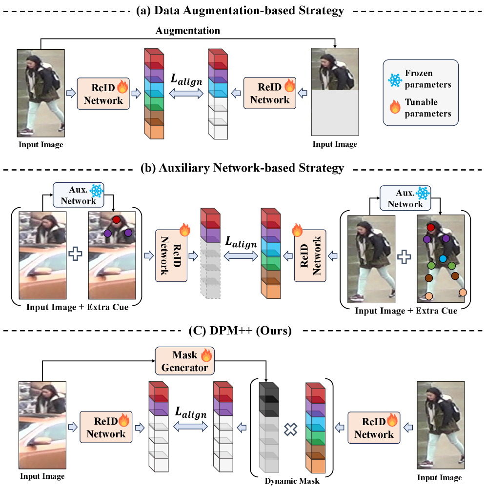
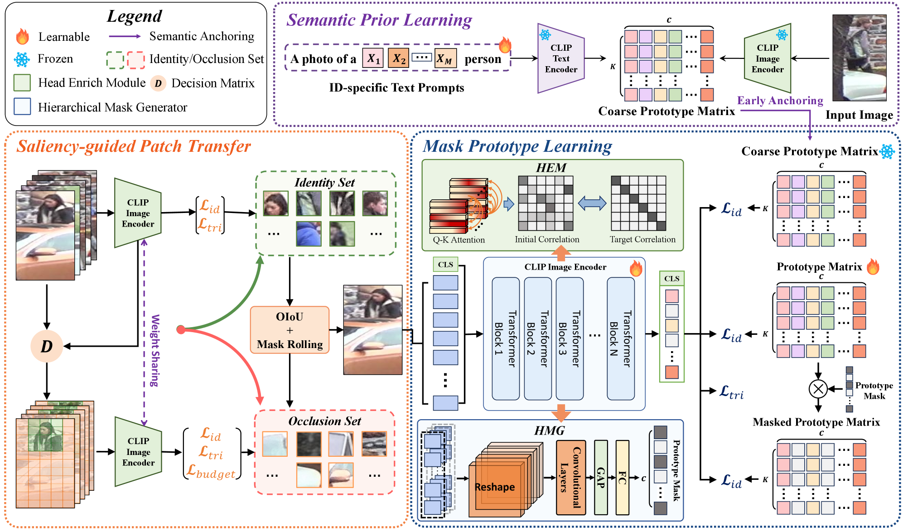
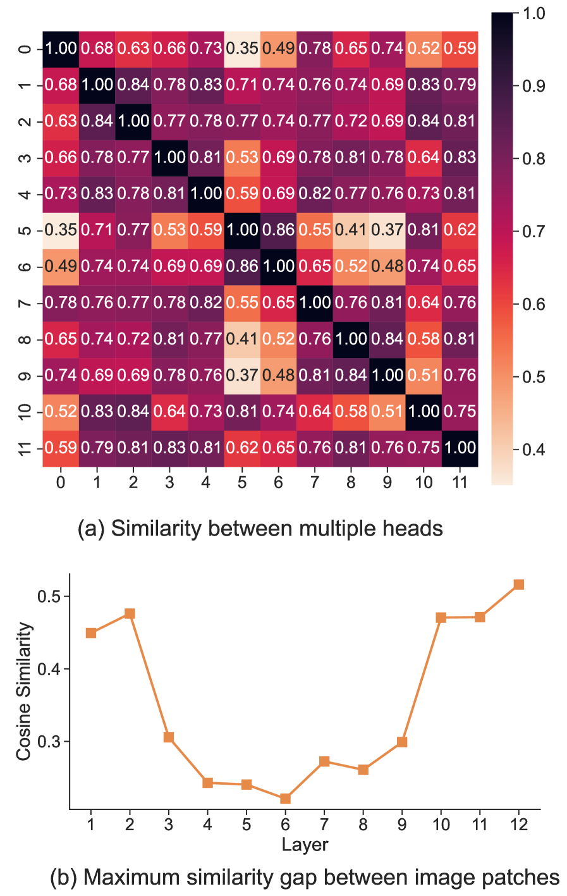

# DPM++: Dynamic Masked Metric Learning for Occluded Person Re-identification

## 基本信息

- **arXiv ID:** [2605.06637v1](https://arxiv.org/abs/2605.06637v1)
- **作者:** Lei Tan, Yingshi Luan, Pincong Zou et al.
- **发布日期:** 2026-05-07
- **分类:** cs.CV
- **PDF:** [arXiv PDF](https://arxiv.org/pdf/2605.06637v1)

## 关键图示

<figure><figcaption>Figure 1</figcaption></figure>
<figure><figcaption>Figure 2</figcaption></figure>
<figure><figcaption>Figure 3</figcaption></figure>

## 摘要

### English

Although person re-identification has made impressive progress, occlusion caused by obstacles remains an unsettled issue in real applications. The difficulty lies in the mismatch between incomplete occluded samples and holistic identity representations. Severe occlusion removes discriminative body cues and introduces interference from background clutter and occluders, making global metric learning unreliable. Existing methods mainly rely on extra pre-trained models to estimate visible parts for alignment or construct occluded samples via data augmentation, but still lack a unified framework that learns robust visibility-consistent matching under realistic occlusion patterns. In this paper, we propose DPM++, a Dynamic Masked Metric Learning framework for occluded person re-identification. DPM++ learns an input-adaptive masked metric that dynamically selects reliable identity subspaces for each occluded instance, enabling matching to emphasize visibility-consistent evidence while suppressing unreliable components. Built upon the classifier-prototype space, DPM++ introduces a CLIP-based two-stage supervision scheme, where ID-level semantic priors are learned from the text branch and transferred into the classifier-prototype space for dynamic masked matching. To strengthen the masked metric, we introduce a saliency-guided patch transfer strategy to synthesize controllable and photo-realistic occluded samples during training. Exploiting real scene priors, this strategy exposes the model to realistic partial observations and provides richer supervision than random erasing. In addition, occlusion-aware sample pairing and mask-guided optimization improve the stability and effectiveness of the framework. Experiments on occluded and holistic person re-identification benchmarks show that DPM++ consistently outperforms previous state-of-the-art methods in both holistic and occlusion scenarios.

### 中文

尽管行人重识别取得了令人瞩目的进展，但障碍物造成的遮挡在实际应用中仍然是一个悬而未决的问题。困难在于不完整的遮挡样本与整体身份表示之间的不匹配。严重的遮挡消除了有区别的身体线索，并引入了背景杂乱和遮挡物的干扰，使得全局度量学习变得不可靠。现有方法主要依靠额外的预训练模型来估计可见部分以进行对齐或通过数据增强构建遮挡样本，但仍然缺乏一个统一的框架来学习现实遮挡模式下鲁棒的可见性一致匹配。在本文中，我们提出了 DPM++，一种用于遮挡人员重新识别的动态掩模度量学习框架。 DPM++ 学习输入自适应屏蔽度量，为每个遮挡实例动态选择可靠的身份子空间，从而实现匹配以强调可见性一致的证据，同时抑制不可靠的组件。 DPM++ 建立在分类器原型空间的基础上，引入了基于 CLIP 的两阶段监督方案，其中从文本分支中学习 ID 级语义先验，并将其转移到分类器原型空间中以进行动态屏蔽匹配。为了加强掩模指标，我们引入了显着性引导的补丁转移策略，以在训练期间合成可控且逼真的遮挡样本。利用真实场景先验，该策略将模型暴露给现实的部分观察，并提供比随机擦除更丰富的监督。此外，遮挡感知样本配对和掩模引导优化提高了框架的稳定性和有效性。对遮挡和整体行人重新识别基准的实验表明，DPM++ 在整体和遮挡场景中始终优于以前最先进的方法。

## 相关概念

- [基准评估](../../concepts/benchmarking.html)
- [AI安全与对齐](../../concepts/ai-safety-alignment.html)

## 核心贡献

1. **动态掩码度量学习框架 (DPM++)**：将遮挡行人重识别形式化为部分到整体的匹配问题，学习输入自适应的掩码度量，动态选择每个遮挡实例的可靠身份子空间。
2. **CLIP 两阶段监督方案**：先从 CLIP 文本分支学习 ID 级语义先验，再迁移到分类器-原型空间进行动态掩码匹配，使原型在严重遮挡下更全面且语义更丰富。
3. **显著性引导的补丁迁移策略**：利用训练数据中的真实场景先验，分离显著身份补丁和遮挡相关补丁，在遮挡感知配对下重组，生成可控且逼真的遮挡样本。
4. **统一框架**：将逼真遮挡合成（训练阶段）、CLIP 语义先验学习和动态掩码匹配（推理阶段）整合为统一框架。

## 方法概述

DPM++ 建立在分类器-原型空间之上。与直接用文本嵌入替换视觉原型不同，DPM++ 保留面向任务的分类器-原型空间用于最终掩码匹配，同时引入 CLIP 两阶段方案来增强原型学习。显著性引导的补丁迁移通过 GrabCut 分割和纹理分析提取身份显著区域，然后在遮挡感知配对策略下合成逼真遮挡样本。训练中还包含遮挡感知样本配对和掩码引导优化来提升框架的稳定性和有效性。

## 实验结果

在多个遮挡和整体行人重识别基准上（Occluded-Duke、Partial-REID、Partial-iLIDS、Market-1501、DukeMTMC-reID 等），DPM++ 始终优于先前的最先进方法，包括基于数据增强和基于辅助网络的方法。消融实验验证了 CLIP 语义监督、显著性补丁迁移和动态掩码各组件的贡献。

## 局限性与注意点

- CLIP 两阶段监督引入了额外的冻结文本编码器，增加推理阶段的存储开销。
- 显著性引导的补丁迁移依赖于训练数据中的真实遮挡先验，若训练数据缺少多样化的遮挡模式，合成质量可能下降。
- 与原有 DPM 方法相比，虽然性能提升显著，但框架复杂度也相应增加。
- 部分到整体匹配策略在极端遮挡（>80% 身体区域被遮挡）场景下仍可能失效。

## 相关概念

关于行人重识别和度量学习的更多文献，参见 [基准评估](../../concepts/benchmarking.html) 和 [AI安全与对齐](../../concepts/ai-safety-alignment.html)。

---
*导入时间: 2026-05-09 06:00*
*来源: arXiv Daily Wiki Update 2026-05-09*
