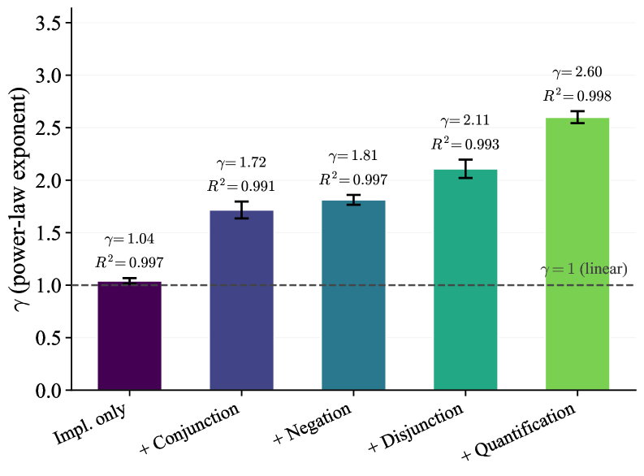
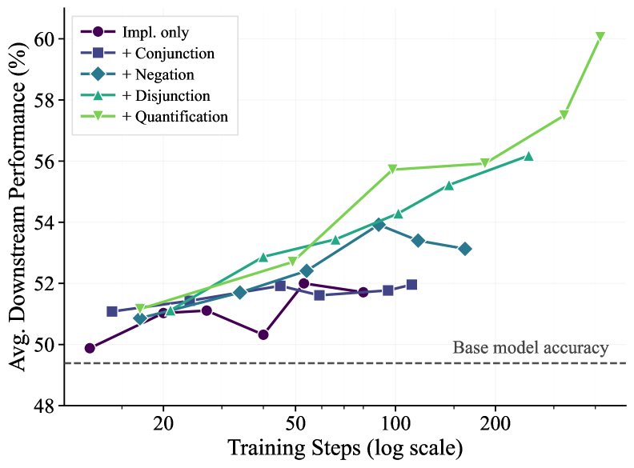

# Can RL Teach Long-Horizon Reasoning to LLMs? Expressiveness Is Key

## 基本信息

- **arXiv ID:** [2605.06638v1](https://arxiv.org/abs/2605.06638v1)
- **作者:** Tianle Wang, Zhaoyang Wang, Guangchen Lan et al.
- **发布日期:** 2026-05-07
- **分类:** cs.AI, cs.CL
- **PDF:** [arXiv PDF](https://arxiv.org/pdf/2605.06638v1)

## 关键图示

<figure><figcaption>Figure 1</figcaption></figure>
<figure><figcaption>Figure 2</figcaption></figure>
<figure><figcaption>Figure 3</figcaption></figure>

## 摘要

### English

Reinforcement learning (RL) has been applied to improve large language model (LLM) reasoning, yet the systematic study of how training scales with task difficulty has been hampered by the lack of controlled, scalable environments. We introduce ScaleLogic, a synthetic logical reasoning framework that offers independent control over two axes of difficulty: the depth of the required proof planning (i.e., the horizon) and the expressiveness of the underlying logic. Our proposed framework supports a wide range of logics: from simple implication-only logic ("if-then") towards more expressive first-order reasoning with conjunction ("and"), disjunction ("or"), negation ("not"), and universal quantification ("for all"). Using this framework, we show that the RL training compute $T$ follows a power law with respect to reasoning depth $D$ ($T \propto D^γ$, $R^{2} > 0.99$), and that the scaling exponent $γ$ increases monotonically with logical expressiveness, from $1.04$ to $2.60$. On downstream mathematics and general reasoning benchmarks, more expressive training settings yield both larger performance gains (up to $+10.66$ points) and more compute-efficient transfer compared to less expressive settings, demonstrating that what a model is trained on, not just how much it is trained, shapes downstream transfer. We further show that the power-law relationship holds across multiple RL methods, and curriculum-based training substantially improves scaling efficiency.

### 中文

强化学习 (RL) 已被应用于改进大型语言模型 (LLM) 推理，但由于缺乏受控、可扩展的环境，对训练如何随任务难度进行扩展的系统研究受到了阻碍。我们引入了 ScaleLogic，一个综合逻辑推理框架，它提供对两个难度轴的独立控制：所需证明计划的深度（即范围）和底层逻辑的表达能力。我们提出的框架支持广泛的逻辑：从简单的仅蕴涵逻辑（“if-then”）到更具表现力的一阶推理，包括合取（“and”）、析取（“or”）、否定（“not”）和通用量化（“for all”）。使用这个框架，我们证明了 RL 训练计算 $T$ 遵循关于推理深度 $D$ 的幂律（$T \propto D^γ$, $R^{2} > 0.99$），并且缩放指数 $γ$ 随着逻辑表达能力单调增加，从 $1.04$ 到 $2.60$。在下游数学和一般推理基准上，与表达能力较低的设置相比，更具表达能力的训练设置会产生更大的性能增益（高达 $+10.66$ 点）和更高的计算效率，这表明模型的训练内容（而不仅仅是训练的程度）决定了下游传输。我们进一步表明，幂律关系在多种强化学习方法中都成立，并且基于课程的培训大大提高了扩展效率。

## 核心贡献

### English
ScaleLogic introduces a synthetic logical reasoning framework that independently controls two axes of difficulty: reasoning depth (horizon) and logical expressiveness (from simple implication to first-order logic with conjunction, disjunction, negation, and universal quantification). Using this framework, the paper reveals a power-law relationship between RL training compute T and reasoning depth D (T ∝ D^γ, R² > 0.99), where the scaling exponent γ increases monotonically with logical expressiveness (from 1.04 to 2.60). The key finding: what a model is trained on (expressiveness) shapes downstream transfer more than how much it is trained — more expressive training yields up to +10.66 points gain on math benchmarks. The power law holds across multiple RL methods, and curriculum-based training improves scaling efficiency.

### 中文
ScaleLogic 引入了一个合成逻辑推理框架，独立控制两个难度轴：推理深度（视界）和逻辑表达能力（从简单蕴含到具有合取、析取、否定和全称量化的一阶逻辑）。使用该框架，论文揭示了 RL 训练计算 T 与推理深度 D 之间的幂律关系（T ∝ D^γ, R² > 0.99），其中缩放指数 γ 随逻辑表达能力单调增加（从 1.04 到 2.60）。关键发现：模型训练的内容（表达能力）比训练量更能塑造下游迁移——更具表达力的训练在数学基准上带来高达 +10.66 分的收益。幂律关系在多种 RL 方法中成立，基于课程的训练提高了缩放效率。

## 方法概述

### English
ScaleLogic generates synthetic reasoning problems by constructing proof trees in formal logic systems of varying expressiveness. The framework supports five expressiveness levels: (L1) implication-only, (L2) + conjunction, (L3) + disjunction, (L4) + negation, (L5) + universal quantification. For each level, problems are generated with controlled proof depth D (number of deduction steps). Each problem presents premises and asks whether a conclusion logically follows. Training uses GRPO-style RL with binary correctness rewards. The power-law analysis measures the minimum training tokens/FLOPs needed to reach a target accuracy at each (depth, expressiveness) combination. Curriculum training proceeds from shallow to deep and from simple to expressive logic. Downstream evaluation covers MATH, GSM8K, and other reasoning benchmarks.

### 中文
ScaleLogic 通过在不同表达能力的逻辑系统中构建证明树来生成合成推理问题。框架支持五个表达能力级别。每个级别生成具有受控证明深度 D 的问题。每个问题呈现前提并询问结论是否逻辑上成立。训练使用 GRPO 式 RL 和二元正确性奖励。幂律分析测量在每对 (深度, 表达能力) 组合下达到目标准确率所需的最小训练 token/FLOPs。课程训练从浅到深、从简单到表达性逻辑进行。下游评估覆盖 MATH、GSM8K 和其他推理基准。

## 实验结果

### English
(1) Power-law relationship: T ∝ D^γ with R² > 0.99 across all expressiveness levels. γ increases from 1.04 (L1) to 2.60 (L5), meaning training cost grows much faster with depth for more expressive logics. (2) Downstream transfer: More expressive training (L4-L5) yields larger gains on MATH (+10.66 points) and GSM8K compared to less expressive training (L1-L2), despite controlling for total training compute. (3) The power law holds across GRPO, PPO, and REINFORCE — it's a property of the task, not the algorithm. (4) Curriculum training (gradually increasing depth and expressiveness) substantially improves scaling efficiency compared to training directly on hard problems. (5) The expressiveness effect dominates over pure compute scaling: training longer on simple logic transfers less than training briefly on expressive logic.

### 中文
(1) 幂律关系：T ∝ D^γ，在所有表达能力级别上 R² > 0.99。γ 从 1.04 (L1) 增加到 2.60 (L5)。(2) 下游迁移：更具表达力的训练（L4-L5）在 MATH（+10.66 分）和 GSM8K 上比较低表达能力训练（L1-L2）产生更大收益。(3) 幂律在 GRPO、PPO 和 REINFORCE 中均成立——这是任务的属性，而非算法的。(4) 课程训练（逐渐增加深度和表达能力）相比直接在难题上训练显著提高缩放效率。(5) 表达能力效应主导纯计算缩放：在简单逻辑上训练更久的效果不如在表达性逻辑上简短训练。

## 局限性与注意点

### English
(1) The framework uses synthetic logical reasoning — whether findings generalize to natural language reasoning tasks needs validation. (2) Only tested on decoder-only transformer architectures; applicability to other architectures unknown. (3) The power-law analysis is at relatively small scale (model sizes not specified as massive); extrapolation to frontier-scale models may differ. (4) Curriculum design (ordering of depth vs expressiveness) was not fully optimized. (5) The relationship between logical expressiveness and natural language task difficulty is not direct — some NL tasks may require types of reasoning not captured by the formal logic hierarchy. (6) Only binary correctness rewards used; richer reward signals could change the scaling relationship.

### 中文
(1) 框架使用合成逻辑推理——发现是否能泛化到自然语言推理任务需要验证。(2) 仅在 decoder-only transformer 架构上测试；对其他架构的适用性未知。(3) 幂律分析在相对小规模进行；外推到前沿规模模型可能不同。(4) 课程设计（深度 vs 表达能力的排序）未完全优化。(5) 逻辑表达能力与自然语言任务难度之间的关系不直接。(6) 仅使用二元正确性奖励；更丰富的奖励信号可能改变缩放关系。

## 相关概念

- [大语言模型](../../concepts/large-language-model.html)
- [强化学习](../../concepts/reinforcement-learning.html)
- [基准评估](../../concepts/benchmarking.html)
- [世界模型](../../concepts/world-models.html)

---
*导入时间: 2026-05-08 06:02*
*来源: arXiv Daily Wiki Update 2026-05-08*
