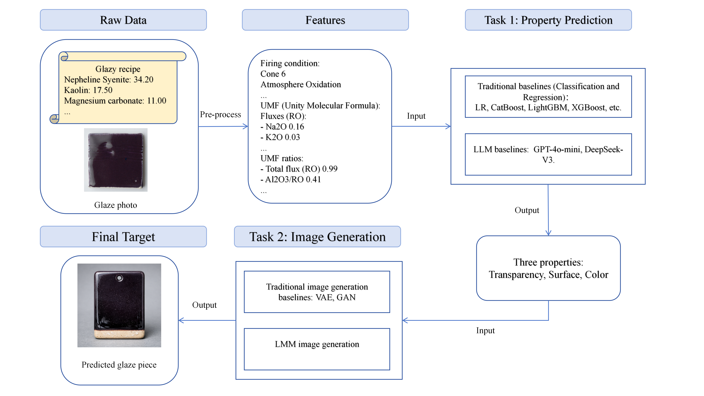
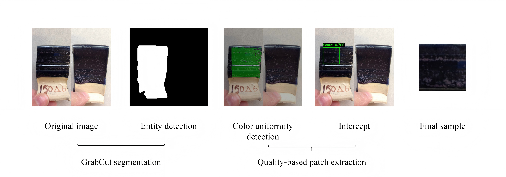
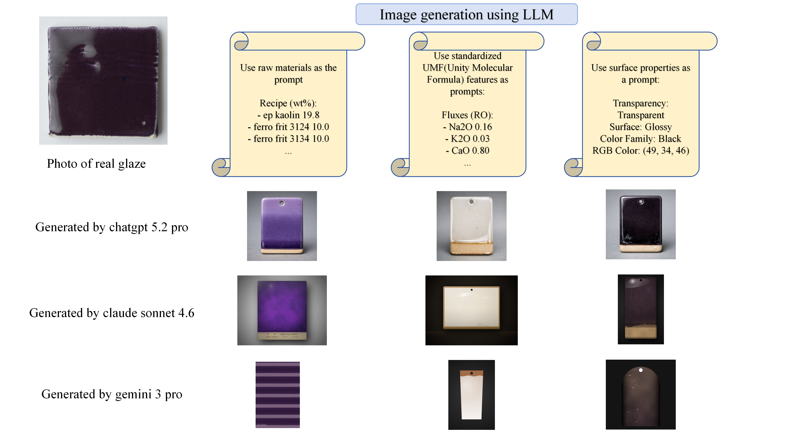

# GlazyBench: A Benchmark for Ceramic Glaze Property Prediction and Image Generation

## 基本信息

- **arXiv ID:** [2605.06641v1](https://arxiv.org/abs/2605.06641v1)
- **作者:** Ziyu Zhai, Siyou Li, Juexi Shao et al.
- **发布日期:** 2026-05-07
- **分类:** cs.AI, cs.CV
- **PDF:** [arXiv PDF](https://arxiv.org/pdf/2605.06641v1)

## 关键图示

<figure><figcaption>Figure 1</figcaption></figure>
<figure><figcaption>Figure 2</figcaption></figure>
<figure><figcaption>Figure 3</figcaption></figure>

## 摘要

### English

Developing ceramic glazes is a costly, time-consuming process of trial and error due to complex chemistry, placing a significant burden on independent artists. While recent advances in multimodal AI offer a modern solution, the field lacks the large-scale datasets required to train these models. We propose GlazyBench, the first dataset for AI-assisted glaze design. Comprising 23,148 real glaze formulations, GlazyBench supports two primary tasks: predicting post-firing surface properties, such as color and transparency, from raw materials, and generating accurate visual representations of the glaze based on these properties. We establish comprehensive baselines for property prediction using traditional machine learning and large language models, alongside image generation benchmarks using deep generative and large multimodal models. Our experiments demonstrate promising yet challenging results. GlazyBench pioneers a new research direction in AI-assisted material design, providing a standardized benchmark for systematic evaluation.

### 中文

由于化学成分复杂，开发陶瓷釉料是一个成本高昂、耗时的反复试验过程，给独立艺术家带来了沉重的负担。虽然多模式人工智能的最新进展提供了现代解决方案，但该领域缺乏训练这些模型所需的大规模数据集。我们提出 GlazyBench，这是人工智能辅助釉料设计的第一个数据集。 GlazyBench 包含 23,148 种真实釉料配方，支持两项主要任务：预测原材料烧成后的表面特性，例如颜色和透明度，并根据这些特性生成釉料的准确视觉表示。我们使用传统机器学习和大型语言模型建立了全面的属性预测基线，以及使用深度生成和大型多模态模型的图像生成基准。我们的实验证明了有希望但具有挑战性的结果。 GlazyBench开创了人工智能辅助材料设计的新研究方向，为系统评估提供了标准化基准。

## 相关概念

- [大语言模型](../../concepts/large-language-model.html)
- [多模态学习](../../concepts/multimodal-learning.html)
- [基准评估](../../concepts/benchmarking.html)

## 核心贡献

1. **首个 AI 辅助釉料设计数据集**：包含 23,148 个真实釉料配方，覆盖化学组成、烧制参数、表面属性等多维度信息。
2. **双任务基准**：(a) 属性预测——从原材料预测烧成后的颜色（RGB + 颜色族）、透明度和表面纹理；(b) 图像生成——基于预测属性生成釉料的视觉表示。
3. **系统化的数据清洗与标准化**：通过模型投票、颜色空间转换、GrabCut 分割和 LBP 纹理分析等多阶段流程确保数据质量，最终保留 12,175 个验证训练样本。
4. **完整的特征工程体系**：建立了从原材料层到氧化物百分比再到 Unity Molecular Formula (UMF) 的双重表示系统，并构造了 SiO₂:Al₂O₃ 等物理驱动的比例特征。

## 方法概述

GlazyBench 从开源 Glazy 平台收集数据，经过多阶段筛选：缺失配方剔除 → 模型投票一致性验证 → 颜色族边界样本剔除。属性预测任务使用随机森林、XGBoost 和大型语言模型建立基线。图像生成任务通过 GrabCut 分割（90.13% 训练成功率）和基于质量的补丁提取，从 4,490 个训练样本中筛选出 2,323 个高质量样本用于生成模型训练。

## 实验结果

颜色族分类任务中，随机森林和 XGBoost 组合投票准确率达 95.6%。图像生成采用深度生成模型和大规模多模态模型进行评估。实验结果表明 AI 辅助釉料设计是可行且有前景的，但在颜色精确度、表面纹理细节等方面仍存在挑战。GlazyBench 开创了 AI 辅助材料设计的新研究方向。

## 局限性与注意点

- 数据来源于社区平台，标注质量和一致性受限于用户输入，尽管经过了多轮清洗。
- 烧制结果的再现性受窑炉类型、温控精度等实际工艺因素影响，数据集无法完全建模。
- 图像生成任务仅包含 2,323 个高质量训练样本，规模相对较小。
- 颜色标注基于非标准化光照条件下的用户上传照片，存在色偏风险。
- 当前仅覆盖釉料领域，扩展到其他陶瓷材料需要额外工作。

## 相关概念

关于 AI 辅助材料设计和多模态学习的更多文献，参见 [大语言模型](../../concepts/large-language-model.html)、[多模态学习](../../concepts/multimodal-learning.html) 和 [基准评估](../../concepts/benchmarking.html)。

---
*导入时间: 2026-05-09 06:00*
*来源: arXiv Daily Wiki Update 2026-05-09*
