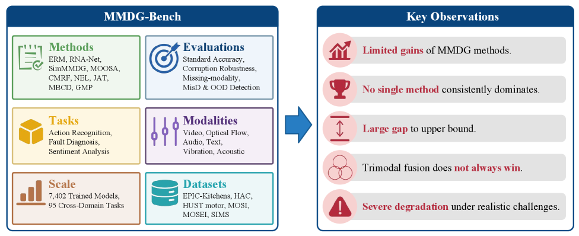
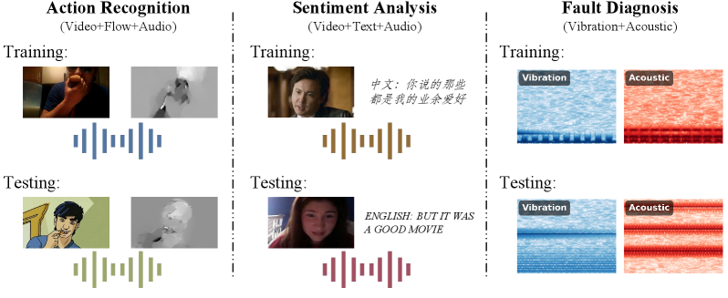
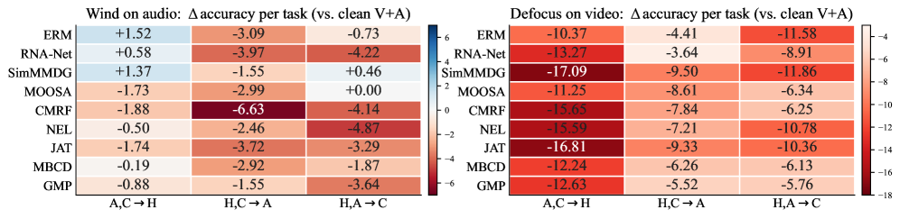

# Are We Making Progress in Multimodal Domain Generalization? A Comprehensive Benchmark Study

## 基本信息

- **arXiv ID:** [2605.06643v1](https://arxiv.org/abs/2605.06643v1)
- **作者:** Hao Dong, Hongzhao Li, Shupan Li et al.
- **发布日期:** 2026-05-07
- **分类:** cs.CV, cs.AI, cs.LG, cs.MM
- **PDF:** [arXiv PDF](https://arxiv.org/pdf/2605.06643v1)

## 关键图示

<figure><figcaption>Figure 1</figcaption></figure>
<figure><figcaption>Figure 2</figcaption></figure>
<figure><figcaption>Figure 3</figcaption></figure>

## 摘要

### English

Despite the growing popularity of Multimodal Domain Generalization (MMDG) for enhancing model robustness, it remains unclear whether reported performance gains reflect genuine algorithmic progress or are artifacts of inconsistent evaluation protocols. Current research is fragmented, with studies varying significantly across datasets, modality configurations, and experimental settings. Furthermore, existing benchmarks focus predominantly on action recognition, often neglecting critical real-world challenges such as input corruptions, missing modalities, and model trustworthiness. This lack of standardization obscures a reliable assessment of the field's advancement. To address this issue, we introduce MMDG-Bench, the first unified and comprehensive benchmark for MMDG, which standardizes evaluation across six datasets spanning three diverse tasks: action recognition, mechanical fault diagnosis, and sentiment analysis. MMDG-Bench encompasses six modality combinations, nine representative methods, and multiple evaluation settings. Beyond standard accuracy, it systematically assesses corruption robustness, missing-modality generalization, misclassification detection, and out-of-distribution detection. With 7, 402 neural networks trained in total across 95 unique cross-domain tasks, MMDG-Bench yields five key findings: (1) under fair comparisons, recent specialized MMDG methods offer only marginal improvements over ERM baseline; (2) no single method consistently outperforms others across datasets or modality combinations; (3) a substantial gap to upper-bound performance persists, indicating that MMDG remains far from solved; (4) trimodal fusion does not consistently outperform the strongest bimodal configurations; and (5) all evaluated methods exhibit significant degradation under corruption and missing-modality scenarios, with some methods further compromising model trustworthiness.

### 中文

尽管用于增强模型鲁棒性的多模态域泛化（MMDG）越来越受欢迎，但仍不清楚报告的性能增益是否反映了真正的算法进展，还是不一致的评估协议的产物。目前的研究是分散的，研究在数据集、模态配置和实验设置方面存在显着差异。此外，现有的基准主要关注动作识别，往往忽略了现实世界的关键挑战，例如输入损坏、模式缺失和模型可信度。标准化的缺乏阻碍了对该领域进展的可靠评估。为了解决这个问题，我们引入了 MMDG-Bench，这是第一个统一且全面的 MMDG 基准，它标准化了跨越三个不同任务的六个数据集的评估：动作识别、机械故障诊断和情感分析。 MMDG-Bench 包含六种模态组合、九种代表性方法和多种评估设置。除了标准准确性之外，它还系统地评估腐败鲁棒性、缺失模态泛化、错误分类检测和分布外检测。通过在 95 个独特的跨域任务中总共训练了 7, 402 个神经网络，MMDG-Bench 得出了五个关键发现：（1）在公平比较下，最近的专门 MMDG 方法仅比 ERM 基线提供了微小的改进； (2) 没有任何一种方法能够在数据集或模态组合中始终优于其他方法； (3) 与上限绩效的巨大差距仍然存在，表明 MMDG 仍远未得到解决； (4) 三峰融合并不总是优于最强的双峰配置； （5）所有评估的方法在腐败和缺失模态场景下都表现出显着的退化，其中一些方法进一步损害了模型的可信度。

## 相关概念

- [多模态学习](../../concepts/multimodal-learning.html)
- [基准评估](../../concepts/benchmarking.html)
- [AI安全与对齐](../../concepts/ai-safety-alignment.html)

## 核心贡献

1. **首个统一 MMDG 基准**：MMDG-Bench 覆盖 6 个数据集、3 类任务（动作识别、机械故障诊断、情感分析）、6 种模态组合、9 种代表性方法、95 个跨域任务。
2. **大规模标准化评测**：共训练 7,402 个神经网络，在统一的数据划分、超参搜索、优化协议下进行公平比较。
3. **超越标准准确率的评估维度**：系统性评估腐败鲁棒性、模态缺失泛化、误分类检测和分布外检测，涵盖模型可信度。
4. **五项关键发现**：揭示了 MMDG 领域的真实进展远低于表面报告水平的现实。

## 方法概述

MMDG-Bench 形式化定义了多源 MMDG、单源 MMDG、腐败鲁棒性和缺失模态泛化四种评估范式。入选的 9 种方法包括 ERM、RNA-Net、SimMMDG、MOOSA、CMRF、NEL、JAT、MBCD 和 GMP，覆盖了从基线到最新专用方法的完整谱系。所有实验在标准化的数据划分和超参搜索下进行，确保结果可比性。除了多源设置，还评估了单源场景下的迁移能力。

## 实验结果

五项关键发现：(1) 在公平比较下，专用 MMDG 方法相比 ERM 基线仅有微小提升；(2) 没有任何单一方法在所有数据集或模态组合上持续领先；(3) 与 Oracle 上界的差距巨大，MMDG 远未解决；(4) 三模态融合并不始终优于最强双模态配置；(5) 所有方法在腐败和模态缺失场景下性能显著下降，部分方法在提升原始准确率的同时反而损害了模型可信度。

## 局限性与注意点

- 数据集覆盖仍有限（6 个），未涵盖医学影像、自动驾驶等重要应用领域。
- Oracle 上界的构造依赖于在目标域上的训练，实际应用中不可达。
- 未深入分析不同骨干架构（如 Transformer vs CNN）对结果的影响。
- 腐败类型和严重程度的选择可能不完全反映真实世界的分布偏移模式。

## 相关概念

关于域泛化和鲁棒性评估的更多文献，参见 [多模态学习](../../concepts/multimodal-learning.html)、[基准评估](../../concepts/benchmarking.html) 和 [AI安全与对齐](../../concepts/ai-safety-alignment.html)。

---
*导入时间: 2026-05-09 06:00*
*来源: arXiv Daily Wiki Update 2026-05-09*
