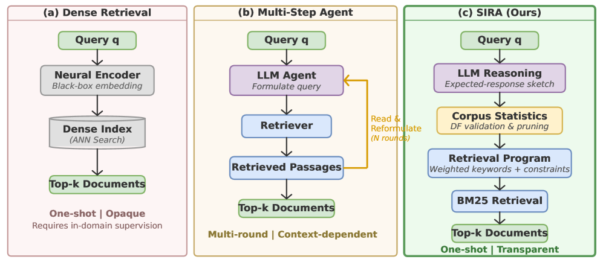
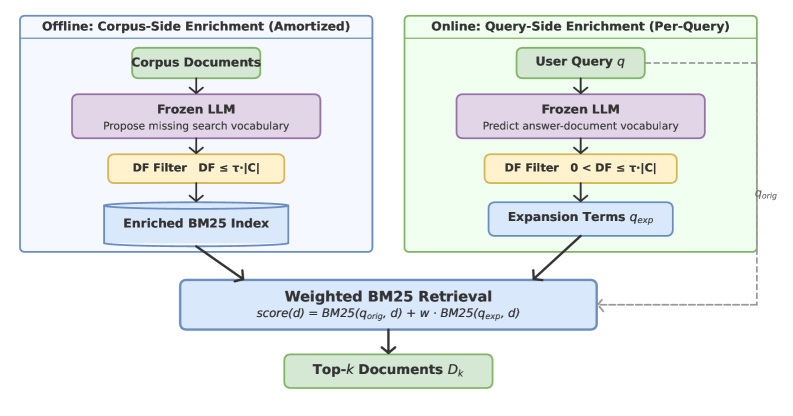
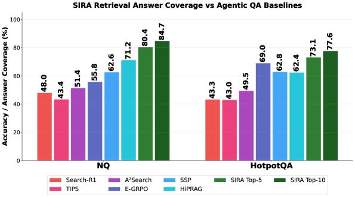

# Superintelligent Retrieval Agent: The Next Frontier of Information Retrieval

## 基本信息

- **arXiv ID:** [2605.06647v1](https://arxiv.org/abs/2605.06647v1)
- **作者:** Zeyu Yang, Qi Ma, Jason Chen et al.
- **发布日期:** 2026-05-07
- **分类:** cs.IR, cs.AI, cs.LG
- **PDF:** [arXiv PDF](https://arxiv.org/pdf/2605.06647v1)

## 关键图示

<figure><figcaption>Figure 1</figcaption></figure>
<figure><figcaption>Figure 2</figcaption></figure>
<figure><figcaption>Figure 3</figcaption></figure>

## 摘要

### English

Retrieval-augmented agents are increasingly the interface to large organizational knowledge bases, yet most still treat retrieval as a black box: they issue exploratory queries, inspect returned snippets, and iteratively reformulate until useful evidence emerges. This approach resembles how a newcomer searches an unfamiliar database rather than how an expert navigates it with strong priors about terminology and likely evidence, and results in unnecessary retrieval rounds, increased latency, and poor recall.   We introduce \textit{SuperIntelligent Retrieval Agent} (SIRA), which defines \emph{superintelligence} in retrieval as the ability to compress multi-round exploratory search into a single corpus-discriminative retrieval action. SIRA does not merely ask what terms are relevant to the query; it asks which terms are likely to separate the desired evidence from corpus-level confusers. On the corpus side, an LLM enriches each document offline with missing search vocabulary; on the query side, it predicts evidence vocabulary omitted by the query; and document-frequency statistics as a tool call to filter proposed terms that are absent, overly common, or unlikely to create retrieval margin. The final retrieval step is a single weighted BM25 call combining the original query with the validated expansion.   Across ten BEIR benchmarks and downstream question-answering tasks, SIRA achieves the significantly superior performance outperforming dense retrievers and state-of-the-art multi-round agentic baselines, demonstrating that one well-formed lexical query, guided by LLM cognition and lightweight corpus statistics, can exceed substantially more expensive multi-round search while remaining interpretable, training-free, and efficient.

### 中文

检索增强代理越来越多地成为大型组织知识库的接口，但大多数仍然将检索视为黑匣子：它们发出探索性查询，检查返回的片段，并迭代地重新制定，直到出现有用的证据。这种方法类似于新手如何搜索不熟悉的数据库，而不是专家如何利用有关术语和可能证据的强大先验来导航它，并导致不必要的检索轮次、延迟增加和召回率低。我们引入\textit{超级智能检索代理}（SIRA），它将检索中的\emph{超级智能}定义为将多轮探索性搜索压缩为单个语料库判别性检索操作的能力。 SIRA 不仅会询问哪些术语与查询相关；还会询问哪些术语与查询相关。它询问哪些术语可能将所需的证据与语料库级别的混淆分开。在语料库方面，法学硕士通过缺失的搜索词汇离线丰富每个文档；在查询方面，它预测查询省略的证据词汇；文档频率统计作为一种工具调用来过滤不存在​​、过于常见或不太可能创造检索余量的建议术语。最后的检索步骤是单个加权 BM25 调用，将原始查询与经过验证的扩展相结合。在十个 BEIR 基准测试和下游问答任务中，SIRA 实现了明显优于密集检索器和最先进的多轮代理基线的性能，证明在 LLM 认知和轻量级语料库统计的指导下，一个格式良好的词汇查询可以超越更昂贵的多轮搜索，同时保持可解释、免训练和高效。

## 相关概念

- [大语言模型](../../concepts/large-language-model.html)
- [基准评估](../../concepts/benchmarking.html)
- [智能体](../../concepts/ai-agents.html)

## 核心贡献

1. **检索中的超级智能定义**：将多轮探索式搜索压缩为单次语料库判别性检索动作的能力——不需检查返回的片段，直接在查询阶段就产生专家级的检索行动。
2. **SIRA 两阶段框架**：(a) 离线语料库侧：LLM 为每个文档补充缺失的搜索词汇，经文档频率过滤后建立增强 BM25 索引；(b) 在线查询侧：LLM 生成预期回答草图，预测查询遗漏的证据词汇，通过文档频率统计工具调用验证和剪枝。
3. **检索程序编译**：将原始查询与经过验证的扩展词汇组合为单次加权 BM25 调用，保持可解释、免训练和高效率。
4. **大规模基准验证**：在 10 个 BEIR 基准和下游 QA 任务上显著优于密集检索器和 SOTA 多轮代理基线。

## 方法概述

SIRA 的核心创新在于用 LLM 的参量化知识替代多轮检索中的上下文累积。离线阶段，LLM 离线扫描语料库，为每个文档提议缺失的搜索词汇（如领域术语、同义词），经文档频率过滤（去除过于常见或缺失的词汇）后建立增强 BM25 索引。在线阶段，对于每个查询，LLM 首先生成一个"预期回答草图"——假设相关证据中会出现的概念和术语；然后查询倒排索引获取文档频率统计，验证和剪枝提议的扩展词；最后编译为单次加权 BM25 调用。整个过程仅需一次 LLM 推理和一次 BM25 搜索。

## 实验结果

在 10 个 BEIR 基准（包括 TREC-COVID、NFCorpus、FiQA、ArguAna、SCIDOCS、SciFact 等）上，SIRA 的 NDCG@10 和 Recall 指标显著优于密集检索器（如 Contriever、GTR）和 SPLADE，以及多轮代理基线。下游 QA 任务中，无需多轮搜索即可达到或超越多轮代理的准确率。消融实验验证了文档频率过滤、语料库侧增强和查询侧扩展各组件的贡献。

## 局限性与注意点

- 离线语料库增强需要为每个文档执行 LLM 推理，对大规模语料库（>10M 文档）成本可能很高，但可摊销。
- BM25 的词汇匹配性质使其在处理跨语言检索或严重拼写错误时可能力不从心。
- 预期回答草图的生成质量直接取决于 LLM 的知识覆盖范围，对 LLM 知识盲区领域的查询可能效果不佳。
- 当前仅评估单次检索设置；多次 BM25 调用（如先粗检再精排）可能进一步提升性能。

## 相关概念

关于信息检索和代理系统的更多文献，参见 [大语言模型](../../concepts/large-language-model.html)、[基准评估](../../concepts/benchmarking.html) 和 [智能体](../../concepts/ai-agents.html)。

---
*导入时间: 2026-05-09 06:00*
*来源: arXiv Daily Wiki Update 2026-05-09*
