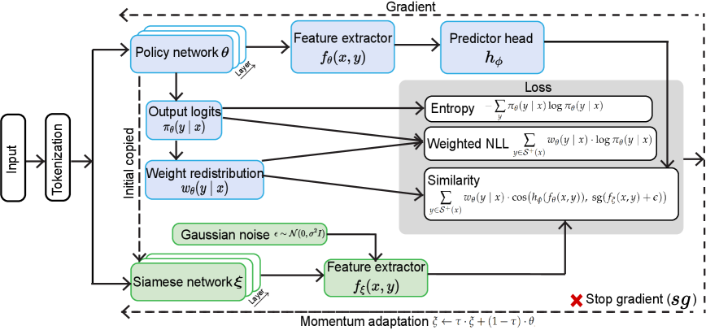

# Beyond Negative Rollouts: Positive-Only Policy Optimization with Implicit Negative Gradients

## 基本信息

- **arXiv ID:** [2605.06650v1](https://arxiv.org/abs/2605.06650v1)
- **作者:** Mingwei Xu, Hao Fang
- **发布日期:** 2026-05-07
- **分类:** cs.CL
- **PDF:** [arXiv PDF](https://arxiv.org/pdf/2605.06650v1)

## 关键图示

<figure><figcaption>Figure 1</figcaption></figure>
<figure><figcaption>Figure 2</figcaption></figure>

## 摘要

### English

Reinforcement learning with verifiable rewards (RLVR), due to the deterministic verification, becomes a dominant paradigm for enhancing the reasoning ability of large language models (LLMs). The community witnesses the rapid change from the Proximal Policy Optimization (PPO) to Group Relative Policy Optimization (GRPO), in which GRPO reduces the complicated advantage estimation with simple estimation over grouped positive and negative rollouts. However, we note that negative rollouts may admit no gradation of failure severity, and the combinatorial vastness makes penalizing a few sampled negatives unlikely to cover a meaningful reward signal under sparse binary rewards. In this work, we propose Positive-Only Policy Optimization (POPO), a novel RLVR framework in which learning can occur exclusively via online positive rollouts. Specifically, POPO utilizes bounded importance sampling over the positive rollout set. Thus, no disjoint negative rollouts are used for the gradient guidance. We show that implicit negative gradients can emerge naturally through reinforcing the positive probability via rollouts redistribution. Next, POPO stabilizes the policy optimization through two mechanisms. First, it applies a siamese policy network with a momentum-based adaptation law for stabilized policy evolution. Second, we replace the KL-divergence with a bounded similarity penalty term in the siamese representation space. We conduct extensive experiments using publicly available, well-established text-LLM models, e.g., the Qwen family, across all-level mathematical benchmarks. Our experiment demonstrates that POPO achieves performance comparable to, or even superior to GRPO. Notably, we show that POPO can achieve 36.67% in AIME 2025 with Qwen-Math-7B, outperforming GRPO 30.00%. Our ablation and sweep studies further illustrate the necessity and robustness of POPO components.

### 中文

由于确定性验证，具有可验证奖励的强化学习（RLVR）成为增强大型语言模型（LLM）推理能力的主导范式。社区见证了从近端策略优化（PPO）到组相对策略优化（GRPO）的快速变化，其中GRPO通过对分组正向和负向推出的简单估计来减少复杂的优势估计。然而，我们注意到，负数推出可能不承认失败严重程度的分级，并且组合的巨大性使得惩罚一些采样负数不太可能在稀疏的二元奖励下覆盖有意义的奖励信号。在这项工作中，我们提出了仅正向策略优化（POPO），这是一种新颖的 RLVR 框架，其中学习可以完全通过在线正向推出进行。具体来说，POPO 在正推出集上利用有限重要性采样。因此，不相交的负推出用于梯度引导。我们表明，通过推出重新分配来增强正概率，隐式负梯度可以自然出现。接下来，POPO通过两种机制来稳定策略优化。首先，它应用具有基于动量的适应律的连体政策网络来稳定政策演变。其次，我们用暹罗表示空间中的有界相似性惩罚项替换 KL 散度。我们使用公开的、完善的文本法学硕士模型（例如 Qwen 系列）在所有级别的数学基准上进行了广泛的实验。我们的实验表明，POPO 的性能与 GRPO 相当，甚至优于 GRPO。值得注意的是，我们表明 POPO 在 Qwen-Math-7B 的 AIME 2025 中可以达到 36.67%，优于 GRPO 30.00%。我们的消融和扫描研究进一步说明了 POPO 组件的必要性和稳健性。

## 核心贡献

### English
POPO proposes a novel RLVR framework that learns exclusively from positive (correct) rollouts, eliminating the need for negative rollouts in policy optimization. The key insight is twofold: (1) under sparse binary rewards, negative rollouts provide no gradation of failure severity, and the combinatorially vast space of incorrect responses means penalizing a few sampled negatives is unlikely to cover meaningful failure modes; (2) implicit negative gradients emerge naturally through softmax probability redistribution — reinforcing positive responses automatically decreases probability mass on negative ones. POPO stabilizes this positive-only learning via three mechanisms: self-normalized importance weights over the positive set, an EMA-updated siamese policy network as an adaptive anchor, and representation-space cosine similarity replacing KL divergence.

### 中文
POPO 提出了一种新颖的 RLVR 框架，仅从正向（正确）rollout 中学习，消除了策略优化中对负向 rollout 的需求。关键洞察有两点：(1) 在稀疏二元奖励下，负向 rollout 不提供失败严重程度的分级，且错误响应的组合空间巨大，惩罚少量采样负样本不太可能覆盖有意义的失败模式；(2) 隐式负梯度通过 softmax 概率重分配自然涌现——增强正向响应自动减少负向响应的概率质量。POPO 通过三种机制稳定这种仅正向学习：正样本集上的自归一化重要性权重、EMA 更新的孪生策略网络作为自适应锚点，以及表示空间余弦相似度替代 KL 散度。

## 方法概述

### English
POPO's loss function is: L = -E[Σ w_θ(y|x)·log π_θ(y|x)] + α·L_sim + β·L_ent. The key components: (1) Self-normalized weights: w_θ(y|x) = π_θ(y|x)/Z_+(x), creating self-competition among positive responses. (2) Adaptive anchor: A siamese policy network π_ξ is updated via EMA (ξ ← τξ + (1-τ)θ), providing a stable reference without KL divergence. (3) Representation-space alignment: L_sim uses cosine similarity between predictor-head outputs of policy and siamese networks, with stop-gradient and Gaussian noise for stability. (4) Entropy regularization maintains exploration diversity. Theorem 3.1 proves that the gradient for any negative response y' is strictly positive, creating implicit downward pressure: ∂L/∂z_y' = π_θ(y'|x)[1 + β·log π_θ(y'|x) + H(π_θ)]. Lemma 3.2 bounds parameter drift: ||θ_t - ξ_t|| ≤ τηG_max/(1-τ).

### 中文
POPO 的损失函数为 L = -E[Σ w_θ(y|x)·log π_θ(y|x)] + α·L_sim + β·L_ent。关键组件：(1) 自归一化权重：w_θ(y|x) = π_θ(y|x)/Z_+(x)，在正响应间创建自我竞争。(2) 自适应锚点：孪生策略网络 π_ξ 通过 EMA (ξ ← τξ + (1-τ)θ) 更新，无需 KL 散度提供稳定参考。(3) 表示空间对齐：L_sim 使用策略网络和孪生网络的预测头输出间的余弦相似度，配合停止梯度和高斯噪声以稳定。(4) 熵正则化维持探索多样性。定理 3.1 证明任何负响应的梯度严格为正，产生隐式向下压力。引理 3.2 限定了参数漂移。

## 实验结果

### English
POPO was evaluated on 6 base models (Qwen2.5-Math-1.5B/7B, R1-Distill-1.5B/7B, Llama-3.1-8B, DeepSeek-Math-7B) across MATH-500, AMC23, AIME24/25, and Olympiad benchmarks using the DeepScaleR-Preview-Dataset. Key results: (1) Qwen-Math-1.5B: POPO Avg 53.06 vs GRPO 50.22, with largest gains on harder tasks (AIME25: 23.33 vs 16.25). (2) Qwen-Math-7B: POPO achieves 36.67% on AIME 2025, outperforming GRPO's 30.00% — a 22% relative improvement. (3) R1-Distill-1.5B: POPO Avg 59.92 vs GRPO 57.03. (4) R1-Distill-7B: POPO slightly underperforms GRPO (66.22 vs 65.60), likely due to reduced entropy from distillation limiting exploration. (5) The performance gap between POPO and GRPO widens on harder benchmarks, supporting the hypothesis that negative rollouts are less informative under sparse binary rewards with combinatorially vast failure spaces.

### 中文
POPO 在 6 个基座模型上评估，使用 DeepScaleR-Preview-Dataset，覆盖 MATH-500、AMC23、AIME24/25 和 Olympiad 基准。关键结果：(1) Qwen-Math-1.5B：POPO 平均 53.06 vs GRPO 50.22，在更难任务上收益更大（AIME25: 23.33 vs 16.25）。(2) Qwen-Math-7B：POPO 在 AIME 2025 上达 36.67%，优于 GRPO 的 30.00%——相对提升 22%。(3) R1-Distill-1.5B：POPO 平均 59.92 vs GRPO 57.03。(4) R1-Distill-7B：POPO 略低于 GRPO（66.22 vs 65.60），可能因蒸馏降低熵限制了探索。(5) POPO 与 GRPO 的性能差距在更难基准上扩大，支持负向 rollout 在稀疏二元奖励和组合巨大失败空间下信息量较低的假设。

## 局限性与注意点

### English
(1) Only tested on mathematical reasoning; generalizability to other RLVR domains (code, agent tasks) remains unverified. (2) Performance on highly distilled models (R1-Distill-7B) slightly underperforms GRPO, suggesting positive-only learning may need negative signals when the policy has very low entropy. (3) The implicit negative gradient mechanism relies on softmax normalization — its effectiveness with other architectures (e.g., different decoding methods) is unclear. (4) The method requires online positive rollouts; when pass@k rates are extremely low (cold start), the approach may struggle. (5) Limited to binary reward settings; extension to continuous or multi-dimensional rewards is not addressed. (6) Only one training dataset (DeepScaleR-Preview) used; dataset-specific effects not isolated.

### 中文
(1) 仅在数学推理上测试；对其他 RLVR 领域（代码、智能体任务）的泛化性未验证。(2) 在高度蒸馏模型（R1-Distill-7B）上略低于 GRPO，表明策略熵极低时仅正向学习可能需要负向信号。(3) 隐式负梯度机制依赖 softmax 归一化——其与其他架构的有效性不清楚。(4) 方法需要在线正向 rollout；当 pass@k 率极低（冷启动）时可能困难。(5) 限于二元奖励设置；未涉及连续或多维奖励的扩展。(6) 仅使用一个训练数据集。

## 相关概念

- [大语言模型](../../concepts/large-language-model.html)
- [强化学习](../../concepts/reinforcement-learning.html)
- [基准评估](../../concepts/benchmarking.html)
- [AI安全与对齐](../../concepts/ai-safety-alignment.html)

---
*导入时间: 2026-05-08 06:02*
*来源: arXiv Daily Wiki Update 2026-05-08*
