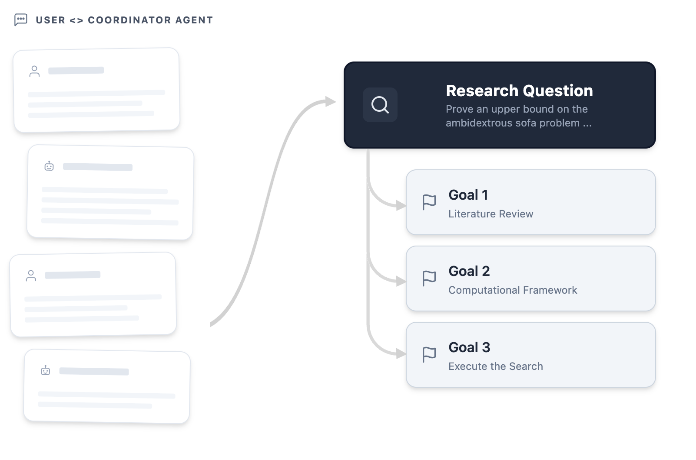
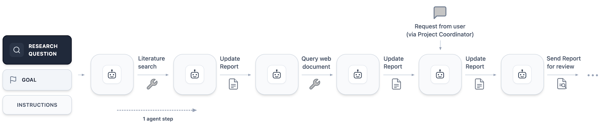

# AI Co-Mathematician: Accelerating Mathematicians with Agentic AI

## 基本信息

- **arXiv ID:** [2605.06651v1](https://arxiv.org/abs/2605.06651v1)
- **作者:** Daniel Zheng, Ingrid von Glehn, Yori Zwols et al.
- **发布日期:** 2026-05-07
- **分类:** cs.AI
- **PDF:** [arXiv PDF](https://arxiv.org/pdf/2605.06651v1)

## 关键图示

<figure><figcaption>Figure 1</figcaption></figure>
<figure><figcaption>Figure 2</figcaption></figure>
<figure><figcaption>Figure 3</figcaption></figure>

## 摘要

### English

We introduce the AI co-mathematician, a workbench for mathematicians to interactively leverage AI agents to pursue open-ended research. The AI co-mathematician is optimized to provide holistic support for the exploratory and iterative reality of mathematical workflows, including ideation, literature search, computational exploration, theorem proving and theory building. By providing an asynchronous, stateful workspace that manages uncertainty, refines user intent, tracks failed hypotheses, and outputs native mathematical artifacts, the system mirrors human collaborative workflows. In early tests, the AI co-mathematician helped researchers solve open problems, identify new research directions, and uncover overlooked literature references. Besides demonstrating a highly interactive paradigm for AI-assisted mathematical discovery, the AI co-mathematician also achieves state of the art results on hard problem-solving benchmarks, including scoring 48% on FrontierMath Tier 4, a new high score among all AI systems evaluated.

### 中文

我们推出了 AI 联合数学家，这是数学家可以交互地利用 AI 代理进行开放式研究的工作台。 AI 联合数学家经过优化，可为数学工作流程的探索性和迭代现实提供整体支持，包括构思、文献检索、计算探索、定理证明和理论构建。通过提供一个异步、有状态的工作空间来管理不确定性、完善用户意图、跟踪失败的假设并输出本地数学工件，该系统反映了人类协作工作流程。在早期测试中，人工智能联合数学家帮助研究人员解决开放问题，确定新的研究方向，并发现被忽视的文献参考。除了展示人工智能辅助数学发现的高度交互范例外，这位人工智能联合数学家还在难题解决基准上取得了最先进的成绩，包括在 FrontierMath Tier 4 上得分 48%，这是所有评估的人工智能系统中的新高分。

## 相关概念

- [基准评估](../../concepts/benchmarking.html)
- [智能体](../../concepts/ai-agents.html)

## 核心贡献

1. **AI 联合数学家工作台**：提出首个为数学家开放研究设计的交互式 AI 代理系统，包含项目协调器代理和多个专业子代理的层级架构，通过异步消息系统支持并行工作流。
2. **七大设计原则**：超越证明的数学、迭代式意图细化、原生数学工件输出、异步交互与灵活引导、渐进式信息披露、不确定性跟踪管理与沟通、失败探索历史保存。
3. **状态化工作空间**：以"活的工作论文"为核心，追踪研究演进状态、标注声明来源和争议性、以原生格式（内联文本和边注）呈现 AI 推理过程。
4. **SOTA 基准成绩**：在 FrontierMath Tier 4 上达到 48%，为所有评估 AI 系统中的最高分数。

## 方法概述

系统架构基于 Gemini 语言模型，包含一个顶层项目协调器代理和多个专业子代理（文献搜索、计算探索、定理证明、理论构建、代码验证等），通过内部消息系统通信。工作空间维护共享文件系统，所有代理写入其中。用户主要与协调器交互，协调器分配任务并汇总结果。系统采用渐进式信息披露，默认隐藏子代理的执行细节但允许用户按需下钻。核心技术挑战包括不确定性管理（通过连续审查、数值模拟和引用检查来验证声明）和对抗性审查循环（防止系统在棘手问题上走捷径）。

## 实验结果

早期测试中，AI 联合数学家帮助研究人员解决了开放问题、确定了新研究方向并发现了被忽视的文献参考。系统在 FrontierMath Tier 4 上达到 48% 的 SOTA 成绩。论文呈现了具体案例——一个计算几何沙发移动问题的变体，展示了从初始探索到约束公式化再到对抗性审查的完整工作流。

## 局限性与注意点

- 当前发布范围有限，仍在早期阶段，大规模可用性尚未验证。
- 底层模型（Gemini）的推理能力缺陷是不确定性的根本来源，对抗性审查虽能部分缓解但无法完全消除幻觉。
- 多代理并行工作流可能导致协调开销和冗余计算。
- 系统设计高度依赖数学工作者熟悉的工作流程范式，对非专业用户的使用门槛较高。
- 论文主要呈现定性结果，缺乏大规模用户研究或严格定量对比。

## 相关概念

关于 AI 代理和数学推理的更多文献，参见 [基准评估](../../concepts/benchmarking.html) 和 [智能体](../../concepts/ai-agents.html)。

---
*导入时间: 2026-05-09 06:00*
*来源: arXiv Daily Wiki Update 2026-05-09*
