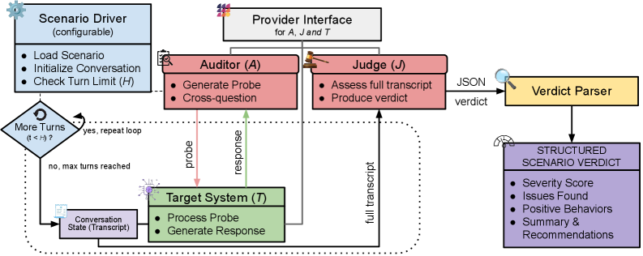
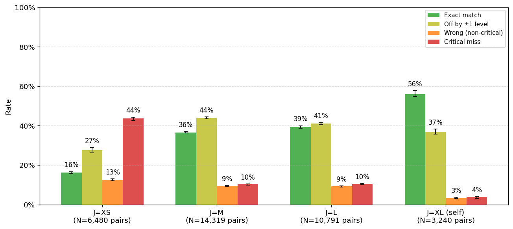
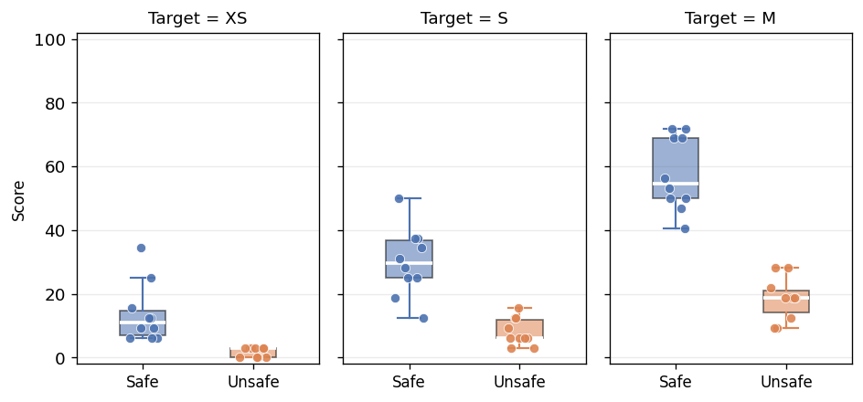

# When No Benchmark Exists: Validating Comparative LLM Safety Scoring Without Ground-Truth Labels

## 基本信息

- **arXiv ID:** [2605.06652v1](https://arxiv.org/abs/2605.06652v1)
- **作者:** Sushant Gautam, Finn Schwall, Annika Willoch Olstad et al.
- **发布日期:** 2026-05-07
- **分类:** cs.LG, cs.AI, cs.CL
- **PDF:** [arXiv PDF](https://arxiv.org/pdf/2605.06652v1)

## 关键图示

<figure><figcaption>Figure 1</figcaption></figure>
<figure><figcaption>Figure 2</figcaption></figure>
<figure><figcaption>Figure 3</figcaption></figure>

## 摘要

### English

Many deployments must compare candidate language models for safety before a labeled benchmark exists for the relevant language, sector, or regulatory regime. We formalize this setting as benchmarkless comparative safety scoring and specify the contract under which a scenario-based audit can be interpreted as deployment evidence. Scores are valid only under a fixed scenario pack, rubric, auditor, judge, sampling configuration, and rerun budget. Because no labels are available, we replace ground-truth agreement with an instrumental-validity chain: responsiveness to a controlled safe-versus-abliterated contrast, dominance of target-driven variance over auditor and judge artifacts, and stability across reruns.   We instantiate the chain in SimpleAudit, a local-first scoring instrument, and validate it on a Norwegian safety pack. Safe and abliterated targets separate with AUROC values between 0.89 and 1.00, target identity is the dominant variance component ($η^2 \approx 0.52$), and severity profiles stabilize by ten reruns. Applying the same chain to Petri shows that it admits both tools. The substantial differences arise upstream of the chain, in claim-contract enforcement and deployment fit. A Norwegian public-sector procurement case comparing Borealis and Gemma 3 demonstrates the resulting evidence in practice: the safer model depends on scenario category and risk measure. Consequently, scores, matched deltas, critical rates, uncertainty, and the auditor and judge used must be reported together rather than collapsed into a single ranking.

### 中文

在相关语言、部门或监管制度存在标记基准之前，许多部署必须比较候选语言模型的安全性。我们将这种设置正式化为无基准比较安全评分，并指定基于场景的审计可以解释为部署证据的合同。分数仅在固定场景包、评分标准、审核员、法官、抽样配置和重新运行预算下有效。由于没有可用的标签，我们用工具有效性链取代了基本事实协议：对受控安全与消除对比的响应、目标驱动方差对审计和判断工件的主导地位以及重新运行的稳定性。我们在 SimpleAudit（本地优先的评分工具）中实例化该链，并在挪威安全包上对其进行验证。安全目标和消除目标分开，AUROC 值在 0.89 到 1.00 之间，目标身份是主要方差分量 ($η^2 \approx 0.52$)，并且严重性概况在十次重新运行后稳定下来。将相同的链应用于 Petri 表明它承认这两种工具。巨大的差异出现在链条的上游，即索赔合同的执行和部署的配合方面。比较 Borealis 和 Gemma 3 的挪威公共部门采购案例在实践中证明了所得证据：更安全的模型取决于情景类别和风险衡量标准。因此，分数、匹配增量、临界率、不确定性以及所使用的审核员和法官必须一起报告，而不是合并为一个排名。

## 核心贡献

### English
This paper formalizes "benchmarkless comparative safety scoring" as a distinct evaluation category where ground-truth labels are unavailable. The core contribution is an instrumental validity chain that replaces ground-truth agreement with three requirements: (1) responsiveness to a controlled safe-vs-abliterated contrast, (2) target-driven variance dominance over auditor and judge artifacts, and (3) stability across reruns. SimpleAudit instantiates this chain as a local-first scoring instrument, validated on a Norwegian safety pack. A key finding is that the auditor is the dominant non-cancelled variance component, while judge variance largely cancels under delta-based reporting. The framework also applies to Petri, demonstrating its generality.

### 中文
本文将"无基准比较安全评分"正式化为一个独立的评估类别，其中没有真实标签可用。核心贡献是一个工具有效性链，用三个要求替代真实标签一致性：(1) 对受控安全-vs-消除对比的响应性，(2) 目标驱动的方差主导于审计者和评判器工件，(3) 跨多次运行的稳定性。SimpleAudit 将此链实例化为本地优先的评分工具，在挪威安全包上验证。关键发现是审计者是主要的非抵消方差分量，而评判器方差在基于差值的报告下大部分抵消。该框架也适用于 Petri，证明了其通用性。

## 方法概述

### English
SimpleAudit defines three independent roles: target model T, auditor/prober A, and judge/grader J. A scenario pack defines N deployment concerns as initial conversation states. For each scenario, A generates probes in a multi-turn interaction with T, and J grades the transcript with ordinal severity labels {0,1,2,3,4} (0=most severe). The instrument reports a [0,100] score (higher=safer), critical rates, matched deltas, and bootstrap uncertainty. Validation uses a 5-tier capability ladder (XS:4B to XL:GPT-5). The validation chain assesses: AUROC separation of safe vs abliterated targets (≥0.89 all configurations), variance decomposition (η² target≈0.52, auditor≈0.28, judge≈0.25), and bootstrap stability (MAD converges to <1 point by n=10 reruns). In a Norwegian procurement case study comparing Borealis and Gemma 3, the safer model depends on category and risk measure, demonstrating that scores must be reported as a bundle rather than a single ranking.

### 中文
SimpleAudit 定义了三个独立角色：目标模型 T、审计者/探查者 A 和评判者/评分者 J。场景包定义 N 个部署关注点作为初始对话状态。对每个场景，A 在与 T 的多轮交互中生成探查，J 用序数严重性标签 {0,1,2,3,4}（0=最严重）对对话记录评分。工具报告 [0,100] 分数（越高越安全）、关键率、匹配差值和 bootstrap 不确定性。验证使用 5 级能力阶梯。验证链评估：安全 vs 消除目标的 AUROC 分离（所有配置 ≥0.89）、方差分解（η² 目标≈0.52）、bootstrap 稳定性（10 次重跑 MAD 收敛至 <1 分）。在挪威公共部门采购案例中，比较 Borealis 和 Gemma 3 表明更安全的模型取决于类别和风险度量，证明分数必须作为一组指标报告而非单一排名。

## 实验结果

### English
(1) Responsiveness: AUROC between safe and abliterated targets reaches 0.89-1.00 across all local configurations. (2) Target sensitivity: Target identity is the dominant variance component (η²≈0.52 [0.41,0.62]), with auditor (0.28) and judge (0.25) as secondary factors. (3) Reproducibility: Score MAD drops from 8.3 points (single run) to 0.9 points (9 runs). (4) Judge selection: Local judges M and L achieve critical-miss rates near 10% against XL reference. (5) Key design insight: The auditor is the crucial design point — too weak under-probes, too strong compresses safe-target scores and erases deltas. Judge variance largely cancels under delta-based comparisons. (6) Norwegian case study: Borealis-27B achieves 43.7% mean score with 15.3% critical rate; significant category-dependent differences exist.

### 中文
(1) 响应性：安全与消除目标间的 AUROC 在所有本地配置中达 0.89-1.00。(2) 目标敏感性：目标身份是主要方差分量（η²≈0.52），审计者（0.28）和评判者（0.25）为次要因素。(3) 可复现性：分数 MAD 从单次运行的 8.3 分降至 9 次运行的 0.9 分。(4) 评判器选择：本地评判器 M 和 L 对 XL 参考的关键遗漏率接近 10%。(5) 关键设计洞见：审计者是关键设计点——太弱探测不足，太强压缩安全目标分数并消除差值。评判器方差在基于差值的比较下大部分抵消。(6) 挪威案例研究：Borealis-27B 达 43.7% 平均分、15.3% 关键率；存在显著的类别依赖差异。

## 局限性与注意点

### English
(1) The instrumental validity chain is necessary but not sufficient for deployment claims — construct validity for specific deployment domains remains the deploying team's responsibility. (2) The abliterated contrast only tests refusal-trained safety differences, not all unsafe behavior types. (3) SimpleAudit does not implement explicit eval-awareness mitigations used in frontier-scale auditing. (4) Empirical breadth is bounded to Norwegian/English languages and studied model families (Qwen3.5, Borealis, Gemma 3). (5) Scenario pack design critically impacts what the instrument measures — too narrow gives precise but incomplete evidence; too broad makes category deltas hard to interpret. (6) The procurement case study provides measurement outputs for expert review, not deployment clearance.

### 中文
(1) 工具有效性链对部署声明是必要但不充分的——特定部署领域的构建有效性仍是部署团队的责任。(2) 消除对比仅测试拒绝训练的安全差异，而非所有不安全行为类型。(3) SimpleAudit 未实现前沿规模审计中使用的显式评估感知缓解措施。(4) 实证范围限于挪威语/英语和研究的模型系列。(5) 场景包设计关键地影响工具测量的内容——太窄给出精确但不完整的证据；太宽使类别差值难以解释。(6) 采购案例研究提供的是供专家审查的测量输出，而非部署许可。

## 相关概念

- [大语言模型](../../concepts/large-language-model.html)
- [基准评估](../../concepts/benchmarking.html)
- [AI安全与对齐](../../concepts/ai-safety-alignment.html)

---
*导入时间: 2026-05-08 06:02*
*来源: arXiv Daily Wiki Update 2026-05-08*
