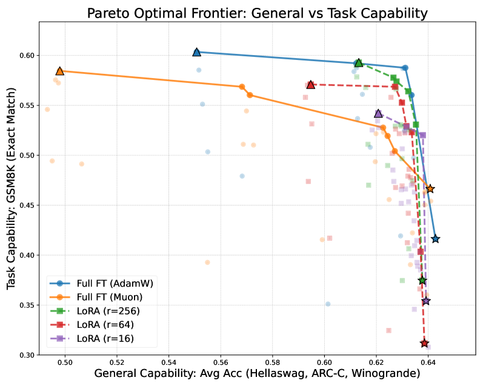
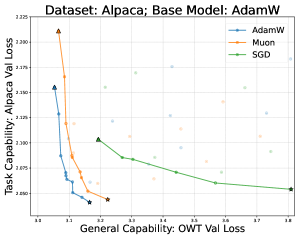
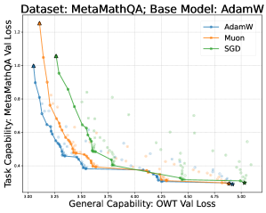

# Optimizer-Model Consistency: Full Finetuning with the Same Optimizer as Pretraining Forgets Less

## 基本信息

- **arXiv ID:** [2605.06654v1](https://arxiv.org/abs/2605.06654v1)
- **作者:** Yuxing Liu, Jianyu Wang, Tong Zhang
- **发布日期:** 2026-05-07
- **分类:** cs.LG, cs.AI, math.OC
- **PDF:** [arXiv PDF](https://arxiv.org/pdf/2605.06654v1)

## 关键图示

<figure><figcaption>Figure 1</figcaption></figure>
<figure><figcaption>Figure 2</figcaption></figure>
<figure><figcaption>Figure 3</figcaption></figure>

## 摘要

### English

Optimizers play an important role in both pretraining and finetuning stages when training large language models (LLMs). In this paper, we present an observation that full finetuning with the same optimizer as in pretraining achieves a better learning-forgetting tradeoff, i.e., forgetting less while achieving the same or better performance on the new task, than other optimizers and, possibly surprisingly, LoRA, during the supervised finetuning (SFT) stage. We term this phenomenon optimizer-model consistency. To better understand it, through controlled experiments and theoretical analysis, we show that: 1) optimizers can shape the models by having regularization effects on the activations, leading to different landscapes around the pretrained checkpoints; 2) in response to this regularization effect, the weight update in SFT should follow some specific structures to lower forgetting of the knowledge learned in pretraining, which can be obtained by using the same optimizer. Moreover, we specifically compare Muon and AdamW when they are employed throughout the pretraining and SFT stages and find that Muon performs worse when finetuned for reasoning tasks. With a synthetic language modeling experiment, we demonstrate that this can come from Muon's strong tendency towards rote memorization, which may hurt pattern acquisition with a small amount of data, as for SFT.

### 中文

在训练大型语言模型 (LLM) 时，优化器在预训练和微调阶段都发挥着重要作用。在本文中，我们提出了一个观察结果，即在监督微调（SFT）阶段，使用与预训练相同的优化器进行完全微调可以实现更好的学习-遗忘权衡，即在新任务上实现相同或更好性能的同时，与其他优化器以及可能令人惊讶的 LoRA 相比，遗忘更少。我们将这种现象称为优化器模型一致性。为了更好地理解它，通过受控实验和理论分析，我们表明：1）优化器可以通过对激活进行正则化影响来塑造模型，从而在预训练检查点周围产生不同的景观； 2）针对这种正则化效果，SFT中的权重更新应该遵循一些特定的结构，以减少对预训练中学到的知识的遗忘，这可以通过使用相同的优化器来获得。此外，我们特别比较了 Muon 和 AdamW 在整个预训练和 SFT 阶段的使用情况，发现 Muon 在针对推理任务进行微调时表现更差。通过合成语言建模实验，我们证明这可能来自 Muon 强烈的死记硬背倾向，这可能会损害少量数据的模式获取，就像 SFT 一样。

## 相关概念

- [大语言模型](../../concepts/large-language-model.html)

## 核心贡献

1. **优化器-模型一致性现象**：发现并系统验证了在 SFT 阶段使用与预训练相同的优化器进行全量微调可获得最佳的学习-遗忘权衡（遗忘更少但学习相同甚至更好），甚至优于 LoRA。
2. **理论解释**：证明优化器通过对激活施加正则化效应来塑造模型，在预训练检查点周围形成不同的损失景观；SFT 权重更新需要遵循特定结构以降低遗忘，而使用相同优化器恰好能提供这种结构。
3. **Muon vs AdamW 案例研究**：发现 Muon 在预训练中通常优于 AdamW，但在数学推理等推理任务上微调后表现反而更差，可能源于 Muon 强烈的死记硬背倾向损害了少量数据下的模式获取。
4. **合成实验验证**：通过合成语言建模实验证明了 Muon 倾向于记忆而非学习模式的假说。

## 方法概述

论文采用完整的预训练-微调流水线：使用 GPT-2-small 在 OpenWebText 上预训练，然后在 MetaMathQA（数学）、Alpaca（指令遵循）、Magicoder（编码）三个下游任务上进行 SFT。对 Llama-2-7B 进行全量微调与 LoRA 的对比。通过绘制帕累托前沿（x 轴为遗忘度量，y 轴为学习度量）来比较不同优化器（AdamW、Muon、SGD）和 LoRA 变体（r=16/64/256）的学习-遗忘权衡。

## 实验结果

- 在所有下游任务和预训练骨架组合中，使用与预训练相同优化器的全量微调始终位于帕累托前沿的最优位置。
- GPT-2 预训练中 Muon 的验证损失（OpenWebText 2.974）优于 AdamW（3.010），但在 MetaMathQA 微调后 Muon 的表现反而不如 AdamW。
- 全量微调经过学习率搜索后，在学习和遗忘两个维度上均可超越 LoRA（包括 r=256）。
- SGD 在下游任务上表现合理但遗忘显著更多。

## 局限性与注意点

- 实验主要在中等规模模型（GPT-2、Llama-2-7B）上进行，大模型（70B+）的一致性现象需进一步验证。
- 理论解释基于简化假设，实际深度学习中的非凸优化更复杂。
- Muon 的"记忆优于模式学习"假说仅通过合成实验支持，在真实场景中的机制可能更复杂。
- 未探讨优化器超参（如 β1、β2、权重衰减）对一致性的影响。

## 相关概念

关于 LLM 训练和优化的更多文献，参见 [大语言模型](../../concepts/large-language-model.html)。

---
*导入时间: 2026-05-09 06:00*
*来源: arXiv Daily Wiki Update 2026-05-09*
