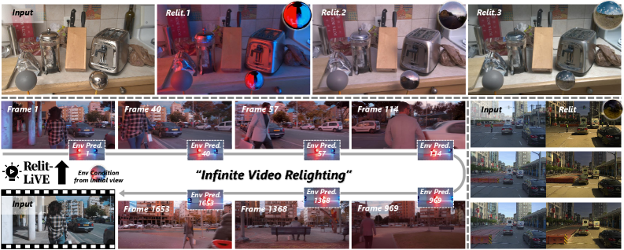
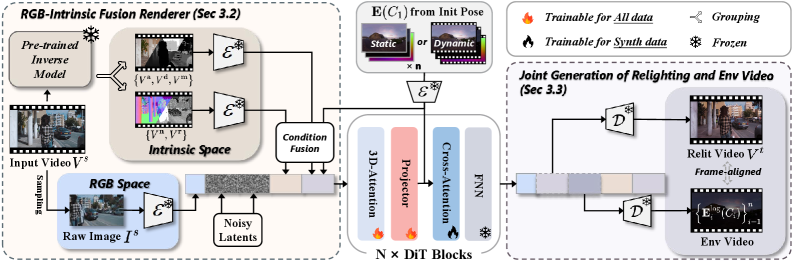
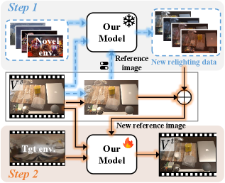

# Relit-LiVE: Relight Video by Jointly Learning Environment Video

## 基本信息

- **arXiv ID:** [2605.06658v1](https://arxiv.org/abs/2605.06658v1)
- **作者:** Weiqing Xiao, Hong Li, Xiuyu Yang et al.
- **发布日期:** 2026-05-07
- **分类:** cs.CV
- **PDF:** [arXiv PDF](https://arxiv.org/pdf/2605.06658v1)

## 关键图示

<figure><figcaption>Figure 1</figcaption></figure>
<figure><figcaption>Figure 2</figcaption></figure>
<figure><figcaption>Figure 3</figcaption></figure>

## 摘要

### English

Recent advances have shown that large-scale video diffusion models can be repurposed as neural renderers by first decomposing videos into intrinsic scene representations and then performing forward rendering under novel illumination. While promising, this paradigm fundamentally relies on accurate intrinsic decomposition, which remains highly unreliable for real-world videos and often leads to distorted appearances, broken materials, and accumulated temporal artifacts during relighting. In this work, we present Relit-LiVE, a novel video relighting framework that produces physically consistent, temporally stable results without requiring prior knowledge of camera pose. Our key insight is to explicitly introduce raw reference images into the rendering process, enabling the model to recover critical scene cues that are inevitably lost or corrupted in intrinsic representations. Furthermore, we propose a novel environment video prediction formulation that simultaneously generates relit videos and per-frame environment maps aligned with each camera viewpoint in a single diffusion process. This joint prediction enforces strong geometric-illumination alignment and naturally supports dynamic lighting and camera motion, significantly improving physical consistency in video relighting while easing the requirement of known per-frame camera pose. Extensive experiments demonstrate that Relit-LiVE consistently outperforms state-of-the-art video relighting and neural rendering methods across synthetic and real-world benchmarks. Beyond relighting, our framework naturally supports a wide range of downstream applications, including scene-level rendering, material editing, object insertion, and streaming video relighting. The Project is available at https://github.com/zhuxing0/Relit-LiVE.

### 中文

最近的进展表明，大规模视频扩散模型可以重新用作神经渲染器，首先将视频分解为内在场景表示，然后在新颖的照明下执行前向渲染。虽然很有希望，但这种范例从根本上依赖于准确的内在分解，这对于现实世界的视频来说仍然非常不可靠，并且经常导致外观扭曲、材料损坏以及重新照明期间累积​​的时间伪影。在这项工作中，我们提出了 Relit-LiVE，这是一种新颖的视频重新照明框架，可以产生物理一致、时间稳定的结果，而无需事先了解相机姿势。我们的主要见解是将原始参考图像显式引入渲染过程，使模型能够恢复内在表示中不可避免地丢失或损坏的关键场景线索。此外，我们提出了一种新颖的环境视频预测公式，该公式可以在单个扩散过程中同时生成与每个摄像机视点对齐的重照明视频和每帧环境图。这种联合预测强制执行强大的几何照明对齐，并自然支持动态照明和相机运动，显着提高视频重新照明的物理一致性，同时减轻已知每帧相机姿势的要求。大量实验表明，Relit-LiVE 在合成和现实基准测试中始终优于最先进的视频重新照明和神经渲染方法。除了重新照明之外，我们的框架自然支持广泛的下游应用程序，包括场景级渲染、材质编辑、对象插入和流视频重新照明。该项目可在 https://github.com/zhuxing0/Relit-LiVE 获取。

## 相关概念

- [多模态学习](../../concepts/multimodal-learning.html)
- [基准评估](../../concepts/benchmarking.html)
- [AI安全与对齐](../../concepts/ai-safety-alignment.html)
- [智能体](../../concepts/ai-agents.html)

## 核心贡献

1. **RGB-Intrinsic 融合渲染器**：将原始 RGB 参考帧显式引入渲染过程，融合真实世界光照效果与内在物理约束，避免纯内在分解在复杂光照场景中的失真问题。
2. **联合环境视频预测**：在单一扩散过程中同时生成重光照视频和每帧环境贴图，无需已知相机位姿即可实现几何-光照对齐。
3. **免相机位姿的重光照**：通过隐式推断光照变换，消除对外部位姿估计的依赖，支持动态光照和相机运动。
4. **两种互补训练策略**：潜在空间插值（合成多光照数据）+ 循环一致自监督光照学习（无需额外标注即可保证时序光照一致性）。

## 方法概述

Relit-LiVE 将视频重光照形式化为同时学习重光照视频和环境视频的任务。给定源视频序列和目标光照条件，RGB-Intrinsic 融合渲染器利用原始 RGB 帧作为参考，指导并纠正渲染过程，使模型能恢复内在表示中丢失的关键场景线索。环境视频预测公式以扩散模型为基础，在单次推理中生成重光照视频和按帧对齐的环境贴图。训练阶段通过潜在空间插值和循环一致方案增强模型鲁棒性。

## 实验结果

在合成和真实世界基准上，Relit-LiVE 始终优于现有最先进的视频重光照和神经渲染方法（如 Light-A-Video、IC-Light、TC-Light、RelightMaster、UniLumos、UniRelight、Diffusion Renderer、V-RGBX 等）。方法展现出逼真的材质反射效果，并能有效处理视角变化。下游应用包括场景级渲染、材质编辑、物体插入和流式视频重光照。论文已被 SIGGRAPH 2026 接收。

## 局限性与注意点

- 对极端复杂的光传输现象（如焦散、次表面散射）的处理能力受限于扩散模型的生成能力。
- 训练需要较大的扩散模型作为基础，对计算资源有一定要求。
- RGB-Intrinsic 融合在部分场景下可能产生伪影，特别是当 RGB 参考帧本身包含严重光照干扰时。
- 深度、法线等几何线索的质量会影响环境视频预测的精度。

## 相关概念

关于视频渲染和扩散模型的更多文献，参见 [多模态学习](../../concepts/multimodal-learning.html)、[基准评估](../../concepts/benchmarking.html)、[AI安全与对齐](../../concepts/ai-safety-alignment.html) 和 [智能体](../../concepts/ai-agents.html)。

---
*导入时间: 2026-05-09 06:00*
*来源: arXiv Daily Wiki Update 2026-05-09*
