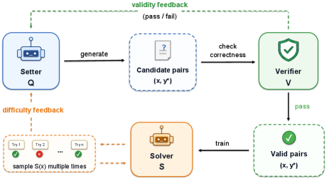
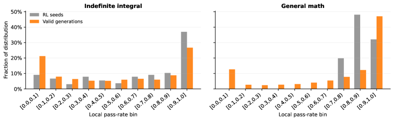
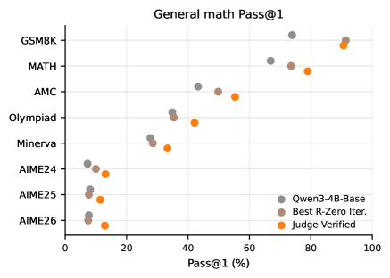

# Verifier-Backed Hard Problem Generation for Mathematical Reasoning

## 基本信息

- **arXiv ID:** [2605.06660v1](https://arxiv.org/abs/2605.06660v1)
- **作者:** Yuhang Lai, Jiazhan Feng, Yee Whye Teh et al.
- **发布日期:** 2026-05-07
- **分类:** cs.LG, cs.AI, cs.CL
- **PDF:** [arXiv PDF](https://arxiv.org/pdf/2605.06660v1)

## 关键图示

<figure><figcaption>Figure 1</figcaption></figure>
<figure><figcaption>Figure 2</figcaption></figure>
<figure><figcaption>Figure 3</figcaption></figure>

## 摘要

### English

Large Language Models (LLMs) demonstrate strong capabilities for solving scientific and mathematical problems, yet they struggle to produce valid, challenging, and novel problems - an essential component for advancing LLM training and enabling autonomous scientific research. Existing problem generation approaches either depend on expensive human expert involvement or adopt naive self-play paradigms, which frequently yield invalid problems due to reward hacking. This work introduces VHG, a verifier-enhanced hard problem generation framework built upon three-party self-play. By integrating an independent verifier into the conventional setter-solver duality, our design constrains the setter's reward to be jointly determined by problem validity (evaluated by the verifier) and difficulty (assessed by the solver). We instantiate two verifier variants: a Hard symbolic verifier and a Soft LLM-based verifier, with evaluations conducted on indefinite integral tasks and general mathematical reasoning tasks. Experimental results show that VHG substantially outperforms all baseline methods by a clear margin.

### 中文

大型语言模型（LLM）展示了解决科学和数学问题的强大能力，但它们难以产生有效的、具有挑战性的和新颖的问题——这是推进 LLM 培训和实现自主科学研究的重要组成部分。现有的问题生成方法要么依赖于昂贵的人类专家参与，要么采用幼稚的自我博弈范式，这些范式经常因奖励黑客而产生无效问题。这项工作介绍了 VHG，一种基于三方自博构建的验证者增强型难题生成框架。通过将独立验证者集成到传统的设置器-求解器二元性中，我们的设计将设置器的奖励限制为由问题有效性（由验证器评估）和难度（由求解器评估）共同确定。我们实例化了两个验证器变体：硬符号验证器和基于 LLM 的软验证器，并对不定积分任务和一般数学推理任务进行评估。实验结果表明，VHG 明显优于所有基线方法。

## 核心贡献

### English
VHG introduces a three-party self-play framework for generating hard mathematical problems that are both valid and challenging. The key innovation is adding an independent verifier to the standard setter-solver self-play paradigm. The setter proposes problem-solution pairs, the verifier checks validity, and only verifier-accepted pairs contribute to the setter's reward via solver difficulty. This prevents reward hacking — where the setter could previously generate invalid/underspecified problems that the solver cannot answer — by making validity a first-class gate in the reward oracle. VHG is instantiated with two verifier types: a hard symbolic verifier (SymPy for indefinite integrals) and a soft LLM-based verifier (for general math), demonstrating broad applicability.

### 中文
VHG 引入了一个三方自博弈框架，用于生成既有效又具有挑战性的数学问题。核心创新是在标准出题者-解题者自博弈范式中添加一个独立的验证器。出题者提出问题-解答对，验证器检查有效性，只有验证器接受的题目对才通过解题者难度反馈贡献给出题者的奖励。这通过将有效性作为奖励预言中的第一道关来防止奖励黑客——出题者此前可以生成解题者无法回答的无效或不完整问题。VHG 以两种验证器类型实例化：硬符号验证器（SymPy，用于不定积分）和软 LLM 验证器（用于通用数学），展示了广泛的适用性。

## 方法概述

### English
VHG extends the setter-solver self-play to three parties: Setter Q (generates problem-solution pairs), Solver S (attempts problems, difficulty measured by accuracy), and Verifier V (validates pair correctness). The setter reward is R_Q = 1[V(x,y*)=1] × (1 - Acc_S(x,y*)), meaning solver failure only counts if the verifier accepts the pair. For indefinite integrals, the hard verifier uses SymPy: it validates formula format and checks that the derivative of the proposed antiderivative equals the integrand. For general math, the soft verifier combines hard-coded filters (rejecting malformed outputs, missing answers, trivial copies) with an LLM judge that checks problem validity, answer validity, and correspondence. Training alternates between setter generation, verifier acceptance, solver-based difficulty scoring, and downstream solver training using only verifier-accepted data. All experiments use Qwen3-4B-Base as backbone.

### 中文
VHG 将出题者-解题者自博弈扩展为三方：出题者 Q（生成问题-解答对）、解题者 S（尝试解题，难度由正确率衡量）、验证器 V（验证题目对正确性）。出题者奖励为 R_Q = 1[V(x,y*)=1] × (1 - Acc_S(x,y*))，即仅当验证器接受题目对时，解题者失败才计入奖励。对于不定积分，硬验证器使用 SymPy：验证公式格式并检查所提原函数的导数是否等于被积函数。对于通用数学，软验证器结合硬编码过滤器（拒绝格式错误输出、缺失答案、简单复制）和 LLM 评判器，检查问题有效性、答案有效性和对应关系。训练交替进行出题者生成、验证器接受、基于解题者的难度评分，以及仅使用验证器接受数据训练下游解题者。所有实验均使用 Qwen3-4B-Base 作为骨干模型。

## 实验结果

### English
(1) RQ-1 (Problem quality): VHG generates problems in lower pass-rate bins (harder) absent from seed data. The hardest zero-pass-rate problems remain challenging even for Qwen3-32B (Pass@1 < 50%, Pass@8 < 86% for integrals; Pass@8 < 71% for general math). (2) RQ-2 (Solver improvement): On indefinite integrals, VHG raises Pass@1 from 28.8%/52.5%/43.3% to 45.4%/69.4%/64.7% on Competition/Qualifier/Stress Test benchmarks, significantly outperforming R-Zero (which degrades after iteration 1 due to invalid problem accumulation). On general math, VHG improves overall Pass@1 from 56.8% to 69.0% across MATH, AMC, Minerva, Olympiad, and AIME benchmarks. (3) The setter learns validity first (reference-valid rate from 30.6% to 65.2% in steps 0-50), then difficulty (solver pass rate falls to 17.6% from steps 50-200). (4) VHG's verifier-accepted problems have 46.0% in the [0.0, 0.1) hardness bin, vs. near-zero for R-Zero.

### 中文
(1) RQ-1（问题质量）：VHG 在种子数据中不存在的更低通过率区间（更难）生成问题。最难的零通过率问题即使对 Qwen3-32B 仍具挑战性（不定积分 Pass@1 < 50%, Pass@8 < 86%；通用数学 Pass@8 < 71%）。(2) RQ-2（解题者提升）：在不定积分上，VHG 将 Pass@1 从 28.8%/52.5%/43.3% 提升至 45.4%/69.4%/64.7%（Competition/Qualifier/Stress Test），显著优于 R-Zero（因无效问题积累在第 1 轮后性能下降）。在通用数学上，VHG 将整体 Pass@1 从 56.8% 提升至 69.0%，覆盖 MATH、AMC、Minerva、Olympiad、AIME 基准。(3) 出题者先学习有效性（参考有效率达 65.2%），再学习难度（解题者通过率降至 17.6%）。(4) VHG 验证器接受的问题中 46.0% 位于 [0.0, 0.1) 难度区间，而 R-Zero 几乎为零。

## 局限性与注意点

### English
(1) Hard verifiers require tasks with formal symbolic verification (e.g., integrals, code execution) — not all mathematical domains support this. (2) Soft verifiers introduce noise; their reliability depends on LLM judge quality and prompt design. (3) The framework was tested only on Qwen3-4B backbone; scaling to larger models may surface different dynamics. (4) The setter and solver share the same architecture — whether different architectures benefit differently is unknown. (5) The generated problems, while hard for the local solver, may not cover all difficulty dimensions relevant to human evaluation. (6) Only math domain tested; extension to other verifiable domains (e.g., code, formal proofs) remains to be explored.

### 中文
(1) 硬验证器要求任务具有形式化符号验证能力（如积分、代码执行）——并非所有数学领域都支持。(2) 软验证器引入噪声；其可靠性取决于 LLM 评判器质量和提示设计。(3) 框架仅在 Qwen3-4B 骨干上测试；扩展到更大模型可能出现不同动态。(4) 出题者和解题者共享相同架构——不同架构是否受益不同尚不清楚。(5) 生成的问题虽然对本地解题者困难，但可能不覆盖与人类评估相关的所有难度维度。(6) 仅测试数学领域；扩展到其他可验证领域（如代码、形式化证明）有待探索。

## 相关概念

- [大语言模型](../../concepts/large-language-model.html)
- [强化学习](../../concepts/reinforcement-learning.html)
- [基准评估](../../concepts/benchmarking.html)
- [自动驾驶](../../concepts/autonomous-driving.html)

---
*导入时间: 2026-05-08 06:02*
*来源: arXiv Daily Wiki Update 2026-05-08*
