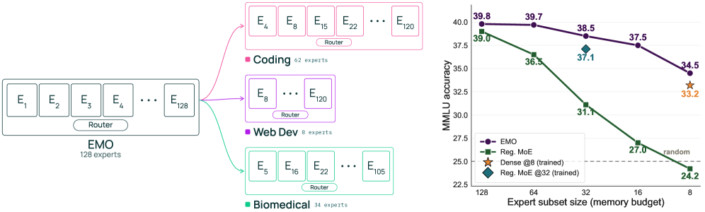

# EMO: Pretraining Mixture of Experts for Emergent Modularity

## 基本信息

- **arXiv ID:** [2605.06663v1](https://arxiv.org/abs/2605.06663v1)
- **作者:** Ryan Wang, Akshita Bhagia, Sewon Min
- **发布日期:** 2026-05-07
- **分类:** cs.CL
- **PDF:** [arXiv PDF](https://arxiv.org/pdf/2605.06663v1)

## 关键图示

<figure><figcaption>Figure 1</figcaption></figure>

## 摘要

### English

Large language models are typically deployed as monolithic systems, requiring the full model even when applications need only a narrow subset of capabilities, e.g., code, math, or domain-specific knowledge. Mixture-of-Experts (MoEs) seemingly offer a potential alternative by activating only a subset of experts per input, but in practice, restricting inference to a subset of experts for a given domain leads to severe performance degradation. This limits their practicality in memory-constrained settings, especially as models grow larger and sparser. We introduce EMO, an MoE designed for modularity-the independent use and composition of expert subsets-without requiring human-defined priors. Our key idea is to encourage tokens from similar domains to rely on similar experts. Since tokens within a document often share a domain, EMO restricts them to select experts from a shared pool, while allowing different documents to use different pools. This simple constraint enables coherent expert groupings to emerge during pretraining using document boundaries alone. We pretrain a 1B-active, 14B-total EMO on 1T tokens. As a full model, it matches standard MoE performance. Crucially, it enables selective expert use: retaining only 25% (12.5%) of experts incurs just a 1% (3%) absolute drop, whereas standard MoEs break under the same setting. We further find that expert subsets in EMO specialize at semantic levels (e.g., domains such as math or code), in contrast to the low-level syntactic specialization observed in standard MoEs. Altogether, our results demonstrate a path toward modular, memory-efficient deployment of large, sparse models and open new opportunities for composable architectures.

### 中文

大型语言模型通常部署为整体系统，即使应用程序只需要一小部分功能（例如代码、数学或特定领域的知识），也需要完整的模型。专家混合 (MoE) 似乎提供了一种潜在的替代方案，即每个输入仅激活一部分专家，但实际上，将推理限制为给定领域的一部分专家会导致性能严重下降。这限制了它们在内存受限环境中的实用性，尤其是当模型变得更大、更稀疏时。我们引入了 EMO，这是一种为模块化而设计的 MoE，即专家子集的独立使用和组合，而不需要人类定义的先验。我们的主要想法是鼓励来自相似领域的代币依赖相似的专家。由于文档中的代币通常共享一个域，因此 EMO 限制它们从共享池中选择专家，同时允许不同的文档使用不同的池。这个简单的约束使得在预训练期间仅使用文档边界就可以出现一致的专家分组。我们在 1T 代币上预训练 1B 活跃、总 14B 的 EMO。作为完整型号，它符合标准的 MoE 性能。至关重要的是，它可以选择性地使用专家：仅保留 25% (12.5%) 的专家只会导致 1% (3%) 的绝对下降，而标准 MoE 在相同设置下就会崩溃。我们进一步发现，EMO 中的专家子集专注于语义级别（例如，数学或代码等领域），这与标准 MoE 中观察到的低级句法专业化形成鲜明对比。总而言之，我们的结果展示了一条通往大型稀疏模型的模块化、内存高效部署的道路，并为可组合架构开辟了新的机会。

## 核心贡献

### English
EMO introduces a novel MoE pretraining approach where modular expert groupings emerge without human-defined domain priors. The key innovation is a document-level routing constraint: all tokens within a document must select active experts from a shared pool, while different documents can use different pools. This simple constraint, using only document boundaries as grouping signals, enables coherent expert specialization at the semantic level (e.g., math, code, biomedical). When pretrained at 1B-active/14B-total parameters on 1T tokens, EMO matches standard MoE full-model performance while uniquely enabling selective expert use — retaining only 25% of experts causes just a 1% absolute drop in performance, versus severe degradation in standard MoEs.

### 中文
EMO 提出了一种新颖的 MoE 预训练方法，使得模块化的专家分组在没有人为定义领域先验的情况下自然涌现。核心创新是文档级路由约束：同一文档内的所有 token 必须从共享池中选择活跃专家，而不同文档可以使用不同的池。这一简单约束仅使用文档边界作为分组信号，使得连贯的专家分组在语义层面（如数学、代码、生物医学）涌现。在 1B 活跃/14B 总参数、1T token 的预训练规模下，EMO 在全模型性能上匹敌标准 MoE，同时独特地支持选择性专家使用——仅保留 25% 的专家仅导致 1% 的绝对性能下降，而标准 MoE 在同一设置下则会崩溃。

## 方法概述

### English
EMO's method is built on a straightforward modification to standard MoE routing. In a standard MoE, each token independently selects its top-k experts from the full per-layer expert set. In EMO, the router first selects a subset of experts for the entire document, and all tokens within that document are constrained to route within this shared pool. Specifically, for an MoE with 128 total experts and 8 active experts per token, all tokens from a document select from a shared pool of 32 experts. The pool assignment is per-document, allowing different documents to activate different expert groups. This design requires no domain labels — the only supervision signal is document boundaries in the pretraining corpus. The model is pretrained end-to-end with this constraint, and expert groupings emerge in a fully self-supervised manner. The authors also propose expert subset selection methods for downstream tasks using simple heuristics like expert frequency counting per domain.

### 中文
EMO 的方法建立在对标准 MoE 路由的简单修改之上。在标准 MoE 中，每个 token 独立从完整的每层专家集中选择其 top-k 专家。在 EMO 中，路由器首先为整个文档选择一个专家子集，该文档内的所有 token 被限制在此共享池内路由。具体而言，对于一个有 128 个总专家、每个 token 8 个活跃专家的 MoE，文档中的所有 token 从 32 个专家的共享池中选择。池分配是按文档进行的，允许不同文档激活不同的专家组。该设计不需要领域标签——唯一的监督信号是预训练语料库中的文档边界。模型在此约束下端到端预训练，专家分组以完全自监督的方式涌现。作者还提出了下游任务的专家子集选择方法，使用简单的启发式方法，如按领域统计专家频率。

## 实验结果

### English
EMO was evaluated as a 1B-active, 14B-total parameter model trained on 1T tokens. Key results: (1) Full-model performance: EMO matches standard MoE on MMLU and MMLU-Pro benchmarks. (2) Selective expert use: Across 16 MMLU categories, retaining only 25% of experts (32 out of 128) incurs just a ~1% absolute drop; retaining 12.5% (16 experts) incurs ~3%. Standard MoEs suffer ~10% and ~15% drops respectively. (3) Expert specialization analysis: EMO experts specialize at semantic/topic levels (math, code, biomedical domains), unlike standard MoEs where experts specialize in low-level syntactic patterns (prepositions, punctuation). (4) Memory-accuracy Pareto frontier: EMO with expert subsets pushes the Pareto frontier over both standard MoEs and separately-trained dense models of matching parameter budgets.

### 中文
EMO 在 1B 活跃参数、14B 总参数、1T token 的规模上进行评估。关键结果：(1) 全模型性能：EMO 在 MMLU 和 MMLU-Pro 基准上匹敌标准 MoE。(2) 选择性专家使用：在 16 个 MMLU 类别上，仅保留 25% 的专家（128 中的 32 个）仅导致约 1% 的绝对下降；保留 12.5%（16 个专家）仅约 3% 下降。标准 MoE 分别遭受约 10% 和 15% 的下降。(3) 专家特化分析：EMO 的专家在语义/主题层面特化（数学、代码、生物医学领域），而标准 MoE 的专家特化于低级句法模式（介词、标点符号）。(4) 内存-准确率帕累托前沿：EMO 的专家子集在内存-准确率权衡上超越了标准 MoE 和匹配参数预算的单独训练密集模型。

## 局限性与注意点

### English
(1) The approach has only been validated at the 1B-active/14B-total scale on 1T tokens — whether modularity scales to much larger models (100B+) remains an open question. (2) Expert subset selection for downstream tasks currently relies on simple heuristics (frequency-based); more principled selection methods may further improve performance. (3) The document-boundary assumption works well for web-crawled corpora but may be less effective for data sources without clear document boundaries. (4) The approach requires training from scratch with the EMO constraint — it cannot be applied post-hoc to existing pretrained MoEs. (5) Only autoregressive language modeling was tested; applicability to other modalities remains unexplored.

### 中文
(1) 该方法仅在 1B 活跃/14B 总参数、1T token 规模上验证——模块化是否能扩展到更大模型（100B+）仍是一个开放问题。(2) 下游任务的专家子集选择目前依赖简单启发式方法（基于频率）；更系统的选择方法可能进一步提升性能。(3) 文档边界假设对网络爬取语料效果好，但对没有清晰文档边界的数据源可能效果较差。(4) 该方法需要用 EMO 约束从头训练——无法事后应用于现有预训练 MoE。(5) 仅在自回归语言建模上测试；对其他模态的适用性尚未探索。

## 相关概念

- [大语言模型](../../concepts/large-language-model.html)

---
*导入时间: 2026-05-08 06:02*
*来源: arXiv Daily Wiki Update 2026-05-08*
