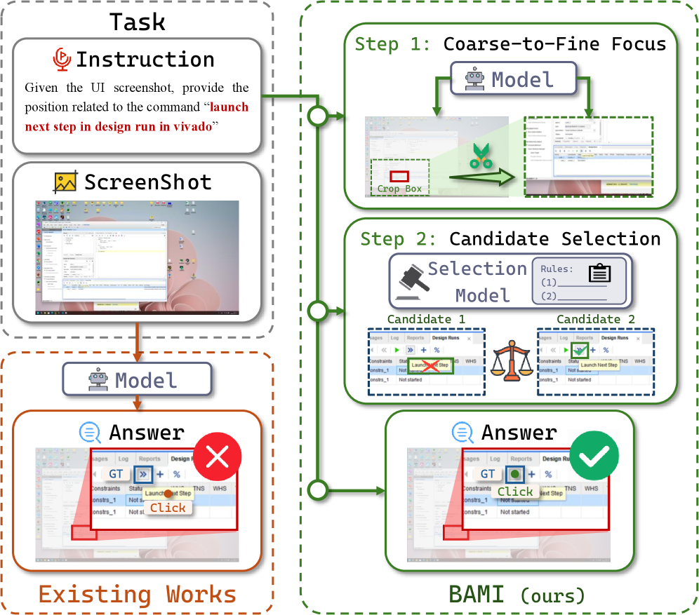
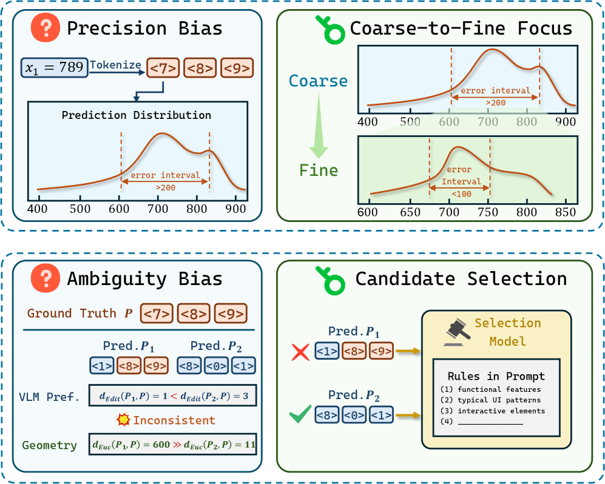
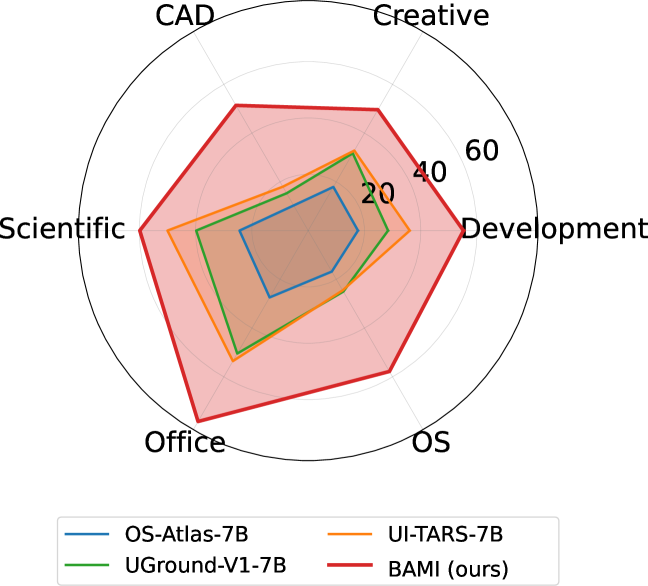

# BAMI: Training-Free Bias Mitigation in GUI Grounding

## 基本信息

- **arXiv ID:** [2605.06664v1](https://arxiv.org/abs/2605.06664v1)
- **作者:** Borui Zhang, Bo Zhang, Bo Wang et al.
- **发布日期:** 2026-05-07
- **分类:** cs.CV, cs.AI
- **PDF:** [arXiv PDF](https://arxiv.org/pdf/2605.06664v1)

## 关键图示

<figure><figcaption>Figure 1</figcaption></figure>
<figure><figcaption>Figure 2</figcaption></figure>
<figure><figcaption>Figure 3</figcaption></figure>

## 摘要

### English

GUI grounding is a critical capability for enabling GUI agents to execute tasks such as clicking and dragging. However, in complex scenarios like the ScreenSpot-Pro benchmark, existing models often suffer from suboptimal performance. Utilizing the proposed \textbf{Masked Prediction Distribution (MPD)} attribution method, we identify that the primary sources of errors are twofold: high image resolution (leading to precision bias) and intricate interface elements (resulting in ambiguity bias). To address these challenges, we introduce \textbf{Bias-Aware Manipulation Inference (BAMI)}, which incorporates two key manipulations, coarse-to-fine focus and candidate selection, to effectively mitigate these biases. Our extensive experimental results demonstrate that BAMI significantly enhances the accuracy of various GUI grounding models in a training-free setting. For instance, applying our method to the TianXi-Action-7B model boosts its accuracy on the ScreenSpot-Pro benchmark from 51.9\% to 57.8\%. Furthermore, ablation studies confirm the robustness of the BAMI approach across diverse parameter configurations, highlighting its stability and effectiveness. Code is available at https://github.com/Neur-IO/BAMI.

### 中文

GUI 接地是使 GUI 代理能够执行单击和拖动等任务的关键功能。然而，在 ScreenSpot-Pro 基准测试等复杂场景中，现有模型的性能常常不佳。利用所提出的\textbf{掩模预测分布（MPD）}归因方法，我们发现错误的主要来源有两个：高图像分辨率（导致精度偏差）和复杂的界面元素（导致模糊性偏差）。为了应对这些挑战，我们引入了偏差感知操纵推理（BAMI），它结合了两个关键操作，从粗到细的聚焦和候选选择，以有效地减轻这些偏差。我们广泛的实验结果表明，BAMI 在免训练环境中显着提高了各种 GUI 接地模型的准确性。例如，将我们的方法应用于 TianXi-Action-7B 模型，可将其在 ScreenSpot-Pro 基准测试中的准确率从 51.9% 提高到 57.8%。此外，消融研究证实了 BAMI 方法在不同参数配置中的稳健性，突出了其稳定性和有效性。代码可在 https://github.com/Neur-IO/BAMI 获取。

## 相关概念

- [多模态学习](../../concepts/multimodal-learning.html)
- [基准评估](../../concepts/benchmarking.html)
- [AI安全与对齐](../../concepts/ai-safety-alignment.html)
- [智能体](../../concepts/ai-agents.html)

## 核心贡献

1. **错误诊断方法**：提出 Masked Prediction Distribution (MPD) 归因方法，通过随机遮挡截图并统计预测热点分布，系统分析 GUI 接地模型的失败模式。在 50 个错误样本中，约 14% 源于知识缺失，74% 源于归纳偏差（包括精度偏差和模糊性偏差）。
2. **精度偏差缓解（粗到细聚焦）**：将单步定位转化为层级式渐进搜索，每步在上一步的候选区域内进一步细化，缩小搜索空间并提高坐标精度。
3. **模糊性偏差校正（候选选择）**：引入预定义的提示规则（功能性特征、典型 UI 模式、交互式元素等）来修正 MLLM 的选择偏好，无需额外训练。
4. **免训练即插即用**：在 OS-Atlas-7B、UI-TARS-7B、TianXi-Action-7B 等多种开源骨架上验证，均实现一致提升。

## 方法概述

BAMI 的核心思想是将一步定位任务转化为基于预定义偏差感知操作的多步结构化推理过程。MPD 方法通过对截图进行随机遮挡（每样本 300 次扰动，约 20 分钟/样本）并聚合预测热点，揭示模型的注意力分布模式。针对精度偏差，BAMI 采用层级裁剪策略，逐步细化候选区域；针对模糊性偏差，引入外部候选选择机制，通过 prompt 注入具体的选择规则来纠正模型的错误偏好。整个过程无需任何模型训练，直接应用于推理阶段。

## 实验结果

在 ScreenSpot-Pro 基准（覆盖 CAD、Creative、Scientific、Development、Office、OS 等多个专业软件领域）上，BAMI 一致提升所有测试骨架的性能：TianXi-Action-7B 准确率从 51.9% 提升至 57.8%，OS-Atlas-7B 和 UI-TARS-7B 也获得显著增益。消融实验验证了粗到细聚焦和候选选择两个组件的各自贡献，并在不同参数配置下表现稳健。

## 局限性与注意点

- MPD 归因需要每样本约 20 分钟的计算（单 RTX 4090 GPU），用于大规模分析时开销较高。
- 候选选择规则需要针对任务人工定义，对不同类型 GUI 任务可能需要调整规则集。
- 论文实验主要基于 ScreenSpot-Pro 和 ScreenSpot-V2 数据集，在其他 GUI 基准上的泛化性仍待验证。
- 方法依赖于模型基础能力——如果模型完全不认识目标元素（知识缺失），BAMI 无法弥补。

## 相关概念

关于 GUI 接地和偏差缓解的更多文献，参见 [多模态学习](../../concepts/multimodal-learning.html)、[基准评估](../../concepts/benchmarking.html)、[AI安全与对齐](../../concepts/ai-safety-alignment.html) 和 [智能体](../../concepts/ai-agents.html)。

---
*导入时间: 2026-05-09 06:00*
*来源: arXiv Daily Wiki Update 2026-05-09*
