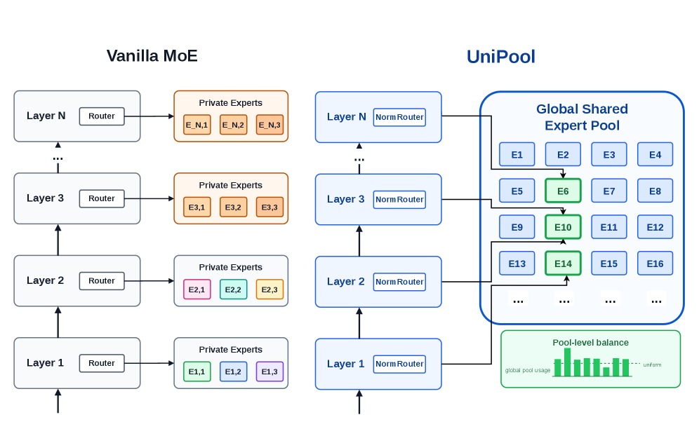
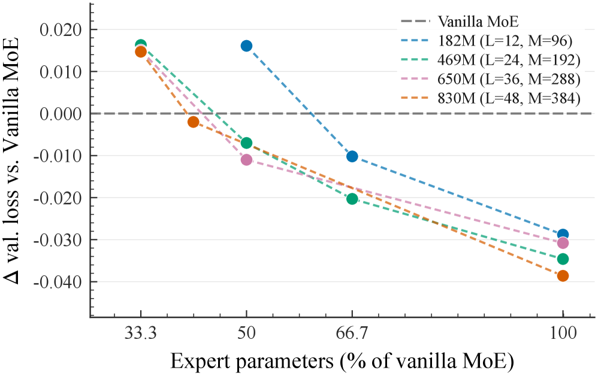
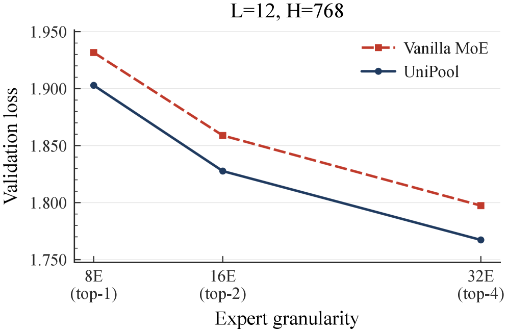

# UniPool: A Globally Shared Expert Pool for Mixture-of-Experts

## 基本信息

- **arXiv ID:** [2605.06665v1](https://arxiv.org/abs/2605.06665v1)
- **作者:** Minbin Huang, Han Shi, Chuanyang Zheng et al.
- **发布日期:** 2026-05-07
- **分类:** cs.LG, cs.AI
- **PDF:** [arXiv PDF](https://arxiv.org/pdf/2605.06665v1)

## 关键图示

<figure><figcaption>Figure 1</figcaption></figure>
<figure><figcaption>Figure 2</figcaption></figure>
<figure><figcaption>Figure 3</figcaption></figure>

## 摘要

### English

Modern Mixture-of-Experts (MoE) architectures allocate expert capacity through a rigid per-layer rule: each transformer layer owns a separate expert set. This convention couples depth scaling with linear expert-parameter growth and assumes that every layer needs isolated expert capacity. However, recent analyses and our routing probe challenge this allocation rule: replacing a deeper layer's learned top-k router with uniform random routing drops downstream accuracy by only 1.0-1.6 points across multiple production MoE models. Motivated by this redundancy, we propose UniPool, an MoE architecture that treats expert capacity as a global architectural budget by replacing per-layer expert ownership with a single shared pool accessed by independent per-layer routers. To enable stable and balanced training under sharing, we introduce a pool-level auxiliary loss that balances expert utilization across the entire pool, and adopt NormRouter to provide sparse and scale-stable routing into the shared expert pool. Across five LLaMA-architecture model scales (182M, 469M, 650M, 830M, and 978M parameters) trained on 30B tokens from the Pile, UniPool consistently improves validation loss and perplexity over the matched vanilla MoE baselines. Across these scales, UniPool reduces validation loss by up to 0.0386 relative to vanilla MoE. Beyond raw loss improvement, our results identify pool size as an explicit depth-scaling hyperparameter: reduced-pool UniPool variants using only 41.6%-66.7% of the vanilla expert-parameter budget match or outperform layer-wise MoE at the tested scales. This shows that, under a shared-pool design, expert parameters need not grow linearly with depth; they can grow sublinearly while remaining more efficient and effective than vanilla MoE. Further analysis shows that UniPool's benefits compose with finer-grained expert decomposition.

### 中文

现代专家混合 (MoE) 架构通过严格的每层规则分配专家容量：每个变压器层拥有一个单独的专家集。该约定将深度缩放与线性专家参数增长结合起来，并假设每一层都需要独立的专家容量。然而，最近的分析和我们的路由探测对这一分配规则提出了挑战：用统一的随机路由替换更深层学习的 top-k 路由器，在多个生产 MoE 模型中，下游精度仅下降 1.0-1.6 个点。受这种冗余的推动，我们提出了 UniPool，这是一种 MoE 架构，通过用独立的每层路由器访问的单个共享池取代每层专家所有权，将专家容量视为全局架构预算。为了在共享下实现稳定和平衡的训练，我们引入了池级辅助损失来平衡整个池中的专家利用率，并采用 NormRouter 为共享专家池提供稀疏且规模稳定的路由。在使用来自 Pile 的 30B 代币训练的五个 LLaMA 架构模型规模（182M、469M、650M、830M 和 978M 参数）中，UniPool 持续改善了匹配的普通 MoE 基线的验证损失和困惑度。在这些规模上，UniPool 相对于普通 MoE 将验证损失降低了 0.0386。除了原始损失改进之外，我们的结果将池大小确定为显式深度缩放超参数：缩小池 UniPool 变体仅使用 41.6%-66.7% 的普通专家参数预算匹配或在测试规模上优于逐层 MoE。这表明，在共享池设计下，专家参数不需要随深度线性增长；它们可以亚线性增长，同时保持比普通 MoE 更高的效率和效果。进一步分析表明，UniPool 的好处在于更细粒度的专家分解。

## 核心贡献

### English
UniPool challenges the standard per-layer expert ownership convention in MoE architectures by proposing a globally shared expert pool accessed by independent per-layer routers. The key motivation comes from a routing-randomization probe: replacing a deeper layer's learned top-k router with uniform random routing drops accuracy by only 1.0-1.6 points across three production MoE models, indicating substantial expert redundancy in deep layers. UniPool treats expert capacity as a global architectural budget, enabling cross-layer expert reuse. Two co-designs enable stable training: a pool-level auxiliary loss (balancing utilization over the shared pool rather than per-layer) and NormRouter (L2-normalized ReLU scoring for sparse, scale-stable routing). Reduced-pool variants using only 41.6%-66.7% of vanilla expert parameters match or outperform layer-wise MoE.

### 中文
UniPool 通过提出由独立的每层路由器访问的全局共享专家池，挑战了 MoE 架构中标准的每层专家所有权惯例。关键动机来自路由随机化探测：在三个生产 MoE 模型中，用均匀随机路由替换深层学习的 top-k 路由器仅导致准确率下降 1.0-1.6 分，表明深层存在大量专家冗余。UniPool 将专家容量视为全局架构预算，实现跨层专家复用。两项联合设计实现稳定训练：池级辅助损失（在共享池而非每层上平衡利用率）和 NormRouter（L2 归一化 ReLU 评分以实现稀疏、规模稳定的路由）。仅使用 41.6%-66.7% 标准专家参数的缩减池变体匹敌或优于逐层 MoE。

## 方法概述

### English
UniPool replaces L per-layer expert sets with a single global pool of M shared experts. Each layer retains its own router r_l that selects from this shared pool: FFN_l(x) = Σ gl,i(x) · e_i(x) for i in Top-k(r_l(x)). Key components: (1) Pool-level auxiliary loss: Instead of per-layer load balancing (which would force every layer to use every expert), UniPool aggregates token-to-expert assignments across all layers and computes a single loss over the global pool. This prevents globally dead experts while allowing layer-specific expert subsets. (2) NormRouter: Replaces softmax with L2-normalize-then-ReLU scoring (s_i = σ·c·max(0, z_i/(||z||_2+ε))), providing sparse routing that is insensitive to layer-specific hidden-state scale differences. (3) The pool size M is a depth-scaling hyperparameter — expert parameters can grow sublinearly with depth. Five model scales (182M-978M) trained on 30B Pile tokens.

### 中文
UniPool 用一个包含 M 个共享专家的全局池替换 L 个每层专家集。每层保留自己的路由器 r_l，从此共享池中选择。关键组件：(1) 池级辅助损失：UniPool 聚合所有层的 token-专家分配并计算全局池上的单一损失，而非每层负载均衡。这防止全局死专家的同时允许层特定专家子集。(2) NormRouter：用 L2 归一化后 ReLU 评分替代 softmax，提供对层特定隐藏状态尺度差异不敏感的稀疏路由。(3) 池大小 M 是深度缩放超参数——专家参数可随深度亚线性增长。五个模型规模在 30B Pile token 上训练。

## 实验结果

### English
(1) Consistent validation loss improvement: UniPool reduces validation loss over vanilla MoE by 0.0288-0.0386 across all five scales (182M-978M). (2) Sublinear expert scaling: Reduced-pool UniPool variants match or beat vanilla MoE using only 66.7% (182M), 50% (469M/650M), and 41.6% (830M) of vanilla expert parameters. The smallest winning fraction shrinks with depth. (3) Downstream zero-shot: UniPool improves average accuracy by 0.87-1.85 points across scales. (4) Expert granularity: UniPool composes with finer-grained decomposition (16E/top-2, 32E/top-4), maintaining improvements. (5) The deeper 830M model with fewer stored parameters achieves lower validation loss than the wider 978M model, supporting a budget-allocation view where depth with shared pools beats width. (6) Routing-randomization probe on UniPool shows larger drops than vanilla MoE, confirming that sharing actively breaks the redundancy.

### 中文
(1) 一致的验证损失改进：UniPool 在所有五个规模上将验证损失降低 0.0288-0.0386。(2) 亚线性专家缩放：缩减池 UniPool 变体仅使用 66.7%-41.6% 标准专家参数匹敌或优于标准 MoE。最小获胜比例随深度缩小。(3) 下游零样本：UniPool 在各规模上平均准确率提升 0.87-1.85 分。(4) 专家粒度：UniPool 与更细粒度分解组合，维持改进。(5) 更深的 830M 模型以更少的存储参数获得比更宽的 978M 模型更低的验证损失。(6) UniPool 上的路由随机化探测显示比标准 MoE 更大的下降，确认共享主动打破冗余。

## 局限性与注意点

### English
(1) Trained on only 30B tokens — whether benefits persist at trillion-token scales remains untested. (2) Only LLaMA-architecture backbones tested; applicability to other architectures (e.g., non-autoregressive, encoder-decoder) unknown. (3) Models up to 978M parameters — verification at production scales (10B+) is needed. (4) The pool-level auxiliary loss uses one-micro-batch-behind statistics; training dynamics at very large batch sizes may differ. (5) NormRouter's fixed constant c requires Monte Carlo estimation — complexity for new architectures. (6) The routing-randomization probe methodology, while insightful, does not fully characterize the nature of expert redundancy.

### 中文
(1) 仅在 30B token 上训练——收益是否在万亿 token 规模持续尚未测试。(2) 仅测试 LLaMA 架构骨干；对其他架构的适用性未知。(3) 模型最高 978M 参数——需要在生产规模验证。(4) 池级辅助损失使用延迟一个微批次的统计；大批量下的训练动态可能不同。(5) NormRouter 的固定常数 c 需要蒙特卡洛估计——对新架构增加复杂性。(6) 路由随机化探测方法虽有洞见，但未完全描述专家冗余的性质。

## 相关概念

- [大语言模型](../../concepts/large-language-model.html)

---
*导入时间: 2026-05-08 06:02*
*来源: arXiv Daily Wiki Update 2026-05-08*
