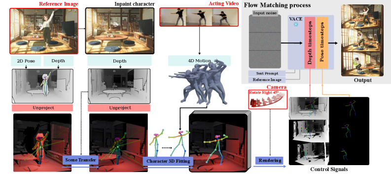
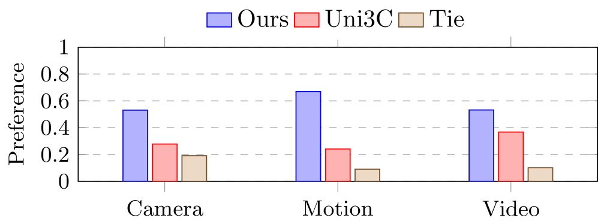

# ActCam: Zero-Shot Joint Camera and 3D Motion Control for Video Generation

## 基本信息

- **arXiv ID:** [2605.06667v1](https://arxiv.org/abs/2605.06667v1)
- **作者:** Omar El Khalifi, Thomas Rossi, Oscar Fossey et al.
- **发布日期:** 2026-05-07
- **分类:** cs.CV, cs.AI, cs.LG
- **PDF:** [arXiv PDF](https://arxiv.org/pdf/2605.06667v1)

## 关键图示

<figure><figcaption>Figure 1</figcaption></figure>
<figure><figcaption>Figure 2</figcaption></figure>
<figure><figcaption>Figure 3</figcaption></figure>

## 摘要

### English

For artistic applications, video generation requires fine-grained control over both performance and cinematography, i.e., the actor's motion and the camera trajectory. We present ActCam, a zero-shot method for video generation that jointly transfers character motion from a driving video into a new scene and enables per-frame control of intrinsic and extrinsic camera parameters. ActCam builds on any pretrained image-to-video diffusion model that accepts conditioning in terms of scene depth and character pose. Given a source video with a moving character and a target camera motion, ActCam generates pose and depth conditions that remain geometrically consistent across frames. We then run a single sampling process with a two-phase conditioning schedule: early denoising steps condition on both pose and sparse depth to enforce scene structure, after which depth is dropped and pose-only guidance refines high-frequency details without over-constraining the generation. We evaluate ActCam on multiple benchmarks spanning diverse character motions and challenging viewpoint changes. We find that, compared to pose-only control and other pose and camera methods, ActCam improves camera adherence and motion fidelity, and is preferred in human evaluations, especially under large viewpoint changes. Our results highlight that careful camera-consistent conditioning and staged guidance can enable strong joint camera and motion control without training. Project page: https://elkhomar.github.io/actcam/.

### 中文

对于艺术应用，视频生成需要对表演和摄影进行精细控制，即演员的动作和摄像机轨迹。我们提出了 ActCam，一种用于视频生成的零镜头方法，可将角色运动从驾驶视频联合传输到新场景，并实现内部和外部相机参数的每帧控制。 ActCam 建立在任何预先训练的图像到视频扩散模型的基础上，该模型接受场景深度和角色姿势的调节。给定具有移动角色和目标摄像机运动的源视频，ActCam 会生成跨帧保持几何一致的姿势和深度条件。然后，我们使用两阶段调节计划运行单个采样过程：早期去噪步骤以姿势和稀疏深度为条件，以强制场景结构，之后深度被丢弃，仅姿势指导可细化高频细节，而不会过度约束生成。我们根据涵盖不同角色动作和具有挑战性的视角变化的多个基准来评估 ActCam。我们发现，与仅姿势控制和其他姿势和相机方法相比，ActCam 提高了相机依从性和运动保真度，并且在人类评估中受到青睐，尤其是在较大视点变化的情况下。我们的结果强调，仔细的相机一致调节和分阶段指导可以在无需训练的情况下实现强大的联合相机和运动控制。项目页面：https://elkhomar.github.io/actcam/。

## 核心贡献

### English
ActCam enables zero-shot joint control over both character motion and camera trajectory in video generation, using any pretrained image-to-video diffusion model. The key insight is constructing camera-aligned conditioning signals: per-frame 3D pose maps (from monocular 3D human reconstruction) and per-frame depth maps (from reference image depth estimation), both rendered under the target camera viewpoint. A two-phase conditioning schedule — early denoising with depth+pose for scene structure, later with pose-only for high-frequency detail refinement — prevents over-constraining. ActCam requires no finetuning, outperforming the trained Uni3C baseline in both control quality and visual fidelity.

### 中文
ActCam 实现了视频生成中角色动作和摄像机轨迹的零样本联合控制，使用任何预训练的图像到视频扩散模型。核心洞察是构建摄像机对齐的条件信号：每帧 3D 姿态图（来自单目 3D 人体重建）和每帧深度图（来自参考图像深度估计），两者均在目标摄像机视角下渲染。两阶段条件调度——早期用深度+姿态去噪以加强场景结构，后期仅用姿态细化高频细节——防止过度约束。ActCam 无需微调，在控制质量和视觉保真度上均优于已训练的 Uni3C 基线。

## 方法概述

### English
ActCam's pipeline: (1) Input: reference image (defines scene/identity), acting video (provides motion), target camera trajectory. (2) Scene preparation: Inpaint character from reference image to get background-only depth map D_bg; estimate 3D mesh from D_bg. (3) Motion recovery: Use GVHMR to recover 3D human motion sequence (SMPL parameters) from acting video. (4) Scene transfer: Align the recovered 3D character with the background 3D mesh via weighted centroid-based affine transformation along the depth axis. (5) Rendering: Rasterize pose and depth+pose control signals under the target camera at each frame. (6) Two-phase denoising: For timesteps t ≤ t_stop, condition on both depth+pose; for t > t_stop, condition on pose only. Backbone: VACE (based on Wan 2.1 14B). All steps are inference-time only.

### 中文
ActCam 流水线：(1) 输入：参考图像（定义场景/身份）、表演视频（提供动作）、目标摄像机轨迹。(2) 场景准备：从参考图像中擦除角色，获得纯背景深度图 D_bg；从 D_bg 估计 3D 网格。(3) 动作恢复：使用 GVHMR 从表演视频恢复 3D 人体运动序列。(4) 场景转移：通过沿深度轴的加权质心仿射变换将恢复的 3D 角色与背景 3D 网格对齐。(5) 渲染：在目标摄像机下逐帧光栅化姿态和深度+姿态控制信号。(6) 两阶段去噪：t ≤ t_stop 时以深度+姿态为条件；t > t_stop 时仅以姿态为条件。骨干：VACE（基于 Wan 2.1 14B）。所有步骤仅推理时使用。

## 实验结果

### English
(1) Joint camera+motion control: ActCam achieves better MPJPE (0.2087 vs 0.2121) and Sampson Error (0.4546 vs 0.5665) than Uni3C on moving-camera benchmarks (4 camera presets × 100 clips). (2) Visual quality: Outperforms Uni3C on VBench metrics — Subject Consistency (0.9212), Imaging Quality (0.7212). (3) Static camera: Competitive with strong motion-control methods (Moore-AnimateAnyone, MimicMotion, VACE). (4) Ablation: Two-phase conditioning significantly outperforms both full-depth (over-constrained, static backgrounds) and pose-only (loses camera motion) baselines. (5) The approach generalizes across diverse character motions and challenging viewpoint changes.

### 中文
(1) 联合摄像机+动作控制：ActCam 在移动摄像机基准上比 Uni3C 获得更好的 MPJPE (0.2087 vs 0.2121) 和 Sampson Error (0.4546 vs 0.5665)。(2) 视觉质量：在 VBench 指标上优于 Uni3C——主体一致性 (0.9212)、成像质量 (0.7212)。(3) 静态摄像机：与强动作控制方法竞争。(4) 消融：两阶段条件显著优于全深度（过度约束、静态背景）和仅姿态（丢失摄像机运动）基线。(5) 方法泛化到多样的角色动作和挑战性视角变化。

## 局限性与注意点

### English
(1) Zero-shot approach inherently limited by the pretrained backbone's capabilities — cannot generate motions or viewpoints outside the backbone's training distribution. (2) Depth estimation quality directly impacts results; monocular depth estimators may produce artifacts under complex geometries. (3) 3D human reconstruction (GVHMR) may fail under severe occlusions or unusual poses. (4) The scene transfer step assumes a rigid alignment between character and background — complex interactions (e.g., character sitting on furniture) may be unrealistic. (5) Two-phase schedule's t_stop is a hyperparameter that may need tuning per scenario. (6) No explicit handling of character-background occlusions or lighting consistency.

### 中文
(1) 零样本方法固有地受预训练骨干能力限制——无法生成骨干训练分布之外的动作或视角。(2) 深度估计质量直接影响结果；单目深度估计器在复杂几何下可能产生伪影。(3) 3D 人体重建在严重遮挡或不寻常姿态下可能失败。(4) 场景转移步骤假设角色与背景间的刚性对齐——复杂交互可能不真实。(5) 两阶段调度的 t_stop 是需要按场景调整的超参数。(6) 未显式处理角色-背景遮挡或光照一致性。

## 相关概念

- [多模态学习](../../concepts/multimodal-learning.html)
- [基准评估](../../concepts/benchmarking.html)
- [自动驾驶](../../concepts/autonomous-driving.html)
- [图神经网络](../../concepts/graph-neural-networks.html)

---
*导入时间: 2026-05-08 06:02*
*来源: arXiv Daily Wiki Update 2026-05-08*
