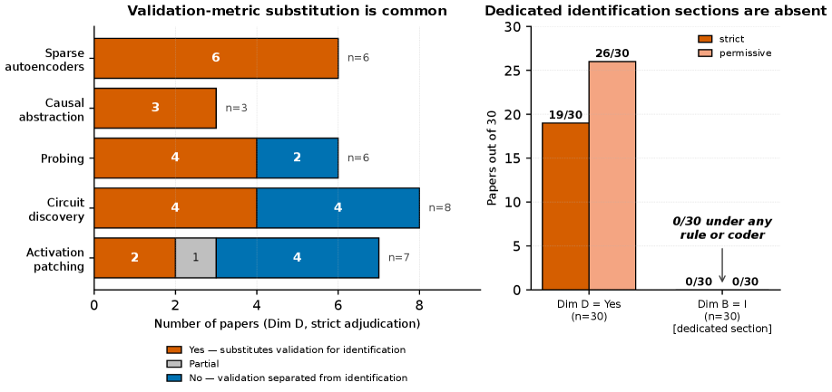

# Position: Mechanistic Interpretability Must Disclose Identification Assumptions for Causal Claims

## 基本信息

- **arXiv ID:** [2605.08012v1](https://arxiv.org/abs/2605.08012v1)
- **作者:** Zezheng Lin, Fengming Liu
- **发布日期:** 2026-05-08
- **分类:** cs.LG, cs.AI, cs.CL
- **PDF:** [arXiv PDF](https://arxiv.org/pdf/2605.08012v1)

## 关键图示

<figure><figcaption>Figure 1</figcaption></figure>
<figure><figcaption>Figure 2</figcaption></figure>

## 摘要

### English

Mechanistic interpretability papers increasingly use causal vocabulary: circuits, mediators, causal abstraction, monosemanticity. Such claims require explicit identification assumptions. A purposive audit of 10 papers across four methodological strands finds no dedicated identification-assumptions section and a recurring pattern: validation metrics such as faithfulness, completeness, monosemanticity, alignment, or ablation effects are reported as causal support without stating the assumptions that make them identifying. A two-human-coder audit on $n=30$ reproduces the direction of the main finding: dedicated identification sections are absent, and validation-metric substitution is common, though exact Dim B/D counts are coding-rule sensitive. The paper proposes a disclosure norm: state whether the claim is causal, name the identification strategy, enumerate assumptions, stress at least one, and explain how conclusions shift if assumptions fail. Validation is not identification.

### 中文

机械可解释性论文越来越多地使用因果词汇：电路、中介、因果抽象、单一语义。此类主张需要明确的识别假设。对四个方法论分支的 10 篇论文进行了有目的的审核，发现没有专门的识别假设部分和重复出现的模式：诸如忠实性、完整性、单义性、对齐或消融效应等验证指标被报告为因果支持，但没有说明使它们识别的假设。对 $n=30$ 的两人编码员审计重现了主要发现的方向：缺少专用标识部分，并且验证度量替换很常见，尽管精确的 Dim B/D 计数对编码规则敏感。该论文提出了一种披露规范：说明主张是否有因果关系，命名识别策略，列举假设，强调至少一个，并解释如果假设失败，结论将如何变化。验证不是识别。

## 核心贡献

### English
This position paper identifies "validation metric substitution" as a systemic pattern in mechanistic interpretability: papers report faithfulness, completeness, monosemanticity, or ablation effects as causal evidence without stating identification assumptions. A two-human-coder audit of n=30 papers across four strands (activation patching, SAEs, causal abstraction, probing) finds 0/30 contain a dedicated identification-assumptions section. The paper proposes a disclosure norm: state whether the claim is causal, name the identification strategy, enumerate assumptions, stress at least one, and explain how conclusions shift if assumptions fail.

### 中文
本文识别了机械可解释性中的"验证度量替代"系统性模式：论文将忠实性、完整性、单语义性或消融效应报告为因果证据，却不陈述识别假设。对四个方法论分支的 30 篇论文进行双人编码审计，发现 0/30 包含专门的识别假设部分。论文提出披露规范：声明主张是否具因果性、命名识别策略、枚举假设、强调至少一个假设、解释假设失败时结论如何变化。

## 方法概述

### English
The audit covers four methodological strands: (1) Activation Patching — assumptions of circuit completeness, pathway exclusivity, metric sufficiency; (2) Sparse Autoencoders — dictionary basis recoverability, feature atomicity; (3) Causal Abstraction — distributed alignment, abstraction consistency; (4) Probing with Ablation — intervention completeness, representational locality. The paper borrows the meta-practice from econometrics (not specific frameworks): causal claims require explicit assumptions. Templates are provided for each strand listing assumptions, evidence, falsifiability tests, and sensitivity implications.

### 中文
审计涵盖四个方法论分支：(1) 激活修补——电路完整性、通路排他性、度量充分性假设；(2) 稀疏自编码器——字典基可恢复性、特征原子性假设；(3) 因果抽象——分布式对齐、抽象一致性假设；(4) 探针消融——干预完整性、表征局部性假设。论文借鉴计量经济学元实践（非特定框架）：因果主张需要明确假设。提供各分支模板。

## 实验结果

### English
Primary audit (n=10 purposive): 0/10 papers have a dedicated identification-assumptions section; 8/10 make only implicit causal claims in abstracts; 7/10 contain no falsifiability test; the majority substitute validation metrics for identification statements. Two-human-coder sensitivity audit (n=30): confirms 0/30 contain identification-assumptions sections under any coding rule (Dim B=0), though exact Dim D (explicit causal vocabulary in abstracts) counts vary by coder. The finding that validation metric substitution is widespread is robust across coding rules.

### 中文
主审计（n=10 目的性抽样）：0/10 有专门识别假设部分；8/10 仅在摘要中隐含因果主张；7/10 不含可证伪性测试；大多数以验证度量替代识别陈述。双人编码敏感性审计（n=30）：确认 0/30 在任意编码规则下包含识别假设部分，但摘要中显式因果词汇计数因编码员而异。验证度量替代普遍存在这一发现在编码规则间稳健。

## 局限性与注意点

- 审计样本是目的性抽样（n=10）和小规模（n=30），不旨在估计全领域流行率。
- 论文是立场论文（Position Paper），非实证研究，核心主张是概念性的。
- 提出的披露模板是建议性而非规范性，各方法的识别假设列表可能不完整。
- 未提供假设违反时的具体统计检验方法。
- 立场本身依赖"因果主张需要假设"这一认识论前提，该前提在某些科学哲学传统中存在争议。

## 相关概念

- [基准评估](../../concepts/benchmarking.html)
- [AI安全与对齐](../../concepts/ai-safety-alignment.html)

---
*导入时间: 2026-05-11 06:02*
*来源: arXiv Daily Wiki Update 2026-05-11*
