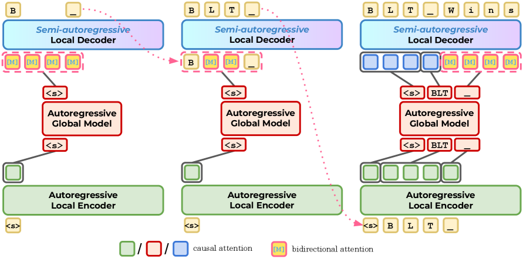
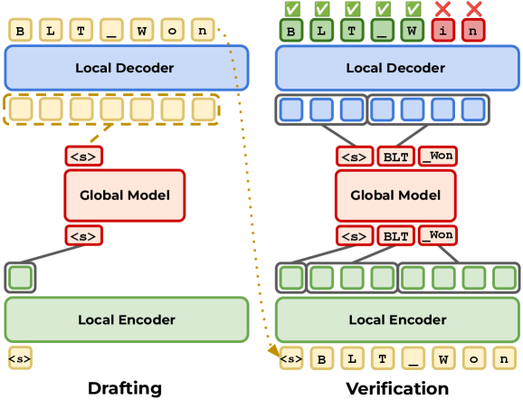
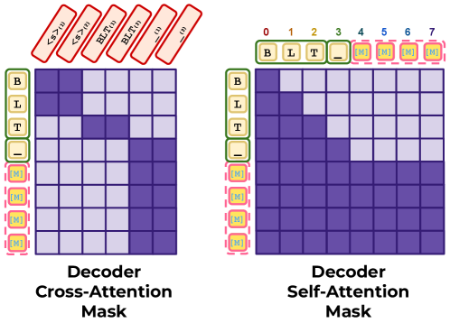

# Fast Byte Latent Transformer

## 基本信息

- **arXiv ID:** [2605.08044v1](https://arxiv.org/abs/2605.08044v1)
- **作者:** Julie Kallini, Artidoro Pagnoni, Tomasz Limisiewicz et al.
- **发布日期:** 2026-05-08
- **分类:** cs.CL, cs.AI, cs.LG
- **PDF:** [arXiv PDF](https://arxiv.org/pdf/2605.08044v1)

## 关键图示

<figure><figcaption>Figure 1</figcaption></figure>
<figure><figcaption>Figure 2</figcaption></figure>
<figure><figcaption>Figure 3</figcaption></figure>

## 摘要

### English

Recent byte-level language models (LMs) match the performance of token-level models without relying on subword vocabularies, yet their utility is limited by slow, byte-by-byte autoregressive generation. We address this bottleneck in the Byte Latent Transformer (BLT) through new training and generation techniques. First, we introduce BLT Diffusion (BLT-D), a new model and our fastest BLT variant, trained with an auxiliary block-wise diffusion objective alongside the standard next-byte prediction loss. This enables an inference procedure that generates multiple bytes in parallel per decoding step, substantially reducing the number of forward passes required to generate a sequence. Second, we propose two extensions inspired by speculative decoding that trade some of this speed for higher generation quality: BLT Self-speculation (BLT-S), in which BLT's local decoder continues generating past its normal patch boundaries to draft bytes, which are then verified with a single full-model forward pass; and BLT Diffusion+Verification (BLT-DV), which augments BLT-D with an autoregressive verification step after diffusion-based generation. All methods may achieve an estimated memory-bandwidth cost over 50% lower than BLT on generation tasks. Each approach offers its own unique advantages, together removing key barriers to the practical use of byte-level LMs.

### 中文

最近的字节级语言模型（LM）在不依赖子词词汇的情况下与令牌级模型的性能相匹配，但它们的实用性受到缓慢的逐字节自回归生成的限制。我们通过新的训练和生成技术解决了 Byte Latent Transformer (BLT) 中的这一瓶颈。首先，我们介绍 BLT 扩散 (BLT-D)，这是一种新模型，也是我们最快的 BLT 变体，它使用辅助分块扩散目标以及标准下一个字节预测损失进行训练。这使得推理过程能够在每个解码步骤并行生成多个字节，从而大大减少生成序列所需的前向传递的数量。其次，我们提出了两个受推测解码启发的扩展，它们以部分速度换取更高的生成质量：BLT 自推测 (BLT-S)，其中 BLT 的本地解码器继续生成超过其正常补丁边界的草稿字节，然后使用单个全模型前向传递进行验证； BLT 扩散+验证 (BLT-DV)，它在基于扩散的生成之后通过自回归验证步骤增强了 BLT-D。在生成任务中，所有方法都可以实现比 BLT 低 50% 以上的估计内存带宽成本。每种方法都有其独特的优势，共同消除了字节级 LM 实际使用的关键障碍。

## 核心贡献

### English
This paper introduces three inference methods that accelerate Byte Latent Transformer (BLT) generation: (1) BLT-D, which adds block-wise discrete diffusion training to enable parallel multi-byte generation, achieving the largest speedups (up to 92% memory-bandwidth cost reduction); (2) BLT-S, which uses the existing local decoder for self-speculation, drafting bytes past patch boundaries with no quality loss; (3) BLT-DV, which adds autoregressive verification to BLT-D drafts, recovers quality while still achieving up to 81% cost reduction. All methods achieve >50% lower estimated memory-bandwidth cost than BLT at 1B and 3B scales.

### 中文
本文提出三种加速 Byte Latent Transformer (BLT) 生成的推理方法：(1) BLT-D——添加块级离散扩散训练以实现并行多字节生成，达到最大加速（最高 92% 内存带宽成本降低）；(2) BLT-S——利用现有局部解码器自推测，在补丁边界外起草字节且无损质量；(3) BLT-DV——对 BLT-D 草案添加自回归验证，恢复质量的同时仍实现最高 81% 成本降低。所有方法在 1B 和 3B 规模上实现 >50% 内存带宽成本降低。

## 方法概述

### English
BLT architecture: bytes are dynamically grouped into variable-length patches by an entropy-based patcher; a local encoder and a large global Transformer operate on latent tokens; a local decoder generates bytes autoregressively. BLT-D modifies the decoder to accept corrupted byte blocks and trains with both next-byte prediction and masked-byte prediction. At inference, it initializes a block of [MASK] tokens and iteratively unmasks positions via semi-autoregressive diffusion. BLT-S lets the decoder draft bytes beyond normal patch boundaries, verified by a full-model forward pass. BLT-DV uses diffusion-drafted blocks verified autoregressively. All methods reuse the same model weights — no separate draft model.

### 中文
BLT 架构通过基于熵的分块器将字节动态分组为可变长度补丁；局部编码器和大全局 Transformer 处理潜在 token；局部解码器自回归生成字节。BLT-D 修改解码器接受损坏的字节块，同时用下一字节预测和掩码字节预测训练。推理时初始化 [MASK] 块并通过半自回归扩散迭代去掩码。BLT-S 让解码器在补丁边界外起草字节，全模型前向传播验证。BLT-DV 用扩散草案自回归验证。所有方法重用相同模型权重。

## 实验结果

### English
At 1B scale on WMT translation and HumanEval code generation: BLT-D achieves 92% reduction in decoder NFEs with diffusion block size 32, with moderate BLEU drop on translation. BLT-S achieves up to 77% encoder/global-call reduction with zero quality loss (greedy-identical output guaranteed). BLT-DV at block size 16 achieves 81% reduction with quality close to autoregressive BLT. At 3B scale, similar trends hold. Likelihood evaluations confirm diffusion training does not degrade perplexity. Generation diversity analysis shows BLT-D produces more diverse outputs at high temperatures.

### 中文
1B 规模在 WMT 翻译和 HumanEval 代码生成上：BLT-D 在扩散块大小 32 时实现 92% 解码器 NFE 降低，翻译 BLEU 适度下降。BLT-S 实现最高 77% 编码器/全局调用降低且零质量损失。BLT-DV 在块大小 16 时实现 81% 降低且质量接近自回归 BLT。3B 规模趋势相似。困惑度评估确认扩散训练不降低困惑度。生成多样性分析显示 BLT-D 在高温下产生更多样化输出。

## 局限性与注意点

- BLT-D 的扩散生成引入质量-效率权衡：块越大速度越快但质量越低。
- 内存带宽成本估算基于理想假设（权重完全驻留内存），实际加速因硬件而异。
- 仅在翻译和代码生成任务上验证，对话/推理等其他任务表现未知。
- BLT-S 的草案长度受 patch 边界影响，过短则加速有限。
- 所有方法需要在 BLT 架构基础上修改训练流程，无法直接应用于预训练 BLT 模型。

## 相关概念

- [大语言模型](../../concepts/large-language-model.html)

---
*导入时间: 2026-05-11 06:02*
*来源: arXiv Daily Wiki Update 2026-05-11*
