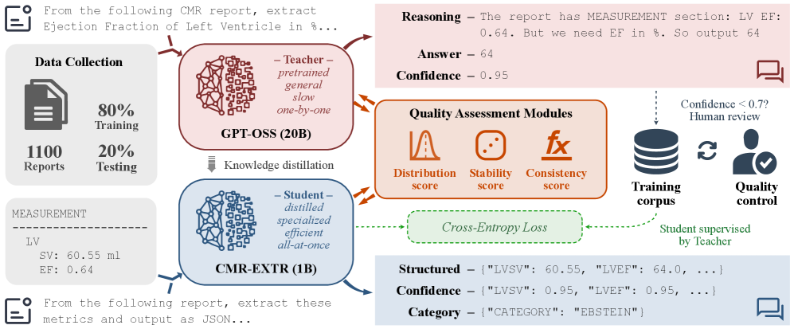
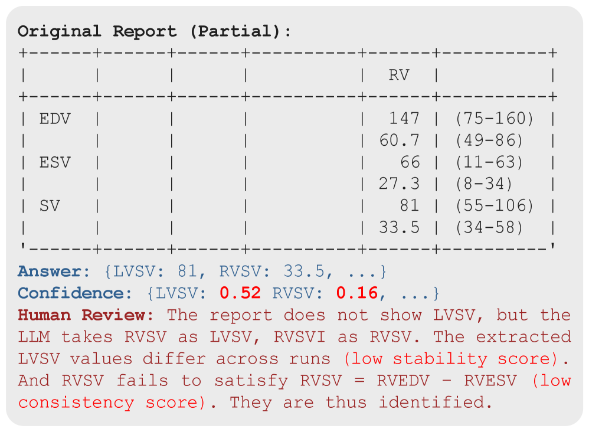

# Uncertainty-Aware Structured Data Extraction from Full CMR Reports via Distilled LLMs

## 基本信息

- **arXiv ID:** [2605.08045v1](https://arxiv.org/abs/2605.08045v1)
- **作者:** Yi Yu, Parker Martin, Zhenyu Bu et al.
- **发布日期:** 2026-05-08
- **分类:** cs.CL
- **PDF:** [arXiv PDF](https://arxiv.org/pdf/2605.08045v1)

## 关键图示

<figure><figcaption>Figure 1</figcaption></figure>
<figure><figcaption>Figure 2</figcaption></figure>
<figure><figcaption>Figure 3</figcaption></figure>

## 摘要

### English

Converting free-text cardiac magnetic resonance (CMR) reports into auditable structured data remains a bottleneck for cohort assembly, longitudinal curation, and clinical decision support. We present CMR-EXTR, a lightweight framework that converts free-text CMR reports into structured data and assigns per-field confidence for quality control. A teacher-student distillation pipeline enables fully offline inference while limiting manual annotation. Uncertainty integrates three complementary principles -- distribution plausibility, sampling stability, and cross-field consistency -- to triage human review. Experiments show that CMR-EXTR achieves 99.65% variable-level accuracy, demonstrating both reliable extraction and informative confidence scores. To our knowledge, this is the first CMR-specific extraction system with integrated confidence estimation. The code is available at https://github.com/yuyi1005/CMR-EXTR.

### 中文

将自由文本心脏磁共振 (CMR) 报告转换为可审核的结构化数据仍然是队列组装、纵向管理和临床决策支持的瓶颈。我们推出了 CMR-EXTR，这是一个轻量级框架，可将自由文本 CMR 报告转换为结构化数据，并为每个字段分配质量控制的置信度。师生蒸馏管道可以实现完全离线推理，同时限制手动注释。不确定性整合了三个互补的原则——分布合理性、抽样稳定性和跨领域一致性——来对人工审查进行分类。实验表明，CMR-EXTR 达到了 99.65% 的变量级别准确率，证明了可靠的提取和信息丰富的置信度得分。据我们所知，这是第一个具有集成置信度估计的 CMR 特定提取系统。该代码可从 https://github.com/yuyi1005/CMR-EXTR 获取。

## 核心贡献

### English
CMR-EXTR presents a lightweight, CMR-specialized LLM framework that converts free-text cardiac MRI reports into structured 52-field JSON in a single pass. Three contributions: (1) teacher-student distillation from GPT-OSS-20B to Llama-3.2-1B enabling fully offline inference; (2) a three-principle uncertainty scheme (distribution plausibility, sampling stability, cross-field consistency) for per-field confidence; (3) achieves 99.65% variable-level accuracy with strong triage capability (42% error rate when confidence < 0.7 vs. 1% when > 0.7).

### 中文
CMR-EXTR 是一个轻量级 CMR 专用 LLM 框架，将自由文本心脏 MRI 报告一次性转换为结构化 52 字段 JSON。三项贡献：(1) 从 GPT-OSS-20B 到 Llama-3.2-1B 的师生蒸馏实现完全离线推理；(2) 三项原则的不确定性方案（分布合理性、采样稳定性、跨字段一致性）用于逐字段置信度；(3) 达到 99.65% 变量级精度，具备强分流能力。

## 方法概述

### English
The pipeline: (1) Data Preparation — GPT-OSS-20B (teacher) extracts 52 variables one-by-one from 1,100 CMR reports in zero-shot mode, producing training corpus; low-confidence values (< 0.7) undergo minimal human review. (2) Quality Assessment — three scores: Distribution score (Gaussian fit to clinical reference ranges), Stability score (consistency across 3 stochastic generations at temperature 0.3), and Consistency score (22 physiological/algebraic formulas). (3) Distillation — Llama-3.2-1B (student) is trained with cross-entropy loss on the teacher-generated corpus. The student outputs both structured values and per-field confidence scores.

### 中文
流程：(1) 数据准备——GPT-OSS-20B（教师）零样本逐变量提取 52 个值，低置信度值人工审核；(2) 质量评估——三项得分：分布得分（临床参考范围高斯拟合）、稳定性得分（温度 0.3 下 3 次随机生成的一致性）、一致性得分（22 个生理/代数公式）；(3) 蒸馏——Llama-3.2-1B（学生）以交叉熵损失训练，输出结构化值和置信度。

## 实验结果

### English
On 220 held-out CMR reports: CMR-EXTR achieves 99.65% variable-level accuracy, outperforming both the undistilled 1B baseline (96.32%) and the GPT-OSS-20B zero-shot teacher (90.78%). Report-level exact-match accuracy is 71.36% (vs. 46.82% for the teacher). Error breakdown: omission errors are most common. Confidence triage is effective: values with confidence ≥ 0.7 have only 1% error; confidence < 0.7 have 42% error. Report classification accuracy reaches 86.8% across 5 disease categories.

### 中文
在 220 份保留报告上：CMR-EXTR 达到 99.65% 变量级精度，优于未蒸馏的 1B 基线（96.32%）和 GPT-OSS-20B 零样本教师（90.78%）。报告级精确匹配率 71.36%（教师 46.82%）。错误以遗漏为主。置信度分流有效：≥0.7 仅 1% 错误，<0.7 达 42% 错误。5 种疾病分类准确率 86.8%。

## 局限性与注意点

- 数据来自单一医院（OSU），报告风格和变量覆盖可能存在机构偏差。
- 需要一定量的人工审核（低置信度值审核），并非完全无人工。
- 22 个公式覆盖的生理约束有限，不反映所有临床合理性检查。
- 蒸馏训练数据由教师模型生成，教师的错误会传播给学生。
- 仅针对英文 CMR 报告，其他语言或放射学领域需重新训练。

## 相关概念

- [医学AI](../../concepts/medical-ai.html)

---
*导入时间: 2026-05-11 06:01*
*来源: arXiv Daily Wiki Update 2026-05-11*
