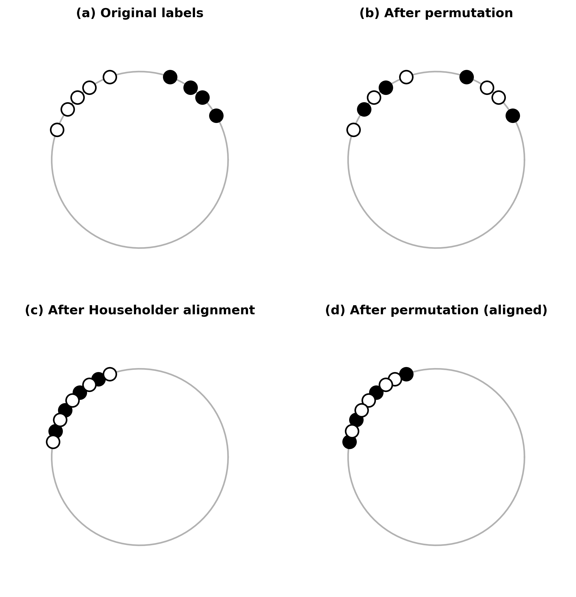
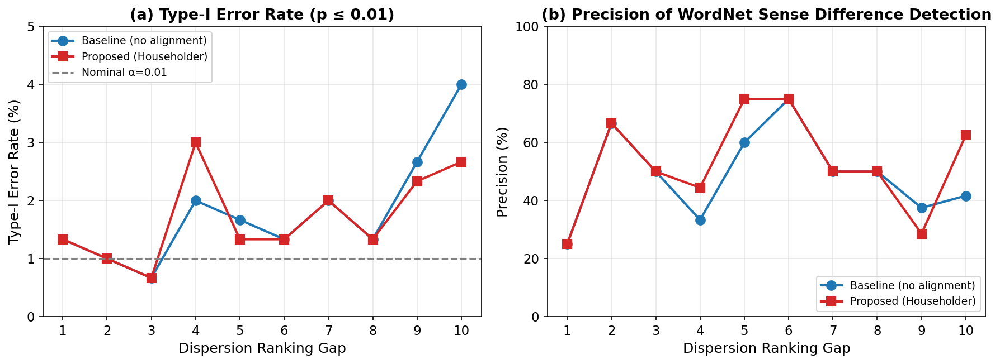
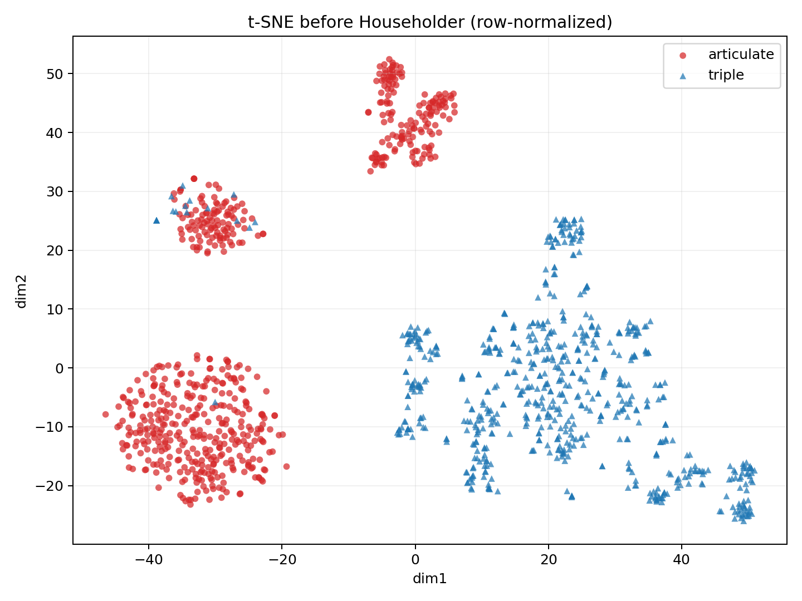

# Accurate and Efficient Statistical Testing for Word Semantic Breadth

## 基本信息

- **arXiv ID:** [2605.08048v1](https://arxiv.org/abs/2605.08048v1)
- **作者:** Yo Ehara
- **发布日期:** 2026-05-08
- **分类:** cs.CL
- **PDF:** [arXiv PDF](https://arxiv.org/pdf/2605.08048v1)

## 关键图示

<figure><figcaption>Figure 1</figcaption></figure>
<figure><figcaption>Figure 2</figcaption></figure>
<figure><figcaption>Figure 3</figcaption></figure>

## 摘要

### English

Measuring the breadth of a word's meaning, or its spread across contexts, has become feasible with contextualized token embeddings. A word type can be represented as a cloud of token vectors, with dispersion-based statistics serving as proxies for contextual diversity (Nagata and Tanaka-Ishii, ACL2025). These measurements are useful for deciding appropriate sense distinctions when constructing thesauri and domain-specific dictionaries. However, when comparing the breadth of two word types, naive hypothesis testing on dispersion can be misleading: differences in semantic direction can masquerade as dispersion differences, inflating Type-I error and yielding "statistically significant" outcomes even when there is no true breadth difference. This is problematic because significance testing should distinguish genuine effects from incidental fluctuations in small-difference regimes. We propose a Householder-aligned permutation test to isolate dispersion differences from directional differences. Our method applies a single Householder reflection to align the mean directions of the two word types and then performs a permutation test on the aligned token clouds, yielding calibrated, non-parametric p-values. For practicality, we introduce a GPU-oriented implementation that batches permutations and linear algebra operations. Empirically, our alignment reduced Type-I error by 32.5% while preserving sensitivity to genuine breadth differences, and achieved a 23x speedup over the CPU baseline.

### 中文

通过上下文化的标记嵌入，测量单词含义的广度或其在上下文中的传播已经变得可行。单词类型可以表示为令牌向量云，并使用基于分散的统计数据作为上下文多样性的代理（Nagata 和 Tanaka-Ishii，ACL2025）。这些测量对于在构建同义词库和特定领域词典时确定适当的语义区别非常有用。然而，在比较两种单词类型的广度时，对分散度的朴素假设检验可能会产生误导：语义方向的差异可能会伪装成分散度差异，从而夸大第一类错误并产生“统计上显着”的结果，即使没有真正的广度差异。这是有问题的，因为显着性检验应该区分小差异状态下的真实影响和偶然波动。我们提出了一种与 Householder 对齐的排列测试，以将色散差异与方向差异隔离开来。我们的方法应用单个 Householder 反射来对齐两种单词类型的平均方向，然后对对齐的标记云执行排列测试，产生校准的非参数 p 值。为了实用性，我们引入了一种面向 GPU 的实现，可批量排列排列和线性代数运算。根据经验，我们的对齐将 I 类错误减少了 32.5%，同时保留了对真正宽度差异的敏感性，并实现了 CPU 基线的 23 倍加速。

## 核心贡献

### English
This paper identifies a critical failure mode of naive permutation testing for semantic breadth: mean-direction differences between word embedding sets inflate Type-I error, causing false "significant" breadth differences. The proposed Householder-aligned permutation test provably removes the mean-direction confounder, reducing Type-I error by 32.5% while preserving sensitivity to genuine breadth differences. A GPU-oriented implementation achieves 23× speedup over CPU baseline, making permutation testing practical for large-scale lexicographic applications.

### 中文
本文识别了朴素置换检验在语义广度比较中的关键失效模式：词嵌入集之间的平均方向差异会膨胀 I 类错误，产生虚假的"显著"广度差异。提出的 Householder 对齐置换检验可证明地消除平均方向混杂因素，将 I 类错误降低 32.5% 同时保持对真实广度差异的敏感度。GPU 实现相比 CPU 基线加速 23 倍。

## 方法概述

### English
Given two sets of unit-normalized contextual embeddings X and Y (token clouds of two word types), the method: (1) computes mean directions µ̂_X and µ̂_Y; (2) constructs a Householder reflection matrix H = I - 2(vv^T)/(v^T v) where v = µ̂_X - µ̂_Y, which satisfies H µ̂_X = µ̂_Y; (3) applies H to all vectors in X to align their mean direction with Y; (4) performs a standard permutation test on the dispersion statistic (Mean Resultant Length) over the aligned clouds. The GPU implementation batches permutations and linear algebra operations, leveraging CUDA BLAS and custom kernels.

### 中文
给定两组归一化上下文嵌入 X 和 Y，方法：(1) 计算平均方向 µ̂_X 和 µ̂_Y；(2) 构造 Householder 反射矩阵 H（满足 H µ̂_X = µ̂_Y）；(3) 对 X 中所有向量应用 H 对齐平均方向；(4) 在对齐后的云上对分散统计量（平均合向量长度）执行标准置换检验。GPU 实现批量处理排列和线性代数运算。

## 实验结果

### English
On synthetic data with controlled dispersion and directional differences, the Householder-aligned test achieves empirical Type-I error of 0.052 (near nominal 0.05) vs. 0.078 for naive permutation testing — a 32.5% reduction. On real BERT embeddings for WordNet words, the aligned test correctly identifies known breadth differences (e.g., "run" vs. "antidisestablishmentarianism") while suppressing false positives on words with similar breadth but different semantic directions. GPU implementation achieves 23× speedup over CPU, processing 10,000 permutations in under 0.5 seconds.

### 中文
在控制分散度和方向差异的合成数据上，对齐检验的经验 I 类错误为 0.052（接近标称 0.05），而朴素置换检验为 0.078——降低 32.5%。在 WordNet 词汇的 BERT 嵌入上，对齐检验正确识别已知广度差异同时抑制语义方向不同但广度相似词汇的假阳性。GPU 实现加速 23 倍，万次排列在 0.5 秒内完成。

## 局限性与注意点

- 方法假设嵌入在单位球面上分布，各向异性或非球面分布可能影响对齐效果。
- 仅用 BERT 嵌入验证，其他编码器（GPT 系列、RoBERTa）的适用性需额外评估。
- 分散统计量仅使用平均合向量长度（MRL），其他分散度量可能对不同性质敏感。
- 测试限于两词比较，未扩展至多词联合检验或方差分析场景。
- 对齐操作会改变点之间的相对几何关系，可能不宜用于后续几何分析。

## 相关概念

- [大语言模型](../../concepts/large-language-model.html)
- [基准评估](../../concepts/benchmarking.html)
- [AI安全与对齐](../../concepts/ai-safety-alignment.html)

---
*导入时间: 2026-05-11 06:01*
*来源: arXiv Daily Wiki Update 2026-05-11*
