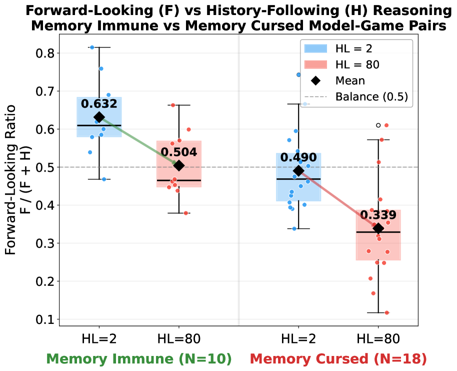
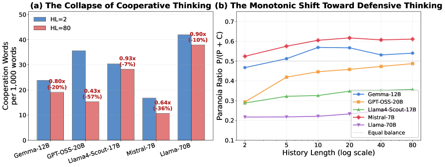

# The Memory Curse: How Expanded Recall Erodes Cooperative Intent in LLM Agents

## 基本信息

- **arXiv ID:** [2605.08060v1](https://arxiv.org/abs/2605.08060v1)
- **作者:** Jiayuan Liu, Tianqin Li, Shiyi Du et al.
- **发布日期:** 2026-05-08
- **分类:** cs.CL, cs.AI, cs.GT, cs.MA
- **PDF:** [arXiv PDF](https://arxiv.org/pdf/2605.08060v1)

## 关键图示

<figure><figcaption>Figure 1</figcaption></figure>
<figure><figcaption>Figure 2</figcaption></figure>
<figure><figcaption>Figure 3</figcaption></figure>

## 摘要

### English

Context window expansion is often treated as a straightforward capability upgrade for LLMs, but we find it systematically fails in multi-agent social dilemmas. Across 7 LLMs and 4 games over 500 rounds, expanding accessible history degrades cooperation in 18 of 28 model--game settings, a pattern we term the memory curse. We isolate the underlying mechanism through three analyses. First, lexical analysis of 378,000 reasoning traces associates this breakdown with eroding forward-looking intent rather than rising paranoia. We validate this using targeted fine-tuning as a cognitive probe: a LoRA adapter trained exclusively on forward-looking traces mitigates the decay and transfers zero-shot to distinct games. Second, memory sanitization holds prompt length fixed while replacing visible history with synthetic cooperative records, which restores cooperation substantially, proving the trigger is memory content, not length alone. Finally, ablating explicit Chain-of-Thought reasoning often reduces the collapse, showing that deliberation paradoxically amplifies the memory curse. Together, these results recast memory as an active determinant of multi-agent behavior: longer recall can either destabilize or support cooperation depending on the reasoning patterns it elicits.

### 中文

上下文窗口扩展通常被视为法学硕士的直接能力升级，但我们发现它在多智能体社会困境中系统性地失败。在 7 个法学硕士和 4 个超过 500 轮的游戏中，扩展可访问的历史会降低 28 个模型中的 18 个模型的合作——游戏设置，我们将这种模式称为“记忆诅咒”。我们通过三个分析来分离出潜在的机制。首先，对 378,000 条推理痕迹的词汇分析将这种故障与前瞻性意图的削弱而不是偏执的增加联系起来。我们使用有针对性的微调作为认知探针来验证这一点：专门针对前瞻性轨迹进行训练的 LoRA 适配器可以减轻衰减并将零样本转移到不同的游戏。其次，内存清理保持提示长度固定，同时用合成合作记录替换可见历史，这基本上恢复了合作，证明触发因素是内存内容，而不仅仅是长度。最后，消除明确的思想链推理通常会减少崩溃，这表明深思熟虑反而会放大记忆诅咒。总之，这些结果将记忆重塑为多智能体行为的主动决定因素：较长的回忆可能会破坏稳定或支持合作，具体取决于它引发的推理模式。

## 核心贡献

### English
This paper discovers and systematically characterizes the "memory curse" — expanding LLMs' accessible interaction history degrades cooperation in 18 of 28 model-game settings across 7 LLMs and 4 social dilemma games over 500 rounds. Three mechanistic analyses reveal: (1) the breakdown stems from eroding forward-looking intent, not paranoia; (2) memory sanitization with synthetic cooperative records restores cooperation; (3) Chain-of-Thought reasoning paradoxically amplifies the curse. A LoRA adapter trained on forward-looking traces mitigates the decay and transfers zero-shot to distinct games.

### 中文
本文发现并系统性刻画了"记忆诅咒"——在 7 个 LLM 和 4 个博弈共 500 轮的场景中，扩展可访问历史长度导致 28 个模型-博弈组合中 18 个的合作恶化。三项机制分析揭示：(1) 崩溃源于前瞻性意图的削弱而非偏执增加；(2) 用合成合作记录替换历史（记忆消毒）显著恢复合作；(3) 思维链推理反而放大诅咒。在前瞻性轨迹上训练的 LoRA 适配器减轻衰减并零样本迁移。

## 方法概述

### English
The experimental design spans 7 LLMs (GPT-4o, Claude 3.5 Sonnet, Gemini 1.5 Pro, Llama-3.1-8B/70B, Mistral-7B, Qwen-2.5-7B), 4 repeated games (Prisoner's Dilemma, Traveler's Dilemma, Public Goods, Trust Game), and 9 history-length settings from 2 to 80 rounds over 500-round interactions. Three interventional analyses isolate the mechanism: (1) lexical analysis of 378,000 CoT reasoning traces using LIWC and custom dictionaries to measure forward-looking vs. paranoid reasoning; (2) memory sanitization replacing visible history with synthetic always-cooperate records; (3) CoT ablation removing explicit reasoning prompts.

### 中文
实验设计涵盖 7 个 LLM（GPT-4o、Claude 3.5 Sonnet、Gemini 1.5 Pro、Llama-3.1-8B/70B、Mistral-7B、Qwen-2.5-7B）、4 种重复博弈和 9 种历史长度设置。三种干预分析：(1) 对 378,000 条 CoT 推理轨迹进行 LIWC 词汇分析，衡量前瞻性推理与偏执推理；(2) 记忆消毒——用始终合作的合成记录替换可见历史；(3) 移除 CoT 提示的消融。

## 实验结果

### English
Cooperation rates decline as history length increases in 18/28 model-game settings. Lexical analysis shows forward-looking intent words decrease significantly (p < 0.01) while paranoid/defensive language does not increase proportionally. LoRA fine-tuning on forward-looking traces boosts cooperation by 15-25% at HL=80 while preserving performance on GSM8K, TriviaQA, HumanEval, MBPP. Memory sanitization restores cooperation to near-HL=2 levels. CoT ablation reduces cooperation collapse in memory-cursed models, confirming deliberation amplifies the effect.

### 中文
在 18/28 个模型-博弈设置中合作率随历史长度增加而下降。词汇分析显示前瞻性词汇显著减少（p < 0.01）而偏执语言未成比例增加。LoRA 微调在 HL=80 时将合作提升 15-25%，同时保持 GSM8K、TriviaQA 等基准性能。记忆消毒将合作恢复至接近 HL=2 水平。CoT 消融减少合作崩溃，证实深思熟虑放大记忆诅咒。

## 局限性与注意点

- 实验使用特定系统提示和行动空间设计，不同提示工程可能改变结果。
- 仅在 4 种对称博弈中测试，博弈结构不对称时结论可能不同。
- LoRA 微调使用了合成的前瞻性轨迹，其质量限制干预效果。
- 未探索动态记忆压缩或选择性遗忘机制作为解决方案。
- 大模型 API 版本更新可能导致合作行为漂移。

## 相关概念

- [大语言模型](../../concepts/large-language-model.html)
- [智能体](../../concepts/ai-agents.html)

---
*导入时间: 2026-05-11 06:01*
*来源: arXiv Daily Wiki Update 2026-05-11*
