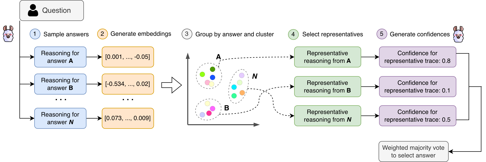
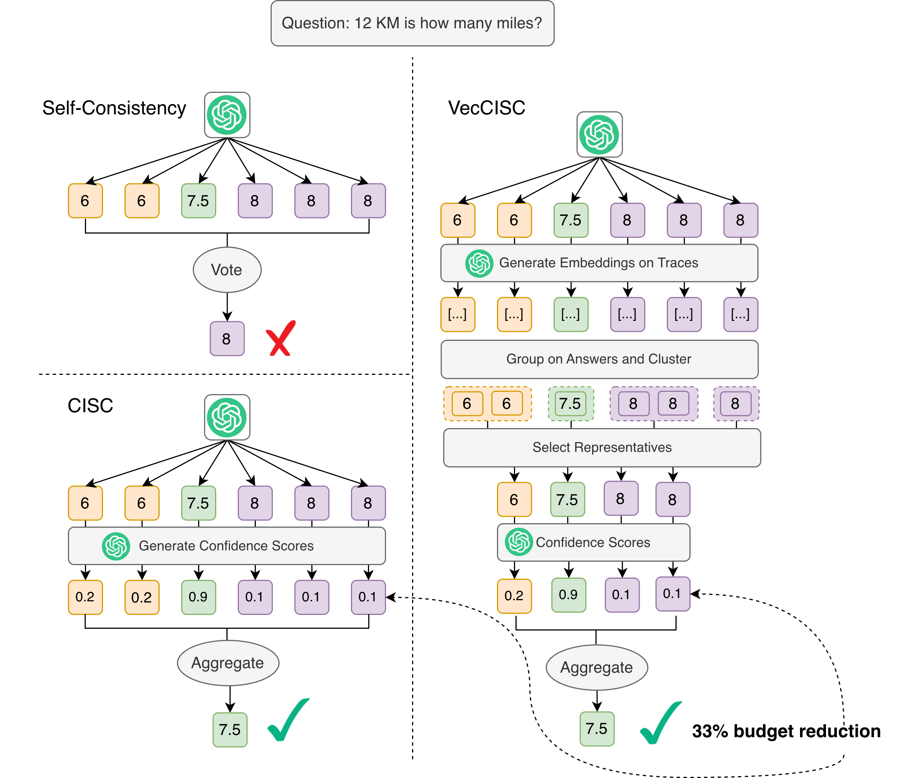
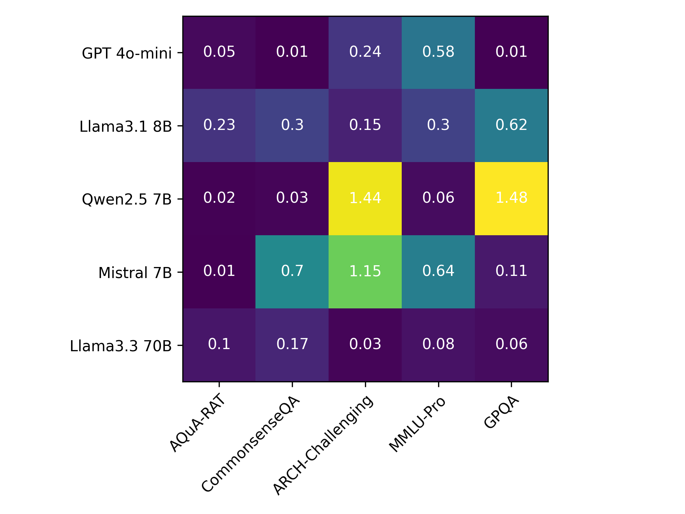

# VecCISC: Improving Confidence-Informed Self-Consistency with Reasoning Trace Clustering and Candidate Answer Selection

## 基本信息

- **arXiv ID:** [2605.08070v1](https://arxiv.org/abs/2605.08070v1)
- **作者:** James Petullo, Sonny George, Dylan Cashman et al.
- **发布日期:** 2026-05-08
- **分类:** cs.AI
- **PDF:** [arXiv PDF](https://arxiv.org/pdf/2605.08070v1)

## 关键图示

<figure><figcaption>Figure 1</figcaption></figure>
<figure><figcaption>Figure 2</figcaption></figure>
<figure><figcaption>Figure 3</figcaption></figure>

## 摘要

### English

A standard technique for scaling inference-time reasoning is Self-Consistency, whereby multiple candidate answers are sampled from an LLM and the most common answer is selected. More recently, it has been shown that weighted majority voting (e.g. Confidence-Informed Self Consistency (CISC)), which assigns a confidence value to each candidate answer and chooses the answer with the largest accumulated score, tends to be more accurate on a wide range of popular benchmarks. In practice, weighted majority voting necessitates calling a critic LLM on each candidate's reasoning trace to produce the answer's confidence score. This secondary series of LLM calls greatly increases the overhead and cost of weighted majority voting, despite its potential performance benefits. To reduce this expense, we propose VecCISC, a lightweight, adaptive framework that uses a measure of semantic similarity to filter reasoning traces that are semantically equivalent to others, degenerate, or hallucinated, thus decreasing the number of candidate answers that must be evaluated by the critic. To ensure adequate experimental thoroughness, we evaluate VecCISC on five challenging, widely-adopted datasets spanning the domains of mathematics, chemistry, biology, commonsense reasoning, and the humanities. Our results demonstrate that VecCISC reduces the total token usage by 47%, while maintaining or exceeding the accuracy of CISC.

### 中文

扩展推理时间推理的标准技术是自我一致性，即从法学硕士中抽取多个候选答案，并选择最常见的答案。最近，事实证明，加权多数投票（例如信心知情的自我一致性（CISC））为每个候选答案分配一个置信值并选择累积分数最大的答案，在各种流行的基准上往往更准确。在实践中，加权多数投票需要对每个候选人的推理轨迹调用批评者法学硕士，以产生答案的置信度分数。尽管具有潜在的性能优势，但第二系列的 LLM 调用极大地增加了加权多数投票的开销和成本。为了减少这种费用，我们提出了 VecCISC，这是一个轻量级的自适应框架，它使用语义相似性度量来过滤语义上与其他推理等同、退化或幻觉的推理痕迹，从而减少评论家必须评估的候选答案的数量。为了确保足够的实验彻底性，我们在五个具有挑战性的、广泛采用的数据集上评估 VecCISC，这些数据集涵盖数学、化学、生物学、常识推理和人文学科。我们的结果表明，VecCISC 将总代币使用量减少了 47%，同时保持或超过 CISC 的准确性。

## 核心贡献

### English
VecCISC reduces the cost of the "think twice" paradigm (CISC) by clustering reasoning trace embeddings (via KMeans or HAC) within each unique answer group, selecting a representative trace per cluster, and only passing those representatives to the critic LLM. This eliminates redundant, degenerate, and hallucinated traces before the expensive critic evaluation step. Across 5 datasets spanning mathematics, chemistry, biology, commonsense, and humanities, VecCISC reduces total token usage by 47% while maintaining or exceeding CISC accuracy.

### 中文
VecCISC 通过对每个唯一答案组内的推理轨迹嵌入进行聚类（KMeans 或 HAC），从每个聚类中选择代表性轨迹，仅将代表传给批评 LLM，从而降低"think twice"范式 (CISC) 的成本。在昂贵的批评评估前过滤掉冗余、退化和幻觉轨迹。在跨数学、化学、生物、常识和人文学科的 5 个数据集上，VecCISC 将总 token 用量降低 47%，同时维持或超过 CISC 精度。

## 方法概述

### English
VecCISC pipeline: (1) Sample n reasoning trace-answer pairs from LLM_gen; (2) Generate embeddings via text-embedding-3-small for each trace; (3) Group embeddings by unique answer; (4) Within each answer group, apply KMeans or HAC clustering with K clusters; (5) Select the trace closest to each cluster centroid (cosine similarity); (6) Pass only representative traces to the critic LLM for confidence scoring; (7) Weighted majority vote with softmax-normalized scores selects the final answer. Grid search determines K and softmax temperature T per (dataset, model) combination.

### 中文
VecCISC 流程：(1) 从 LLM_gen 采样 n 个推理-答案对；(2) 用 text-embedding-3-small 生成嵌入；(3) 按唯一答案分组；(4) 在每组内应用 KMeans 或 HAC 聚类；(5) 选择距聚类质心余弦相似度最近的轨迹；(6) 仅将代表轨迹传给批评 LLM 评分；(7) softmax 归一化加权多数投票选择最终答案。网格搜索确定每组 (数据集, 模型) 的 K 和温度 T。

## 实验结果

### English
On AQuA_RAT (math), CommonsenseQA, MedMCQA (biology), MMLU-Chemistry, and MMLU-Philosophy with Llama-3.1-8B and Mistral-7B: VecCISC+KMeans achieves average 47% token reduction vs. CISC while maintaining or exceeding accuracy. KMeans and HAC perform similarly; both outperform random K-sample selection (VecCISC random). At K=2-3 clusters, VecCISC often matches full CISC accuracy at ~50% cost. Largest gains are on datasets with high answer redundancy (e.g., CommonsenseQA). Smaller models (Mistral-7B) benefit more from clustering than larger models.

### 中文
在 AQuA_RAT、CommonsenseQA、MedMCQA、MMLU-Chemistry、MMLU-Philosophy 上用 Llama-3.1-8B 和 Mistral-7B：VecCISC+KMeans 相比 CISC 平均减少 47% token 用量同时保持或超过精度。KMeans 和 HAC 表现相似，均优于随机 K 样本选择。K=2-3 聚类时 VecCISC 常以约 50% 成本匹配全量 CISC 精度。在答案冗余度高的数据集上收益最大。小模型 (Mistral-7B) 比大模型受益更多。

## 局限性与注意点

- 嵌入模型的固定费用（text-embedding-3-small）对小批量可能不划算。
- K（聚类数）和 T（softmax 温度）需按数据集-模型组合网格搜索，增加前期成本。
- 聚类方法假设语义相似的推理轨迹等价，对需要微小差异来区分正确性的场景可能有害。
- 仅在 QA 格式任务上验证，对开放式生成或长文本任务未测试。
- LLM 批评者本身可能被某些推理模式系统性误导，过滤不代表消除偏差。

## 相关概念

- [大语言模型](../../concepts/large-language-model.html)
- [基准评估](../../concepts/benchmarking.html)

---
*导入时间: 2026-05-11 06:02*
*来源: arXiv Daily Wiki Update 2026-05-11*
