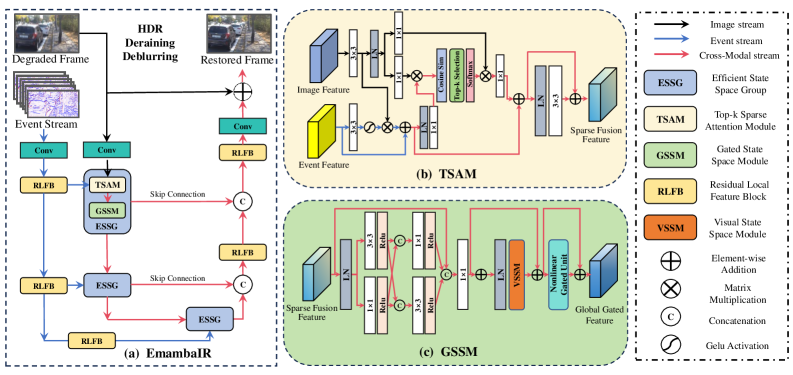
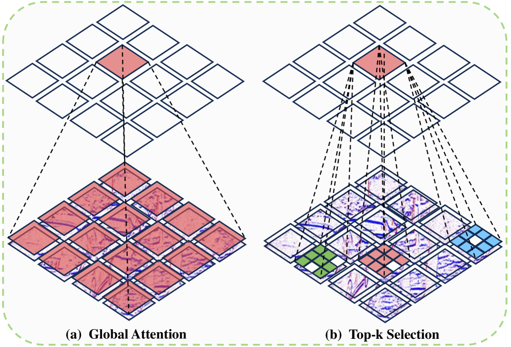

# EmambaIR: Efficient Visual State Space Model for Event-guided Image Reconstruction

## 基本信息

- **arXiv ID:** [2605.08073v1](https://arxiv.org/abs/2605.08073v1)
- **作者:** Wei Yu, Yunhang Qian
- **发布日期:** 2026-05-08
- **分类:** cs.CV, cs.AI
- **PDF:** [arXiv PDF](https://arxiv.org/pdf/2605.08073v1)

## 关键图示

<figure><figcaption>Figure 1</figcaption></figure>
<figure><figcaption>Figure 2</figcaption></figure>
<figure><figcaption>Figure 3</figcaption></figure>

## 摘要

### English

Recent event-based image reconstruction methods predominantly rely on Convolutional Neural Networks (CNNs) and Vision Transformers (ViTs) to process complementary event information. However, these architectures face fundamental limitations: CNNs often fail to capture global feature correlations, whereas ViTs incur quadratic computational complexity (e.g., $O(n^2)$), hindering their application in high-resolution scenarios. To address these bottlenecks, we introduce EmambaIR, an Efficient visual State Space Model designed for image reconstruction using spatially sparse and temporally continuous event streams. Our framework introduces two key components: the cross-modal Top-k Sparse Attention Module (TSAM) and the Gated State-Space Module (GSSM). TSAM efficiently performs pixel-level top-k sparse attention to guide cross-modal interactions, yielding rich yet sparse fusion features. Subsequently, GSSM utilizes a nonlinear gated unit to enhance the temporal representation of vanilla linear-complexity ($O(n)$) SSMs, effectively capturing global contextual dependencies without the typical computational overhead. Extensive experiments on six datasets across three diverse image reconstruction tasks - motion deblurring, deraining, and High Dynamic Range (HDR) enhancement - demonstrate that EmambaIR significantly outperforms state-of-the-art methods while offering substantial reductions in memory consumption and computational cost. The source code and data are publicly available at: https://github.com/YunhangWickert/EmambaIR

### 中文

最近基于事件的图像重建方法主要依靠卷积神经网络（CNN）和视觉变换器（ViT）来处理补充事件信息。然而，这些架构面临着根本的限制：CNN 通常无法捕获全局特征相关性，而 ViT 会产生二次计算复杂度（例如 $O(n^2)$），阻碍了它们在高分辨率场景中的应用。为了解决这些瓶颈，我们引入了 EmambaIR，这是一种高效的视觉状态空间模型，设计用于使用空间稀疏和时间连续的事件流进行图像重建。我们的框架引入了两个关键组件：跨模态 Top-k 稀疏注意力模块（TSAM）和门控状态空间模块（GSSM）。 TSAM 有效地执行像素级 top-k 稀疏注意力来指导跨模态交互，产生丰富而稀疏的融合特征。随后，GSSM 利用非线性门控单元来增强普通线性复杂度 ($O(n)$) SSM 的时间表示，从而有效捕获全局上下文依赖性，而无需典型的计算开销。对三个不同图像重建任务（运动去模糊、去雨和高动态范围 (HDR) 增强）的六个数据集进行的广泛实验表明，EmambaIR 的性能显着优于最先进的方法，同时大幅降低了内存消耗和计算成本。源代码和数据可公开获取：https://github.com/YunhangWickert/EmambaIR

## 核心贡献

### English
EmambaIR introduces an efficient visual State Space Model for event-guided image reconstruction with two key modules: (1) Top-k Sparse Attention Module (TSAM) — exploits event spatial sparsity via pixel-level top-k selection for cross-modal fusion with linear complexity; (2) Gated State-Space Module (GSSM) — enhances vanilla SSM long-range temporal modeling with nonlinear gating. On 6 datasets across deblurring, deraining, and HDR tasks, EmambaIR outperforms CNN and ViT SOTA methods while using fewer parameters and lower memory.

### 中文
EmambaIR 为事件引导图像重建提出高效的视觉状态空间模型，包含两个关键模块：(1) Top-k 稀疏注意力模块 (TSAM) ——利用事件空间稀疏性通过像素级 top-k 选择实现线性复杂度的跨模态融合；(2) 门控状态空间模块 (GSSM) ——用非线性门控增强普通 SSM 的长程时间建模能力。在 6 个数据集的去模糊、去雨和 HDR 任务上，EmambaIR 以更少参数和更低内存超越 CNN 和 ViT SOTA 方法。

## 方法概述

### English
The EmambaIR architecture: (1) Input — degraded image frame and corresponding event stream (represented as voxel grid); (2) TSAM — computes cosine similarity between image and event features at each pixel, selects top-k most relevant event features per pixel, applies sparse attention for cross-modal fusion; (3) GSSM — applies 2D selective scan (inspired by Mamba) with nonlinear gated unit along channel dimension to capture global dependencies; (4) Efficient State Space Group (ESSG) blocks stack TSAM and GSSM in multiple stages with skip connections. The architecture maintains O(n) complexity via SSM backbone and sparse attention.

### 中文
EmambaIR 架构：(1) 输入——退化图像帧和对应事件流（表示为体素网格）；(2) TSAM——计算每个像素图像与事件特征的余弦相似度，选择 top-k 最相关事件特征，应用稀疏注意力进行跨模态融合；(3) GSSM——沿通道维度应用带非线性门控单元的 2D 选择性扫描捕获全局依赖；(4) 高效状态空间组 (ESSG) 多阶段堆叠 TSAM 和 GSSM。架构通过 SSM 主干和稀疏注意力维持 O(n) 复杂度。

## 实验结果

### English
Deblurring (GoPro, DVD, REBlur datasets): EmambaIR achieves PSNR 35.76 dB on GoPro with 12.5M parameters vs. 36.0 dB for REFID (45M). Deraining: significant PSNR gains over MPRNet, Restormer. HDR enhancement: consistent improvements. Memory: EmambaIR uses 40-60% less GPU memory during inference than ViT-based methods. Ablation: both TSAM and GSSM independently contribute; top-k sparsity with k=5 provides optimal accuracy-efficiency tradeoff.

### 中文
去模糊（GoPro、DVD、REBlur）：EmambaIR 在 GoPro 上以 12.5M 参数达到 PSNR 35.76 dB（REFID 45M 参数 36.0 dB）。去雨：显著优于 MPRNet、Restormer。HDR 增强：持续提升。内存：推理时 GPU 内存比 ViT 方法少 40-60%。消融：TSAM 和 GSSM 各自独立贡献；top-k 稀疏度 k=5 提供最佳精度-效率权衡。

## 局限性与注意点

- 仅在事件引导的图像重建任务上验证，对纯图像任务或视频任务的泛化性未知。
- 依赖事件相机数据，事件传感器尚未在消费设备中普及，实际部署受限。
- top-k 选择中的 k 值为固定超参数，可能需要根据输入稀疏度动态调整。
- 与最新的 diffusion-based 或 Mamba-2 架构未进行对比。
- 实验集中在合成和受控数据集，真实世界极端光照/运动场景需额外验证。

## 相关概念

- [大语言模型](../../concepts/large-language-model.html)
- [多模态学习](../../concepts/multimodal-learning.html)
- [基准评估](../../concepts/benchmarking.html)

---
*导入时间: 2026-05-11 06:02*
*来源: arXiv Daily Wiki Update 2026-05-11*
