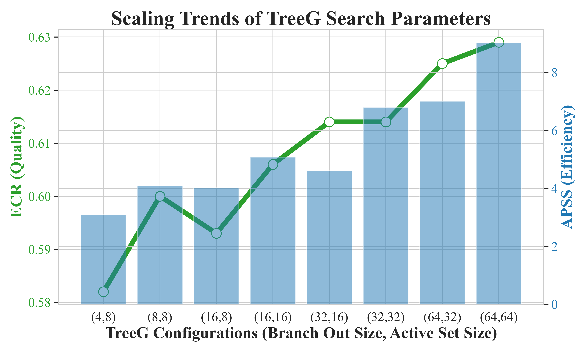
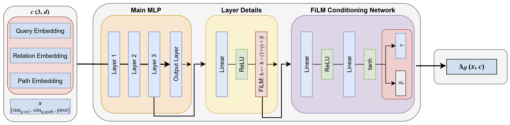

# Conformal Path Reasoning: Trustworthy Knowledge Graph Question Answering via Path-Level Calibration

## 基本信息

- **arXiv ID:** [2605.08077v1](https://arxiv.org/abs/2605.08077v1)
- **作者:** Shuhang Lin, Chuhao Zhou, Xiao Lin et al.
- **发布日期:** 2026-05-08
- **分类:** cs.CL
- **PDF:** [arXiv PDF](https://arxiv.org/pdf/2605.08077v1)

## 关键图示

<figure><figcaption>Figure 1</figcaption></figure>
<figure><figcaption>Figure 2</figcaption></figure>
<figure><figcaption>Figure 3</figcaption></figure>

## 摘要

### English

Knowledge Graph Question Answering (KGQA) has shown promise for grounded and interpretable reasoning, yet existing approaches often fail to provide reliable coverage guarantees over retrieved answers. While Conformal Prediction (CP) offers a principled framework for producing prediction sets with statistical guarantees, prior methods suffer from critical limitations in both calibration validity and score discriminability, resulting in violated coverage guarantees and excessively large prediction sets. To address these pitfalls, we propose Conformal Path Reasoning (CPR), a trustworthy KGQA framework with two key innovations. First, we perform query-level conformal calibration over path-level scores, preserving the exchangeability while generating path prediction sets. Second, we introduce the Residual Conformal Value Network (RCVNet), a lightweight module trained via PUCT-guided exploration to learn discriminative path-level nonconformity scores. Experiments on benchmarks show that CPR significantly improves the Empirical Coverage Rate by 34% while reducing average prediction set size by 40% compared to conformal baselines. These results validate the efficacy of CPR in satisfying coverage guarantees with substantially more compact answer sets.

### 中文

知识图问答（KGQA）已显示出有基础且可解释的推理的前景，但现有方法往往无法对检索到的答案提供可靠的覆盖保证。虽然保形预测（CP）提供了一个用于生成具有统计保证的预测集的原则框架，但先前的方法在校准有效性和分数可辨别性方面都受到严重限制，导致违反覆盖率保证和过大的预测集。为了解决这些陷阱，我们提出了保形路径推理 (CPR)，这是一个值得信赖的 KGQA 框架，具有两项关键创新。首先，我们对路径级分数执行查询级保形校准，在生成路径预测集的同时保留可交换性。其次，我们介绍了残余共形价值网络（RCVNet），这是一个通过 PUCT 引导探索训练的轻量级模块，用于学习有区别的路径级不合格分数。基准实验表明，与保形基线相比，CPR 将经验覆盖率显着提高了 34%，同时将平均预测集大小减少了 40%。这些结果验证了 CPR 在通过更加紧凑的答案集满足覆盖保证方面的功效。

## 核心贡献

### English
CPR introduces two key innovations for trustworthy KGQA: (1) query-level conformal calibration over path-level scores, preserving exchangeability and enabling valid coverage guarantees; (2) RCVNet, a lightweight module trained via PUCT-guided exploration to learn discriminative path-level nonconformity scores. CPR improves Empirical Coverage Rate by 34% while reducing average prediction set size by 40% compared to conformal baselines.

### 中文
CPR 为可信 KGQA 提出两项关键创新：(1) 在路径级分数上进行查询级保形校准，保留可交换性以获得有效覆盖保证；(2) RCVNet，通过 PUCT 引导探索训练的轻量级残差网络，学习有区分力的路径级不合格分数。相比保形基线，CPR 将经验覆盖率提升 34%，同时将平均预测集大小缩减 40%。

## 方法概述

### English
CPR operates in two phases. Training phase: PUCT-guided search collects reasoning trajectories over the knowledge graph, labeling paths as positive or negative; RCVNet then learns path-level nonconformity scores via contrastive loss, using a residual architecture over relation-level features. Inference phase: for each query, TreeG retrieves candidate paths, RCVNet scores them, and query-exchangeable conformal calibration constructs a prediction set with formal coverage guarantees. Unlike hop-level CP approaches, path-level calibration avoids sequential dependencies across hops, maintaining the exchangeability assumption.

### 中文
CPR 分两阶段运作。训练阶段：PUCT 搜索收集知识图谱上的推理轨迹，标记正负路径；RCVNet 通过对比损失学习路径级不合格分数，采用关系级特征的残差架构。推理阶段：TreeG 检索候选路径，RCVNet 评分，查询可交换保形校准构建具有形式化覆盖保证的预测集。与逐跳保形方法不同，路径级校准避免了跳跃间的序列依赖性，保持了可交换性假设。

## 实验结果

### English
Experiments on WebQSP and CWQ benchmarks show CPR achieves 34% higher Empirical Coverage Rate and 40% smaller prediction set size compared to hop-level conformal baselines (UaG, APS). CPR's coverage is within the target rate while hop-level methods systematically violate coverage guarantees. Ablation shows RCVNet significantly outperforms heuristic path scores (e.g., average embedding similarity) in discriminability, measured by AUROC for distinguishing correct from incorrect paths.

### 中文
在 WebQSP 和 CWQ 上的实验表明，与逐跳保形基线（UaG、APS）相比，CPR 的经验覆盖率高 34%，预测集缩小 40%。CPR 的覆盖率符合目标率，而逐跳方法系统性违反覆盖保证。消融实验证实 RCVNet 在区分正确与错误路径的 AUROC 上显著优于基于平均嵌入相似度等启发式评分。

## 局限性与注意点

- 路径级校准假设查询间独立同分布，不适用于查询间存在依赖的动态 KG 场景。
- PUCT 轨迹收集的计算开销随 KG 规模增长。
- 未与基于 LLM 的 KGQA 方法（如 RoG、PoG）进行严格对比。
- RCVNet 的训练依赖 PUCT 收集的正负路径对质量，可能受探索不充分影响。
- 仅在两个英文 KGQA 基准上验证，多语言/跨领域泛化性未知。

## 相关概念

- [基准评估](../../concepts/benchmarking.html)
- [图神经网络](../../concepts/graph-neural-networks.html)

---
*导入时间: 2026-05-11 06:01*
*来源: arXiv Daily Wiki Update 2026-05-11*
