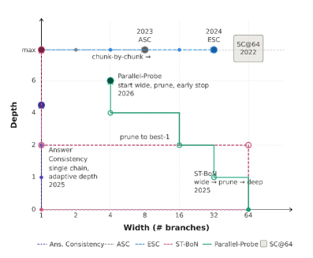

# LLMs Improving LLMs: Agentic Discovery for Test-Time Scaling

## 基本信息

- **arXiv ID:** [2605.08083v1](https://arxiv.org/abs/2605.08083v1)
- **作者:** Tong Zheng, Haolin Liu, Chengsong Huang et al.
- **发布日期:** 2026-05-08
- **分类:** cs.CL
- **PDF:** [arXiv PDF](https://arxiv.org/pdf/2605.08083v1)

## 关键图示

<figure><figcaption>Figure 1</figcaption></figure>
<figure><figcaption>Figure 2</figcaption></figure>

## 摘要

### English

Test-time scaling (TTS) has become an effective approach for improving large language model performance by allocating additional computation during inference. However, existing TTS strategies are largely hand-crafted: researchers manually design reasoning patterns and tune heuristics by intuition, leaving much of the computation-allocation space unexplored. We propose an environment-driven framework, AutoTTS, that changes what researchers design: from individual TTS heuristics to environments where TTS strategies can be discovered automatically. The key to AutoTTS lies in environment construction: the discovery environment must make the control space tractable and provide cheap, frequent feedback for TTS search. As a concrete instantiation, we formulate width--depth TTS as controller synthesis over pre-collected reasoning trajectories and probe signals, where controllers decide when to branch, continue, probe, prune, or stop and can be evaluated cheaply without repeated LLM calls. We further introduce beta parameterization to make the search tractable and fine-grained execution trace feedback to improve discovery efficiency by helping the agent diagnose why a TTS program fails. Experiments on mathematical reasoning benchmarks show that the discovered strategies improve the overall accuracy--cost tradeoff over strong manually designed baselines. The discovered strategies generalize to held-out benchmarks and model scales, while the entire discovery costs only $39.9 and 160 minutes. Our data, and code will be open-source at https://github.com/zhengkid/AutoTTS.

### 中文

测试时间缩放（TTS）已成为通过在推理过程中分配额外计算来提高大型语言模型性能的有效方法。然而，现有的 TTS 策略很大程度上是手工设计的：研究人员手动设计推理模式并凭直觉调整启发式方法，从而留下了许多计算分配空间未被探索。我们提出了一个环境驱动的框架 AutoTTS，它改变了研究人员的设计：从单独的 TTS 启发法到可以自动发现 TTS 策略的环境。 AutoTTS的关键在于环境构建：发现环境必须使控制空间易于处理，并为TTS搜索提供廉价、频繁的反馈。作为一个具体的实例，我们将宽度-深度 TTS 制定为预先收集的推理轨迹和探测信号的控制器综合，其中控制器决定何时分支、继续、探测、修剪或停止，并且可以廉价地进行评估，而无需重复的 LLM 调用。我们进一步引入 beta 参数化，使搜索易于处理，并提供细粒度的执行跟踪反馈，通过帮助代理诊断 TTS 程序失败的原因来提高发现效率。数学推理基准的实验表明，所发现的策略提高了整体准确性——相对于强大的手动设计基准的成本权衡。发现的策略可推广到现有的基准和模型规模，而整个发现的成本仅为 39.9 美元和 160 分钟。我们的数据和代码将在 https://github.com/zhengkid/AutoTTS 开源。

## 核心贡献

### English
AutoTTS introduces an environment-driven paradigm that shifts human effort from designing individual TTS heuristics to constructing discovery environments. A proof-of-concept formulates width-depth TTS as controller synthesis in an offline replay environment, with beta parameterization reducing the search space to a single trade-off scalar and execution-trace feedback diagnosing failure modes. Discovered controllers improve the accuracy-cost Pareto frontier over hand-crafted baselines while generalizing to held-out benchmarks and model scales, at a total discovery cost of $39.90 and 160 minutes.

### 中文
AutoTTS 将人类的设计重心从手动设计 TTS 启发式策略转移到构建发现环境。在离线重放环境中将宽度-深度 TTS 形式化为控制器合成问题，通过 beta 参数化将搜索空间压缩为单一权衡标量，并通过执行轨迹反馈帮助诊断失败模式。发现的控制器在精度-成本帕累托前沿上优于手工基线，且能泛化到保留基准和不同模型规模，总发现成本仅 $39.90 和 160 分钟。

## 方法概述

### English
AutoTTS consists of (1) an environment construction phase where humans define states, actions, feedback, and objectives; and (2) an agent-driven discovery loop where an explorer LLM iteratively proposes code-defined controllers, evaluates them via offline replay of pre-collected reasoning trajectories, and receives feedback from scaling curves and execution traces. Controller actions include BRANCH, CONTINUE, PROBE, PRUNE, and ANSWER. The key technical innovations are beta parameterization — mapping all internal hyperparameters deterministically from a single β — and fine-grained execution-trace feedback that reveals budget allocation patterns per question. The offline replay environment reuses pre-collected trajectories and probe signals, enabling deterministic evaluation without repeated LLM calls.

### 中文
AutoTTS 由两部分组成：(1) 人类定义状态、动作、反馈和目标的构建阶段；(2) 探索 LLM 迭代提出代码定义的控制器，在预收集推理轨迹的离线重放环境中评估，并通过缩放曲线和执行轨迹接收反馈。动作为分支、继续、探测、修剪和回答。关键创新是 beta 参数化（从单个 β 值确定性地推导所有内部超参数）和执行轨迹反馈（逐问题揭示预算分配模式）。离线重放复用预收集轨迹，无需反复调用 LLM。

## 实验结果

### English
Experiments on MATH, AMC, AIME, and OlympiadBench benchmarks using Qwen-2.5 (1.5B/7B) and Llama-3.1 (8B) show that discovered controllers consistently improve the accuracy-cost Pareto frontier over strong baselines including Self-Consistency@64, Adaptive Self-Consistency, and Parallel Probe. AutoTTS-discovered controllers achieve higher accuracy at equal budget or lower cost at equal accuracy. Generalization tests confirm transfer to unseen benchmarks (GPQA, MMLU-Pro Math) and model scales. Ablations show both beta parameterization and execution-trace feedback independently improve discovery.

### 中文
在 MATH、AMC、AIME 和 OlympiadBench 上使用 Qwen-2.5 (1.5B/7B) 和 Llama-3.1 (8B) 的实验表明，发现的控制器在精度-成本帕累托前沿上持续优于 Self-Consistency@64、自适应自一致性等基线。发现的控制器泛化到 GPQA、MMLU-Pro Math 等保留基准。消融实验证实 beta 参数化和执行轨迹反馈独立提升发现效率。

## 局限性与注意点

- 宽度-深度空间只是 TTS 的一个子集，无法涵盖树搜索等多结构方法。
- 预收集推理轨迹的质量和覆盖度直接影响可发现策略的上限。
- 当前仅验证数学推理领域，在代码生成等更结构化任务上的表现未知。
- 离线重放假设探针信号可直接从预收集轨迹中获取；实时场景下需额外设计。
- 发现成本虽低，但仍是一次性固定投入。

## 相关概念

- [大语言模型](../../concepts/large-language-model.html)
- [基准评估](../../concepts/benchmarking.html)
- [智能体](../../concepts/ai-agents.html)

---
*导入时间: 2026-05-11 06:01*
*来源: arXiv Daily Wiki Update 2026-05-11*
