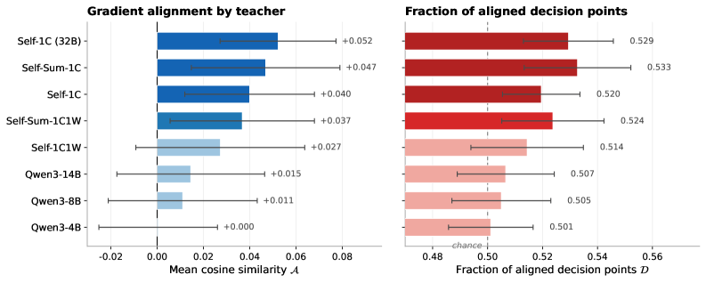
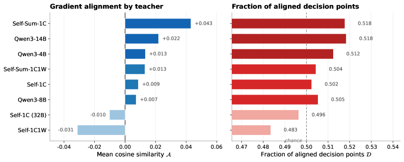

# Unmasking On-Policy Distillation: Where It Helps, Where It Hurts, and Why

## 基本信息

- **arXiv ID:** [2605.10889v1](https://arxiv.org/abs/2605.10889v1)
- **作者:** Mohammadreza Armandpour, Fatih Ilhan, David Harrison et al.
- **发布日期:** 2026-05-11
- **分类:** cs.LG, cs.AI
- **PDF:** [arXiv PDF](https://arxiv.org/pdf/2605.10889v1)

## 关键图示

<figure><figcaption>Figure 1</figcaption></figure>
<figure><figcaption>Figure 2</figcaption></figure>
<figure><figcaption>Figure 3</figcaption></figure>

## 摘要

### English

On-policy distillation offers dense, per-token supervision for training reasoning models; however, it remains unclear under which conditions this signal is beneficial and under which it is detrimental. Which teacher model should be used, and in the case of self-distillation, which specific context should serve as the supervisory signal? Does the optimal choice vary from one token to the next? At present, addressing these questions typically requires costly training runs whose aggregate performance metrics obscure the dynamics at the level of individual tokens. We introduce a training-free diagnostic framework that operates at the highest resolution: per token, per question, and per teacher. We derive an ideal per-node gradient defined as the parameter update that maximally increases the student's probability of success. We then develop a scalable targeted-rollout algorithm to estimate this gradient efficiently, even for long chains of intermediate thoughts. The gradient alignment score, defined as the cosine similarity between this ideal gradient and any given distillation gradient, quantifies the extent to which a particular configuration approximates the ideal signal. Across a range of self-distillation settings and external teacher models, we observe that distillation guidance exhibits substantially higher alignment with the ideal on incorrect rollouts than on correct ones, where the student already performs well and the teacher's signal tends to become noisy. Furthermore, we find that the optimal distillation context depends jointly on the student model's capacity and the target task, and that no single universally effective configuration emerges. These findings motivate the use of per-task, per-token diagnostic analyses for distillation.

### 中文

在策略蒸馏为训练推理模型提供密集的、按令牌的监督；然而，目前尚不清楚该信号在哪些条件下有益，在哪些条件下有害。应该采用哪种教师模式，在自我蒸馏的情况下，应该以哪种具体情境作为监督信号？不同代币的最佳选择是否有所不同？目前，解决这些问题通常需要昂贵的训练运行，其总体性能指标掩盖了单个代币级别的动态。我们引入了一个免培训的诊断框架，该框架以最高分辨率运行：每个令牌、每个问题和每个教师。我们推导出一个理想的每节点梯度，定义为最大程度地增加学生成功概率的参数更新。然后，我们开发了一种可扩展的有针对性的推出算法来有效地估计这个梯度，即使对于长链的中间思想也是如此。梯度对齐分数定义为该理想梯度与任何给定蒸馏梯度之间的余弦相似度，量化特定配置近似理想信号的程度。在一系列自蒸馏设置和外部教师模型中，我们观察到蒸馏指导在不正确的部署中表现出比在正确的部署中更高的理想一致性，在正确的部署中，学生已经表现良好，而教师的信号往往会变得嘈杂。此外，我们发现最佳蒸馏上下文共同取决于学生模型的能力和目标任务，并且没有出现单一的普遍有效的配置。这些发现促使使用每个任务、每个标记的诊断分析来进行蒸馏。

## 相关概念

- [大语言模型](../../concepts/large-language-model.html)
- [强化学习](../../concepts/reinforcement-learning.html)
- [基准评估](../../concepts/benchmarking.html)
- [AI安全与对齐](../../concepts/ai-safety-alignment.html)

## 核心贡献

### English

This paper provides a rigorous diagnostic framework for understanding when and why on-policy distillation helps or hurts reasoning model training. Key contributions: (1) Derivation of an ideal per-node gradient — the parameter update that maximally increases the student's probability of success — serving as an oracle reference. (2) A scalable targeted-rollout algorithm to efficiently estimate success probabilities at each node without exhaustive enumeration. (3) The gradient alignment score — cosine similarity between the ideal gradient and any distillation gradient — which quantifies how well a teacher+algorithm combination approximates the ideal signal. (4) Key empirical finding: distillation guidance has substantially higher alignment with the ideal on incorrect rollouts than on correct ones, motivating selective distillation strategies. (5) Evidence that no single teacher/configuration is universally optimal — the best choice depends jointly on student capacity and task.

### 中文

本文提供了一个严格的诊断框架，用于理解策略蒸馏何时以及为何有助于或有害于推理模型训练。核心贡献：(1) 推导理想每节点梯度——最大化学生成功概率的参数更新——作为 oracle 参考。(2) 可扩展的有目标 rollout 算法，无需穷举枚举即可高效估计每个节点的成功概率。(3) 梯度对齐分数——理想梯度与任何蒸馏梯度之间的余弦相似度——量化教师+算法组合近似理想信号的程度。(4) 关键实证发现：蒸馏指导在不正确的 rollout 上比在正确的 rollout 上具有显著更高的理想对齐度，这激励了选择性蒸馏策略。(5) 证据表明没有单一教师/配置是普遍最优的——最佳选择共同取决于学生能力和任务。

## 方法概述

### English

The framework operates in three steps. **Step 1 — Estimate P̂succ**: For each branching node (token position) in the student's generation, run targeted rollouts to estimate the probability of eventual task success for each possible next token. Targeted rollouts construct prefixes that force specific token choices at the node of interest, then complete the trajectory with the student model. **Step 2 — Compute ideal gradient**: The ideal gradient at node u is gⱼ_ideal = Pθⱼ(Psuccⱼ - P̄succ), where Pθⱼ is the student's current probability for token j and Psuccⱼ is the estimated success rate after choosing j. This gradient pushes toward tokens that lead to success. **Step 3 — Alignment score**: For any distillation method (GKD, MiniLLM, Dr. GRPO), compute its gradient and measure cosine similarity with g_ideal. The analysis covers four distillation algorithms, showing they all produce gradients of the form ∂L/∂zⱼ = Pθⱼ(fⱼ - f̄), making them directly comparable via alignment. A key theoretical contribution is showing Dr. GRPO (without length normalization) recovers the ideal gradient in expectation.

### 中文

该框架分三步运行。**步骤一——估计 P̂succ**：对于学生生成中的每个分支节点（token 位置），运行有目标 rollout 以估计每个可能的下一个 token 的最终任务成功概率。有目标 rollout 构建强制在感兴趣节点选择特定 token 的前缀，然后用学生模型完成轨迹。**步骤二——计算理想梯度**：节点 u 的理想梯度为 gⱼ_ideal = Pθⱼ(Psuccⱼ - P̄succ)，其中 Pθⱼ 是学生对 token j 的当前概率，Psuccⱼ 是选择 j 后的估计成功率。该梯度推向导致成功的 token。**步骤三——对齐分数**：对于任何蒸馏方法（GKD、MiniLLM、Dr. GRPO），计算其梯度并测量与 g_ideal 的余弦相似度。分析涵盖四种蒸馏算法，显示它们都产生形式为 ∂L/∂zⱼ = Pθⱼ(fⱼ - f̄) 的梯度，使其可通过对齐度直接比较。一个关键理论贡献是表明 Dr. GRPO（无长度归一化）在期望中恢复了理想梯度。

## 实验结果

### English

Experiments span self-distillation and external teacher settings across reasoning benchmarks (GSM8K, MATH, etc.). **Key findings**: (1) Distillation gradients show 0.3-0.6 alignment with ideal on incorrect rollouts vs near-zero or negative alignment on correct rollouts — the teacher's signal is beneficial precisely where the student struggles. (2) Self-distillation (student as own teacher) often produces near-zero alignment — the student's own distribution provides little useful signal. (3) Stronger teachers generally yield higher alignment, but the optimal teacher varies by task. (4) Per-token alignment varies dramatically within a single generation — some tokens have +0.8 alignment while neighbors have -0.3. This motivates per-token selective distillation. (5) MiniLLM's trajectory-level coupling introduces noise that reduces alignment compared to per-node methods like GKD.

### 中文

实验涵盖推理基准（GSM8K、MATH 等）上的自蒸馏和外部教师设置。**关键发现**：(1) 蒸馏梯度在不正确的 rollout 上显示 0.3-0.6 的理想对齐度，而在正确的 rollout 上接近零或负对齐——教师的信号恰好在学生困难处有益。(2) 自蒸馏（学生作为自己的教师）通常产生接近零的对齐——学生自身的分布提供的有用信号很少。(3) 更强的教师通常产生更高的对齐度，但最优教师因任务而异。(4) 单次生成内的逐 token 对齐度变化剧烈——某些 token 有 +0.8 对齐度而相邻 token 为 -0.3。这激励了逐 token 选择性蒸馏。(5) MiniLLM 的轨迹级耦合引入噪声，与 GKD 等逐节点方法相比降低了对齐度。

## 局限性与注意点

### English

(1) The diagnostic framework requires running many targeted rollouts per node, which is computationally expensive for long generations. (2) Alignment is measured against an empirical estimate of success probability, which may be noisy for rare tokens. (3) The framework diagnoses but does not prescribe — it identifies where distillation helps/hurts but doesn't provide an algorithm to automatically act on this information. (4) All experiments use relatively small models (<8B parameters); findings may differ at larger scales. (5) The "ideal gradient" assumes the goal is maximizing success probability, which may not capture all desiderata (e.g., diversity, safety).

### 中文

(1) 诊断框架需要为每个节点运行许多有目标 rollout，对于长生成计算开销大。(2) 对齐度是相对于成功概率的经验估计测量的，对于稀有 token 可能有噪声。(3) 框架诊断但不处方——它识别蒸馏在哪里有帮助/有害，但不提供自动据此行动的算法。(4) 所有实验使用相对较小的模型（<8B 参数）；更大规模的发现可能不同。(5) "理想梯度"假设目标是最大化成功概率，这可能无法捕捉所有需求（如多样性、安全性）。

---
*导入时间: 2026-05-12 06:01*
*来源: arXiv Daily Wiki Update 2026-05-12*
