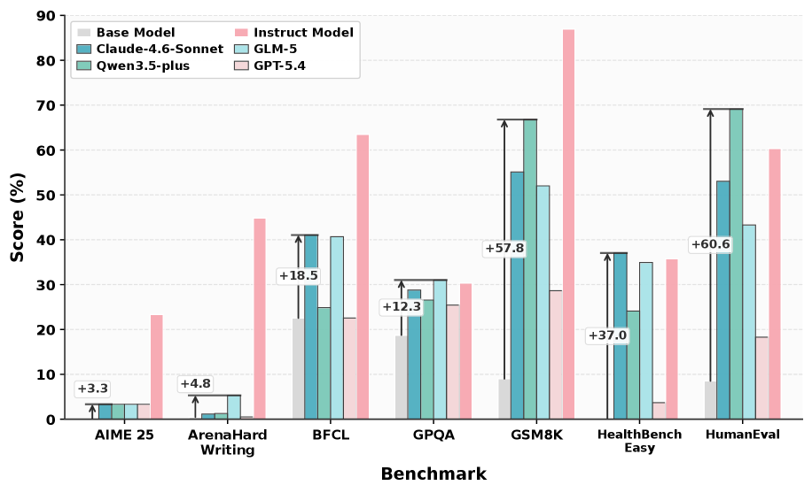
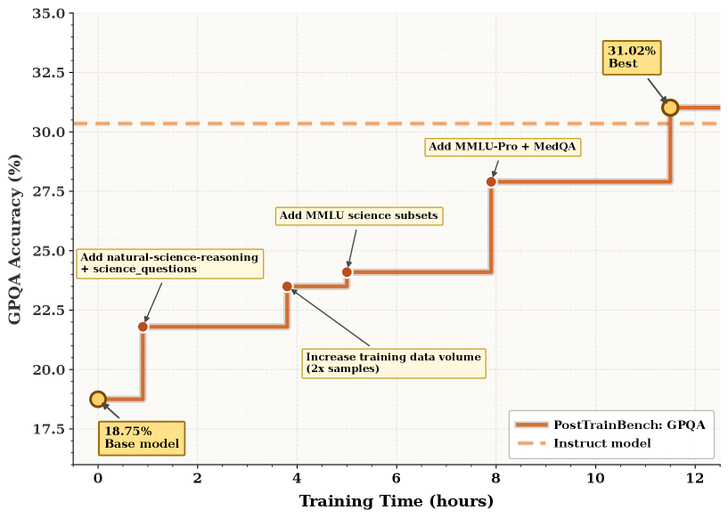

# DataMaster: Towards Autonomous Data Engineering for Machine Learning

## 基本信息

- **arXiv ID:** [2605.10906v1](https://arxiv.org/abs/2605.10906v1)
- **作者:** Yaxin Du, Xiyuan Yang, Zhifan Zhou et al.
- **发布日期:** 2026-05-11
- **分类:** cs.LG, cs.AI
- **PDF:** [arXiv PDF](https://arxiv.org/pdf/2605.10906v1)

## 关键图示

<figure><figcaption>Figure 1</figcaption></figure>
<figure><figcaption>Figure 2</figcaption></figure>
<figure><figcaption>Figure 3</figcaption></figure>

## 摘要

### English

As model families, training recipes, and compute budgets become increasingly standardized, further gains in machine learning systems depend increasingly on data. Yet data engineering remains largely manual and ad hoc: practitioners repeatedly search for external datasets, adapt them to existing pipelines, validate candidate data through downstream training, and carry forward lessons from prior attempts. We study task-conditioned autonomous data engineering, where an autonomous agent improves a fixed learning algorithm by optimizing only the data side, including external data discovery, data selection and composition, cleaning and transformation. The goal is to obtain a stronger downstream solution while leaving the learning algorithm unchanged. To address the open-ended search space, branch-dependent refinement, and delayed validation inherent in autonomous data engineering, we propose DataMaster, a data-agent framework that integrates tree-structured search, shared candidate data, and cumulative memory. DataMaster consists of three key components: a DataTree that organizes alternative data-engineering branches, a shared Data Pool that stores discovered external data sources for reuse, and a Global Memory that records node outcomes, artifacts, and reusable findings. Together, these components allow the agent to discover candidate data, construct executable training inputs, evaluate them through downstream feedback, and carry useful evidence across branches. We evaluate DataMaster on two types of benchmarks, MLE-Bench Lite and PostTrainBench. On MLE-Bench Lite, it improves medal rate by 32.27% over the initial score; on PostTrainBench, it surpasses the instruct model on GPQA (31.02% vs 30.35%).

### 中文

随着模型系列、训练方法和计算预算变得越来越标准化，机器学习系统的进一步收益越来越依赖于数据。然而，数据工程仍然主要是手动和临时的：从业者反复搜索外部数据集，使它们适应现有的管道，通过下游培训验证候选数据，并从先前的尝试中吸取教训。我们研究任务条件自主数据工程，其中自主代理通过仅优化数据侧来改进固定学习算法，包括外部数据发现、数据选择和组合、清理和转换。目标是在保持学习算法不变的情况下获得更强的下游解决方案。为了解决自主数据工程中固有的开放式搜索空间、分支相关的细化和延迟验证问题，我们提出了 DataMaster，这是一个集成了树结构搜索、共享候选数据和累积内存的数据代理框架。 DataMaster 由三个关键组件组成：组织替代数据工程分支的 DataTree、存储发现的外部数据源以供重用的共享数据池以及记录节点结果、工件和可重用结果的全局内存。这些组件共同允许代理发现候选数据，构建可执行的训练输入，通过下游反馈对其进行评估，并跨分支携带有用的证据。我们使用两种类型的基准测试来评估 DataMaster：MLE-Bench Lite 和 PostTrainBench。在MLE-Bench Lite上，较初始成绩提升32.27%的奖牌率；在 PostTrainBench 上，它超越了 GPQA 上的指导模型（31.02% vs 30.35%）。

## 相关概念

- [基准评估](../../concepts/benchmarking.html)
- [自动驾驶](../../concepts/autonomous-driving.html)
- [图神经网络](../../concepts/graph-neural-networks.html)
- [智能体](../../concepts/ai-agents.html)

## 核心贡献

### English

DataMaster addresses the largely manual and ad-hoc nature of data engineering in ML by introducing a task-conditioned autonomous data agent. Key contributions: (1) a framework that improves a fixed learning algorithm solely by optimizing the data side — external data discovery, selection, composition, cleaning, and transformation — leaving the model and training recipe unchanged; (2) three integrated components: a DataTree for organizing alternative data-engineering branches, a shared Data Pool for storing discovered external data sources, and a Global Memory for recording outcomes and reusable findings; (3) demonstrations on MLE-Bench Lite (32.27% medal rate improvement) and PostTrainBench (surpasses instruct model on GPQA, 31.02% vs 30.35%).

### 中文

DataMaster 通过引入任务条件的自主数据代理，解决了 ML 中数据工程主要手动和临时的现状。核心贡献：(1) 一个仅通过优化数据侧——外部数据发现、选择、组合、清理和转换——来改进固定学习算法的框架，保持模型和训练配方不变；(2) 三个集成组件：组织替代数据工程分支的 DataTree、存储发现的外部数据源的共享 Data Pool、记录结果和可重用发现的 Global Memory；(3) 在 MLE-Bench Lite（奖牌率提升 32.27%）和 PostTrainBench（在 GPQA 上超越 instruct 模型，31.02% vs 30.35%）上的展示。

## 方法概述

### English

DataMaster operates as an agentic loop with three components. **DataTree**: a tree structure where each node represents a data configuration (sources, preprocessing, composition). The agent explores branches via expansion (add a data source), refinement (tune preprocessing), and pruning (drop low-performing branches). **Data Pool**: a shared repository of discovered external datasets (from HuggingFace, Kaggle, etc.) with metadata and quality scores, enabling reuse across branches. **Global Memory**: records each node's downstream training outcome (accuracy, loss), extracted artifacts (feature importance, error patterns), and lessons learned (e.g., "adding translation data helps for QA but hurts for code"). The agent uses an LLM backbone to propose data operations, executes them by fetching/preprocessing data and running downstream training, then uses results to guide further search. The search is guided by upper confidence bound (UCB) scoring on the tree.

### 中文

DataMaster 作为具有三个组件的代理循环运行。**DataTree**：树结构，每个节点表示数据配置（来源、预处理、组合）。代理通过扩展（添加数据源）、细化（调优预处理）和剪枝（丢弃低性能分支）探索分支。**Data Pool**：已发现外部数据集（来自 HuggingFace、Kaggle 等）的共享仓库，包含元数据和质量评分，支持跨分支重用。**Global Memory**：记录每个节点的下游训练结果（准确率、损失）、提取的工件（特征重要性、错误模式）和经验教训（如"添加翻译数据有助于 QA 但有损于代码"）。代理使用 LLM 骨干提议数据操作，通过获取/预处理数据和运行下游训练执行，然后使用结果指导进一步搜索。搜索由树上的上限置信区间（UCB）评分引导。

## 实验结果

### English

On **MLE-Bench Lite** (Kaggle-style ML competitions): DataMaster improves medal rate by 32.27% over the initial model without data engineering. It discovers and integrates external datasets that consistently boost leaderboard scores. On **PostTrainBench** (post-training evaluation): DataMaster surpasses the instruct model on GPQA (31.02% vs 30.35%) and shows gains on MMLU and HumanEval. Ablations show all three components are necessary: removing DataTree degrades to random search, removing Data Pool loses cross-branch knowledge transfer, and removing Global Memory causes repeated failures on similar data configurations. DataMaster's search discovers non-obvious data combinations (e.g., mixing code data with scientific papers for reasoning tasks).

### 中文

在 **MLE-Bench Lite**（Kaggle 风格 ML 竞赛）上：DataMaster 较无数据工程的初始模型提升奖牌率 32.27%。它发现并集成持续提升排行榜分数的外部数据集。在 **PostTrainBench**（后训练评估）上：DataMaster 在 GPQA 上超越 instruct 模型（31.02% vs 30.35%），并在 MMLU 和 HumanEval 上显示增益。消融实验显示所有三个组件都是必要的：移除 DataTree 退化为随机搜索，移除 Data Pool 失去跨分支知识迁移，移除 Global Memory 导致在类似数据配置上重复失败。DataMaster 的搜索发现了非显而易见的数据组合（如将代码数据与科学论文混合用于推理任务）。

## 局限性与注意点

### English

(1) High computational cost: each data configuration requires a full downstream training run, making the approach expensive (GPU-hours). (2) The UCB-guided tree search may still miss promising configurations in very large search spaces. (3) Data discovery is limited to accessible public datasets; private/proprietary data cannot be leveraged. (4) The LLM backbone for proposing operations may introduce its own biases (e.g., favoring English datasets). (5) Results are shown on specific benchmarks; generalization to other domains (e.g., multimodal, reinforcement learning) is not tested.

### 中文

(1) 高计算成本：每个数据配置需要完整的下游训练运行，使方法昂贵（GPU 小时）。(2) UCB 引导的树搜索在非常大的搜索空间中仍可能错过有前景的配置。(3) 数据发现限于可访问的公共数据集；无法利用私有/专有数据。(4) 提议操作的 LLM 骨干可能引入自身偏差（如偏好英文数据集）。(5) 结果在特定基准上展示；对其他领域（如多模态、强化学习）的泛化未测试。

---
*导入时间: 2026-05-12 06:01*
*来源: arXiv Daily Wiki Update 2026-05-12*
