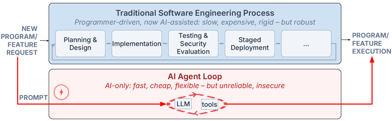
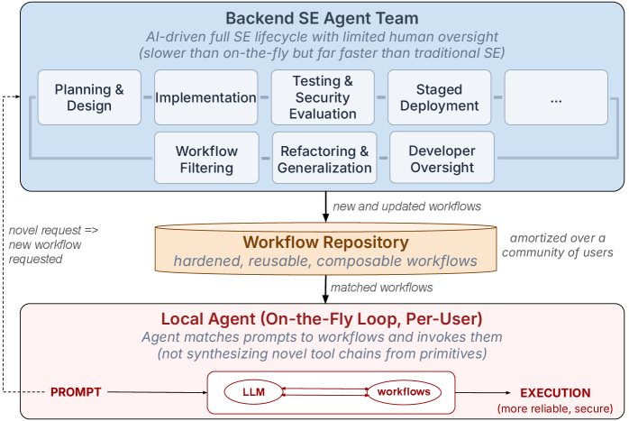
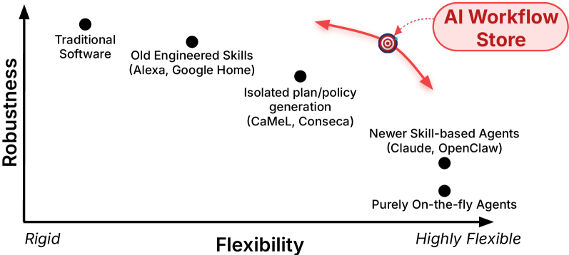

# Engineering Robustness into Personal Agents with the AI Workflow Store

## 基本信息

- **arXiv ID:** [2605.10907v1](https://arxiv.org/abs/2605.10907v1)
- **作者:** Roxana Geambasu, Mariana Raykova, Pierre Tholoniat et al.
- **发布日期:** 2026-05-11
- **分类:** cs.CR, cs.AI
- **PDF:** [arXiv PDF](https://arxiv.org/pdf/2605.10907v1)

## 关键图示

<figure><figcaption>Figure 1</figcaption></figure>
<figure><figcaption>Figure 2</figcaption></figure>
<figure><figcaption>Figure 3</figcaption></figure>

## 摘要

### English

The dominant paradigm for AI agents is an "on-the-fly" loop in which agents synthesize plans and execute actions within seconds or minutes in response to user prompts. We argue that this paradigm short-circuits disciplined software engineering (SE) processes -- iterative design, rigorous testing, adversarial evaluation, staged deployment, and more -- that have delivered the (relatively) reliable and secure systems we use today. By focusing on rapid, real-time synthesis, are AI agents effectively delivering users improvised prototypes rather than systems fit for high-stakes scenarios in which users may unwittingly apply them?   This paper argues for the need to integrate rigorous SE processes into the agentic loop to produce production-grade, hardened, and deterministically-constrained agent *workflows* that substantially outperform the potentially brittle and vulnerable results of on-the-fly synthesis. Doing so may require extra compute and time, and if so, we must amortize the cost of rigor through reuse across a broad user community. We envision an *AI Workflow Store* that consists of hardened and reusable workflows that agents can invoke with far greater reliability and security than improvised tool chains. We outline the research challenges of this vision, which stem from a broader flexibility-robustness tension that we argue requires moving beyond the ``on-the-fly'' paradigm to navigate effectively.

### 中文

人工智能代理的主导范例是“即时”循环，其中代理综合计划并在几秒或几分钟内执行操作以响应用户提示。我们认为，这种范式短路了严格的软件工程（SE）流程——迭代设计、严格测试、对抗性评估、分阶段部署等等——这些流程提供了我们今天使用的（相对）可靠和安全的系统。通过专注于快速、实时的综合，人工智能代理是否可以有效地为用户提供临时原型，而不是适合用户可能无意中应用它们的高风险场景的系统？本文认为需要将严格的 SE 流程集成到代理循环中，以生成生产级、强化且确定性约束的代理“工作流程”，其性能大大优于即时合成的潜在脆弱性和易受攻击的结果。这样做可能需要额外的计算和时间，如果是这样，我们必须通过在广泛的用户社区中重用来分摊严格成本。我们设想一个“人工智能工作流存储”，由强化且可重用的工作流组成，代理可以比临时工具链以更高的可靠性和安全性调用这些工作流。我们概述了这一愿景的研究挑战，这些挑战源于更广泛的灵活性-鲁棒性张力，我们认为需要超越“即时”范式才能有效导航。

## 相关概念

- [大语言模型](../../concepts/large-language-model.html)
- [基准评估](../../concepts/benchmarking.html)
- [AI安全与对齐](../../concepts/ai-safety-alignment.html)
- [智能体](../../concepts/ai-agents.html)

## 核心贡献

### English

This is a position paper arguing that the dominant "on-the-fly" paradigm for AI agents — synthesizing plans and executing actions in real-time — produces improvised prototypes rather than production-grade systems. The key intellectual contributions are: (1) identifying a fundamental flexibility-robustness tension in agent design — real-time synthesis maximizes flexibility but undermines reliability, security, and predictability; (2) arguing for integrating disciplined software engineering (SE) processes — iterative design, rigorous testing, adversarial evaluation, staged deployment — into the agentic loop; (3) proposing the AI Workflow Store concept: a repository of hardened, reusable, deterministically-constrained agent workflows that agents can invoke with far greater reliability than improvised tool chains; and (4) outlining the research challenges, including workflow specification, trust establishment, and cost amortization through community reuse.

### 中文

这是一篇立场论文，论证 AI 代理的主导"即时"范式——实时综合计划和执行动作——产生的是临时原型而非生产级系统。核心智力贡献包括：(1) 识别代理设计中根本的灵活性-鲁棒性张力——实时综合最大化灵活性但损害可靠性、安全性和可预测性；(2) 主张将规范的软件工程（SE）流程——迭代设计、严格测试、对抗性评估、分阶段部署——集成到代理循环中；(3) 提出 AI Workflow Store 概念：一个强化、可重用、确定性约束的代理工作流仓库，代理可以比临时工具链更高的可靠性调用；(4) 概述研究挑战，包括工作流规范、信任建立和通过社区重用的成本分摊。

## 方法概述

### English

This paper does not present a concrete system implementation but rather a vision and research agenda. The AI Workflow Store is envisioned as operating analogously to app stores: developers submit workflows that have undergone rigorous SE processes (testing, adversarial evaluation, formal verification where possible). Workflows are deterministically constrained — they have well-defined preconditions, postconditions, and resource bounds. Agents query the store with a task specification and receive a ranked list of applicable workflows. Key design dimensions include: workflow representation (declarative vs imperative), trust mechanisms (reputation, formal verification, sandboxing), composition (how workflows chain together), and incentive structures for contributors. The paper draws parallels to how software libraries, package managers, and CI/CD pipelines brought reliability to traditional software.

### 中文

本文不呈现具体的系统实现，而是提出愿景和研究议程。AI Workflow Store 设想类似应用商店运作：开发者提交经过严格 SE 流程（测试、对抗性评估、尽可能的形式化验证）的工作流。工作流是确定性约束的——具有明确定义的前置条件、后置条件和资源边界。代理以任务规范查询商店，并收到适用工作流的排序列表。关键设计维度包括：工作流表示（声明式 vs 命令式）、信任机制（信誉、形式化验证、沙箱）、组合（工作流如何链接）以及贡献者的激励机制。本文将其与传统软件中软件库、包管理器和 CI/CD 管道如何带来可靠性进行类比。

## 实验结果

### English

As a position paper, this work does not contain empirical experiments. Instead, it provides a conceptual analysis supported by examples from software engineering history. The paper identifies specific failure modes of on-the-fly agents (prompt injection vulnerabilities, unbounded action spaces, non-deterministic outputs) and argues these are inherent to the paradigm rather than implementation flaws. It discusses how SE practices have historically addressed analogous challenges in traditional software (e.g., type systems for memory safety, CI/CD for regression prevention) and maps these solutions to the agent domain.

### 中文

作为立场论文，本文不包含实证实验。相反，它提供了由软件工程历史案例支持的概念分析。论文识别了即时代理的特定失败模式（提示注入漏洞、无界动作空间、非确定性输出），并论证这些是范式固有的而非实现缺陷。讨论了 SE 实践如何在历史上解决传统软件中的类似挑战（如类型系统保证内存安全、CI/CD 防止回归），并将这些解决方案映射到代理领域。

## 局限性与注意点

### English

(1) This is a vision paper — no system is built or evaluated, so claims about effectiveness remain speculative. (2) The AI Workflow Store idea inherits challenges from app stores: curation, malicious actors, versioning, and dependency management. (3) The paper does not address how to balance workflow rigidity with the flexibility that makes agents valuable in the first place. (4) Cost amortization through community reuse assumes a large, active user base, which may not materialize. (5) The tension between open-ended agent capabilities and deterministic workflows may prove fundamental rather than engineering-solvable.

### 中文

(1) 这是一篇愿景论文——没有构建或评估系统，因此有效性的声明仍是推测性的。(2) AI Workflow Store 的想法继承了应用商店的挑战：策展、恶意行为者、版本控制和依赖管理。(3) 论文未讨论如何在工作流刚性与使代理有价值的灵活性之间取得平衡。(4) 通过社区重用的成本分摊假设存在大量活跃用户基础，这可能不会实现。(5) 开放式代理能力与确定性工作流之间的张力可能是根本性的而非工程可解决的。

---
*导入时间: 2026-05-12 06:01*
*来源: arXiv Daily Wiki Update 2026-05-12*
