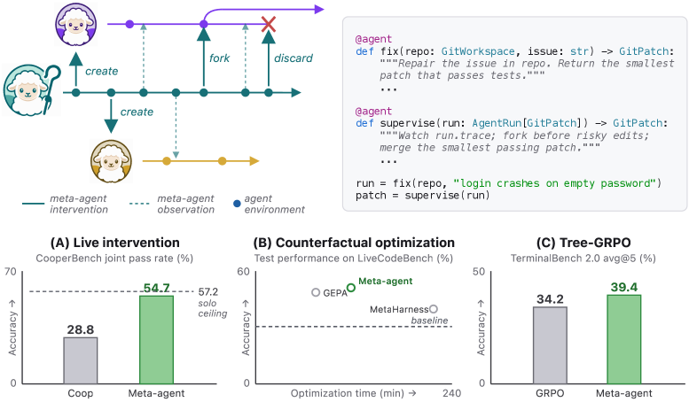
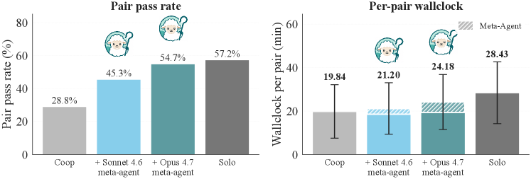
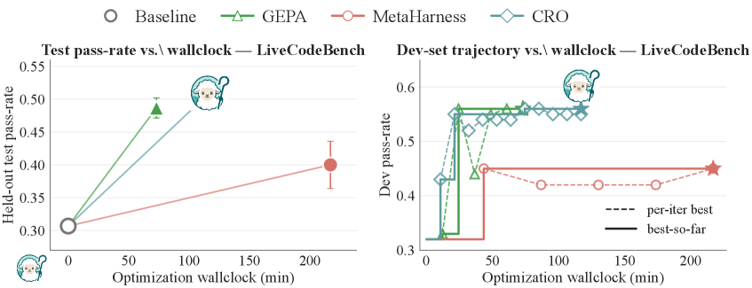

# Shepherd: A Runtime Substrate Empowering Meta-Agents with a Formalized Execution Trace

## 基本信息

- **arXiv ID:** [2605.10913v1](https://arxiv.org/abs/2605.10913v1)
- **作者:** Simon Yu, Derek Chong, Ananjan Nandi et al.
- **发布日期:** 2026-05-11
- **分类:** cs.AI, cs.PL, cs.SE
- **PDF:** [arXiv PDF](https://arxiv.org/pdf/2605.10913v1)

## 关键图示

<figure><figcaption>Figure 1</figcaption></figure>
<figure><figcaption>Figure 2</figcaption></figure>
<figure><figcaption>Figure 3</figcaption></figure>

## 摘要

### English

We introduce Shepherd, a functional programming model that formalizes meta-agent operations on target agents as functions, with core operations mechanized in Lean. Shepherd records every agent-environment interaction as a typed event in a Git-like execution trace, enabling any past state to be forked and replayed. The system forks the agent process and its filesystem $5\times$ faster than Docker, achieving $>95\%$ prompt-cache reuse on replay. We demonstrate the model through three applications. First, in runtime intervention, a live supervisor increases pair coding pass rates from 28.8% to 54.7% on CooperBench. Second, in counterfactual meta-optimization, branching exploration outperforms baselines across four benchmarks by up to 11 points while reducing wall-clock time by up to 58%. Third, in Tree-RL training, forking rollouts at selected turns improves TerminalBench-2 performance from 34.2% to 39.4%. These results establish Shepherd as an efficient infrastructure for programming meta-agents. We open-source the system to support future research.

### 中文

我们引入 Shepherd，这是一种函数式编程模型，它将目标代理上的元代理操作形式化为函数，并在精益中机械化核心操作。 Shepherd 将每个代理与环境的交互记录为类似 Git 的执行跟踪中的类型化事件，从而可以分叉和重播任何过去的状态。该系统分叉代理进程及其文件系统比 Docker 快 $5\time$，在重放时实现 $>95\%$ 提示缓存重用。我们通过三个应用程序演示该模型。首先，在运行时干预中，现场主管将 CooperBench 上的配对编码通过率从 28.8% 提高到 54.7%。其次，在反事实元优化中，分支探索在四个基准测试中的表现优于基线高达 11 个点，同时减少挂钟时间高达 58%。第三，在 Tree-RL 训练中，在选定的回合进行分叉部署将 TerminalBench-2 的性能从 34.2% 提高到 39.4%。这些结果使 Shepherd 成为编程元代理的高效基础设施。我们开源该系统以支持未来的研究。

## 相关概念

- [大语言模型](../../concepts/large-language-model.html)
- [强化学习](../../concepts/reinforcement-learning.html)
- [基准评估](../../concepts/benchmarking.html)
- [智能体](../../concepts/ai-agents.html)

## 核心贡献

### English

Shepherd introduces a principled infrastructure for programming meta-agents — agents that observe, control, and optimize other agents. Key contributions: (1) A functional programming model that formalizes meta-agent operations (fork, replay, intervene) as typed functions, with core semantics mechanized in the Lean theorem prover. (2) A Git-like execution trace that records every agent-environment interaction as a typed event, enabling any past state to be forked and replayed with >95% prompt-cache reuse. (3) System performance: forking agent processes 5× faster than Docker. (4) Three compelling applications showing practical value: runtime supervision (28.8% → 54.7% on CooperBench), counterfactual meta-optimization (up to 11-point improvement with 58% less wall-clock time), and Tree-RL training (34.2% → 39.4% on TerminalBench-2).

### 中文

Shepherd 引入了一个原则性的基础设施用于编程元代理——观察、控制和优化其他代理的代理。核心贡献：(1) 函数式编程模型，将元代理操作（fork、replay、intervene）形式化为类型化函数，核心语义在 Lean 定理证明器中机械化。(2) 类似 Git 的执行跟踪，将每次代理-环境交互记录为类型化事件，支持分叉和重放任何过去状态，提示缓存重用率 >95%。(3) 系统性能：分叉代理进程比 Docker 快 5 倍。(4) 三个有说服力的应用展示实用价值：运行时监督（CooperBench 从 28.8% 提升到 54.7%）、反事实元优化（最多 11 点改进，墙钟时间减少 58%）、Tree-RL 训练（TerminalBench-2 从 34.2% 提升到 39.4%）。

## 方法概述

### English

Shepherd models meta-agents as functions in a functional programming paradigm: `MetaAgent : Trace → Action`, where `Trace` is an append-only log of typed events (thought, tool_call, tool_result, observation). The trace is structured as a Merkle DAG, enabling efficient forking via copy-on-write semantics. Core operations — fork, replay, intervene — are defined as pure functions and mechanized in Lean, providing formal guarantees about trace consistency. The system implements a filesystem snapshot mechanism that captures the agent's working directory at each step, enabling deterministic replay. For efficiency, Shepherd uses prompt-cache sharing: when replaying a forked trace, shared prefix computations are reused. At inference time, a meta-agent (e.g., a supervisor LLM) reads the trace and can inject interventions (overriding actions, injecting prompts) at any step. For Tree-RL, the fork primitive enables branching rollouts from any intermediate state.

### 中文

Shepherd 将元代理建模为函数式编程范式中的函数：`MetaAgent : Trace → Action`，其中 Trace 是类型化事件的追加日志（thought、tool_call、tool_result、observation）。跟踪结构化为 Merkle DAG，通过写时复制语义实现高效分叉。核心操作——fork、replay、intervene——定义为纯函数并在 Lean 中机械化，提供关于跟踪一致性的形式化保证。系统实现了文件系统快照机制，捕获代理在每个步骤的工作目录，实现确定性重放。为提高效率，Shepherd 使用提示缓存共享：重放分叉的跟踪时，共享前缀计算被重用。推理时，元代理（如监督者 LLM）读取跟踪并可在任何步骤注入干预（覆盖动作、注入提示）。对于 Tree-RL，fork 原语支持从任何中间状态进行分支部署。

## 实验结果

### English

**Runtime intervention**: A live supervisor meta-agent monitors coding agents on CooperBench. Without intervention, pair coding pass rate is 28.8%. With Shepherd enabling the supervisor to inject corrections at failure points, pass rate reaches 54.7% — nearly doubling performance. **Counterfactual meta-optimization**: On four benchmarks (CooperBench, SWE-bench, etc.), branching exploration via Shepherd's fork outperforms sequential baselines by 3-11 points while reducing wall-clock time by 34-58%. **Tree-RL**: Forking rollouts at selected turns using Shepherd improves TerminalBench-2 from 34.2% to 39.4%. **System benchmarks**: Fork latency is <100ms for typical agent states vs >500ms for Docker; prompt-cache hit rate >95% on replay.

### 中文

**运行时干预**：实时监督者元代理监控 CooperBench 上的编码代理。无干预时，配对编码通过率为 28.8%。通过 Shepherd 使监督者在失败点注入纠正，通过率达到 54.7%——性能几乎翻倍。**反事实元优化**：在四个基准（CooperBench、SWE-bench 等）上，通过 Shepherd fork 的分支探索比顺序基线高 3-11 分，同时减少墙钟时间 34-58%。**Tree-RL**：使用 Shepherd 在选定回合进行分叉部署，TerminalBench-2 从 34.2% 提升到 39.4%。**系统基准**：典型代理状态的 fork 延迟 <100ms vs Docker >500ms；重放时提示缓存命中率 >95%。

## 局限性与注意点

### English

(1) Shepherd currently assumes a single-machine execution model; distributed multi-agent scenarios are future work. (2) The filesystem snapshot mechanism may not scale to very large working directories (e.g., multi-GB codebases). (3) The mechanistic formalization in Lean covers core operations but not all runtime behaviors (e.g., network failures, partial observations). (4) The meta-agent policy itself is not learned — it requires human-authored supervision strategies. (5) Prompt-cache reuse depends on shared prefixes; effectiveness degrades with highly divergent branches.

### 中文

(1) Shepherd 目前假设单机执行模型；分布式多代理场景是未来工作。(2) 文件系统快照机制可能无法扩展到非常大的工作目录（如数 GB 代码库）。(3) Lean 中的机械化形式化覆盖核心操作，但未覆盖所有运行时行为（如网络故障、部分观测）。(4) 元代理策略本身并非学习而来——需要人工编写的监督策略。(5) 提示缓存重用依赖共享前缀；在高度分叉的分支上效果下降。

---
*导入时间: 2026-05-12 06:01*
*来源: arXiv Daily Wiki Update 2026-05-12*
