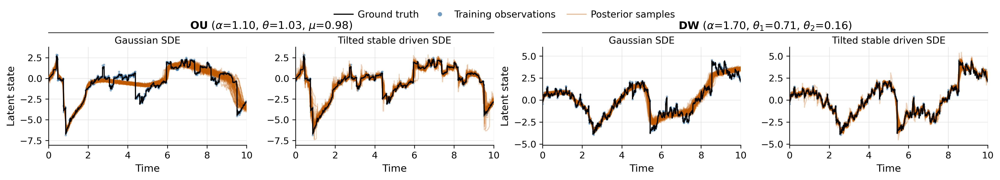
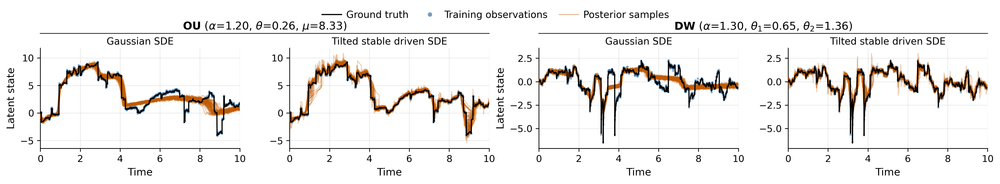
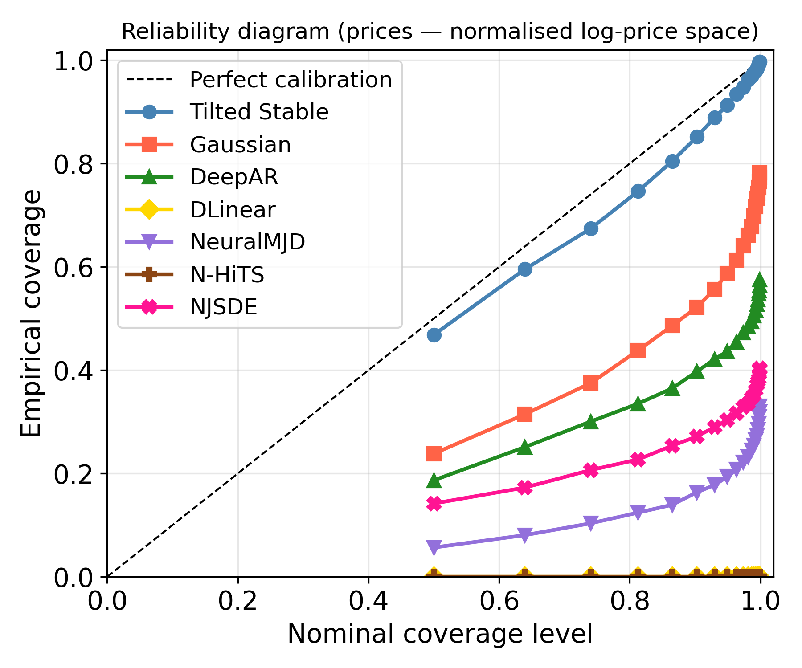

# Variational Inference for Lévy Process-Driven SDEs via Neural Tilting

## 基本信息

- **arXiv ID:** [2605.10934v1](https://arxiv.org/abs/2605.10934v1)
- **作者:** Yaman Kindap, Manfred Opper, Benjamin Dupuis et al.
- **发布日期:** 2026-05-11
- **分类:** cs.LG, cs.AI, cs.CV, cs.RO, stat.ML
- **PDF:** [arXiv PDF](https://arxiv.org/pdf/2605.10934v1)

## 关键图示

<figure><figcaption>Figure 1</figcaption></figure>
<figure><figcaption>Figure 2</figcaption></figure>
<figure><figcaption>Figure 3</figcaption></figure>

## 摘要

### English

Modelling extreme events and heavy-tailed phenomena is central to building reliable predictive systems in domains such as finance, climate science, and safety-critical AI. While Lévy processes provide a natural mathematical framework for capturing jumps and heavy tails, Bayesian inference for Lévy-driven stochastic differential equations (SDEs) remains intractable with existing methods: Monte Carlo approaches are rigorous but lack scalability, whereas neural variational inference methods are efficient but rely on Gaussian assumptions that fail to capture discontinuities. We address this tension by introducing a neural exponential tilting framework for variational inference in Lévy-driven SDEs. Our approach constructs a flexible variational family by exponentially reweighting the Lévy measure using neural networks. This parametrization preserves the jump structure of the underlying process while remaining computationally tractable. To enable efficient inference, we develop a quadratic neural parametrization that yields closed-form normalization of the tilted measure, a conditional Gaussian representation for stable processes that facilitates simulation, and symmetry-aware Monte Carlo estimators for scalable optimization. Empirically, we demonstrate that the method accurately captures jump dynamics and yields reliable posterior inference in regimes where Gaussian-based variational approaches fail, on both synthetic and real-world datasets.

### 中文

对极端事件和重尾现象进行建模对于在金融、气候科学和安全关键型人工智能等领域构建可靠的预测系统至关重要。虽然 Lévy 过程为捕获跳跃和重尾提供了一个自然的数学框架，但 Lévy 驱动的随机微分方程 (SDE) 的贝叶斯推理仍然难以用现有方法处理：蒙特卡洛方法很严格，但缺乏可扩展性，而神经变分推理方法很有效，但依赖于无法捕获不连续性的高斯假设。我们通过在 Lévy 驱动的 SDE 中引入用于变分推理的神经指数倾斜框架来解决这种紧张关系。我们的方法通过使用神经网络对 Lévy 度量进行指数级重新加权来构建灵活的变分族。这种参数化保留了底层进程的跳转结构，同时保持计算上的易处理性。为了实现有效的推理，我们开发了一种二次神经参数化，可以产生倾斜测量的封闭式归一化、有利于模拟的稳定过程的条件高斯表示，以及用于可扩展优化的对称感知蒙特卡洛估计器。根据经验，我们证明该方法可以准确地捕获跳跃动态，并在基于高斯的变分方法失败的情况下，在合成数据集和真实数据集上产生可靠的后验推理。

## 相关概念

- [基准评估](../../concepts/benchmarking.html)
- [AI安全与对齐](../../concepts/ai-safety-alignment.html)
- [世界模型](../../concepts/world-models.html)

## 核心贡献

### English

This paper addresses the long-standing challenge of Bayesian inference for Lévy-driven SDEs — models crucial for capturing extreme events and heavy tails in finance, climate, and safety-critical AI. The key contributions are: (1) a neural exponential tilting framework that constructs a flexible variational family by exponentially reweighting the Lévy measure with neural networks, preserving jump structure while remaining computationally tractable; (2) a quadratic neural parameterization that yields closed-form normalization of the tilted measure, eliminating the need for numerical integration; (3) a conditional Gaussian representation for stable processes that facilitates efficient simulation; (4) symmetry-aware Monte Carlo estimators for scalable optimization; and (5) empirical demonstration that the method accurately captures jump dynamics where Gaussian-based variational approaches fail.

### 中文

本文解决了 Lévy 驱动 SDE 贝叶斯推理的长期挑战——这些模型对于捕捉金融、气候和安全关键型 AI 中的极端事件和重尾现象至关重要。核心贡献包括：(1) 神经指数倾斜框架，通过用神经网络对 Lévy 测度进行指数重加权来构建灵活的变分族，保留了跳跃结构同时保持计算可处理性；(2) 二次神经参数化，可产生倾斜测度的闭式归一化，消除数值积分需求；(3) 用于稳定过程的条件高斯表示，便于高效模拟；(4) 对称感知蒙特卡洛估计器用于可扩展优化；(5) 实证证明该方法在基于高斯的变分方法失败时能准确捕捉跳跃动态。

## 方法概述

### English

The framework begins with a Lévy-driven SDE: dXt = f(Xt)dt + σ(Xt)dLt, where Lt is a Lévy process with characteristic triplet. Traditional variational inference uses Gaussian processes which cannot capture jumps. The authors instead define a **neural exponential tilting** of the Lévy measure ν: ν̃θ(dz) = exp(Tθ(z)) · ν(dz), where Tθ is a neural network. For tractability, they propose a **quadratic parameterization** Tθ(z) = -½zᵀAθz + bθᵀz + cθ, which yields closed-form normalization when ν is a stable Lévy measure. For simulation, they derive a **conditional Gaussian representation**: stable processes can be represented as Gaussian mixtures conditionally on an auxiliary variable, enabling reparameterization tricks. Training uses **symmetry-aware Monte Carlo estimators** that exploit the symmetry of Lévy measures to reduce variance. The framework supports both α-stable and tempered stable processes.

### 中文

该框架从 Lévy 驱动的 SDE 开始：dXt = f(Xt)dt + σ(Xt)dLt，其中 Lt 是具有特征三元组的 Lévy 过程。传统变分推理使用高斯过程，无法捕捉跳跃。作者改为定义 Lévy 测度 ν 的**神经指数倾斜**：ν̃θ(dz) = exp(Tθ(z)) · ν(dz)，其中 Tθ 是神经网络。为保持可处理性，他们提出**二次参数化** Tθ(z) = -½zᵀAθz + bθᵀz + cθ，当 ν 是稳定 Lévy 测度时产生闭式归一化。对于模拟，他们推导出**条件高斯表示**：稳定过程可表示为以辅助变量为条件的高斯混合，支持重参数化技巧。训练使用**对称感知蒙特卡洛估计器**，利用 Lévy 测度的对称性减少方差。该框架支持 α-稳定和调和稳定过程。

## 实验结果

### English

Experiments span synthetic and real-world datasets. On synthetic data (Lévy-driven Ornstein-Uhlenbeck process), the method accurately recovers both the drift and jump parameters, while Gaussian VI collapses to a single mode and misses jumps entirely. On real financial data (S&P 500 returns), the neural tilting approach captures tail risk and volatility clustering better than GARCH and Gaussian state-space models, with lower predictive negative log-likelihood. On climate data (extreme temperature events), the model identifies heavy-tailed noise structures that Gaussian models miss. Computational scaling experiments show the quadratic parameterization achieves 10-100× speedup over numerical integration alternatives while maintaining accuracy.

### 中文

实验涵盖合成和真实数据集。在合成数据（Lévy 驱动的 Ornstein-Uhlenbeck 过程）上，该方法准确恢复了漂移和跳跃参数，而高斯 VI 坍缩到单一模态并完全错过跳跃。在真实金融数据（S&P 500 收益）上，神经倾斜方法比 GARCH 和高斯状态空间模型更好地捕捉尾部风险和波动率聚类，具有更低的预测负对数似然。在气候数据（极端温度事件）上，模型识别出高斯模型遗漏的重尾噪声结构。计算扩展实验显示二次参数化比数值积分替代方案快 10-100 倍，同时保持准确性。

## 局限性与注意点

### English

(1) The quadratic parameterization, while computationally efficient, limits expressiveness — highly multi-modal posterior distributions may not be fully captured. (2) The method currently focuses on α-stable and tempered stable processes; extension to general Lévy processes requires further work. (3) The conditional Gaussian representation relies on specific properties of stable distributions. (4) Scalability to very high-dimensional state spaces (e.g., spatiotemporal models) remains to be explored. (5) The method requires specifying the Lévy process type a priori; model selection among Lévy families is not addressed.

### 中文

(1) 二次参数化虽然计算高效，但限制了表达能力——高度多模态的后验分布可能无法完全捕捉。(2) 该方法目前专注于 α-稳定和调和稳定过程；扩展到一般 Lévy 过程需要进一步工作。(3) 条件高斯表示依赖于稳定分布的特定性质。(4) 对非常高维状态空间（如时空模型）的可扩展性仍有待探索。(5) 该方法需要先验指定 Lévy 过程类型；Lévy 族之间的模型选择尚未解决。

---
*导入时间: 2026-05-12 06:01*
*来源: arXiv Daily Wiki Update 2026-05-12*
