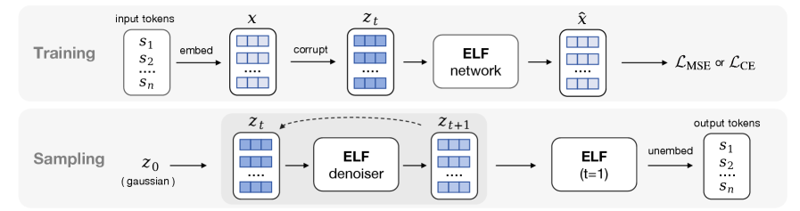

# ELF: Embedded Language Flows

## 基本信息

- **arXiv ID:** [2605.10938v1](https://arxiv.org/abs/2605.10938v1)
- **作者:** Keya Hu, Linlu Qiu, Yiyang Lu et al.
- **发布日期:** 2026-05-11
- **分类:** cs.CL, cs.AI, cs.LG
- **PDF:** [arXiv PDF](https://arxiv.org/pdf/2605.10938v1)

## 关键图示

<figure><figcaption>Figure 1</figcaption></figure>
<figure><figcaption>Figure 2</figcaption></figure>
<figure><figcaption>Figure 3</figcaption></figure>

## 摘要

### English

Diffusion and flow-based models have become the de facto approaches for generating continuous data, e.g., in domains such as images and videos. Their success has attracted growing interest in applying them to language modeling. Unlike their image-domain counterparts, today's leading diffusion language models (DLMs) primarily operate over discrete tokens. In this paper, we show that continuous DLMs can be made effective with minimal adaptation to the discrete domain. We propose Embedded Language Flows (ELF), a class of diffusion models in continuous embedding space based on continuous-time Flow Matching. Unlike existing DLMs, ELF predominantly stays within the continuous embedding space until the final time step, where it maps to discrete tokens using a shared-weight network. This formulation makes it straightforward to adapt established techniques from image-domain diffusion models, e.g., classifier-free guidance (CFG). Experiments show that ELF substantially outperforms leading discrete and continuous DLMs, achieving better generation quality with fewer sampling steps. These results suggest that ELF offers a promising path toward effective continuous DLMs.

### 中文

扩散和基于流的模型已成为生成连续数据的事实上的方法，例如在图像和视频等领域。他们的成功引起了人们越来越多的兴趣将其应用于语言建模。与图像领域的模型不同，当今领先的扩散语言模型 (DLM) 主要在离散标记上运行。在本文中，我们证明连续 DLM 可以通过对离散域的最小适应而变得有效。我们提出了嵌入式语言流（ELF），这是一类基于连续时间流匹配的连续嵌入空间中的扩散模型。与现有的 DLM 不同，ELF 主要停留在连续嵌入空间内，直到最后一个时间步，它使用共享权重网络映射到离散令牌。这种公式可以直接适应图像域扩散模型中的现有技术，例如无分类器引导（CFG）。实验表明，ELF 的性能明显优于领先的离散和连续 DLM，以更少的采样步骤实现了更好的生成质量。这些结果表明 ELF 为有效的连续 DLM 提供了一条有希望的道路。

## 相关概念

- [大语言模型](../../concepts/large-language-model.html)
- [多模态学习](../../concepts/multimodal-learning.html)

## 核心贡献

### English

ELF demonstrates that continuous diffusion language models (DLMs) can be highly competitive with minimal adaptation to the discrete domain. The paper's key contributions are: (1) a continuous-time Flow Matching formulation that performs denoising entirely in continuous embedding space, with discretization applied only at the final time step via a shared-weight network — no separate decoder is needed; (2) seamless integration of classifier-free guidance (CFG), a technique widely used in image diffusion models but largely unexplored in discrete DLMs; (3) strong empirical results showing ELF outperforms leading discrete DLMs (MDLM, Duo) and concurrent continuous DLMs (FLM, LangFlow) with fewer sampling steps (32 vs 1024) and 10× fewer training tokens, all without distillation.

### 中文

ELF 证明了连续扩散语言模型可以通过对离散域的最小适应而具备高度竞争力。论文的核心贡献包括：(1) 基于连续时间 Flow Matching 的公式，完全在连续嵌入空间中进行去噪，仅在最后一步通过共享权重网络进行离散化——无需单独的解码器；(2) 无缝集成无分类器引导（CFG），该技术在图像扩散模型中广泛使用但在离散 DLM 中几乎未被探索；(3) 强有力的实验结果表明，ELF 以更少的采样步数（32 步 vs 1024 步）和 10 倍少的训练 token、且无需蒸馏，优于领先的离散 DLM (MDLM, Duo) 和同期连续 DLM (FLM, LangFlow)。

## 方法概述

### English

ELF operates in three stages. **Encoding**: discrete tokens are mapped to continuous embeddings using a pretrained T5 encoder (frozen, jointly trained, or even random). **Flow Matching**: starting from Gaussian noise z₀, ELF iteratively denoises through an ODE dzt/dt = vθ(zt, t), parameterized via x-prediction (predicting clean embeddings rather than velocity). The x-prediction parameterization is crucial — it aligns naturally with the final discretization step and outperforms v-prediction when weights are shared with the decoder. **Decoding**: only at t=1 does ELF switch to "decode" mode, applying a token-level corruption process to the near-clean embeddings and projecting through a learnable unembedding matrix W with cross-entropy loss. Training alternates between denoising (MSE) and decoding (CE) branches in a single batch. For conditional generation, ELF uses self-conditioning (feeding the previous step's prediction as context) combined with CFG. An SDE-inspired sampler variant adds per-step noise for improved sample diversity.

### 中文

ELF 分三个阶段运行。**编码**：使用预训练的 T5 编码器将离散 token 映射为连续嵌入。**Flow Matching**：从高斯噪声 z₀ 开始，ELF 通过 ODE dzt/dt = vθ(zt, t) 迭代去噪，使用 x-prediction 参数化（预测干净嵌入而非速度）。x-prediction 参数化至关重要——它自然地与最终离散化步骤对齐，且在与解码器共享权重时优于 v-prediction。**解码**：仅在 t=1 时 ELF 切换到"decode"模式，对接近干净的嵌入施加 token 级腐败过程，并通过可学习的 unembedding 矩阵 W 以交叉熵损失进行投影。训练在单个批次中交替进行去噪（MSE）和解码（CE）分支。对于条件生成，ELF 使用自条件化结合 CFG。SDE 启发的采样器变体在每步注入噪声以提高样本多样性。

## 实验结果

### English

On OpenWebText (unconditional generation), ELF (105M params) achieves Gen. PPL of ~25 with 32 sampling steps, vs ~40 for MDLM and Duo (both 170M) with 1024 steps. With CFG, ELF further reduces Gen. PPL. On machine translation (WMT14 En→De), ELF achieves BLEU 28.5+ vs 26.5 for DiffuSeq. On XSum summarization, ELF reaches ROUGE-L ~29 vs ~27 for baselines. Ablations confirm: x-prediction > v-prediction, T5 encoder > random/learned embeddings, and CFG consistently improves quality. ELF also scales to 440M parameters, maintaining gains.

### 中文

在 OpenWebText（无条件生成）上，ELF（105M 参数）以 32 步采样实现约 25 的 Gen. PPL，而 MDLM 和 Duo（均为 170M）以 1024 步达到约 40。使用 CFG 后 ELF 进一步降低 Gen. PPL。在机器翻译（WMT14 En→De）上，ELF 达到 BLEU 28.5+ vs DiffuSeq 的 26.5。在 XSum 摘要上，ELF 达到 ROUGE-L ~29 vs 基线的 ~27。消融实验证实：x-prediction > v-prediction，T5 编码器 > 随机/学习嵌入，CFG 持续提升质量。ELF 也可扩展到 440M 参数，保持优势。

## 局限性与注意点

### English

(1) ELF currently operates at the sentence/paragraph level (~128 tokens); scaling to long-form generation remains unexplored. (2) The reliance on a pretrained T5 encoder means performance on low-resource languages or domains without good encoders is unclear. (3) CFG in ELF uses self-conditioning, which may not capture the full power of external conditioning signals (e.g., class labels, instructions). (4) The SDE sampler only approximates true SDE dynamics; a proper SDE formulation may yield further improvements. (5) All experiments use relatively small models (105M-440M); behavior at billion-parameter scale is unknown.

### 中文

(1) ELF 目前仅在句子/段落级别（~128 token）运行；扩展到长文本生成尚未探索。(2) 依赖预训练的 T5 编码器，在缺乏良好编码器的低资源语言或领域上的性能未知。(3) ELF 中的 CFG 使用自条件化，可能无法充分利用外部条件信号（如类别标签、指令）。(4) SDE 采样器仅近似真实 SDE 动态；适当的 SDE 公式可能带来进一步改进。(5) 所有实验使用相对较小的模型（105M-440M）；十亿参数规模下的行为未知。

---
*导入时间: 2026-05-12 06:01*
*来源: arXiv Daily Wiki Update 2026-05-12*
