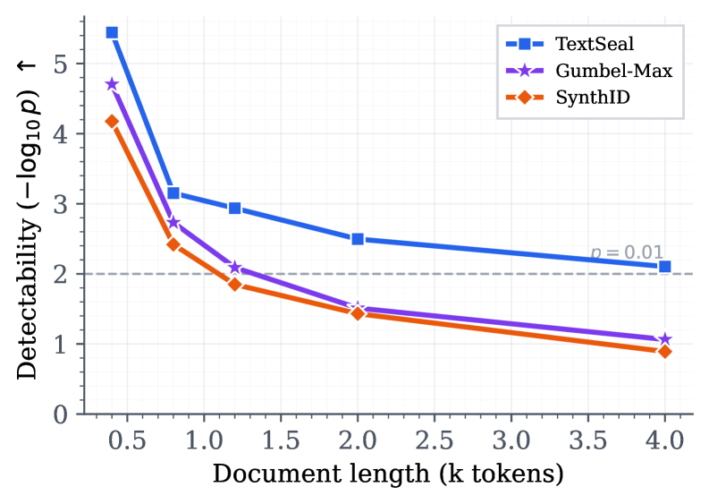
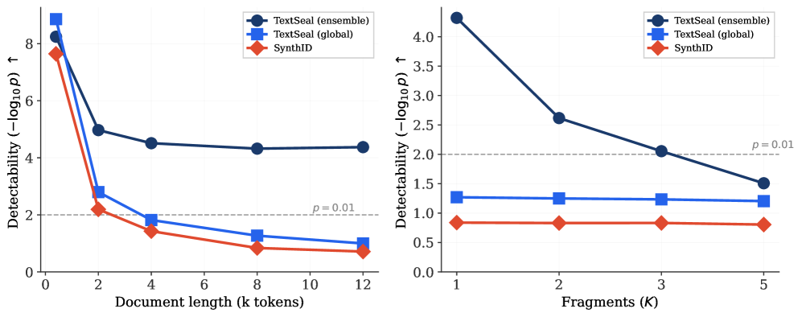

# TextSeal: A Localized LLM Watermark for Provenance & Distillation Protection

## 基本信息

- **arXiv ID:** [2605.12456v1](https://arxiv.org/abs/2605.12456v1)
- **作者:** Tom Sander, Hongyan Chang, Tomáš Souček et al.
- **发布日期:** 2026-05-12
- **分类:** cs.CR, cs.CL, cs.LG
- **PDF:** [arXiv PDF](https://arxiv.org/pdf/2605.12456v1)

## 关键图示

<figure><figcaption>Figure 1</figcaption></figure>
<figure><figcaption>Figure 2</figcaption></figure>
<figure><figcaption>Figure 3</figcaption></figure>

## 摘要

### English

We introduce TextSeal, a state-of-the-art watermark for large language models. Building on Gumbel-max sampling, TextSeal introduces dual-key generation to restore output diversity, along with entropy-weighted scoring and multi-region localization for improved detection. It supports serving optimizations such as speculative decoding and multi-token prediction, and does not add any inference overhead. TextSeal strictly dominates baselines like SynthID-text in detection strength and is robust to dilution, maintaining confident localized detection even in heavily mixed human/AI documents. The scheme is theoretically distortion-free, and evaluation across reasoning benchmarks confirms that it preserves downstream performance; while a multilingual human evaluation (6000 A/B comparisons, 5 languages) shows no perceptible quality difference. Beyond its use for provenance detection, TextSeal is also ``radioactive'': its watermark signal transfers through model distillation, enabling detection of unauthorized use.

### 中文

我们推出了 TextSeal，这是一种适用于大型语言模型的最先进的水印。 TextSeal 以 Gumbel-max 采样为基础，引入了双密钥生成来恢复输出多样性，并引入熵加权评分和多区域定位来改进检测。它支持推测性解码和多令牌预测等服务优化，并且不会增加任何推理开销。 TextSeal 在检测强度方面严格控制 SynthID-text 等基线，并且对稀释具有鲁棒性，即使在高度混合的人类/AI 文档中也能保持可靠的本地检测。该方案理论上是无失真的，并且跨推理基准的评估证实它保留了下游性能；而多语言人工评估（6000 次 A/B 比较，5 种语言）显示没有明显的质量差异。除了用于来源检测之外，TextSeal 还具有“放射性”：其水印信号通过模型蒸馏进行传输，从而能够检测未经授权的使用。

## 相关概念

- [大语言模型](../../concepts/large-language-model.html)
- [基准评估](../../concepts/benchmarking.html)
- [AI安全与对齐](../../concepts/ai-safety-alignment.html)

## 核心贡献

### English

TextSeal is a distortion-free LLM watermark that builds on Gumbel-max sampling with three key innovations: dual-key generation to restore output diversity (overcoming Gumbel-max's determinism), entropy-weighted scoring with moment-matched Gamma approximations for calibrated p-values, and multi-region localized detection that identifies watermarked segments even in heavily mixed human/AI documents. It strictly dominates SynthID-text in detection, is robust to 10× dilution, preserves downstream performance across 12 reasoning benchmarks, and shows no perceptible quality difference in a 6,000-comparison multilingual human evaluation. TextSeal is also "radioactive": its signal transfers through model distillation.

### 中文

TextSeal 是一种无失真的 LLM 水印方案，基于 Gumbel-max 采样并进行了三项关键创新：双密钥生成以恢复输出多样性（克服了 Gumbel-max 的确定性），熵加权评分搭配矩匹配 Gamma 近似实现校准的 p 值，以及多区域定位检测，即使在严重混合的人类/AI 文档中也能识别水印片段。它在检测上严格优于 SynthID-text，在 10 倍稀释下仍保持鲁棒性，在 12 个推理基准上保持下游性能，并在 6,000 次对比的多语言人类评估中未见明显质量差异。TextSeal 还具有「放射性」：其信号通过模型蒸馏转移。

## 方法概述

### English

Dual-key generation randomly alternates between two secret keys during token generation, restoring diversity while maintaining detectability. The detection test computes an entropy-weighted statistic from the Gumbel-max trick: the difference between the observed Gumbel sample and its expected value under the null. Localized detection searches over all subsegments using a geometric cover algorithm with multiple region lengths, finding the segment with the strongest watermark signal. The scheme adds ≤0.3% sampling overhead. It natively supports speculative decoding and multi-token prediction without additional latency.

### 中文

双密钥生成在 token 生成过程中随机在两个秘密密钥之间切换，恢复多样性的同时保持可检测性。检测测试根据 Gumbel-max 技巧计算熵加权统计量：观测到的 Gumbel 样本与其在零假设下的期望值之差。定位检测使用多区域长度的几何覆盖算法搜索所有子段，找到水印信号最强的段。该方案增加了 ≤0.3% 的采样开销。它原生支持推测解码和多 token 预测，无需额外延迟。

## 实验结果

### English

TextSeal strictly dominates SynthID-text across the diversity-detectability Pareto frontier on ELI5 generation (400 tokens, T=0.8). At 10× dilution (90% human text), localized detection maintains confident p-values (p<0.01) while global baselines fail. Across 12 reasoning benchmarks (AIME, MATH, GSM8K, HumanEval, MBPP, ARC, GPQA, HellaSwag, MMLU, SQA, WinoGrande) with Qwen3.5-27B, TextSeal preserves accuracy within ±1.5% of the no-watermark baseline. In 6,000 human A/B comparisons across 5 languages, TextSeal shows no statistically significant quality difference. Watermark transfer through distillation: a student model trained on watermarked outputs inherits a detectable signal (p<0.05 at 10M training tokens).

### 中文

TextSeal 在 ELI5 生成（400 token, T=0.8）的多样性-可检测性帕累托前沿上严格优于 SynthID-text。在 10 倍稀释（90% 人类文本）下，定位检测保持了可靠的 p 值（p<0.01），而全局基线失败。在 Qwen3.5-27B 的 12 个推理基准（AIME、MATH、GSM8K、HumanEval、MBPP、ARC、GPQA、HellaSwag、MMLU、SQA、WinoGrande）上，TextSeal 保持准确率在无水印基线的 ±1.5% 范围内。在跨 5 种语言的 6,000 次人类 A/B 比较中，TextSeal 未显示统计显著的质量差异。水印通过蒸馏转移：在水印输出上训练的学生模型继承了可检测信号（在 1000 万训练 token 时 p<0.05）。

## 局限性与注意点

### English

Detection requires access to the secret key(s), so it's not suitable for public/open detection scenarios. The dual-key approach trades some detection power for diversity — the detection gap vs. single-key Gumbel-max is visible at very short document lengths. The localized detection search over subsegments adds computational overhead at detection time. The radioactivity claim is demonstrated at moderate distillation scales; very large-scale distillation or aggressive data mixing may dilute the signal further. The watermark is designed for text-only LLM output; extension to code or structured data is not addressed.

### 中文

检测需要访问秘密密钥，因此不适用于公共/开放检测场景。双密钥方法以一定的检测能力换取多样性——在极短文档长度下，与单密钥 Gumbel-max 的检测差距是可见的。子段定位检测搜索在检测时增加了计算开销。放射性声明在中等蒸馏规模上得到证明；非常大规吸蒸馏或激进的数据混合可能进一步稀释信号。该水印专为纯文本 LLM 输出设计；扩展到代码或结构化数据未被讨论。

---
*导入时间: 2026-05-13 06:02*
*来源: arXiv Daily Wiki Update 2026-05-13*
