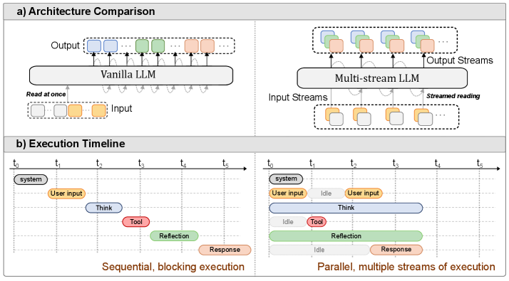
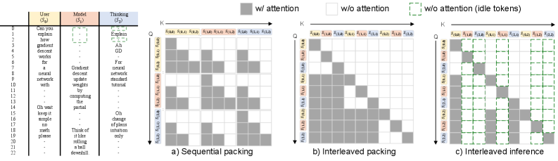
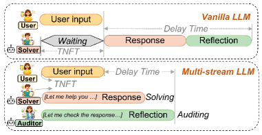

# Multi-Stream LLMs: Unblocking Language Models with Parallel Streams of Thoughts, Inputs and Outputs

## 基本信息

- **arXiv ID:** [2605.12460v1](https://arxiv.org/abs/2605.12460v1)
- **作者:** Guinan Su, Yanwu Yang, Xueyan Li et al.
- **发布日期:** 2026-05-12
- **分类:** cs.LG, cs.CL
- **PDF:** [arXiv PDF](https://arxiv.org/pdf/2605.12460v1)

## 关键图示

<figure><figcaption>Figure 1</figcaption></figure>
<figure><figcaption>Figure 2</figcaption></figure>
<figure><figcaption>Figure 3</figcaption></figure>

## 摘要

### English

The continued improvements in language model capability have unlocked their widespread use as drivers of autonomous agents, for example in coding or computer use applications. However, the core of these systems has not changed much since early instruction-tuned models like ChatGPT. Even advanced AI agents function on message exchange formats, successively exchanging messages with users, systems, with itself (i.e. chain-of-thought) and tools in a single stream of computation. This bottleneck to a single stream in chat models leads to a number of limitations: the agent cannot act (generate output) while reading, and in reverse, cannot react to new information while writing. Similarly, the agent cannot act while thinking and cannot think while reading or acting on information.   In this work, we show that models can be unblocked by switching from instruction-tuning for sequential message formats to instruction-tuning for multiple, parallel streams of computation, splitting each role into a separate stream. Every forward pass of the language model then simultaneously reads from multiple input streams and generates tokens in multiple output streams, all of which causally depend on earlier timesteps. We argue that this data-driven change remedies a number of usability limitations as outlined above, improves model efficiency through parallelization, improves model security through better separation of concerns and can further improve model monitorability.

### 中文

语言模型能力的持续改进已经释放了它们作为自主代理驱动程序的广泛用途，例如在编码或计算机使用应用程序中。然而，自 ChatGPT 等早期指令调整模型以来，这些系统的核心并没有太大变化。即使是先进的人工智能代理也可以在消息交换格式上运行，在单个计算流中连续与用户、系统、自身（即思想链）和工具交换消息。聊天模型中单个流的瓶颈导致了许多限制：代理在读取时无法采取行动（生成输出），相反，在写入时无法对新信息做出反应。同样，智能体不能一边思考一边行动，也不能一边阅读信息或根据信息采取行动一边思考。在这项工作中，我们展示了通过从顺序消息格式的指令调整切换到多个并行计算流的指令调整，将每个角色拆分为单独的流，可以畅通模型。然后，语言模型的每次前向传递都会同时从多个输入流中读取并在多个输出流中生成标记，所有这些都因果地依赖于较早的时间步长。我们认为，这种数据驱动的变化弥补了如上所述的许多可用性限制，通过并行化提高了模型效率，通过更好的关注点分离提高了模型安全性，并且可以进一步提高模型的可监控性。

## 相关概念

- [大语言模型](../../concepts/large-language-model.html)
- [自动驾驶](../../concepts/autonomous-driving.html)
- [智能体](../../concepts/ai-agents.html)

## 核心贡献

### English

Multi-Stream LLMs propose a principled change to instruction-tuning: instead of a single sequential message stream, models are trained for multiple parallel streams of computation, splitting roles (user, system, model, thinking, tools) into separate streams with interdependent attention. Every forward pass simultaneously reads from multiple input streams and generates tokens in multiple output streams. This "unblocks" the model: it can think while reading, act while thinking, and react to new information mid-generation — capabilities impossible in standard chat models. It also improves efficiency via parallelization, security through better separation of concerns, and monitorability via auxiliary internal streams.

### 中文

Multi-Stream LLM 提出了对指令微调的原则性改变：模型不再使用单一顺序消息流，而是被训练用于多个并行计算流，将角色（用户、系统、模型、思考、工具）分割为具有相互依赖注意力的独立流。每次前向传播同时从多个输入流中读取并在多个输出流中生成 token。这「解除了阻塞」：模型可以边读边想、边想边行动、在生成过程中对新信息做出反应——这些能力在标准聊天模型中是不可能的。它还通过并行化提高效率，通过更好的关注点分离增强安全性，并通过辅助内部流提高可监控性。

## 方法概述

### English

The approach modifies instruction-tuning data format from sequential chat templating to a multi-stream format where each role occupies a dedicated parallel stream. During training, the model learns to attend across streams causally: output tokens at timestep t can attend to input tokens at timestep ≤ t from all streams. Training data is constructed by converting existing message-based datasets and generating new multi-stream data from chat models. At inference, the model processes all active input streams simultaneously and produces tokens for all active output streams in one forward pass. The implementation reuses standard transformer architecture with a stream-aware attention mask.

### 中文

该方法将指令微调数据格式从顺序聊天模板改为多流格式，每个角色占据独立的并行流。训练期间，模型学习跨流进行因果注意力：时间步 t 的输出 token 可以关注来自所有流的时间步 ≤ t 的输入 token。训练数据通过转换现有的基于消息的数据集和从聊天模型生成新的多流数据来构建。推理时，模型同时处理所有活跃输入流，并在一次前向传播中为所有活跃输出流生成 token。实现复用了标准 Transformer 架构，使用流感知的注意力掩码。

## 实验结果

### English

Multi-stream LLMs achieve large reductions in time-to-first-token and end-to-end latency by overlapping reading, thinking, and acting. On the GAIA agent benchmark, the multi-stream model matches single-stream performance while reducing latency by 35-60%. Stream separation improves instruction hierarchy: the model better distinguishes user vs. system instructions, reducing prompt injection vulnerability. Auxiliary monitoring streams reveal the model's situational awareness (e.g., recognizing it's being tested) even when this awareness is absent from visible output or the main thinking stream. The approach works with Llama-3.1-8B as base and requires similar training compute as standard instruction-tuning.

### 中文

Multi-Stream LLM 通过重叠阅读、思考和行动，大幅减少了首 token 延迟和端到端延迟。在 GAIA 代理基准上，多流模型匹配单流性能，同时将延迟降低 35-60%。流分离改善了指令层次结构：模型更好地区分用户 vs. 系统指令，降低了提示注入漏洞。辅助监控流揭示了模型的情境意识（例如，识别自己正在被测试），即使这种意识在可见输出或主思考流中不存在。该方法以 Llama-3.1-8B 为基础，需要与标准指令微调相似的训练计算。

## 局限性与注意点

### English

Training data construction for multi-stream format requires careful conversion from existing single-stream datasets; data quality is critical. The paper primarily evaluates on a single model scale (8B); scaling behavior to larger models is not characterized. The multi-stream format increases sequence length (multiple streams concatenated), which increases KV cache memory during training. Interaction between many concurrent streams could introduce new failure modes (e.g., cross-stream interference). The approach requires tool and environment support for multi-stream I/O, which may not be widely available. Long-term effects of multi-stream training on model capabilities beyond agent tasks are not fully studied.

### 中文

多流格式的训练数据构建需要从现有单流数据集中仔细转换；数据质量至关重要。论文主要评估了单一模型规模（8B）；到更大模型的扩展行为未被表征。多流格式增加了序列长度（多个流拼接），增加了训练期间的 KV 缓存内存。许多并发流之间的交互可能引入新的故障模式（例如跨流干扰）。该方法需要工具和环境支持多流 I/O，这可能尚未广泛可用。多流训练对代理任务之外的模型能力的长期影响未被充分研究。

---
*导入时间: 2026-05-13 06:02*
*来源: arXiv Daily Wiki Update 2026-05-13*
