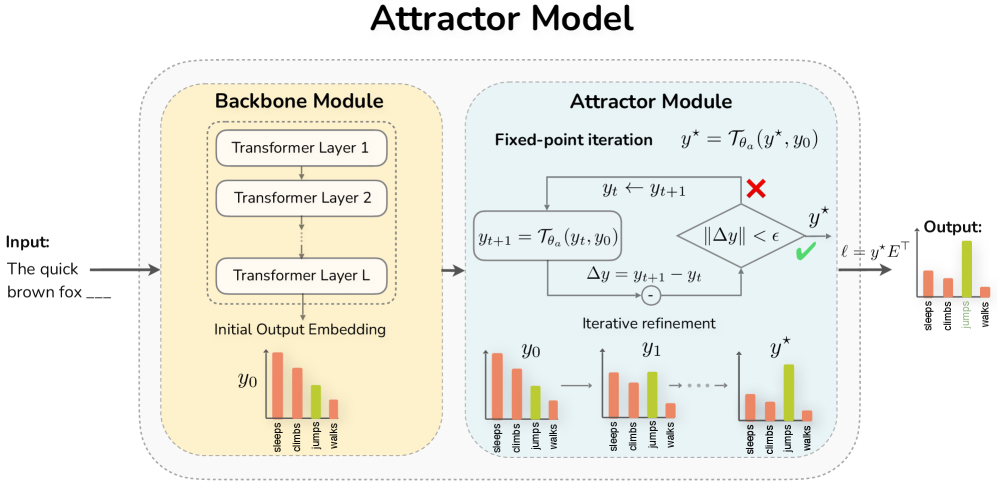
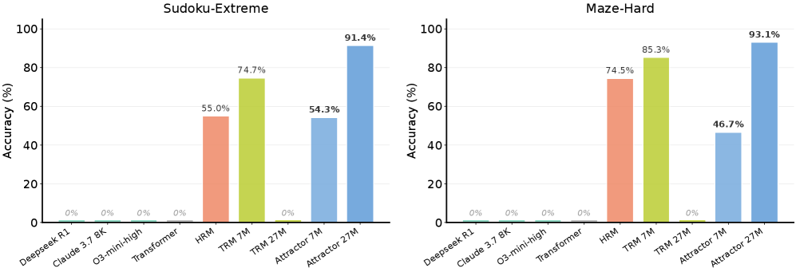

# Solve the Loop: Attractor Models for Language and Reasoning

## 基本信息

- **arXiv ID:** [2605.12466v1](https://arxiv.org/abs/2605.12466v1)
- **作者:** Jacob Fein-Ashley, Paria Rashidinejad
- **发布日期:** 2026-05-12
- **分类:** cs.LG, cs.AI, cs.CL, cs.NE
- **PDF:** [arXiv PDF](https://arxiv.org/pdf/2605.12466v1)

## 关键图示

<figure><figcaption>Figure 1</figcaption></figure>
<figure><figcaption>Figure 2</figcaption></figure>
<figure><figcaption>Figure 3</figcaption></figure>

## 摘要

### English

Looped Transformers offer a promising alternative to purely feed-forward computation by iteratively refining latent representations, improving language modeling and reasoning. Yet recurrent architectures remain unstable to train, costly to optimize and deploy, and constrained to small, fixed recurrence depths. We introduce Attractor Models, in which a backbone module first proposes output embeddings, then an attractor module refines them by solving for the fixed point, with gradients obtained through implicit differentiation. Thus, training memory remains constant in effective depth, and iterations are chosen adaptively by convergence. Empirically, Attractor Models outperform existing models across two regimes, large-scale language-model pretraining and reasoning with tiny models. In language modeling, Attractor Models deliver a Pareto improvement over standard Transformers and stable looped models across sizes, improving perplexity by up to 46.6% and downstream accuracy by up to 19.7% while reducing training cost. Notably, a 770M Attractor Model outperforms a 1.3B Transformer trained on twice as many tokens. On challenging reasoning tasks, we show that our model with only 27M parameters and approximately 1000 examples achieves 91.4% accuracy on Sudoku-Extreme and 93.1% on Maze-Hard, scaling favorably where frontier models like Claude and GPT o3, fail completely, and specialized recursive reasoners collapse at larger sizes. Lastly, we show that Attractor Models exhibit a novel phenomenon, which we call equilibrium internalization: fixed-point training places the model's initial output embedding near equilibrium, allowing the solver to be removed at inference time with little degradation. Together, these results suggest that Attractor Models make iterative refinement scalable by turning recurrence into a computation the model can learn to internalize.

### 中文

循环变压器通过迭代地细化潜在表示、改进语言建模和推理，为纯粹前馈计算提供了一种有前景的替代方案。然而，循环架构的训练仍然不稳定，优化和部署成本高昂，并且受限于较小的固定循环深度。我们引入吸引器模型，其中主干模块首先提出输出嵌入，然后吸引器模块通过求解固定点来细化它们，并通过隐式微分获得梯度。因此，训练记忆在有效深度上保持恒定，并且通过收敛自适应地选择迭代。根据经验，吸引子模型在大规模语言模型预训练和小型模型推理这两个方面都优于现有模型。在语言建模中，Attractor Models 比标准 Transformer 和不同规模的稳定循环模型提供了帕累托改进，将困惑度提高了 46.6%，下游准确度提高了 19.7%，同时降低了培训成本。值得注意的是，770M 吸引器模型的性能优于 1.3B Transformer，训练的令牌数量是后者的两倍。在具有挑战性的推理任务中，我们表明，我们的模型仅具有 27M 个参数和大约 1000 个示例，在 Sudoku-Extreme 上实现了 91.4% 的准确率，在 Maze-Hard 上实现了 93.1% 的准确率，在 Claude 和 GPT o3 等前沿模型完全失败以及专门的递归推理机在更大尺寸下崩溃的情况下，可以顺利扩展。最后，我们表明吸引子模型表现出一种新的现象，我们称之为平衡内化：定点训练使模型的初始输出嵌入接近平衡，从而允许求解器在推理时被移除，而几乎没有退化。总之，这些结果表明，吸引子模型通过将递归转化为模型可以学习内化的计算，使迭代细化具有可扩展性。

## 相关概念

- [大语言模型](../../concepts/large-language-model.html)

## 核心贡献

### English

Attractor Models introduce a novel architecture where a backbone Transformer proposes output embeddings and an attractor module refines them by solving for a fixed point, with gradients via implicit differentiation. Training memory stays constant regardless of effective depth, and iterations are chosen adaptively by convergence. A 770M Attractor Model outperforms a 1.3B Transformer trained on 2× more tokens. A 27M-parameter model achieves 91.4% on Sudoku-Extreme and 93.1% on Maze-Hard. The paper discovers "equilibrium internalization": after training, the solver can be removed at inference with little degradation because initial outputs are placed near equilibrium.

### 中文

Attractor 模型引入了一种新颖的架构，其中主干 Transformer 提出输出嵌入，吸引器模块通过求解不动点来优化它们，梯度通过隐式微分获得。训练内存与有效深度无关保持恒定，迭代次数由收敛自适应选择。770M 的 Attractor 模型优于在 2 倍 token 上训练的 1.3B Transformer。一个 27M 参数的模型在 Sudoku-Extreme 上达到 91.4%，在 Maze-Hard 上达到 93.1%。论文发现「平衡内化」现象：训练后，求解器在推理时可被移除而几乎无性能退化，因为初始输出已被置于平衡态附近。

## 方法概述

### English

The architecture has two components: a Backbone Module (standard Transformer decoder) that produces an initial output embedding y0, and an Attractor Module with cross-attention layers that iteratively refines yt → yt+1 = Tθ(y_t, y0) until convergence. Training uses implicit differentiation through the fixed point, so backpropagation memory is O(1) regardless of how many iterations convergence requires. The model is trained with a combination of next-token prediction loss and an auxiliary loss encouraging fast convergence. At inference, fixed-point iteration runs until ∥y_{t+1} - y_t∥ < ε or a max iteration limit. For equilibrium internalization, the solver is removed entirely.

### 中文

架构有两个组件：主干模块（标准 Transformer 解码器）生成初始输出嵌入 y0，以及带有交叉注意力层的吸引器模块，迭代优化 yt → yt+1 = Tθ(y_t, y0) 直到收敛。训练通过不动点的隐式微分进行，因此无论收敛需要多少次迭代，反向传播内存均为 O(1)。模型结合了下一 token 预测损失和鼓励快速收敛的辅助损失进行训练。推理时，不动点迭代运行直到 ∥y_{t+1} - y_t∥ < ε 或达到最大迭代限制。对于平衡内化，求解器被完全移除。

## 实验结果

### English

In language modeling, Attractor Models achieve Pareto improvement over Transformers: a 770M Attractor Model delivers lower perplexity than a 1.3B Transformer trained on 2× more tokens, reducing perplexity by up to 46.6% and improving downstream accuracy by up to 19.7%. On reasoning: a 27M Attractor Model achieves 91.4% on Sudoku-Extreme and 93.1% on Maze-Hard, where Claude and GPT o3 score near 0%, and specialized recursive reasoners (HRM, TRM) collapse at larger sizes. Equilibrium internalization: removing the solver at inference causes only 1-3% degradation on reasoning tasks, with no degradation on language modeling.

### 中文

在语言建模中，Attractor 模型实现了对 Transformer 的帕累托改进：770M 的 Attractor 模型困惑度低于在 2 倍 token 上训练的 1.3B Transformer，困惑度降低高达 46.6%，下游准确率提升高达 19.7%。在推理上：27M 的 Attractor 模型在 Sudoku-Extreme 上达到 91.4%，在 Maze-Hard 上达到 93.1%，而 Claude 和 GPT o3 得分接近 0%，专门的递归推理器（HRM、TRM）在更大规模上崩溃。平衡内化：在推理时移除求解器仅导致推理任务上 1-3% 性能退化，语言建模上无退化。

## 局限性与注意点

### English

The attractor module adds parameters and inference-time iteration overhead; for language modeling the solver typically requires 4-6 iterations. The implicit differentiation training is more complex to implement than standard backpropagation. The reasoning results are on synthetic puzzles (Sudoku, Maze) with 1000 training examples; generalization to natural language reasoning tasks is not demonstrated. The architecture requires careful tuning of convergence threshold and max iterations. The interaction between the backbone's next-token prediction and the attractor's refinement is not fully ablated. The model has not been tested at scales beyond 1.3B-equivalent.

### 中文

吸引器模块增加了参数和推理时迭代开销；对于语言建模，求解器通常需要 4-6 次迭代。隐式微分训练比标准反向传播实现更复杂。推理结果基于合成谜题（数独、迷宫）和 1000 个训练样例；对自然语言推理任务的泛化能力未被证明。该架构需要仔细调整收敛阈值和最大迭代次数。主干的下一个 token 预测与吸引器的优化之间的交互未被完全消融。模型尚未在 1.3B 等效规模以上进行测试。

---
*导入时间: 2026-05-13 06:02*
*来源: arXiv Daily Wiki Update 2026-05-13*
