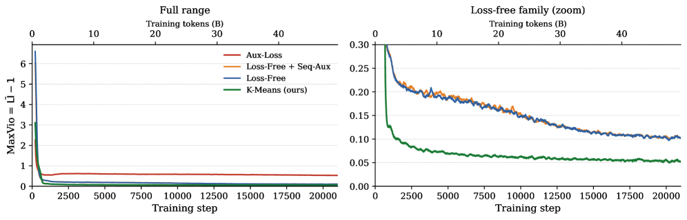
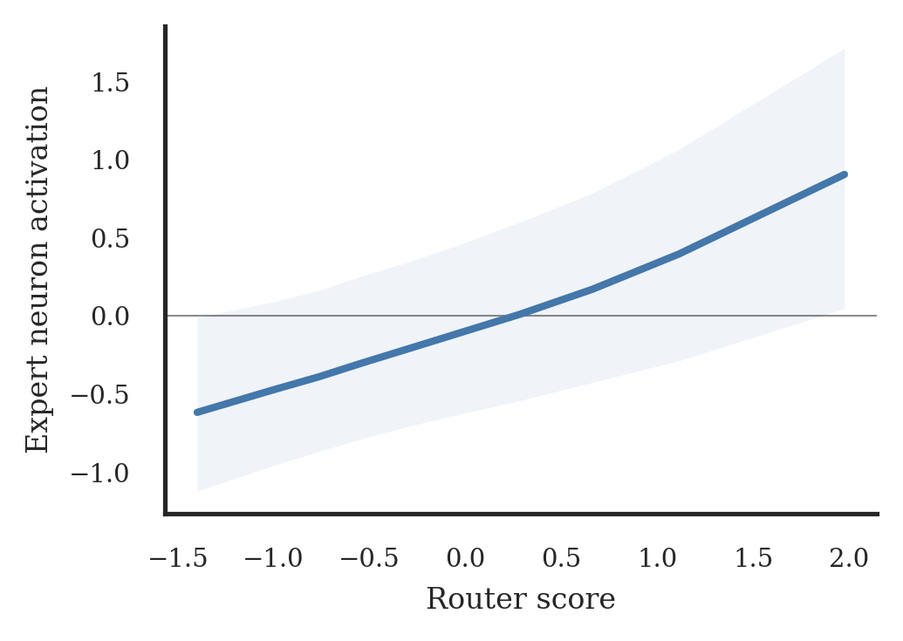

# Routers Learn the Geometry of Their Experts: Geometric Coupling in Sparse Mixture-of-Experts

## 基本信息

- **arXiv ID:** [2605.12476v1](https://arxiv.org/abs/2605.12476v1)
- **作者:** Sagi Ahrac, Noya Hochwald, Mor Geva
- **发布日期:** 2026-05-12
- **分类:** cs.LG, cs.CL
- **PDF:** [arXiv PDF](https://arxiv.org/pdf/2605.12476v1)

## 关键图示

<figure><figcaption>Figure 1</figcaption></figure>
<figure><figcaption>Figure 2</figcaption></figure>
<figure><figcaption>Figure 3</figcaption></figure>

## 摘要

### English

Sparse Mixture-of-Experts (SMoE) models enable scaling language models efficiently, but training them remains challenging, as routing can collapse onto few experts and auxiliary load-balancing losses can reduce specialization. Motivated by these hurdles, we study how routing decisions in SMoEs are formed mechanistically. First, we reveal a geometric coupling between routers and their corresponding experts. For a given token, the router weights for the selected expert and the expert weights processing it receive gradients along the same input direction, differing only in scalar coefficients. Thus, matched router--expert directions accumulate the same routed token history. This theoretical coupling also appears empirically in routing dynamics. In a $1$B SMoE trained from scratch, higher router scores predict stronger expert neuron activations, showing that routing decisions are mirrored inside the selected expert. Next, we analyze the effects of auxiliary load balancing on the router--expert geometric coupling, showing that such losses break this structure by spreading input-directed gradients across router weights, making distinct router directions nearly three times more similar to each other. Last, we demonstrate the centrality of geometric coupling for effective routing with a parameter-free online K-Means router, in which each expert maintains a running average of the hidden states routed to it and tokens are assigned based on cosine similarity. Compared with auxiliary-loss and loss-free balancing, this router achieves the lowest load imbalance with only a modest perplexity increase, indicating that geometric coupling captures a substantial part of what the router learns. Overall, our results explain how routers form assignment geometry that supports an effective division of labor.

### 中文

稀疏专家混合 (SMoE) 模型可以有效地扩展语言模型，但训练它们仍然具有挑战性，因为路由可能会崩溃到少数专家身上，而辅助负载平衡损失可能会减少专业化。受这些障碍的推动，我们研究了 SMoE 中的路由决策是如何机械形成的。首先，我们揭示了路由器及其相应专家之间的几何耦合。对于给定的令牌，所选专家的路由器权重和处理它的专家权重沿着相同的输入方向接收梯度，仅标量系数不同。因此，匹配的路由器专家方向会累积相同的路由令牌历史记录。这种理论上的耦合也以经验的形式出现在路由动态中。在从头开始训练的 $1$B SMoE 中，较高的路由器分数预示着更强的专家神经元激活，这表明路由决策反映在所选专家内部。接下来，我们分析了辅助负载平衡对路由器-专家几何耦合的影响，表明这种损失通过在路由器权重上传播输入导向的梯度来打破这种结构，使不同的路由器方向彼此相似近三倍。最后，我们证明了几何耦合对于使用无参数在线 K-Means 路由器进行有效路由的中心性，其中每个专家维护路由到它的隐藏状态的运行平均值，并根据余弦相似度分配令牌。与辅助损耗和无损耗平衡相比，该路由器实现了最低的负载不平衡，而困惑度仅略有增加，这表明几何耦合捕获了路由器学习内容的很大一部分。总的来说，我们的结果解释了路由器如何形成支持有效分工的分配几何结构。

## 相关概念

- [大语言模型](../../concepts/large-language-model.html)
- [基准评估](../../concepts/benchmarking.html)
- [世界模型](../../concepts/world-models.html)

## 核心贡献

### English

This paper reveals a geometric coupling mechanism between routers and experts in Sparse Mixture-of-Experts (SMoE) models, where matched router-expert pairs receive gradient updates along the same input direction and accumulate shared routed-token history. It shows empirically that routing decisions are reflected inside experts (higher router scores predict stronger neuron activations). It further demonstrates that auxiliary load-balancing losses break this coupling, making distinct router directions ~3× more similar. Building on this insight, a parameter-free online K-Means router achieves the lowest load imbalance with only modest perplexity increase.

### 中文

本文揭示了稀疏专家混合（SMoE）模型中路由器与专家之间的几何耦合机制——匹配的路由器-专家对沿相同输入方向接收梯度更新，并积累共享的路由 token 历史。实证表明路由决策反映在专家内部（更高的路由器分数预测更强的神经元激活）。进一步证明辅助负载均衡损失会破坏这种耦合，使不同的路由器方向彼此相似约 3 倍。基于这一洞察，无参数的在线 K-Means 路由器实现了最低的负载不平衡，仅伴随轻微的困惑度增加。

## 方法概述

### English

The analysis starts from the chain rule through SMoE layers: for a token x routed to expert i, both the router weight ri and expert input weights W_i^gate, W_i^up receive gradients proportional to x, differing only in scalar coefficients. Over training, matched ri and expert rows evolve as coupled accumulators. Empirical validation trains a 1B SMoE from scratch (~50B tokens) and compares router scores against expert gate-neuron activations. The online K-Means router replaces learned router weights with running EMA centroids per expert, routing tokens by cosine similarity with sign-updated biases for load balancing.

### 中文

分析从 SMoE 层的链式法则开始：对于路由到专家 i 的 token x，路由器权重 ri 和专家输入权重 W_i^gate、W_i^up 均接收与 x 成比例的梯度，仅在标量系数上不同。训练过程中，匹配的 ri 和专家行作为耦合累加器演化。实证验证从头训练一个 1B SMoE（约 500 亿 token），并比较路由器分数与专家门控神经元激活。在线 K-Means 路由器用每个专家的运行 EMA 质心替代学习的路由器权重，通过余弦相似度路由 token，并使用符号更新的偏置进行负载均衡。

## 实验结果

### English

Higher router scores strongly predict stronger expert neuron activations in the selected expert, confirming geometric coupling empirically. Auxiliary load balancing makes distinct router vector directions ~3× more similar (higher cosine similarity), eroding specialization. The online K-Means centroid router achieves the lowest load imbalance (Std=0.008 vs. 0.015 for auxiliary-loss and 0.018 for loss-free), with only a 2.2% perplexity increase over the loss-free router and competitive with the auxiliary-loss router. The centroid router shows natural coupling: its cosine similarity between router direction and expert activation direction is highest.

### 中文

更高的路由器分数强烈预测所选专家中更强的神经元激活，实证确认了几何耦合。辅助负载均衡使不同的路由器向量方向相似约 3 倍（更高的余弦相似度），侵蚀了专业化。在线 K-Means 质心路由器实现了最低的负载不平衡（标准差 0.008 vs. 辅助损失 0.015 和无损失 0.018），困惑度仅比无损失路由器增加 2.2%，与辅助损失路由器相当。质心路由器显示自然的耦合：其路由器方向与专家激活方向之间的余弦相似度最高。

## 局限性与注意点

### English

Experiments are conducted on a single 1B SMoE scale trained on ~50B tokens — the findings may not fully transfer to much larger production SMoEs (e.g., DeepSeek-V3 at 671B). The centroid K-Means router introduces a small but non-zero perplexity increase. The analysis focuses on feed-forward SMoE layers in the Transformer; attention-based MoE is not studied. The training duration is relatively short by modern standards. The centroid router requires storing running averages for each expert, adding memory overhead. The paper does not explore whether geometric coupling can be explicitly enforced as a training objective.

### 中文

实验仅在单个 1B SMoE 规模上训练约 500 亿 token —— 发现可能不完全适用于更大的生产级 SMoE（如 671B 的 DeepSeek-V3）。质心 K-Means 路由器引入了小而不可忽略的困惑度增加。分析聚焦于 Transformer 中的前馈 SMoE 层；未研究基于注意力的 MoE。训练时长按现代标准相对较短。质心路由器需要为每个专家存储运行平均值，增加了内存开销。论文未探索是否可以将几何耦合作为显式的训练目标。

---
*导入时间: 2026-05-13 06:02*
*来源: arXiv Daily Wiki Update 2026-05-13*
