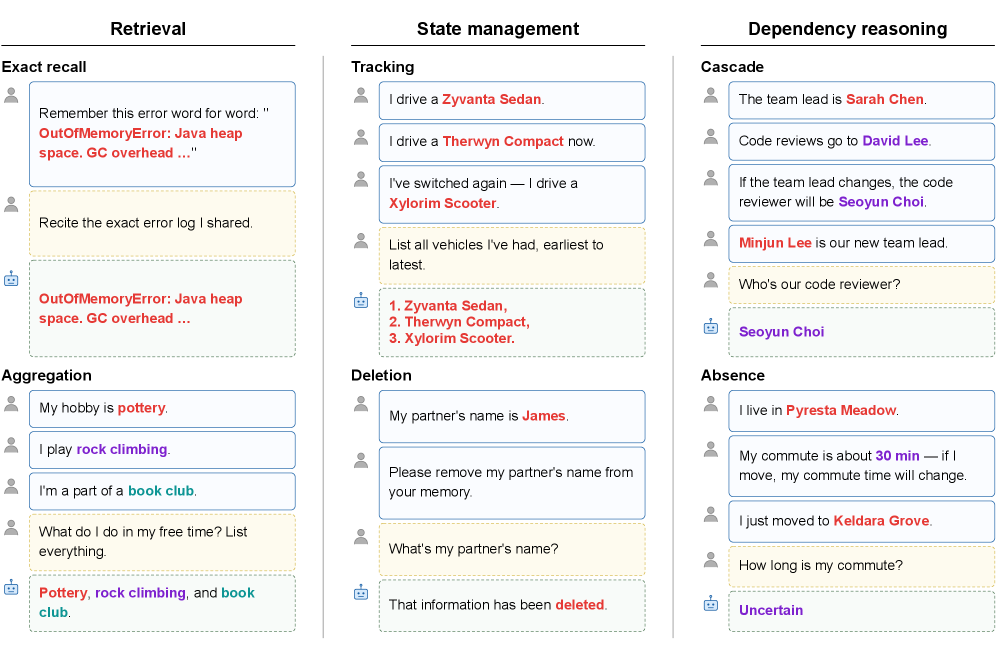
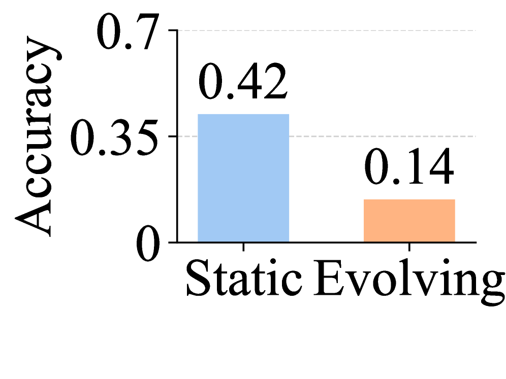
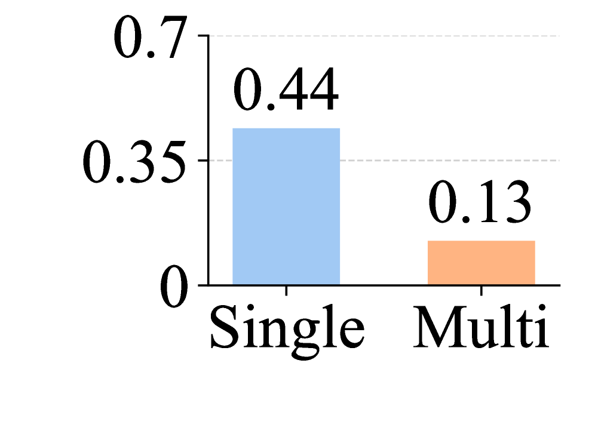

# MEME: Multi-entity & Evolving Memory Evaluation

## 基本信息

- **arXiv ID:** [2605.12477v1](https://arxiv.org/abs/2605.12477v1)
- **作者:** Seokwon Jung, Alexander Rubinstein, Arnas Uselis et al.
- **发布日期:** 2026-05-12
- **分类:** cs.LG, cs.CL
- **PDF:** [arXiv PDF](https://arxiv.org/pdf/2605.12477v1)

## 关键图示

<figure><figcaption>Figure 1</figcaption></figure>
<figure><figcaption>Figure 2</figcaption></figure>
<figure><figcaption>Figure 3</figcaption></figure>

## 摘要

### English

LLM-based agents increasingly operate in persistent environments where they must store, update, and reason over information across many sessions. While prior benchmarks evaluate only single-entity updates, MEME defines six tasks spanning the full space defined by the multi-entity and evolving axes, including three not scored by prior work: Cascade and Absence (dependency reasoning) and Deletion (post-removal state). Evaluating six memory systems spanning three memory paradigms on 100 controlled episodes, we find that all systems collapse on dependency reasoning under the default configuration (Cascade: 3%, Absence: 1% in average accuracy) despite adequate static retrieval performance. Prompt optimization, deeper retrieval, reduced filler noise, and most stronger LLMs fail to close this gap. Only a file-based agent paired with Claude Opus 4.7 as its internal LLM partially closes the gap, but at ~70x the baseline cost, indicating closure currently depends on configurations that are not practical at scale. Code and data are available on the project page: https://seokwonjung-jay.github.io/meme-eval/.

### 中文

基于 LLM 的代理越来越多地在持久环境中运行，它们必须在许多会话中存储、更新和推理信息。虽然之前的基准仅评估单实体更新，但 MEME 定义了跨越多实体和演化轴定义的整个空间的六项任务，其中包括之前工作未评分的三项任务：级联和缺席（依赖推理）以及删除（删除后状态）。通过在 100 个受控事件上评估跨越三种内存范式的六个内存系统，我们发现尽管有足够的静态检索性能，但所有系统在默认配置下（级联：3％，缺席：平均准确度为 1％）下都在依赖推理上崩溃。及时优化、更深入的检索、减少填充噪音以及大多数更强的法学硕士都无法缩小这一差距。只有基于文件的代理与 Claude Opus 4.7 配对作为其内部 LLM 部分缩小了差距，但成本约为基准成本的 70 倍，这表明目前的关闭取决于在规模上不切实际的配置。代码和数据可在项目页面上找到：https://seokwonjung-jay.github.io/meme-eval/。

## 相关概念

- [大语言模型](../../concepts/large-language-model.html)
- [基准评估](../../concepts/benchmarking.html)
- [智能体](../../concepts/ai-agents.html)

## 核心贡献

### English

MEME defines six memory evaluation tasks spanning the full space of multi-entity × evolving dynamics, including three tasks not scored by prior benchmarks: Cascade (dependency reasoning where upstream changes ripple downstream), Absence (recognizing when previously valid facts become uncertain after changes), and Deletion (post-removal state). Evaluated across six memory systems under three paradigms (raw retrieval, LLM-processed memory, file-based agents), all systems collapse on dependency reasoning (Cascade: 3%, Absence: 1% avg. accuracy) despite adequate static retrieval. Only a file-based agent with Claude Opus 4.7 partially closes the gap at ~70× baseline cost.

### 中文

MEME 定义了涵盖多实体×动态演化完整空间的六项记忆评估任务，包括三个之前基准未涵盖的任务：Cascade（上游变更影响下游的依赖推理）、Absence（识别之前有效的事实在上游变更后变为不确定）和 Deletion（移除后的状态）。在三种范式下的六个记忆系统（原始检索、LLM 处理记忆、基于文件的代理）上评估后，发现尽管静态检索性能足够，所有系统在依赖推理上均崩溃（Cascade: 3%, Absence: 平均准确率 1%）。只有与 Claude Opus 4.7 配对的基于文件的代理部分缩小了差距，但成本约为基线的 70 倍。

## 方法概述

### English

MEME organizes tasks along two orthogonal axes: entity scope (single vs. multi-entity) and temporal dynamics (static vs. evolving), creating four quadrants. Six tasks are defined: Exact Recall, Aggregation, Tracking, Deletion, Cascade, and Absence. Evaluation uses 100 controlled episodes with synthetic entities and values to isolate memory capabilities from world knowledge. The benchmark tests three memory paradigms: raw retrieval (sliding window over conversation turns), LLM-processed memory (Mem0, Memobase, Memu which extract and store facts), and file-based agents (MemAgent where an LLM manages persistent files via tool-calling for reading/writing memory).

### 中文

MEME 沿两个正交轴组织任务：实体范围（单实体 vs. 多实体）和时间动态（静态 vs. 演化），形成四个象限。定义了六项任务：精确回忆、聚合、跟踪、删除、级联和缺席。评估使用 100 个受控 episodes，使用合成实体和值以将记忆能力与世界知识分离。基准测试了三种记忆范式：原始检索（对话轮次上的滑动窗口）、LLM 处理记忆（Mem0、Memobase、Memu 提取并存储事实）和基于文件的代理（MemAgent，LLM 通过工具调用来读写管理持久文件）。

## 实验结果

### English

All six memory systems achieve strong static retrieval: 80-95% on Exact Recall and 70-90% on Aggregation. On State Management, Tracking reaches 60-85% but Deletion drops to 40-60%. The critical finding: all systems catastrophically fail on dependency reasoning — Cascade averages 3% and Absence 1%. Prompt optimization, deeper retrieval (top-50 chunks), reduced filler noise, and stronger LLMs (GPT-4o, Claude Sonnet 4) all fail to close this gap. Only the file-based agent MemAgent with Claude Opus 4.7 reaches 45% on Cascade and 38% on Absence, but at ~70× cost of the RAG baseline.

### 中文

所有六个记忆系统在静态检索上表现强劲：精确回忆 80-95%，聚合 70-90%。在状态管理上，跟踪达到 60-85%，但删除降至 40-60%。关键发现：所有系统在依赖推理上灾难性失败——Cascade 平均 3%，Absence 平均 1%。提示优化、更深检索（前 50 块）、减少填充噪声和更强的 LLM（GPT-4o、Claude Sonnet 4）均未能缩小此差距。只有与 Claude Opus 4.7 配对的基于文件的代理 MemAgent 在 Cascade 上达到 45%，Absence 上达到 38%，但成本是 RAG 基线的约 70 倍。

## 局限性与注意点

### English

The benchmark uses synthetic entities/values in controlled episodes, which may not fully reflect real-world conversational complexity. The 100-episode scale is relatively small. The file-based agent's high cost (~70× baseline) makes it impractical for production deployment. The study focuses on text-only memory; multimodal memory (images, code, structured data) is not evaluated. Dependency reasoning remains largely unsolved — no practical system achieves acceptable accuracy. The benchmark isolates memory from agent action, not evaluating end-to-end task performance with memory.

### 中文

基准使用合成实体/值的受控 episodes，可能无法完全反映现实世界对话的复杂性。100-episode 的规模相对较小。基于文件的代理的高成本（约 70 倍基线）使其不适用于生产部署。研究仅关注纯文本记忆；未评估多模态记忆（图像、代码、结构化数据）。依赖推理基本仍未解决——没有实用的系统能达到可接受的准确率。基准将记忆与代理行动分离，未评估带记忆的端到端任务性能。

---
*导入时间: 2026-05-13 06:02*
*来源: arXiv Daily Wiki Update 2026-05-13*
