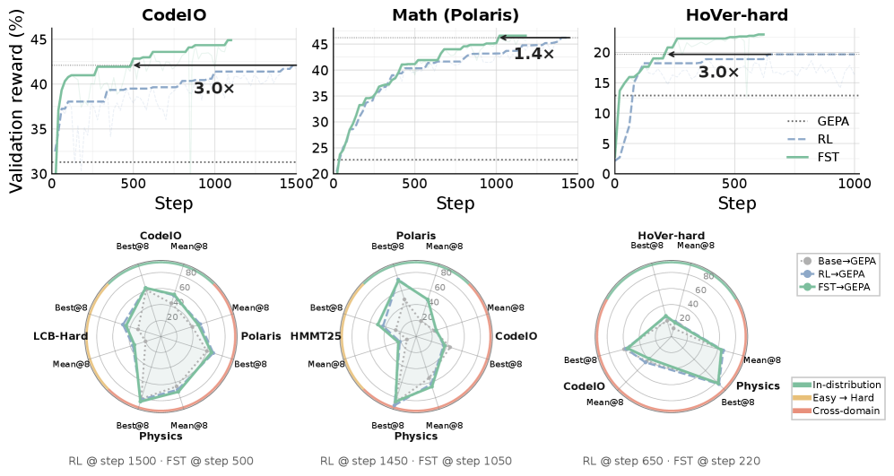
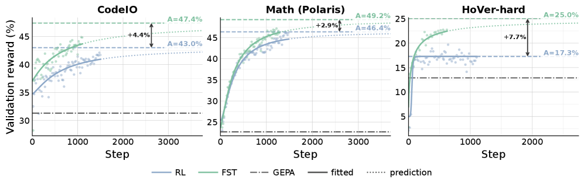

# Learning, Fast and Slow: Towards LLMs That Adapt Continually

## 基本信息

- **arXiv ID:** [2605.12484v1](https://arxiv.org/abs/2605.12484v1)
- **作者:** Rishabh Tiwari, Kusha Sareen, Lakshya A Agrawal et al.
- **发布日期:** 2026-05-12
- **分类:** cs.LG, cs.AI
- **PDF:** [arXiv PDF](https://arxiv.org/pdf/2605.12484v1)

## 关键图示

<figure><figcaption>Figure 1</figcaption></figure>
<figure><figcaption>Figure 2</figcaption></figure>
<figure><figcaption>Figure 3</figcaption></figure>

## 摘要

### English

Large language models (LLMs) are trained for downstream tasks by updating their parameters (e.g., via RL). However, updating parameters forces them to absorb task-specific information, which can result in catastrophic forgetting and loss of plasticity. In contrast, in-context learning with fixed LLM parameters can cheaply and rapidly adapt to task-specific requirements (e.g., prompt optimization), but cannot by itself typically match the performance gains available through updating LLM parameters. There is no good reason for restricting learning to being in-context or in-weights. Moreover, humans also likely learn at different time scales (e.g., System 1 vs 2). To this end, we introduce a fast-slow learning framework for LLMs, with model parameters as "slow" weights and optimized context as "fast" weights. These fast "weights" can learn from textual feedback to absorb the task-specific information, while allowing slow weights to stay closer to the base model and persist general reasoning behaviors. Fast-Slow Training (FST) is up to 3x more sample-efficient than only slow learning (RL) across reasoning tasks, while consistently reaching a higher performance asymptote. Moreover, FST-trained models remain closer to the base LLM (up to 70% less KL divergence), resulting in less catastrophic forgetting than RL-training. This reduced drift also preserves plasticity: after training on one task, FST trained models adapt more effectively to a subsequent task than parameter-only trained models. In continual learning scenarios, where task domains change on the fly, FST continues to acquire each new task while parameter-only RL stalls.

### 中文

大型语言模型 (LLM) 通过更新其参数（例如，通过 RL）来针对下游任务进行训练。然而，更新参数迫使它们吸收特定于任务的信息，这可能会导致灾难性的遗忘和可塑性的丧失。相比之下，使用固定 LLM 参数的上下文学习可以廉价且快速地适应特定于任务的要求（例如，即时优化），但其本身通常无法与通过更新 LLM 参数获得的性能增益相匹配。没有充分的理由将学习限制在上下文中或权重中。此外，人类也可能在不同的时间尺度上学习（例如，系统 1 与系统 2）。为此，我们为法学硕士引入了快慢学习框架，其中模型参数作为“慢”权重，优化上下文作为“快”权重。这些快速“权重”可以从文本反馈中学习以吸收特定于任务的信息，同时允许慢速权重更接近基本模型并持续一般推理行为。在推理任务中，快慢训练 (FST) 的样本效率比仅慢速学习 (RL) 高出 3 倍，同时始终达到更高的性能渐近线。此外，FST 训练的模型仍然更接近基础 LLM（KL 散度减少 70%），从而比 RL 训练产生更少的灾难性遗忘。这种减少的漂移还保留了可塑性：在一项任务训练后，FST 训练的模型比仅参数训练的模型更有效地适应后续任务。 In continual learning scenarios, where task domains change on the fly, FST continues to acquire each new task while parameter-only RL stalls.

## 相关概念

- [大语言模型](../../concepts/large-language-model.html)
- [强化学习](../../concepts/reinforcement-learning.html)

## 核心贡献

### English

Fast-Slow Training (FST) introduces a dual-timescale learning framework for LLMs: model parameters as "slow" weights (updated via RL) and optimized textual context as "fast" weights (updated via reflective prompt optimization). Fast weights absorb task-specific information from rich textual feedback while slow weights stay closer to the base model, persisting general reasoning behaviors. FST is up to 3× more sample-efficient than RL-only training, reaches a higher performance asymptote, reduces KL divergence from the base model by up to 70% (less catastrophic forgetting), preserves plasticity for subsequent tasks, and enables continual learning where RL-only methods stall.

### 中文

快速-慢速训练（FST）为 LLMs 引入了双时间尺度学习框架：模型参数作为「慢」权重（通过 RL 更新），优化的文本上下文作为「快」权重（通过反思性提示优化更新）。快权重从丰富的文本反馈中吸收任务特定信息，而慢权重更接近基础模型，保持通用推理行为。FST 的样本效率比纯 RL 训练高 3 倍，达到更高的性能渐近线，将相对基础模型的 KL 散度降低高达 70%（减少灾难性遗忘），保持后续任务的可塑性，并在纯 RL 方法停滞时实现持续学习。

## 方法概述

### English

FST interleaves slow RL updates (Group Relative Policy Optimization, GRPO) with fast context optimization (GEPA — reflective evolutionary prompt optimization). The slow loop updates model parameters θ using scalar rewards from rollouts. The fast loop consumes the full rollout text (thoughts, tool calls, errors, feedback) and optimizes a diverse population of textual contexts Φ. Rather than a single best prompt, Φ is maintained as a Pareto frontier population, allowing different contexts to specialize to different problem slices. The slow update sees rich conditioning from diverse fast contexts during training. The framework is evaluated in RLVR settings spanning math, code, and general reasoning.

### 中文

FST 交替进行慢 RL 更新（群组相对策略优化 GRPO）和快上下文优化（GEPA——反思性进化提示优化）。慢循环使用 rollout 的标量奖励更新模型参数 θ。快循环消费完整的 rollout 文本（思考、工具调用、错误、反馈）并优化多样化的文本上下文群体 Φ。Φ 不维持单一最佳提示，而是作为帕累托前沿群体维护，允许不同上下文专注于不同的问题切片。慢更新在训练期间从多样化的快上下文中获得丰富的条件信息。该框架在涵盖数学、代码和通用推理的 RLVR 设置中进行评估。

## 实验结果

### English

FST is up to 3× more sample-efficient: it matches RL-only reward with 1/3 the rollouts across math (GSM8K, MATH), code (APPS, LiveCodeBench), and science (GPQA) tasks, and consistently reaches a higher performance ceiling. At matched reward, FST-trained models show up to 70% lower KL divergence from the base model vs. RL-only. Plasticity preservation: after training on task A, FST models adapt to task B effectively, while RL-only models collapse to near 0% performance. In continual learning with changing task domains, FST continues acquiring each new task while RL-only plateaus. The Pareto population of fast contexts provides diverse conditioning that improves slow-weight generalization.

### 中文

FST 的样本效率高达 3 倍：在数学（GSM8K、MATH）、代码（APPS、LiveCodeBench）和科学（GPQA）任务上，FST 用 1/3 的 rollout 匹配纯 RL 奖励，并始终达到更高的性能上限。在匹配奖励下，FST 训练的模型相对基础模型的 KL 散度比纯 RL 低 70%。可塑性保持：在任务 A 上训练后，FST 模型有效适应任务 B，而纯 RL 模型崩溃至接近 0% 性能。在任务域变化的持续学习中，FST 继续习得每个新任务，而纯 RL 停滞不前。快上下文的帕累托群体提供多样化条件，改善了慢权重的泛化能力。

## 局限性与注意点

### English

FST requires both RL training infrastructure and prompt optimization infrastructure, increasing system complexity. The fast context optimization (GEPA) adds computational overhead per slow-update step. The framework is evaluated on reasoning tasks with verifiable rewards; extension to tasks with learned reward models or human preferences is not explored. The Pareto population of fast contexts grows memory requirements linearly with population size. The interaction between fast and slow learning rates has not been extensively ablated. Scaling to very large models (70B+) and very long training horizons is not demonstrated.

### 中文

FST 同时需要 RL 训练基础设施和提示优化基础设施，增加了系统复杂性。快上下文优化（GEPA）在每个慢更新步骤增加了计算开销。该框架在具有可验证奖励的推理任务上评估；扩展到具有学习奖励模型或人类偏好的任务尚未探索。快上下文的帕累托群体使内存需求随群体大小线性增长。快慢学习率之间的交互未被广泛消融。扩展到非常大模型（70B+）和极长训练周期未被证明。

---
*导入时间: 2026-05-13 06:02*
*来源: arXiv Daily Wiki Update 2026-05-13*
