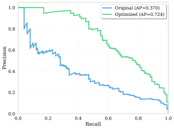
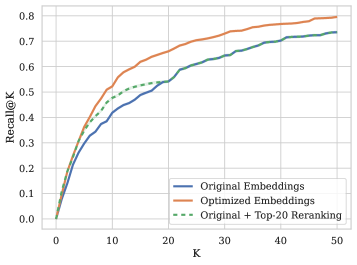

# Task-Adaptive Embedding Refinement via Test-time LLM Guidance

## 基本信息

- **arXiv ID:** [2605.12487v1](https://arxiv.org/abs/2605.12487v1)
- **作者:** Ariel Gera, Shir Ashury-Tahan, Gal Bloch et al.
- **发布日期:** 2026-05-12
- **分类:** cs.CL, cs.IR, cs.LG
- **PDF:** [arXiv PDF](https://arxiv.org/pdf/2605.12487v1)

## 关键图示

<figure><figcaption>Figure 1</figcaption></figure>
<figure><figcaption>Figure 2</figcaption></figure>
<figure><figcaption>Figure 3</figcaption></figure>

## 摘要

### English

We explore the effectiveness of an LLM-guided query refinement paradigm for extending the usability of embedding models to challenging zero-shot search and classification tasks. Our approach refines the embedding representation of a user query using feedback from a generative LLM on a small set of documents, enabling embeddings to adapt in real time to the target task. We conduct extensive experiments with state-of-the-art text embedding models across a diverse set of challenging search and classification benchmarks. Empirical results indicate that LLM-guided query refinement yields consistent gains across all models and datasets, with relative improvements of up to +25% in literature search, intent detection, key-point matching, and nuanced query-instruction following. The refined queries improve ranking quality and induce clearer binary separation across the corpus, enabling the embedding space to better reflect the nuanced, task-specific constraints of each ad-hoc user query. Importantly, this expands the range of practical settings in which embedding models can be effectively deployed, making them a compelling alternative when costly LLM pipelines are not viable at corpus-scale. We release our experimental code for reproducibility, at https://github.com/IBM/task-aware-embedding-refinement.

### 中文

我们探索了法学硕士引导的查询细化范式的有效性，以扩展嵌入模型的可用性以应对零样本搜索和分类任务。我们的方法使用来自生成式 LLM 对一小组文档的反馈来细化用户查询的嵌入表示，使嵌入能够实时适应目标任务。我们在一系列具有挑战性的搜索和分类基准中使用最先进的文本嵌入模型进行了广泛的实验。实证结果表明，LLM 引导的查询细化在所有模型和数据集上都产生了一致的收益，在文献搜索、意图检测、关键点匹配和细致入微的查询指令跟踪方面的相对改进高达 +25%。细化的查询提高了排名质量，并在整个语料库中产生更清晰的二进制分离，使嵌入空间能够更好地反映每个临时用户查询的细微差别、特定于任务的约束。重要的是，这扩大了嵌入模型可以有效部署的实际设置范围，当昂贵的法学硕士管道在语料库规模上不可行时，它们成为一个引人注目的替代方案。我们在 https://github.com/IBM/task-aware-embedding-refinement 上发布了可重复性的实验代码。

## 相关概念

- [大语言模型](../../concepts/large-language-model.html)
- [基准评估](../../concepts/benchmarking.html)

## 核心贡献

### English

This paper demonstrates that test-time LLM-guided query refinement can extend embedding models to challenging zero-shot search and classification tasks. The approach refines embedding representations using feedback from a generative LLM on a small set of top-ranked documents. Across multiple state-of-the-art embedding models and diverse benchmarks, the method achieves consistent gains, with relative improvements up to +25% in literature search, intent detection, key-point matching, and nuanced query-instruction following. This makes embedding models a compelling alternative to costly LLM pipelines at corpus scale.

### 中文

本文证明，测试时 LLM 引导的查询优化可以将嵌入模型扩展到具有挑战性的零样本搜索和分类任务。该方法利用生成式 LLM 对一小部分排名靠前的文档的反馈来优化嵌入表示。在多个最先进的嵌入模型和多样化的基准上，该方法取得了一致的收益，在文献搜索、意图检测、关键点匹配和细致查询指令跟随方面相对改进高达 +25%。这使得嵌入模型成为在语料库规模上替代昂贵 LLM 管线的有力选择。

## 方法概述

### English

The method formulates search/classification as a binary separation problem over a corpus. Starting with an initial suboptimal ranking from an embedding model, a generative LLM (teacher) scores the top-K documents for relevance to the query. The query embedding is then iteratively refined via gradient descent to minimize KL divergence between the embedding model's distribution over the top-K documents and the teacher LLM's distribution. This leverages the teacher's semantic understanding without requiring it to score the entire corpus. The optimized embedding is then used to rank the full corpus.

### 中文

该方法将搜索/分类形式化为语料库上的二元分离问题。从嵌入模型的初始次优排名开始，生成式 LLM（教师）对前 K 个文档与查询的相关性打分。然后通过梯度下降迭代优化查询嵌入，以最小化嵌入模型在前 K 个文档上的分布与教师 LLM 分布之间的 KL 散度。这利用了教师的语义理解能力，而无需其对整个语料库打分。优化后的嵌入随后用于对全库进行排序。

## 实验结果

### English

LLM-guided refinement yields consistent MAP improvements across all embedding models and tasks: +16.9% on academic literature search (SciFact), +9.4% on intent detection (Banking77), +15% on key-point matching (ArguAna), and +7.4% on nuanced query-instruction following (FollowIR). Averaged over all models and tasks, the refined query yields a 12% MAP improvement. The refinement also induces clearer binary separation across the corpus. The approach is model-agnostic: gains hold across GTE-Qwen2-7B, NV-Embed-v2, and Stella-400M.

### 中文

LLM引导的优化在所有嵌入模型和任务上产生了一致的 MAP 改进：学术文献搜索（SciFact）+16.9%，意图检测（Banking77）+9.4%，关键点匹配（ArguAna）+15%，细致查询指令跟随（FollowIR）+7.4%。对所有模型和任务取平均，优化后查询的 MAP 提升了 12%。优化还使得语料库上的二元分离更清晰。该方法与模型无关：在 GTE-Qwen2-7B、NV-Embed-v2 和 Stella-400M 上均有效。

## 局限性与注意点

### English

The method requires a generative LLM call per query at test time, adding latency and cost — though much less than scoring the full corpus with the LLM. The teacher LLM's quality affects refinement: weaker teachers may provide noisy feedback. The approach is limited to tasks where the teacher LLM can reasonably judge relevance from top-K documents. The binary separation formulation requires setting a threshold for classification, which the paper does not fully address. Only text-based embeddings/benchmarks are evaluated, with no multimodal extension. The gradient-based optimization uses a fixed step size and iteration count.

### 中文

该方法在测试时每个查询都需要调用生成式 LLM，增加了延迟和成本——尽管远低于用 LLM 对整个语料库打分。教师 LLM 的质量影响优化效果：较弱的教师可能提供有噪声的反馈。该方法仅限于教师 LLM 能够从前 K 个文档合理判断相关性的任务。二元分离范式需要设定分类阈值，论文未完全解决此问题。仅评估了基于文本的嵌入/基准，没有多模态扩展。基于梯度的优化使用固定的步长和迭代次数。

---
*导入时间: 2026-05-13 06:02*
*来源: arXiv Daily Wiki Update 2026-05-13*
