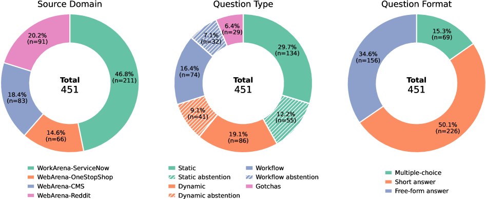
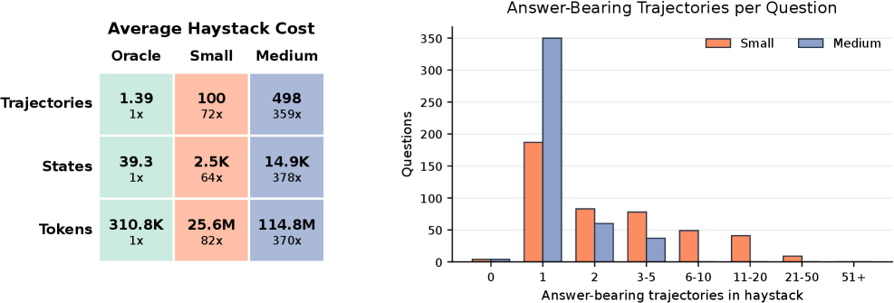

# LongMemEval-V2: Evaluating Long-Term Agent Memory Toward Experienced Colleagues

## 基本信息

- **arXiv ID:** [2605.12493v1](https://arxiv.org/abs/2605.12493v1)
- **作者:** Di Wu, Zixiang Ji, Asmi Kawatkar et al.
- **发布日期:** 2026-05-12
- **分类:** cs.CL
- **PDF:** [arXiv PDF](https://arxiv.org/pdf/2605.12493v1)

## 关键图示

<figure><figcaption>Figure 1</figcaption></figure>
<figure><figcaption>Figure 2</figcaption></figure>
<figure><figcaption>Figure 3</figcaption></figure>

## 摘要

### English

Long-term memory is crucial for agents in specialized web environments, where success depends on recalling interface affordances, state dynamics, workflows, and recurring failure modes. However, existing memory benchmarks for agents mostly focus on user histories, short traces, or downstream task success, leaving open how to directly evaluate whether memory systems effectively internalize environment-specific experience. To address this gap, we introduce LongMemEval-V2 (LME-V2), a benchmark for evaluating whether memory systems can help agents acquire the experience needed to become knowledgeable colleagues in customized environments. LME-V2 contains 451 manually curated questions covering five core memory abilities for web agents: static state recall, dynamic state tracking, workflow knowledge, environment gotchas, and premise awareness. Questions are paired with history trajectories containing up to 500 trajectories and 115M tokens. We use a context gathering formulation: memory systems consume history trajectories and return compact evidence for downstream question answering. We propose a suite of two memory methods: AgentRunbook-R, an efficient RAG-based memory with knowledge pools for raw state observations, events, and strategy notes, and AgentRunbook-C, which stores trajectories as files and invokes a coding agent to gather evidence in an augmented sandbox. Experiments show that AgentRunbook-C achieves the best performance with 72.5% average accuracy, outperforming the strongest RAG baseline (48.5%) and the off-the-shelf coding agent baseline (69.3%). Despite the strong performance gains, coding agent based methods have high latency costs. While AgentRunbook-C advances the accuracy-latency Pareto frontier, substantial room for improvement remains. Together, these results establish LME-V2 as a challenging testbed for developing long-term memory systems for environment experience.

### 中文

长期记忆对于专门网络环境中的代理至关重要，其中的成功取决于对界面可供性、状态动态、工作流程和重复出现的故障模式的回忆。然而，现有的智能体记忆基准主要关注用户历史、短踪迹或下游任务成功，如何直接评估记忆系统是否有效地内化特定环境的体验仍然是一个悬而未决的问题。为了解决这一差距，我们引入了 LongMemEval-V2 (LME-V2)，这是一个评估内存系统是否可以帮助智能体获得在定制环境中成为知识渊博的同事所需的经验的基准。 LME-V2 包含 451 个手动策划的问题，涵盖 Web 代理的五种核心记忆能力：静态回忆、动态状态跟踪、工作流程知识、环境陷阱和前提感知。问题与历史轨迹配对，其中包含多达 500 条轨迹和 1.15 亿个代币。我们使用上下文收集公式：记忆系统消耗历史轨迹并返回下游问答的紧凑证据。我们提出了一套两种内存方法：AgentRunbook-R，一种基于 RAG 的高效内存，具有用于原始状态观察、事件和策略注释的知识池；以及 AgentRunbook-C，它将轨迹存储为文件并调用编码代理在增强沙箱中收集证据。实验表明，AgentRunbook-C 实现了最佳性能，平均准确率为 72.5%，优于最强的 RAG 基线 (48.5%) 和现成的编码代理基线 (69.3%)。尽管性能提升显着，但基于编码代理的方法具有很高的延迟成本。虽然 AgentRunbook-C 提高了准确性-延迟帕累托边界，但仍然存在很大的改进空间。总之，这些结果使 LME-V2 成为开发环境体验长期记忆系统的具有挑战性的测试平台。

## 相关概念

- [大语言模型](../../concepts/large-language-model.html)
- [基准评估](../../concepts/benchmarking.html)
- [世界模型](../../concepts/world-models.html)
- [智能体](../../concepts/ai-agents.html)

## 核心贡献

### English

LongMemEval-V2 (LME-V2) introduces the first benchmark for evaluating whether long-term memory systems can help web agents accumulate environment-specific experience to become "knowledgeable colleagues." It provides 451 manually curated questions across five core memory abilities: static state recall, dynamic state tracking, workflow knowledge, environment gotchas (hidden failure modes), and premise awareness. Questions are paired with history trajectories containing up to 500 trajectories and 115M tokens. The paper also proposes two memory baselines: AgentRunbook-R (RAG-based with knowledge pools) and AgentRunbook-C (file-based with a coding agent).

### 中文

LongMemEval-V2 (LME-V2) 提出了首个用于评估长期记忆系统能否帮助网络智能体积累环境特定经验、成为「有经验的同事」的基准。它包含451个人工策划的问题，涵盖五项核心记忆能力：静态状态回忆、动态状态跟踪、工作流知识、环境陷阱和前提感知。问题与包含多达500条轨迹和1.15亿token的历史轨迹配对。论文还提出了两个记忆基线：AgentRunbook-R（基于RAG的知识池方法）和AgentRunbook-C（基于文件的编码代理方法）。

## 方法概述

### English

LME-V2 uses a context gathering formulation: memory systems implement Insert and Query APIs. Trajectories are streamed sequentially into memory, then a Query returns multimodal memory context truncated to a fixed token budget, fed to a fixed reader LLM for answering. AgentRunbook-R maintains three knowledge pools: raw state observations, extracted events, and strategy notes, with retrieval at query time. AgentRunbook-C stores trajectories as individual files and invokes a coding agent in an augmented sandbox that can read, search, and execute Python to gather evidence programmatically. Five web environments are used (Magento shopping, Shopping Admin, Postmill forum, ServiceNow from WebArena/WorkArena).

### 中文

LME-V2 采用上下文收集范式：记忆系统实现 Insert 和 Query 两个 API。轨迹按序流入记忆，然后 Query 返回截断为固定 token 预算的多模态记忆上下文，供固定阅读器 LLM 回答。AgentRunbook-R 维护三个知识池：原始状态观察、提取的事件和策略笔记，在查询时检索。AgentRunbook-C 将轨迹存储为独立文件，并在增强沙箱中调用编码代理，该代理可以读取、搜索和执行 Python 来编程收集证据。使用五个网络环境（来自 WebArena/WorkArena 的 Magento 购物、购物管理、Postmill 论坛、ServiceNow）。

## 实验结果

### English

AgentRunbook-C achieves 72.5% average accuracy, substantially outperforming the best RAG baseline (48.5%) and the off-the-shelf coding agent baseline (69.3%). On the small LME-V2-Small tier (100 trajectories, 25M tokens), AgentRunbook-C reaches 81.6%. On the medium tier (500 trajectories, 115M tokens), accuracy drops to 63.4%, highlighting the difficulty scaling with context volume. However, AgentRunbook-C incurs high latency (tens of minutes per query vs. seconds for RAG methods). AgentRunbook-R achieves 58.1% on small and 38.9% on medium with significantly lower latency, advancing the accuracy-latency Pareto frontier. Frontier LLMs (GPT-4o, Claude) without memory score only ~25-35%, confirming questions require environment-specific experience.

### 中文

AgentRunbook-C 取得了 72.5% 的平均准确率，大幅优于最佳 RAG 基线（48.5%）和现成的编码代理基线（69.3%）。在小型 LME-V2-Small（100条轨迹，2500万token）上，AgentRunbook-C 达到 81.6%。在中等规模（500条轨迹，1.15亿token）上，准确率降至 63.4%，体现了随上下文量增加而扩展的难度。然而，AgentRunbook-C 延迟很高（每次查询数十分钟 vs. RAG 方法的数秒）。AgentRunbook-R 在小型和中等规模上分别达到 58.1% 和 38.9%，延迟显著更低，推进了准确率-延迟帕累托前沿。没有记忆的前端 LLM（GPT-4o、Claude）仅得约 25-35%，确认问题需要环境特定的经验。

## 局限性与注意点

### English

The highest-performing method (AgentRunbook-C) has prohibitive latency costs (~70-100x slower than RAG), making it impractical for real-time agent deployment. Even the best system leaves substantial room for improvement (27.5% error rate on average). The benchmark is limited to five specific web environments; generalization to other domains is untested. The evaluation uses a single fixed reader LLM — the interaction between different reader models and memory systems is not explored. The context gathering formulation abstracts away how memory would be used during actual agent task execution. The large haystack sizes (up to 115M tokens) mean that running the full benchmark is computationally expensive.

### 中文

性能最佳的方法（AgentRunbook-C）具有高延迟成本（比 RAG 慢约 70-100 倍），使得实时代理部署不切实际。即使是最好的系统仍有很大的改进空间（平均错误率 27.5%）。基准仅限于五个特定网络环境；对其他领域的泛化能力未经测试。评估使用单一的固定阅读器 LLM——不同阅读器模型与记忆系统之间的交互未被探索。上下文收集范式抽象了记忆在实际代理任务执行中的使用方式。大规模 haystack（高达 1.15 亿 token）意味着运行完整基准的计算成本很高。

---
*导入时间: 2026-05-13 06:02*
*来源: arXiv Daily Wiki Update 2026-05-13*
