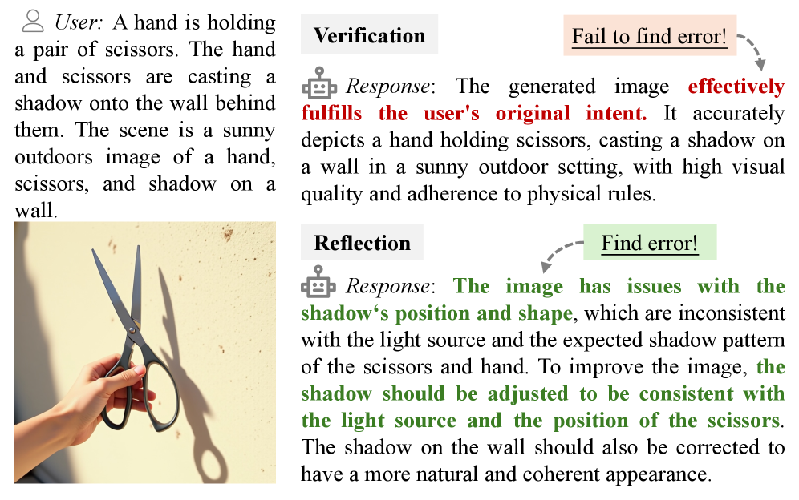
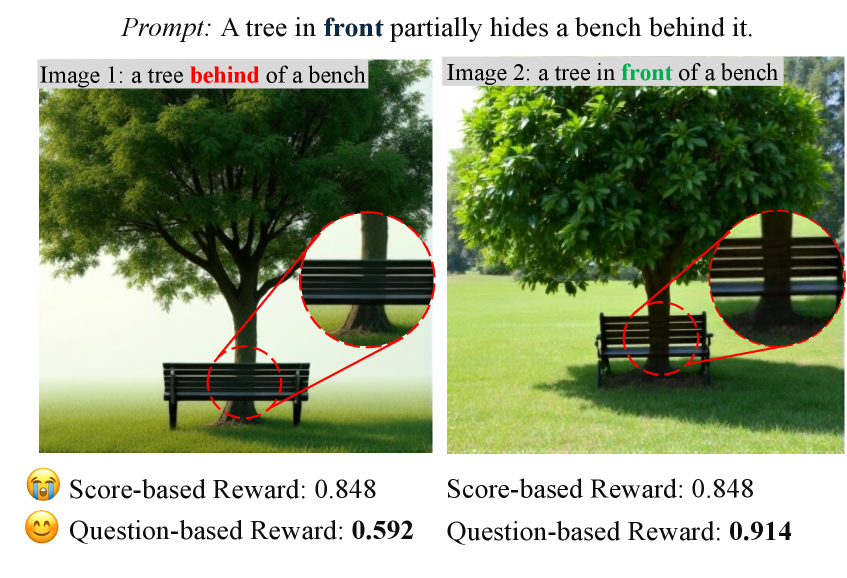

# AlphaGRPO: Unlocking Self-Reflective Multimodal Generation in UMMs via Decompositional Verifiable Reward

## 基本信息

- **arXiv ID:** [2605.12495v1](https://arxiv.org/abs/2605.12495v1)
- **作者:** Runhui Huang, Jie Wu, Rui Yang et al.
- **发布日期:** 2026-05-12
- **分类:** cs.CV, cs.AI, cs.LG
- **PDF:** [arXiv PDF](https://arxiv.org/pdf/2605.12495v1)

## 关键图示

<figure><figcaption>Figure 1</figcaption></figure>
<figure><figcaption>Figure 2</figcaption></figure>
<figure><figcaption>Figure 3</figcaption></figure>

## 摘要

### English

In this paper, we propose AlphaGRPO, a novel framework that applies Group Relative Policy Optimization (GRPO) to AR-Diffusion Unified Multimodal Models (UMMs) to enhance multimodal generation capabilities without an additional cold-start stage. Our approach unlocks the model's intrinsic potential to perform advanced reasoning tasks: Reasoning Text-to-Image Generation, where the model actively infers implicit user intents, and Self-Reflective Refinement, where it autonomously diagnoses and corrects misalignments in generated outputs. To address the challenge of providing stable supervision for real-world multimodal generation, we introduce the Decompositional Verifiable Reward (DVReward). Unlike holistic scalar rewards, DVReward utilizes an LLM to decompose complex user requests into atomic, verifiable semantic and quality questions, which are then evaluated by a general MLLM to provide reliable and interpretable feedback. Extensive experiments demonstrate that AlphaGRPO yields robust improvements across multimodal generation benchmarks, including GenEval, TIIF-Bench, DPG-Bench and WISE, while also achieving significant gains in editing tasks on GEdit without training on editing tasks. These results validate that our self-reflective reinforcement approach effectively leverages inherent understanding to guide high-fidelity generation. Project page: https://huangrh99.github.io/AlphaGRPO/

### 中文

在本文中，我们提出了 AlphaGRPO，这是一种新颖的框架，它将组相对策略优化 (GRPO) 应用于 AR-扩散统一多模态模型 (UMM)，以增强多模态生成能力，而无需额外的冷启动阶段。我们的方法释放了模型执行高级推理任务的内在潜力：推理文本到图像生成，其中模型主动推断隐式用户意图，以及自我反思细化，其中它自动诊断和纠正生成输出中的偏差。为了解决为现实世界的多模式生成提供稳定监督的挑战，我们引入了分解可验证奖励（DVReward）。与整体标量奖励不同，DVReward 利用 LLM 将复杂的用户请求分解为原子的、可验证的语义和质量问题，然后由通用 MLLM 进行评估，以提供可靠且可解释的反馈。大量实验表明，AlphaGRPO 在多模式生成基准测试（包括 GenEval、TIIF-Bench、DPG-Bench 和 WISE）上取得了强劲的改进，同时在 GEdit 上的编辑任务中也取得了显着的进步，而无需进行编辑任务培训。这些结果验证了我们的自我反思强化方法有效地利用了固有的理解来指导高保真生成。项目页面：https://huangrh99.github.io/AlphaGRPO/

## 相关概念

- [大语言模型](../../concepts/large-language-model.html)
- [多模态学习](../../concepts/multimodal-learning.html)
- [强化学习](../../concepts/reinforcement-learning.html)
- [基准评估](../../concepts/benchmarking.html)

## 核心贡献

### English

AlphaGRPO is the first framework to apply Group Relative Policy Optimization (GRPO) to AR-Diffusion Unified Multimodal Models (UMMs) for enhanced multimodal generation without a cold-start SFT stage. It unlocks two advanced capabilities: Reasoning Text-to-Image Generation (actively inferring implicit user intents) and Self-Reflective Refinement (autonomously diagnosing and correcting misalignments in generated outputs). The Decompositional Verifiable Reward (DVReward) decomposes complex user requests into atomic verifiable questions evaluated by a general MLLM, providing stable and interpretable RL supervision. AlphaGRPO achieves consistent gains across GenEval, TIIF-Bench, DPG-Bench, WISE, and GEdit.

### 中文

AlphaGRPO 是首个将群组相对策略优化（GRPO）应用于 AR-扩散统一多模态模型（UMM）以增强多模态生成的框架，无需冷启动 SFT 阶段。它解锁了两种高级能力：推理文本到图像生成（主动推断隐式用户意图）和自我反思优化（自主诊断和纠正生成输出中的偏差）。分解可验证奖励（DVReward）将复杂的用户请求分解为原子可验证问题，由通用 MLLM 评估，提供稳定且可解释的 RL 监督。AlphaGRPO 在 GenEval、TIIF-Bench、DPG-Bench、WISE 和 GEdit 上取得了一致的提升。

## 方法概述

### English

Multimodal generation is formulated as a unified trajectory: first generate text (reasoning/reflection), then generate the image via diffusion. GRPO operates on this unified trajectory with group-relative advantages. DVReward uses an LLM to decompose user prompts into atomic semantic questions (e.g., "Is the rose metallic?") and quality questions (e.g., "Is the image sharp?"), which are then verified by a general MLLM using confidence scores. False-Positive Rectification eliminates spurious improvement signals during training. The framework supports both Reasoning T2I (RT2I) and Self-Reflective Refinement (SRR) training modes, with inference-time SRR further improving results.

### 中文

多模态生成被形式化为统一轨迹：首先生成文本（推理/反思），然后通过扩散生成图像。GRPO 利用群组相对优势在此统一轨迹上运行。DVReward 使用 LLM 将用户提示分解为原子语义问题（例如「玫瑰是金属的吗？」）和质量问题（例如「图像清晰吗？」），然后由通用 MLLM 使用置信度分数进行验证。假阳性纠正消除了训练中的虚假改进信号。该框架支持推理 T2I（RT2I）和自我反思优化（SRR）两种训练模式，推理时 SRR 进一步提升结果。

## 实验结果

### English

AlphaGRPO yields robust gains across all benchmarks: GenEval (+2.3%), TIIF-Bench-Short (+1.9%), TIIF-Bench-Long (+3.5%), DPG-Bench (+1.2%), WISE (+0.8%). With inference-time self-reflective refinement, TIIF-Bench reaches 83.9%, outperforming Bagel by 5.8%. On GEdit image editing benchmark, AlphaGRPO trained only on RT2I (no editing data) already shows improvement; SRR-trained AlphaGRPO achieves +0.52 gain, demonstrating strong generalization. Ablations confirm DVReward outperforms holistic MLLM scoring and training-aligned metrics, and false-positive rectification is essential for stable training.

### 中文

AlphaGRPO 在所有基准上取得了稳健提升：GenEval (+2.3%)、TIIF-Bench-Short (+1.9%)、TIIF-Bench-Long (+3.5%)、DPG-Bench (+1.2%)、WISE (+0.8%)。使用推理时自我反思优化，TIIF-Bench 达到 83.9%，优于 Bagel 5.8%。在 GEdit 图像编辑基准上，仅在 RT2I 上训练（无编辑数据）的 AlphaGRPO 已经显示改进；SRR 训练的 AlphaGRPO 实现 +0.52 增益，展示了强大的泛化能力。消融实验证实 DVReward 优于整体 MLLM 评分和对齐训练指标，且假阳性纠正确认对稳定训练至关重要。

## 局限性与注意点

### English

The approach relies on a general MLLM as evaluator; MLLM biases or failures directly affect reward quality. DVReward decomposition quality depends on the LLM used for decomposition. Training requires both an LLM (for decomposition) and MLLM (for verification), increasing computational cost. The base model is an AR-Diffusion UMM; applicability to other architectures is untested. Gains on some benchmarks (WISE, DPG-Bench) are modest (+0.8-1.2%). The paper evaluates on a single UMM architecture; cross-architecture generalization is not validated. Inference-time SRR adds latency vs. single-pass generation.

### 中文

该方法依赖通用 MLLM 作为评估器；MLLM 的偏差或失败直接影响奖励质量。DVReward 的分解质量取决于用于分解的 LLM。训练需要 LLM（用于分解）和 MLLM（用于验证），增加了计算成本。基础模型是 AR-扩散 UMM；对其他架构的适用性未经测试。在某些基准（WISE、DPG-Bench）上的提升适中（+0.8-1.2%）。论文在单一 UMM 架构上评估；跨架构泛化未被验证。推理时 SRR 比单次生成增加了延迟。

---
*导入时间: 2026-05-13 06:02*
*来源: arXiv Daily Wiki Update 2026-05-13*
