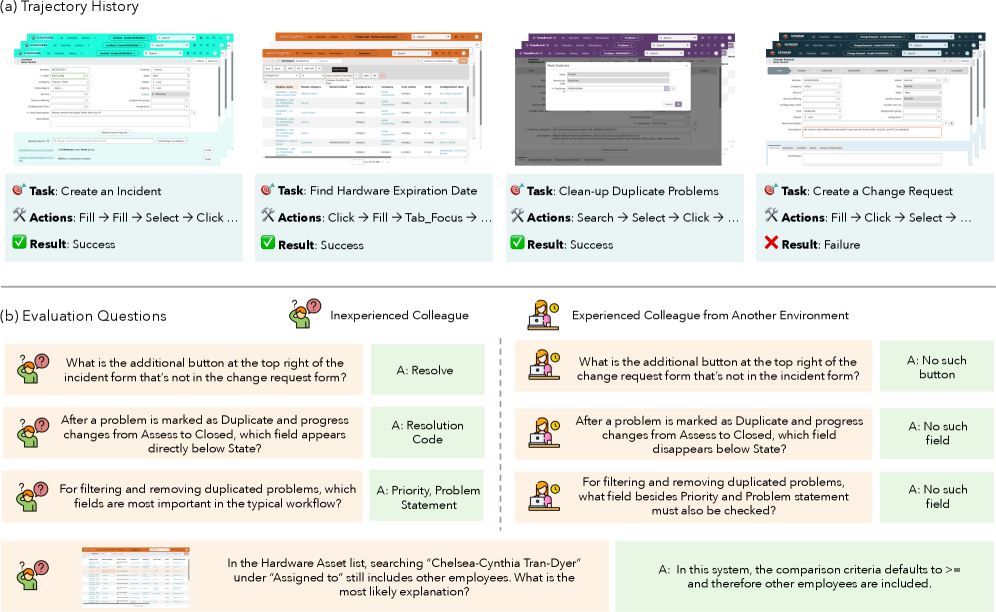
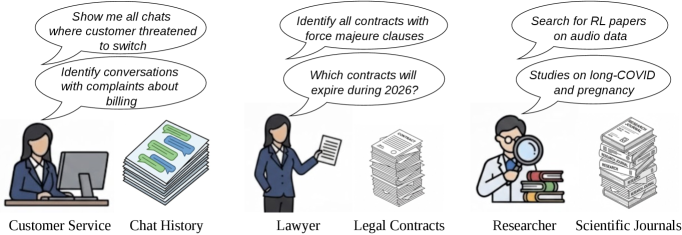
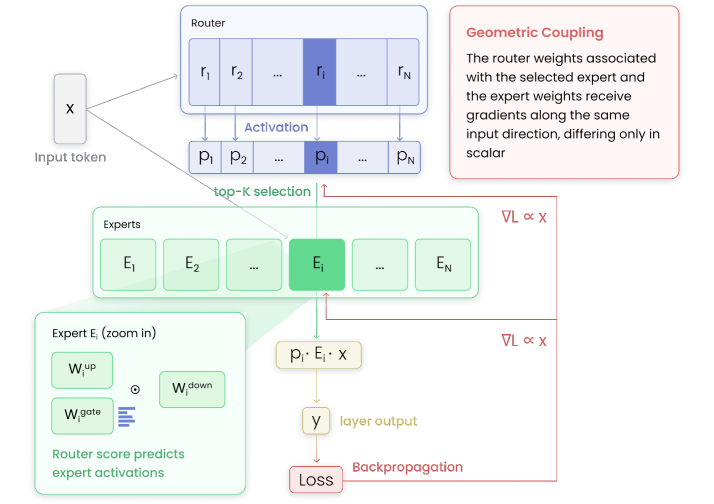
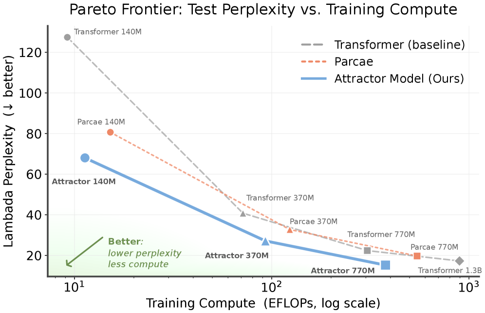
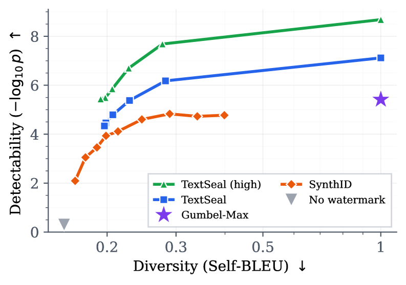
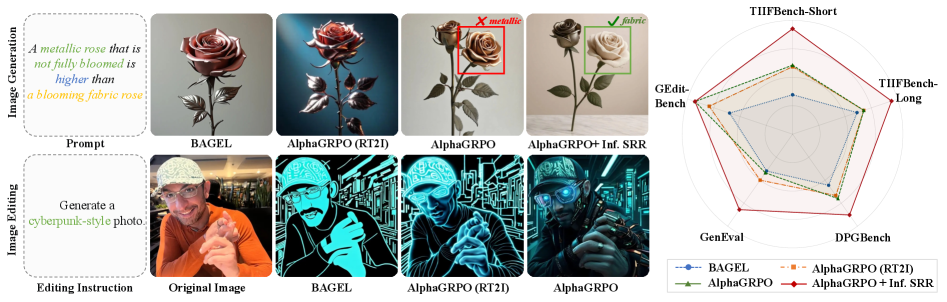
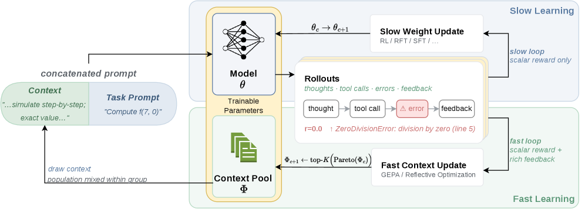

# 🔬 LLM Research Wiki

> AI/ML 领域的维基式知识库。按概念组织，论文为据，持续更新。
> 最后更新：2026-05-13 | 概念：61 | 论文：126

---

## 🌟 今日新论文

> 2026-05-13 自动更新，共 10 篇。这里是网站版每日论文导读；点击标题进入论文页面查看摘要、方法信号、相关主题和关键图示。

  
  

    <h3><a href="entities/papers/2605-12493v1-longmemeval-v2-evaluating-long-term-agent-memory-t.html">LongMemEval-V2: Evaluating Long-Term Agent Memory Toward Experienced Colleagues</a></h3>
    
2026-05-12 · cs.CL · 大语言模型 / 基准评估 / 世界模型 / 智能体

    
<strong>方法/亮点：</strong>To address this gap, we introduce LongMemEval-V2 (LME-V2), a benchmark for evaluating whether memory systems can help agents acquire the experience needed to become knowledgeable colleagues in customized environments.

    
<strong>摘要（中文）：</strong>长期记忆对于专门网络环境中的代理至关重要，其中的成功取决于对界面可供性、状态动态、工作流程和重复出现的故障模式的回忆。然而，现有的智能体记忆基准主要关注用户历史、短踪迹或下游任务成功，如何直接评估记忆系统是否有效地内化特定环境的体验仍然是一个悬而未决的问题。为了解决这一差距，我们引入了 LongMemEval-V2 (LME-V2)，这是一个评估内存系统是否可以帮助智能体获得在定制环境中成为知识渊博的同事所需的经验的基准。 LME-V2...

    
<strong>Abstract:</strong> Long-term memory is crucial for agents in specialized web environments, where success depends on recalling interface affordances, state dynamics, workflows, and recurring failure modes. However, existing memory benchmark...

  

  
  

    <h3><a href="entities/papers/2605-12487v1-task-adaptive-embedding-refinement-via-test-time-l.html">Task-Adaptive Embedding Refinement via Test-time LLM Guidance</a></h3>
    
2026-05-12 · cs.CL, cs.IR, cs.LG · 大语言模型 / 基准评估

    
<strong>方法/亮点：</strong>Our approach refines the embedding representation of a user query using feedback from a generative LLM on a small set of documents, enabling embeddings to adapt in real time to the target task.

    
<strong>摘要（中文）：</strong>我们探索了法学硕士引导的查询细化范式的有效性，以扩展嵌入模型的可用性以应对零样本搜索和分类任务。我们的方法使用来自生成式 LLM 对一小组文档的反馈来细化用户查询的嵌入表示，使嵌入能够实时适应目标任务。我们在一系列具有挑战性的搜索和分类基准中使用最先进的文本嵌入模型进行了广泛的实验。实证结果表明，LLM 引导的查询细化在所有模型和数据集上都产生了一致的收益，在文献搜索、意图检测、关键点匹配和细致入微的查询指令跟踪方面的相对改进高达 +2...

    
<strong>Abstract:</strong> We explore the effectiveness of an LLM-guided query refinement paradigm for extending the usability of embedding models to challenging zero-shot search and classification tasks. Our approach refines the embedding represe...

  

  
  

    <h3><a href="entities/papers/2605-12477v1-meme-multi-entity-evolving-memory-evaluation.html">MEME: Multi-entity &amp; Evolving Memory Evaluation</a></h3>
    
2026-05-12 · cs.LG, cs.CL · 大语言模型 / 基准评估 / 智能体

    
<strong>方法/亮点：</strong>LLM-based agents increasingly operate in persistent environments where they must store, update, and reason over information across many sessions.

    
<strong>摘要（中文）：</strong>基于 LLM 的代理越来越多地在持久环境中运行，它们必须在许多会话中存储、更新和推理信息。虽然之前的基准仅评估单实体更新，但 MEME 定义了跨越多实体和演化轴定义的整个空间的六项任务，其中包括之前工作未评分的三项任务：级联和缺席（依赖推理）以及删除（删除后状态）。通过在 100 个受控事件上评估跨越三种内存范式的六个内存系统，我们发现尽管有足够的静态检索性能，但所有系统在默认配置下（级联：3％，缺席：平均准确度为 1％）下都在依赖推理...

    
<strong>Abstract:</strong> LLM-based agents increasingly operate in persistent environments where they must store, update, and reason over information across many sessions. While prior benchmarks evaluate only single-entity updates, MEME defines s...

  

  
  

    <h3><a href="entities/papers/2605-12476v1-routers-learn-the-geometry-of-their-experts-geomet.html">Routers Learn the Geometry of Their Experts: Geometric Coupling in Sparse Mixture-of-Experts</a></h3>
    
2026-05-12 · cs.LG, cs.CL · 大语言模型 / 基准评估 / 世界模型

    
<strong>方法/亮点：</strong>Sparse Mixture-of-Experts (SMoE) models enable scaling language models efficiently, but training them remains challenging, as routing can collapse onto few experts and auxiliary load-balancing losses can reduce specialization.

    
<strong>摘要（中文）：</strong>稀疏专家混合 (SMoE) 模型可以有效地扩展语言模型，但训练它们仍然具有挑战性，因为路由可能会崩溃到少数专家身上，而辅助负载平衡损失可能会减少专业化。受这些障碍的推动，我们研究了 SMoE 中的路由决策是如何机械形成的。首先，我们揭示了路由器及其相应专家之间的几何耦合。对于给定的令牌，所选专家的路由器权重和处理它的专家权重沿着相同的输入方向接收梯度，仅标量系数不同。因此，匹配的路由器专家方向会累积相同的路由令牌历史记录。这种理论上的耦...

    
<strong>Abstract:</strong> Sparse Mixture-of-Experts (SMoE) models enable scaling language models efficiently, but training them remains challenging, as routing can collapse onto few experts and auxiliary load-balancing losses can reduce specializ...

  

  
  

    <h3><a href="entities/papers/2605-12471v1-kv-fold-one-step-kv-cache-recurrence-for-long-cont.html">KV-Fold: One-Step KV-Cache Recurrence for Long-Context Inference</a></h3>
    
2026-05-12 · cs.LG, cs.AI, cs.CL · 大语言模型 / 基准评估 / AI安全与对齐 / 智能体

    
<strong>方法/亮点：</strong>We introduce KV-Fold, a simple, training-free long-context inference protocol that treats the key-value (KV) cache as the accumulator in a left fold over sequence chunks.

    
<strong>摘要（中文）：</strong>我们引入了 KV-Fold，这是一种简单的、免训练的长上下文推理协议，它将键值 (KV) 缓存视为序列块左折叠中的累加器。在每一步中，模型都会根据累积的缓存处理下一个块，附加新生成的键和值，并将扩大的缓存向前传递；重复应用相同的一步更新，类似于函数式编程中的foldl。基于为潜在多代理通信引入的 KV 缓存串联原语，我们将其重新调整为用于长上下文推理的块到块递归。当处理块 t 时，模型会关注从早期块携带的 KV 缓存作为前缀，跨段重用其...

    
<strong>Abstract:</strong> We introduce KV-Fold, a simple, training-free long-context inference protocol that treats the key-value (KV) cache as the accumulator in a left fold over sequence chunks. At each step, the model processes the next chunk ...

  

  
  

    <h3><a href="entities/papers/2605-12466v1-solve-the-loop-attractor-models-for-language-and-r.html">Solve the Loop: Attractor Models for Language and Reasoning</a></h3>
    
2026-05-12 · cs.LG, cs.AI, cs.CL · 大语言模型

    
<strong>方法/亮点：</strong>We introduce Attractor Models, in which a backbone module first proposes output embeddings, then an attractor module refines them by solving for the fixed point, with gradients obtained through implicit differentiation.

    
<strong>摘要（中文）：</strong>循环变压器通过迭代地细化潜在表示、改进语言建模和推理，为纯粹前馈计算提供了一种有前景的替代方案。然而，循环架构的训练仍然不稳定，优化和部署成本高昂，并且受限于较小的固定循环深度。我们引入吸引器模型，其中主干模块首先提出输出嵌入，然后吸引器模块通过求解固定点来细化它们，并通过隐式微分获得梯度。因此，训练记忆在有效深度上保持恒定，并且通过收敛自适应地选择迭代。根据经验，吸引子模型在大规模语言模型预训练和小型模型推理这两个方面都优于现有模型。...

    
<strong>Abstract:</strong> Looped Transformers offer a promising alternative to purely feed-forward computation by iteratively refining latent representations, improving language modeling and reasoning. Yet recurrent architectures remain unstable ...

  

  
  

    <h3><a href="entities/papers/2605-12460v1-multi-stream-llms-unblocking-language-models-with.html">Multi-Stream LLMs: Unblocking Language Models with Parallel Streams of Thoughts, Inputs and Outputs</a></h3>
    
2026-05-12 · cs.LG, cs.CL · 大语言模型 / 自动驾驶 / 智能体

    
<strong>方法/亮点：</strong>The continued improvements in language model capability have unlocked their widespread use as drivers of autonomous agents, for example in coding or computer use applications.

    
<strong>摘要（中文）：</strong>语言模型能力的持续改进已经释放了它们作为自主代理驱动程序的广泛用途，例如在编码或计算机使用应用程序中。然而，自 ChatGPT 等早期指令调整模型以来，这些系统的核心并没有太大变化。即使是先进的人工智能代理也可以在消息交换格式上运行，在单个计算流中连续与用户、系统、自身（即思想链）和工具交换消息。聊天模型中单个流的瓶颈导致了许多限制：代理在读取时无法采取行动（生成输出），相反，在写入时无法对新信息做出反应。同样，智能体不能一边思考一边行...

    
<strong>Abstract:</strong> The continued improvements in language model capability have unlocked their widespread use as drivers of autonomous agents, for example in coding or computer use applications. However, the core of these systems has not c...

  

  
  

    <h3><a href="entities/papers/2605-12456v1-textseal-a-localized-llm-watermark-for-provenance.html">TextSeal: A Localized LLM Watermark for Provenance &amp; Distillation Protection</a></h3>
    
2026-05-12 · cs.CR, cs.CL, cs.LG · 大语言模型 / 基准评估 / AI安全与对齐

    
<strong>方法/亮点：</strong>We introduce TextSeal, a state-of-the-art watermark for large language models.

    
<strong>摘要（中文）：</strong>我们推出了 TextSeal，这是一种适用于大型语言模型的最先进的水印。 TextSeal 以 Gumbel-max 采样为基础，引入了双密钥生成来恢复输出多样性，并引入熵加权评分和多区域定位来改进检测。它支持推测性解码和多令牌预测等服务优化，并且不会增加任何推理开销。 TextSeal 在检测强度方面严格控制 SynthID-text 等基线，并且对稀释具有鲁棒性，即使在高度混合的人类/AI 文档中也能保持可靠的本地检测。该方案理论上...

    
<strong>Abstract:</strong> We introduce TextSeal, a state-of-the-art watermark for large language models. Building on Gumbel-max sampling, TextSeal introduces dual-key generation to restore output diversity, along with entropy-weighted scoring and...

  

  
  

    <h3><a href="entities/papers/2605-12495v1-alphagrpo-unlocking-self-reflective-multimodal-gen.html">AlphaGRPO: Unlocking Self-Reflective Multimodal Generation in UMMs via Decompositional Verifiable Reward</a></h3>
    
2026-05-12 · cs.CV, cs.AI, cs.LG · 大语言模型 / 多模态学习 / 强化学习 / 基准评估

    
<strong>方法/亮点：</strong>In this paper, we propose AlphaGRPO, a novel framework that applies Group Relative Policy Optimization (GRPO) to AR-Diffusion Unified Multimodal Models (UMMs) to enhance multimodal generation capabilities without an additional cold-start st

    
<strong>摘要（中文）：</strong>在本文中，我们提出了 AlphaGRPO，这是一种新颖的框架，它将组相对策略优化 (GRPO) 应用于 AR-扩散统一多模态模型 (UMM)，以增强多模态生成能力，而无需额外的冷启动阶段。我们的方法释放了模型执行高级推理任务的内在潜力：推理文本到图像生成，其中模型主动推断隐式用户意图，以及自我反思细化，其中它自动诊断和纠正生成输出中的偏差。为了解决为现实世界的多模式生成提供稳定监督的挑战，我们引入了分解可验证奖励（DVReward）。与...

    
<strong>Abstract:</strong> In this paper, we propose AlphaGRPO, a novel framework that applies Group Relative Policy Optimization (GRPO) to AR-Diffusion Unified Multimodal Models (UMMs) to enhance multimodal generation capabilities without an addi...

  

  
  

    <h3><a href="entities/papers/2605-12484v1-learning-fast-and-slow-towards-llms-that-adapt-con.html">Learning, Fast and Slow: Towards LLMs That Adapt Continually</a></h3>
    
2026-05-12 · cs.LG, cs.AI · 大语言模型 / 强化学习

    
<strong>方法/亮点：</strong>To this end, we introduce a fast-slow learning framework for LLMs, with model parameters as &quot;slow&quot; weights and optimized context as &quot;fast&quot; weights.

    
<strong>摘要（中文）：</strong>大型语言模型 (LLM) 通过更新其参数（例如，通过 RL）来针对下游任务进行训练。然而，更新参数迫使它们吸收特定于任务的信息，这可能会导致灾难性的遗忘和可塑性的丧失。相比之下，使用固定 LLM 参数的上下文学习可以廉价且快速地适应特定于任务的要求（例如，即时优化），但其本身通常无法与通过更新 LLM 参数获得的性能增益相匹配。没有充分的理由将学习限制在上下文中或权重中。此外，人类也可能在不同的时间尺度上学习（例如，系统 1 与系统 2...

    
<strong>Abstract:</strong> Large language models (LLMs) are trained for downstream tasks by updating their parameters (e.g., via RL). However, updating parameters forces them to absorb task-specific information, which can result in catastrophic fo...

  

---

## 🧭 知识导航

### 核心概念

| 概念 | 说明 | 论文数 |
|------|------|--------|
| [大语言模型](concepts/large-language-model.html) | GPT、LLaMA 等大规模预训练语言模型 | 8 |
| [强化学习](concepts/reinforcement-learning.html) | RLHF、RLVR、DPO、GRPO 等对齐技术 | 2 |
| [多模态学习](concepts/multimodal-learning.html) | 视觉-语言模型、跨模态推理 | 2 |
| [知识蒸馏](concepts/knowledge-distillation.html) | 教师-学生框架、黑箱蒸馏、策略蒸馏 | 1 |
| [世界模型](concepts/world-models.html) | 环境动态预测与生成 | 1 |
| [基准评估](concepts/benchmarking.html) | 标准化测试与评估方法论 | 2 |
| [智能体](concepts/ai-agents.html) | LLM 驱动的自主代理与多代理协作 | 8 |
| [图神经网络](concepts/graph-neural-networks.html) | 图结构学习与推理 | 1 |
| [自动驾驶](concepts/autonomous-driving.html) | 感知、预测、规划与世界模型 | 1 |
| [AI安全与对齐](concepts/ai-safety-alignment.html) | 对齐问题、对抗训练、安全评估 | 2 |

### 技术方向

- **训练方法** → [强化学习](concepts/reinforcement-learning.html) | [知识蒸馏](concepts/knowledge-distillation.html)
- **模型架构** → [大语言模型](concepts/large-language-model.html) | [图神经网络](concepts/graph-neural-networks.html) | [世界模型](concepts/world-models.html)
- **应用场景** → [自动驾驶](concepts/autonomous-driving.html) | [医学AI](concepts/medical-ai.html) | [智能体](concepts/ai-agents.html)
- **评估与安全** → [基准评估](concepts/benchmarking.html) | [AI安全与对齐](concepts/ai-safety-alignment.html)
