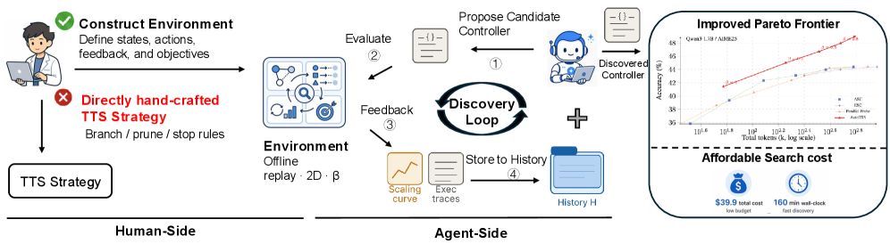
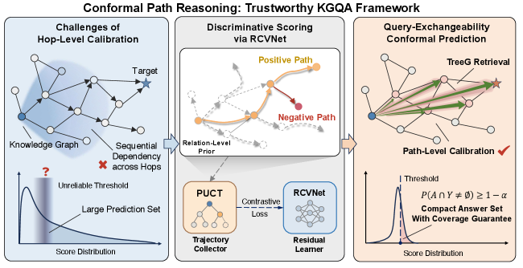
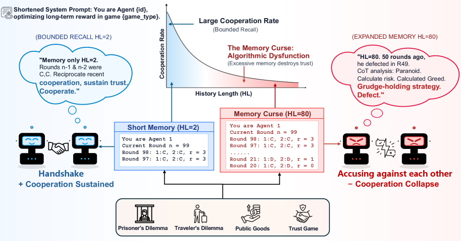
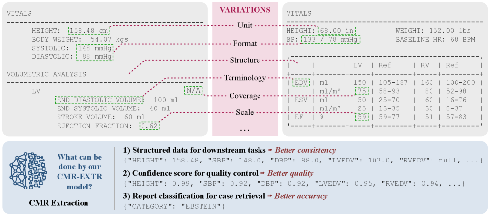
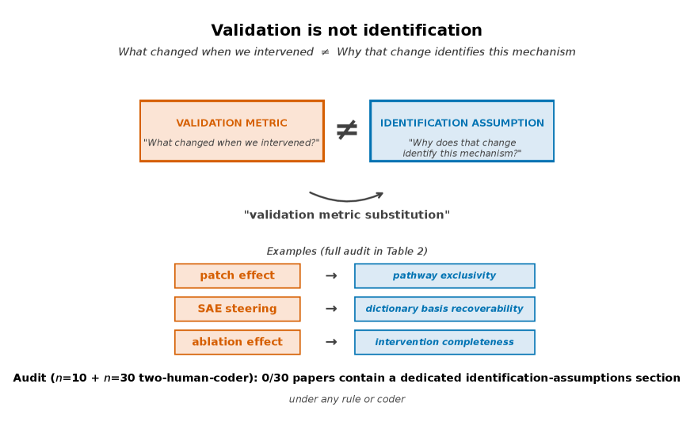
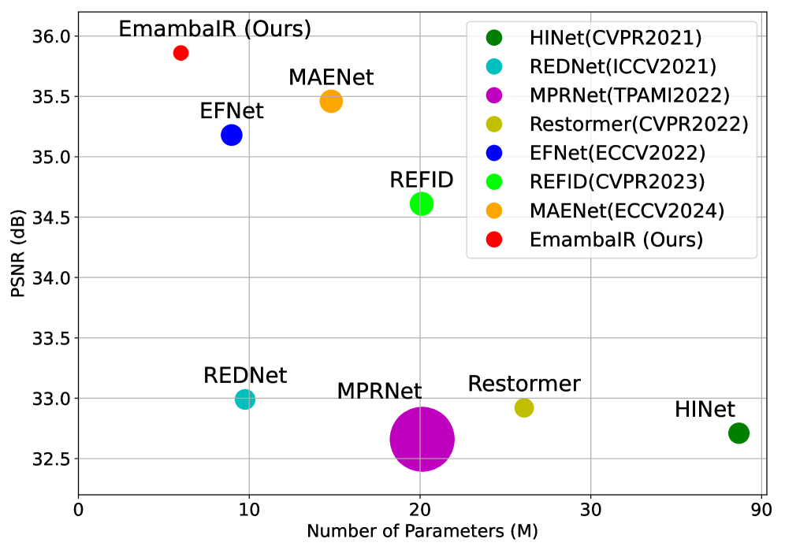

# 🔬 LLM Research Wiki

> AI/ML 领域的维基式知识库。按概念组织，论文为据，持续更新。
> 最后更新：2026-05-11 | 概念：61 | 论文：108

---

## 🌟 今日新论文

> 2026-05-11 自动更新，共 10 篇。这里是网站版每日论文导读；点击标题进入论文页面查看摘要、方法信号、相关主题和关键图示。

  
  

    <h3><a href="entities/papers/2605-08083v1-llms-improving-llms-agentic-discovery-for-test-tim.html">LLMs Improving LLMs: Agentic Discovery for Test-Time Scaling</a></h3>
    
2026-05-08 · cs.CL · 大语言模型 / 基准评估 / 智能体

    
<strong>方法/亮点：</strong>We propose an environment-driven framework, AutoTTS, that changes what researchers design: from individual TTS heuristics to environments where TTS strategies can be discovered automatically.

    
<strong>摘要（中文）：</strong>测试时间缩放（TTS）已成为通过在推理过程中分配额外计算来提高大型语言模型性能的有效方法。然而，现有的 TTS 策略很大程度上是手工设计的：研究人员手动设计推理模式并凭直觉调整启发式方法，从而留下了许多计算分配空间未被探索。我们提出了一个环境驱动的框架 AutoTTS，它改变了研究人员的设计：从单独的 TTS 启发法到可以自动发现 TTS 策略的环境。 AutoTTS的关键在于环境构建：发现环境必须使控制空间易于处理，并为TTS搜索提供...

    
<strong>Abstract:</strong> Test-time scaling (TTS) has become an effective approach for improving large language model performance by allocating additional computation during inference. However, existing TTS strategies are largely hand-crafted: re...

  

  
  

    <h3><a href="entities/papers/2605-08077v1-conformal-path-reasoning-trustworthy-knowledge-gra.html">Conformal Path Reasoning: Trustworthy Knowledge Graph Question Answering via Path-Level Calibration</a></h3>
    
2026-05-08 · cs.CL · 基准评估 / 图神经网络

    
<strong>方法/亮点：</strong>To address these pitfalls, we propose Conformal Path Reasoning (CPR), a trustworthy KGQA framework with two key innovations.

    
<strong>摘要（中文）：</strong>知识图问答（KGQA）已显示出有基础且可解释的推理的前景，但现有方法往往无法对检索到的答案提供可靠的覆盖保证。虽然保形预测（CP）提供了一个用于生成具有统计保证的预测集的原则框架，但先前的方法在校准有效性和分数可辨别性方面都受到严重限制，导致违反覆盖率保证和过大的预测集。为了解决这些陷阱，我们提出了保形路径推理 (CPR)，这是一个值得信赖的 KGQA 框架，具有两项关键创新。首先，我们对路径级分数执行查询级保形校准，在生成路径预测集的...

    
<strong>Abstract:</strong> Knowledge Graph Question Answering (KGQA) has shown promise for grounded and interpretable reasoning, yet existing approaches often fail to provide reliable coverage guarantees over retrieved answers. While Conformal Pre...

  

  
  

    <h3><a href="entities/papers/2605-08060v1-the-memory-curse-how-expanded-recall-erodes-cooper.html">The Memory Curse: How Expanded Recall Erodes Cooperative Intent in LLM Agents</a></h3>
    
2026-05-08 · cs.CL, cs.AI, cs.GT · 大语言模型 / 智能体

    
<strong>方法/亮点：</strong>Context window expansion is often treated as a straightforward capability upgrade for LLMs, but we find it systematically fails in multi-agent social dilemmas.

    
<strong>摘要（中文）：</strong>上下文窗口扩展通常被视为法学硕士的直接能力升级，但我们发现它在多智能体社会困境中系统性地失败。在 7 个法学硕士和 4 个超过 500 轮的游戏中，扩展可访问的历史会降低 28 个模型中的 18 个模型的合作——游戏设置，我们将这种模式称为“记忆诅咒”。我们通过三个分析来分离出潜在的机制。首先，对 378,000 条推理痕迹的词汇分析将这种故障与前瞻性意图的削弱而不是偏执的增加联系起来。我们使用有针对性的微调作为认知探针来验证这一点：专...

    
<strong>Abstract:</strong> Context window expansion is often treated as a straightforward capability upgrade for LLMs, but we find it systematically fails in multi-agent social dilemmas. Across 7 LLMs and 4 games over 500 rounds, expanding accessi...

  

  
  

    <h3><a href="entities/papers/2605-08057v1-ca-sql-complexity-aware-inference-time-reasoning-f.html">CA-SQL: Complexity-Aware Inference Time Reasoning for Text-to-SQL via Exploration and Compute Budget Allocation</a></h3>
    
2026-05-08 · cs.CL, cs.AI · 大语言模型 / 基准评估

    
<strong>方法/亮点：</strong>To address this challenge, we introduce CA-SQL, a novel Text-to-SQL pipeline that utilizes the estimated difficulty of a task to dynamically scale the breadth of the exploration for generating solution candidates.

    
<strong>摘要（中文）：</strong>虽然推理时间学习的最新进展改进了文本到 SQL 任务的 LLM 推理，但当前的解决方案仍然难以在 Bird-Bench (BIRD) 基准测试中最具挑战性的任务上表现良好。这是由于解决方案空间探索不充分，而解决方案空间探索对于发现有希望的候选查询是必要的，这些候选查询可以进一步细化以产生正确的输出。为了应对这一挑战，我们引入了 CA-SQL，这是一种新颖的文本到 SQL 管道，它利用任务的估计难度来动态扩展生成候选解决方案的探索广度。此...

    
<strong>Abstract:</strong> While recent advancements in inference-time learning have improved LLM reasoning on Text-to-SQL tasks, current solutions still struggle to perform well on the most challenging tasks in the Bird-Bench (BIRD) benchmark. Th...

  

  
  

    <h3><a href="entities/papers/2605-08048v1-accurate-and-efficient-statistical-testing-for-wor.html">Accurate and Efficient Statistical Testing for Word Semantic Breadth</a></h3>
    
2026-05-08 · cs.CL · 大语言模型 / 基准评估 / AI安全与对齐

    
<strong>方法/亮点：</strong>We propose a Householder-aligned permutation test to isolate dispersion differences from directional differences.

    
<strong>摘要（中文）：</strong>通过上下文化的标记嵌入，测量单词含义的广度或其在上下文中的传播已经变得可行。单词类型可以表示为令牌向量云，并使用基于分散的统计数据作为上下文多样性的代理（Nagata 和 Tanaka-Ishii，ACL2025）。这些测量对于在构建同义词库和特定领域词典时确定适当的语义区别非常有用。然而，在比较两种单词类型的广度时，对分散度的朴素假设检验可能会产生误导：语义方向的差异可能会伪装成分散度差异，从而夸大第一类错误并产生“统计上显着”的结果...

    
<strong>Abstract:</strong> Measuring the breadth of a word&#x27;s meaning, or its spread across contexts, has become feasible with contextualized token embeddings. A word type can be represented as a cloud of token vectors, with dispersion-based statis...

  

  
  

    <h3><a href="entities/papers/2605-08045v1-uncertainty-aware-structured-data-extraction-from.html">Uncertainty-Aware Structured Data Extraction from Full CMR Reports via Distilled LLMs</a></h3>
    
2026-05-08 · cs.CL · 医学AI

    
<strong>方法/亮点：</strong>We present CMR-EXTR, a lightweight framework that converts free-text CMR reports into structured data and assigns per-field confidence for quality control.

    
<strong>摘要（中文）：</strong>将自由文本心脏磁共振 (CMR) 报告转换为可审核的结构化数据仍然是队列组装、纵向管理和临床决策支持的瓶颈。我们推出了 CMR-EXTR，这是一个轻量级框架，可将自由文本 CMR 报告转换为结构化数据，并为每个字段分配质量控制的置信度。师生蒸馏管道可以实现完全离线推理，同时限制手动注释。不确定性整合了三个互补的原则——分布合理性、抽样稳定性和跨领域一致性——来对人工审查进行分类。实验表明，CMR-EXTR 达到了 99.65% 的变量级...

    
<strong>Abstract:</strong> Converting free-text cardiac magnetic resonance (CMR) reports into auditable structured data remains a bottleneck for cohort assembly, longitudinal curation, and clinical decision support. We present CMR-EXTR, a lightwei...

  

  
  

    <h3><a href="entities/papers/2605-08044v1-fast-byte-latent-transformer.html">Fast Byte Latent Transformer</a></h3>
    
2026-05-08 · cs.CL, cs.AI, cs.LG · 大语言模型

    
<strong>方法/亮点：</strong>First, we introduce BLT Diffusion (BLT-D), a new model and our fastest BLT variant, trained with an auxiliary block-wise diffusion objective alongside the standard next-byte prediction loss.

    
<strong>摘要（中文）：</strong>最近的字节级语言模型（LM）在不依赖子词词汇的情况下与令牌级模型的性能相匹配，但它们的实用性受到缓慢的逐字节自回归生成的限制。我们通过新的训练和生成技术解决了 Byte Latent Transformer (BLT) 中的这一瓶颈。首先，我们介绍 BLT 扩散 (BLT-D)，这是一种新模型，也是我们最快的 BLT 变体，它使用辅助分块扩散目标以及标准下一个字节预测损失进行训练。这使得推理过程能够在每个解码步骤并行生成多个字节，从而大...

    
<strong>Abstract:</strong> Recent byte-level language models (LMs) match the performance of token-level models without relying on subword vocabularies, yet their utility is limited by slow, byte-by-byte autoregressive generation. We address this b...

  

  
  

    <h3><a href="entities/papers/2605-08012v1-position-mechanistic-interpretability-must-disclos.html">Position: Mechanistic Interpretability Must Disclose Identification Assumptions for Causal Claims</a></h3>
    
2026-05-08 · cs.LG, cs.AI, cs.CL · 基准评估 / AI安全与对齐

    
<strong>方法/亮点：</strong>A purposive audit of 10 papers across four methodological strands finds no dedicated identification-assumptions section and a recurring pattern: validation metrics such as faithfulness, completeness, monosemanticity, alignment, or ablation 

    
<strong>摘要（中文）：</strong>机械可解释性论文越来越多地使用因果词汇：电路、中介、因果抽象、单一语义。此类主张需要明确的识别假设。对四个方法论分支的 10 篇论文进行了有目的的审核，发现没有专门的识别假设部分和重复出现的模式：诸如忠实性、完整性、单义性、对齐或消融效应等验证指标被报告为因果支持，但没有说明使它们识别的假设。对 $n=30$ 的两人编码员审计重现了主要发现的方向：缺少专用标识部分，并且验证度量替换很常见，尽管精确的 Dim B/D 计数对编码规则敏感。...

    
<strong>Abstract:</strong> Mechanistic interpretability papers increasingly use causal vocabulary: circuits, mediators, causal abstraction, monosemanticity. Such claims require explicit identification assumptions. A purposive audit of 10 papers ac...

  

  
  

    <h3><a href="entities/papers/2605-08073v1-emambair-efficient-visual-state-space-model-for-ev.html">EmambaIR: Efficient Visual State Space Model for Event-guided Image Reconstruction</a></h3>
    
2026-05-08 · cs.CV, cs.AI · 大语言模型 / 多模态学习 / 基准评估

    
<strong>方法/亮点：</strong>To address these bottlenecks, we introduce EmambaIR, an Efficient visual State Space Model designed for image reconstruction using spatially sparse and temporally continuous event streams.

    
<strong>摘要（中文）：</strong>最近基于事件的图像重建方法主要依靠卷积神经网络（CNN）和视觉变换器（ViT）来处理补充事件信息。然而，这些架构面临着根本的限制：CNN 通常无法捕获全局特征相关性，而 ViT 会产生二次计算复杂度（例如 $O(n^2)$），阻碍了它们在高分辨率场景中的应用。为了解决这些瓶颈，我们引入了 EmambaIR，这是一种高效的视觉状态空间模型，设计用于使用空间稀疏和时间连续的事件流进行图像重建。我们的框架引入了两个关键组件：跨模态 Top-k...

    
<strong>Abstract:</strong> Recent event-based image reconstruction methods predominantly rely on Convolutional Neural Networks (CNNs) and Vision Transformers (ViTs) to process complementary event information. However, these architectures face fund...

  

  
  

    <h3><a href="entities/papers/2605-08070v1-veccisc-improving-confidence-informed-self-consist.html">VecCISC: Improving Confidence-Informed Self-Consistency with Reasoning Trace Clustering and Candidate Answer Selection</a></h3>
    
2026-05-08 · cs.AI · 大语言模型 / 基准评估

    
<strong>方法/亮点：</strong>To reduce this expense, we propose VecCISC, a lightweight, adaptive framework that uses a measure of semantic similarity to filter reasoning traces that are semantically equivalent to others, degenerate, or hallucinated, thus decreasing the

    
<strong>摘要（中文）：</strong>扩展推理时间推理的标准技术是自我一致性，即从法学硕士中抽取多个候选答案，并选择最常见的答案。最近，事实证明，加权多数投票（例如信心知情的自我一致性（CISC））为每个候选答案分配一个置信值并选择累积分数最大的答案，在各种流行的基准上往往更准确。在实践中，加权多数投票需要对每个候选人的推理轨迹调用批评者法学硕士，以产生答案的置信度分数。尽管具有潜在的性能优势，但第二系列的 LLM 调用极大地增加了加权多数投票的开销和成本。为了减少这种费用...

    
<strong>Abstract:</strong> A standard technique for scaling inference-time reasoning is Self-Consistency, whereby multiple candidate answers are sampled from an LLM and the most common answer is selected. More recently, it has been shown that weig...

  

---

## 🧭 知识导航

### 核心概念

| 概念 | 说明 | 论文数 |
|------|------|--------|
| [大语言模型](concepts/large-language-model.html) | GPT、LLaMA 等大规模预训练语言模型 | 8 |
| [强化学习](concepts/reinforcement-learning.html) | RLHF、RLVR、DPO、GRPO 等对齐技术 | 2 |
| [多模态学习](concepts/multimodal-learning.html) | 视觉-语言模型、跨模态推理 | 2 |
| [知识蒸馏](concepts/knowledge-distillation.html) | 教师-学生框架、黑箱蒸馏、策略蒸馏 | 1 |
| [世界模型](concepts/world-models.html) | 环境动态预测与生成 | 1 |
| [基准评估](concepts/benchmarking.html) | 标准化测试与评估方法论 | 2 |
| [智能体](concepts/ai-agents.html) | LLM 驱动的自主代理与多代理协作 | 8 |
| [图神经网络](concepts/graph-neural-networks.html) | 图结构学习与推理 | 1 |
| [自动驾驶](concepts/autonomous-driving.html) | 感知、预测、规划与世界模型 | 1 |
| [AI安全与对齐](concepts/ai-safety-alignment.html) | 对齐问题、对抗训练、安全评估 | 2 |

### 技术方向

- **训练方法** → [强化学习](concepts/reinforcement-learning.html) | [知识蒸馏](concepts/knowledge-distillation.html)
- **模型架构** → [大语言模型](concepts/large-language-model.html) | [图神经网络](concepts/graph-neural-networks.html) | [世界模型](concepts/world-models.html)
- **应用场景** → [自动驾驶](concepts/autonomous-driving.html) | [医学AI](concepts/medical-ai.html) | [智能体](concepts/ai-agents.html)
- **评估与安全** → [基准评估](concepts/benchmarking.html) | [AI安全与对齐](concepts/ai-safety-alignment.html)
