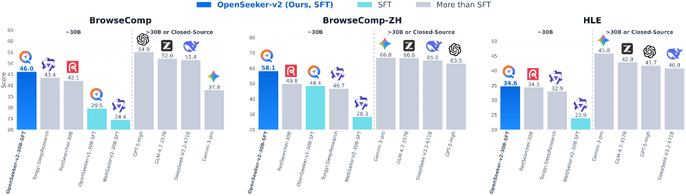
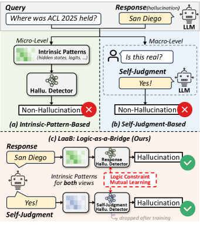
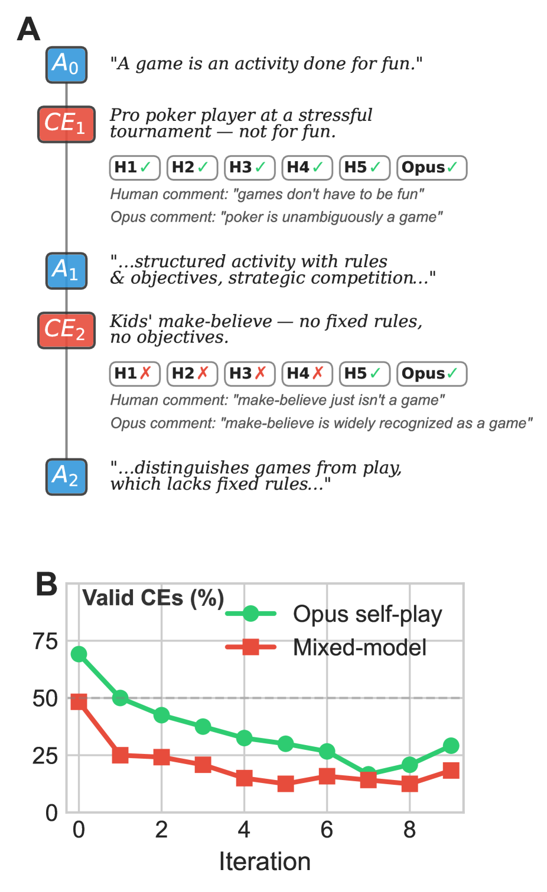

# 🔬 LLM Research Wiki

> AI/ML 领域的维基式知识库。按概念组织，论文为据，持续更新。
> 最后更新：2026-05-06 | 概念：61 | 论文：60

---

## 🌟 今日新论文

> 2026-05-06 自动更新，共 8 篇。这里是网站版每日论文导读；点击标题进入论文页面查看摘要、方法信号、相关主题和关键图示。

  
  

    <h3><a href="entities/papers/2605-04039v1-safety-and-accuracy-follow-different-scaling-laws.html">Safety and accuracy follow different scaling laws in clinical large language models</a></h3>
    
2026-05-05 · cs.CL, cs.AI, cs.LG · 大语言模型 / 基准评估 / AI安全与对齐 / 医学AI

    
<strong>方法/亮点：</strong>We introduce SaFE-Scale, a framework for measuring how clinical LLM safety changes across model scale, evidence quality, retrieval strategy, context exposure, and inference-time compute.

    
<strong>摘要（中文）：</strong>临床法学硕士通常通过增加模型大小、上下文长度、检索复杂性或推理时间计算来扩展，隐含的期望是更高的准确性意味着更安全的行为。这种假设在医学领域是不完整的，在医学领域，一些自信、高风险或证据矛盾的错误可能比平均基准表现更重要。我们引入了 SaFE-Scale，这是一个用于衡量临床 LLM 安全性在模型规模、证据质量、检索策略、上下文暴露和推理时间计算方面如何变化的框架。为了实例化该框架，我们引入了 RadSaFE-200，这是一个以放射安全...

    
<strong>Abstract:</strong> Clinical LLMs are often scaled by increasing model size, context length, retrieval complexity, or inference-time compute, with the implicit expectation that higher accuracy implies safer behavior. This assumption is inco...

  

  
  

    <h3><a href="entities/papers/2605-04036v1-openseeker-v2-pushing-the-limits-of-search-agents.html">OpenSeeker-v2: Pushing the Limits of Search Agents with Informative and High-Difficulty Trajectories</a></h3>
    
2026-05-05 · cs.AI, cs.CL · 大语言模型 / 强化学习 / 基准评估 / 图神经网络

    
<strong>方法/亮点：</strong>Deep search capabilities have become an indispensable competency for frontier Large Language Model (LLM) agents, yet their development remains dominated by industrial giants.

    
<strong>摘要（中文）：</strong>深度搜索能力已经成为前沿大语言模型（LLM）代理不可或缺的能力，但其发展仍然由工业巨头主导。典型的行业配方涉及资源高度密集的管道，涵盖预训练、持续预训练 (CPT)、监督微调 (SFT) 和强化学习 (RL)。在本报告中，我们表明，当提供信息丰富且高难度的轨迹时，简单的 SFT 方法对于训练前沿搜索代理可能会非常强大。通过引入三个简单的数据合成修改：缩放知识图大小以实现更丰富的探索、扩展工具集大小以实现更广泛的功能以及严格的低步过滤，我...

    
<strong>Abstract:</strong> Deep search capabilities have become an indispensable competency for frontier Large Language Model (LLM) agents, yet their development remains dominated by industrial giants. The typical industry recipe involves a highly...

  

  
  

    <h3><a href="entities/papers/2605-04018v1-rethinking-reasoning-intensive-retrieval-evaluatin.html">Rethinking Reasoning-Intensive Retrieval: Evaluating and Advancing Retrievers in Agentic Search Systems</a></h3>
    
2026-05-05 · cs.CL, cs.IR · 基准评估 / 智能体

    
<strong>方法/亮点：</strong>We introduce BRIGHT-Pro, an expert-annotated benchmark that expands each query with multi-aspect gold evidence and evaluates retrievers under both static and agentic search protocols.

    
<strong>摘要（中文）：</strong>推理密集型检索旨在找出支持下游推理的证据，而不仅仅是匹配主题相似性。这种能力对于代理搜索系统越来越重要，检索器必须在迭代搜索和合成中提供补充证据。然而，现有的工作在评估和训练方面仍然有限：诸如 BRIGHT 之类的基准提供了狭窄的黄金集并单独评估检索器，而综合训练语料库通常优化单通道相关性而不是证据组合构建。我们推出了 BRIGHT-Pro，这是一个专家注释的基准测试，它通过多方面的黄金证据扩展每个查询，并在静态和代理搜索协议下评估检索...

    
<strong>Abstract:</strong> Reasoning-intensive retrieval aims to surface evidence that supports downstream reasoning rather than merely matching topical similarity. This capability is increasingly important for agentic search systems, where retrie...

  

  
  

    <h3><a href="entities/papers/2605-03998v1-equitriage-a-fairness-audit-of-gender-bias-in-llm.html">EQUITRIAGE: A Fairness Audit of Gender Bias in LLM-Based Emergency Department Triage</a></h3>
    
2026-05-05 · cs.CL, cs.CY · 大语言模型 / 基准评估 / 医学AI / 图神经网络

    
<strong>方法/亮点：</strong>We present EQUITRIAGE, a fairness audit of LLM-based ESI assignment evaluating five models (Gemini-3-Flash, Nemotron-3-Super, DeepSeek-V3.1, Mistral-Small-3.2, GPT-4.1-Nano) across 374,275 evaluations on 18,714 MIMIC-IV-ED vignettes under f

    
<strong>摘要（中文）：</strong>急诊科分诊为患者分配一个视力评分，以确定治疗的优先顺序，临床证据记录了人类视力评估中持续存在的性别差异。当医院试点大型语言模型（LLM）作为分诊决策支持时，一个关键问题是这些模型是否会重现或减轻已知的偏差。我们提出了 EQUITRIAGE，这是一项基于 LLM 的 ESI 作业的公平性审计，在四种提示策略下对 18,714 个 MIMIC-IV-ED 插图进行了 374,275 次评估，评估了五种模型（Gemini-3-Flash、Ne...

    
<strong>Abstract:</strong> Emergency department triage assigns patients an acuity score that determines treatment priority, and clinical evidence documents persistent gender disparities in human acuity assessment. As hospitals pilot large language...

  

  
  

    <h3><a href="entities/papers/2605-03971v1-logical-consistency-as-a-bridge-improving-llm-hall.html">Logical Consistency as a Bridge: Improving LLM Hallucination Detection via Label Constraint Modeling between Responses and Self-Judgments</a></h3>
    
2026-05-05 · cs.CL · 大语言模型 / 基准评估

    
<strong>方法/亮点：</strong>In this paper, we propose LaaB (Logical Consistency-as-a-Bridge), a framework that bridges neural features and symbolic judgments for hallucination detection.

    
<strong>摘要（中文）：</strong>大型语言模型 (LLM) 很容易出现事实幻觉，从而影响其在现实应用中的可靠性。现有的幻觉检测器主要提取微观层面的内在模式进行不确定性量化或通过语言提示引发宏观层面的自我判断。然而，这些方法只解决幻觉的一个方面，要么关注隐含的神经不确定性，要么关注明确的符号推理，从而孤立地处理这些固有耦合的行为，而未能利用它们的相互依赖关系来获得整体观点。在本文中，我们提出了 LaaB（逻辑一致性桥），这是一个连接神经特征和符号判断以进行幻觉检测的框架。...

    
<strong>Abstract:</strong> Large Language Models (LLMs) are prone to factual hallucinations, risking their reliability in real-world applications. Existing hallucination detectors mainly extract micro-level intrinsic patterns for uncertainty quant...

  

  
  

    <h3><a href="entities/papers/2605-03969v1-feature-augmented-transformers-for-robust-ai-text.html">Feature-Augmented Transformers for Robust AI-Text Detection Across Domains and Generators</a></h3>
    
2026-05-05 · cs.CL, cs.AI · 大语言模型 / 基准评估 / AI安全与对齐

    
<strong>方法/亮点：</strong>AI-generated text is nowadays produced at scale across domains and heterogeneous generation pipelines, making robustness to distribution shift a central requirement for supervised binary detectors.

    
<strong>摘要（中文）：</strong>如今，人工智能生成的文本是跨领域和异构生成管道大规模生成的，这使得分布式转变的鲁棒性成为监督二进制检测器的核心要求。我们在 HC3 PLUS 上训练基于变压器的检测器，并通过最大化保留验证的平衡精度来校准单个决策阈值；然后，对于所有下游测试分布，该阈值保持固定，从而揭示偏移下与域和生成器相关的误差不对称性。我们在 HC3 PLUS 上进行域内评估，在跨数据集传输到多域、多生成器 M4 基准测试的情况下，以及在外部 AI-Text-Det...

    
<strong>Abstract:</strong> AI-generated text is nowadays produced at scale across domains and heterogeneous generation pipelines, making robustness to distribution shift a central requirement for supervised binary detectors. We train transformer-b...

  

  
  

    <h3><a href="entities/papers/2605-03953v1-transformers-with-selective-access-to-early-repres.html">Transformers with Selective Access to Early Representations</a></h3>
    
2026-05-05 · cs.LG, cs.CL · 大语言模型 / 基准评估

    
<strong>方法/亮点：</strong>Several recent Transformer architectures expose later layers to representations computed in the earliest layers, motivated by the observation that low-level features can become harder to recover as the residual stream is repeatedly transfor

    
<strong>摘要（中文）：</strong>最近的几个 Transformer 架构将后面的层暴露给在最早的层中计算的表示，这是由于观察到随着残余流在深度上反复转换，低级特征可能变得更难恢复。这些方法中最便宜的添加静态值残差：学习混合系数，在令牌和头之间均匀地暴露第一层值投影 V_1。更具表现力的密集或动态替代方案可以恢复更细粒度的访问，但内存成本更高，吞吐量更低。 V_1 的有用性在 token、heads 和 context 中不太可能保持不变；不同的立场似乎需要不同数量的早...

    
<strong>Abstract:</strong> Several recent Transformer architectures expose later layers to representations computed in the earliest layers, motivated by the observation that low-level features can become harder to recover as the residual stream is...

  

  
  

    <h3><a href="entities/papers/2605-03936v1-the-counterexample-game-iterated-conceptual-analys.html">The Counterexample Game: Iterated Conceptual Analysis and Repair in Language Models</a></h3>
    
2026-05-05 · cs.CL, cs.AI · 大语言模型

    
<strong>方法/亮点：</strong>Conceptual analysis -- proposing definitions and refining them through counterexamples -- is central to philosophical methodology.

    
<strong>摘要（中文）：</strong>概念分析——提出定义并通过反例完善它们——是哲学方法论的核心。我们研究语言模型是否可以通过迭代分析和修复链来执行此任务：一个模型实例生成建议定义的反例，另一个模型实例修复定义，然后重复该过程。在 20 个概念和数千个反例修复周期中，我们发现，尽管许多 LM 生成的反例被人类专家和 LM 法官判定为无效，但 LM 法官接受的反例数量大约是人类的两倍。尽管如此，每个项目的有效性判断在人类之间以及人类与 LM 之间是适度一致的。我们进一步发现...

    
<strong>Abstract:</strong> Conceptual analysis -- proposing definitions and refining them through counterexamples -- is central to philosophical methodology. We study whether language models can perform this task through iterated analysis and repa...

  

---

## 🧭 知识导航

### 核心概念

| 概念 | 说明 | 论文数 |
|------|------|--------|
| [大语言模型](concepts/large-language-model.html) | GPT、LLaMA 等大规模预训练语言模型 | 8 |
| [强化学习](concepts/reinforcement-learning.html) | RLHF、RLVR、DPO、GRPO 等对齐技术 | 2 |
| [多模态学习](concepts/multimodal-learning.html) | 视觉-语言模型、跨模态推理 | 2 |
| [知识蒸馏](concepts/knowledge-distillation.html) | 教师-学生框架、黑箱蒸馏、策略蒸馏 | 1 |
| [世界模型](concepts/world-models.html) | 环境动态预测与生成 | 1 |
| [基准评估](concepts/benchmarking.html) | 标准化测试与评估方法论 | 2 |
| [智能体](concepts/ai-agents.html) | LLM 驱动的自主代理与多代理协作 | 8 |
| [图神经网络](concepts/graph-neural-networks.html) | 图结构学习与推理 | 1 |
| [自动驾驶](concepts/autonomous-driving.html) | 感知、预测、规划与世界模型 | 1 |
| [AI安全与对齐](concepts/ai-safety-alignment.html) | 对齐问题、对抗训练、安全评估 | 2 |

### 技术方向

- **训练方法** → [强化学习](concepts/reinforcement-learning.html) | [知识蒸馏](concepts/knowledge-distillation.html)
- **模型架构** → [大语言模型](concepts/large-language-model.html) | [图神经网络](concepts/graph-neural-networks.html) | [世界模型](concepts/world-models.html)
- **应用场景** → [自动驾驶](concepts/autonomous-driving.html) | [医学AI](concepts/medical-ai.html) | [智能体](concepts/ai-agents.html)
- **评估与安全** → [基准评估](concepts/benchmarking.html) | [AI安全与对齐](concepts/ai-safety-alignment.html)
