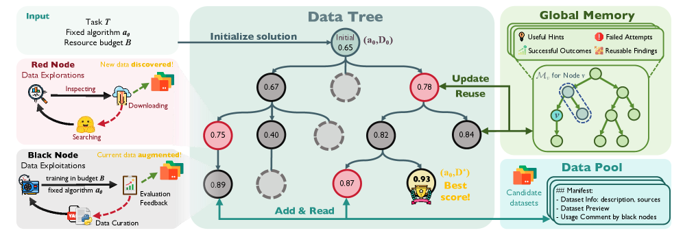
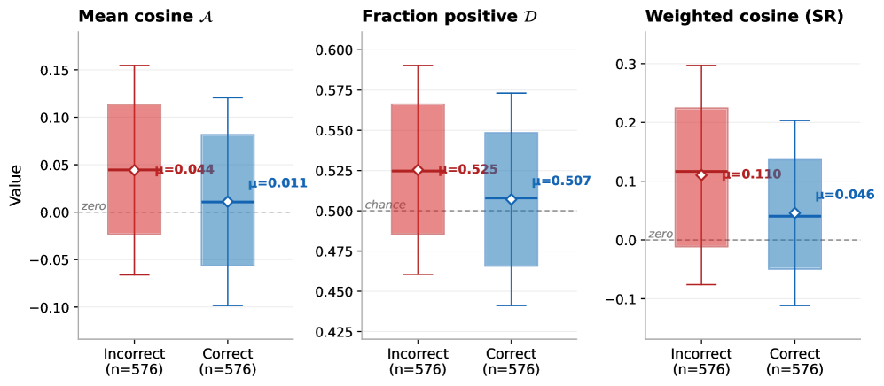

# 🔬 LLM Research Wiki

> AI/ML 领域的维基式知识库。按概念组织，论文为据，持续更新。
> 最后更新：2026-05-12 | 概念：61 | 论文：116

---

## 🌟 今日新论文

> 2026-05-12 自动更新，共 8 篇。这里是网站版每日论文导读；点击标题进入论文页面查看摘要、方法信号、相关主题和关键图示。

  
  

    <h3><a href="entities/papers/2605-10938v1-elf-embedded-language-flows.html">ELF: Embedded Language Flows</a></h3>
    
2026-05-11 · cs.CL, cs.AI, cs.LG · 大语言模型 / 多模态学习

    
<strong>方法/亮点：</strong>We propose Embedded Language Flows (ELF), a class of diffusion models in continuous embedding space based on continuous-time Flow Matching.

    
<strong>摘要（中文）：</strong>扩散和基于流的模型已成为生成连续数据的事实上的方法，例如在图像和视频等领域。他们的成功引起了人们越来越多的兴趣将其应用于语言建模。与图像领域的模型不同，当今领先的扩散语言模型 (DLM) 主要在离散标记上运行。在本文中，我们证明连续 DLM 可以通过对离散域的最小适应而变得有效。我们提出了嵌入式语言流（ELF），这是一类基于连续时间流匹配的连续嵌入空间中的扩散模型。与现有的 DLM 不同，ELF 主要停留在连续嵌入空间内，直到最后一个时...

    
<strong>Abstract:</strong> Diffusion and flow-based models have become the de facto approaches for generating continuous data, e.g., in domains such as images and videos. Their success has attracted growing interest in applying them to language mo...

  

  
  

    <h3><a href="entities/papers/2605-10934v1-variational-inference-for-lvy-process-driven-sdes.html">Variational Inference for Lévy Process-Driven SDEs via Neural Tilting</a></h3>
    
2026-05-11 · cs.LG, cs.AI, cs.CV · 基准评估 / AI安全与对齐 / 世界模型

    
<strong>方法/亮点：</strong>Our approach constructs a flexible variational family by exponentially reweighting the Lévy measure using neural networks.

    
<strong>摘要（中文）：</strong>对极端事件和重尾现象进行建模对于在金融、气候科学和安全关键型人工智能等领域构建可靠的预测系统至关重要。虽然 Lévy 过程为捕获跳跃和重尾提供了一个自然的数学框架，但 Lévy 驱动的随机微分方程 (SDE) 的贝叶斯推理仍然难以用现有方法处理：蒙特卡洛方法很严格，但缺乏可扩展性，而神经变分推理方法很有效，但依赖于无法捕获不连续性的高斯假设。我们通过在 Lévy 驱动的 SDE 中引入用于变分推理的神经指数倾斜框架来解决这种紧张关系。我...

    
<strong>Abstract:</strong> Modelling extreme events and heavy-tailed phenomena is central to building reliable predictive systems in domains such as finance, climate science, and safety-critical AI. While Lévy processes provide a natural mathemati...

  

  
  

    <h3><a href="entities/papers/2605-10916v1-confidence-guided-diffusion-augmentation-for-enhan.html">Confidence-Guided Diffusion Augmentation for Enhanced Bangla Compound Character Recognition</a></h3>
    
2026-05-11 · cs.CV, cs.AI · 大语言模型 / 多模态学习 / 基准评估

    
<strong>方法/亮点：</strong>In this work, we propose a confidence-guided diffusion augmentation framework for low-resolution Bangla compound character recognition.

    
<strong>摘要（中文）：</strong>由于字符结构复杂、类内差异大以及高质量注释数据的可用性有限，手写孟加拉复合字符的识别仍然是一个具有挑战性的问题。现有的孟加拉语手写字符识别系统通常很难概括不同的书写风格，特别是对于包含复杂连字和变音变体的复合字符。在这项工作中，我们提出了一种用于低分辨率孟加拉语复合字符识别的置信引导扩散增强框架。我们的框架将类条件扩散建模与分类器指导相结合，以合成高质量的手写复合字符样本。为了进一步提高生成质量，我们在扩散模型的 U-Net 主干中引入...

    
<strong>Abstract:</strong> Recognition of handwritten Bangla compound characters remains a challenging problem due to complex character structures, large intra-class variation, and limited availability of high-quality annotated data. Existing Bang...

  

  
  

    <h3><a href="entities/papers/2605-10913v1-shepherd-a-runtime-substrate-empowering-meta-agent.html">Shepherd: A Runtime Substrate Empowering Meta-Agents with a Formalized Execution Trace</a></h3>
    
2026-05-11 · cs.AI, cs.PL, cs.SE · 大语言模型 / 强化学习 / 基准评估 / 智能体

    
<strong>方法/亮点：</strong>We introduce Shepherd, a functional programming model that formalizes meta-agent operations on target agents as functions, with core operations mechanized in Lean.

    
<strong>摘要（中文）：</strong>我们引入 Shepherd，这是一种函数式编程模型，它将目标代理上的元代理操作形式化为函数，并在精益中机械化核心操作。 Shepherd 将每个代理与环境的交互记录为类似 Git 的执行跟踪中的类型化事件，从而可以分叉和重播任何过去的状态。该系统分叉代理进程及其文件系统比 Docker 快 $5\time$，在重放时实现 $&gt;95\%$ 提示缓存重用。我们通过三个应用程序演示该模型。首先，在运行时干预中，现场主管将 CooperBenc...

    
<strong>Abstract:</strong> We introduce Shepherd, a functional programming model that formalizes meta-agent operations on target agents as functions, with core operations mechanized in Lean. Shepherd records every agent-environment interaction as ...

  

  
  

    <h3><a href="entities/papers/2605-10907v1-engineering-robustness-into-personal-agents-with-t.html">Engineering Robustness into Personal Agents with the AI Workflow Store</a></h3>
    
2026-05-11 · cs.CR, cs.AI · 大语言模型 / 基准评估 / AI安全与对齐 / 智能体

    
<strong>方法/亮点：</strong>We argue that this paradigm short-circuits disciplined software engineering (SE) processes -- iterative design, rigorous testing, adversarial evaluation, staged deployment, and more -- that have delivered the (relatively) reliable and secur

    
<strong>摘要（中文）：</strong>人工智能代理的主导范例是“即时”循环，其中代理综合计划并在几秒或几分钟内执行操作以响应用户提示。我们认为，这种范式短路了严格的软件工程（SE）流程——迭代设计、严格测试、对抗性评估、分阶段部署等等——这些流程提供了我们今天使用的（相对）可靠和安全的系统。通过专注于快速、实时的综合，人工智能代理是否可以有效地为用户提供临时原型，而不是适合用户可能无意中应用它们的高风险场景的系统？本文认为需要将严格的 SE 流程集成到代理循环中，以生成生产...

    
<strong>Abstract:</strong> The dominant paradigm for AI agents is an &quot;on-the-fly&quot; loop in which agents synthesize plans and execute actions within seconds or minutes in response to user prompts. We argue that this paradigm short-circuits disciplin...

  

  
  

    <h3><a href="entities/papers/2605-10906v1-datamaster-towards-autonomous-data-engineering-for.html">DataMaster: Towards Autonomous Data Engineering for Machine Learning</a></h3>
    
2026-05-11 · cs.LG, cs.AI · 基准评估 / 自动驾驶 / 图神经网络 / 智能体

    
<strong>方法/亮点：</strong>To address the open-ended search space, branch-dependent refinement, and delayed validation inherent in autonomous data engineering, we propose DataMaster, a data-agent framework that integrates tree-structured search, shared candidate data

    
<strong>摘要（中文）：</strong>随着模型系列、训练方法和计算预算变得越来越标准化，机器学习系统的进一步收益越来越依赖于数据。然而，数据工程仍然主要是手动和临时的：从业者反复搜索外部数据集，使它们适应现有的管道，通过下游培训验证候选数据，并从先前的尝试中吸取教训。我们研究任务条件自主数据工程，其中自主代理通过仅优化数据侧来改进固定学习算法，包括外部数据发现、数据选择和组合、清理和转换。目标是在保持学习算法不变的情况下获得更强的下游解决方案。为了解决自主数据工程中固有的开...

    
<strong>Abstract:</strong> As model families, training recipes, and compute budgets become increasingly standardized, further gains in machine learning systems depend increasingly on data. Yet data engineering remains largely manual and ad hoc: pr...

  

  
  

    <h3><a href="entities/papers/2605-10889v1-unmasking-on-policy-distillation-where-it-helps-wh.html">Unmasking On-Policy Distillation: Where It Helps, Where It Hurts, and Why</a></h3>
    
2026-05-11 · cs.LG, cs.AI · 大语言模型 / 强化学习 / 基准评估 / AI安全与对齐

    
<strong>方法/亮点：</strong>We introduce a training-free diagnostic framework that operates at the highest resolution: per token, per question, and per teacher.

    
<strong>摘要（中文）：</strong>在策略蒸馏为训练推理模型提供密集的、按令牌的监督；然而，目前尚不清楚该信号在哪些条件下有益，在哪些条件下有害。应该采用哪种教师模式，在自我蒸馏的情况下，应该以哪种具体情境作为监督信号？不同代币的最佳选择是否有所不同？目前，解决这些问题通常需要昂贵的训练运行，其总体性能指标掩盖了单个代币级别的动态。我们引入了一个免培训的诊断框架，该框架以最高分辨率运行：每个令牌、每个问题和每个教师。我们推导出一个理想的每节点梯度，定义为最大程度地增加学生...

    
<strong>Abstract:</strong> On-policy distillation offers dense, per-token supervision for training reasoning models; however, it remains unclear under which conditions this signal is beneficial and under which it is detrimental. Which teacher mode...

  

  
  

    <h3><a href="entities/papers/2605-10888v1-shields-to-guarantee-probabilistic-safety-in-mdps.html">Shields to Guarantee Probabilistic Safety in MDPs</a></h3>
    
2026-05-11 · cs.LO, cs.AI · 基准评估 / AI安全与对齐 / 自动驾驶 / 智能体

    
<strong>方法/亮点：</strong>Shielding is a prominent model-based technique to ensure safety of autonomous agents.

    
<strong>摘要（中文）：</strong>屏蔽是一种重要的基于模型的技术，可确保自主代理的安全。经典屏蔽旨在确保不会发生任何不良情况，并提供安全性和最大允许性的强有力保证。然而，概率安全屏蔽系统（允许不良事件以可接受的概率发生）已被证明更加复杂。本文提出了一个正式的框架，保守地将经典屏蔽扩展到概率安全。在此框架中，我们（i）证明了不可能保留对安全性和许可性的强有力保障，（ii）提供保障较弱的天然屏障，以及（iii）引入离线和在线屏障建设，以确保强有力的安全保障。实证评估强调了新...

    
<strong>Abstract:</strong> Shielding is a prominent model-based technique to ensure safety of autonomous agents. Classical shielding aims to ensure that nothing bad ever happens and comes with strong guarantees about safety and maximal permissiven...

  

---

## 🧭 知识导航

### 核心概念

| 概念 | 说明 | 论文数 |
|------|------|--------|
| [大语言模型](concepts/large-language-model.html) | GPT、LLaMA 等大规模预训练语言模型 | 8 |
| [强化学习](concepts/reinforcement-learning.html) | RLHF、RLVR、DPO、GRPO 等对齐技术 | 2 |
| [多模态学习](concepts/multimodal-learning.html) | 视觉-语言模型、跨模态推理 | 2 |
| [知识蒸馏](concepts/knowledge-distillation.html) | 教师-学生框架、黑箱蒸馏、策略蒸馏 | 1 |
| [世界模型](concepts/world-models.html) | 环境动态预测与生成 | 1 |
| [基准评估](concepts/benchmarking.html) | 标准化测试与评估方法论 | 2 |
| [智能体](concepts/ai-agents.html) | LLM 驱动的自主代理与多代理协作 | 8 |
| [图神经网络](concepts/graph-neural-networks.html) | 图结构学习与推理 | 1 |
| [自动驾驶](concepts/autonomous-driving.html) | 感知、预测、规划与世界模型 | 1 |
| [AI安全与对齐](concepts/ai-safety-alignment.html) | 对齐问题、对抗训练、安全评估 | 2 |

### 技术方向

- **训练方法** → [强化学习](concepts/reinforcement-learning.html) | [知识蒸馏](concepts/knowledge-distillation.html)
- **模型架构** → [大语言模型](concepts/large-language-model.html) | [图神经网络](concepts/graph-neural-networks.html) | [世界模型](concepts/world-models.html)
- **应用场景** → [自动驾驶](concepts/autonomous-driving.html) | [医学AI](concepts/medical-ai.html) | [智能体](concepts/ai-agents.html)
- **评估与安全** → [基准评估](concepts/benchmarking.html) | [AI安全与对齐](concepts/ai-safety-alignment.html)
