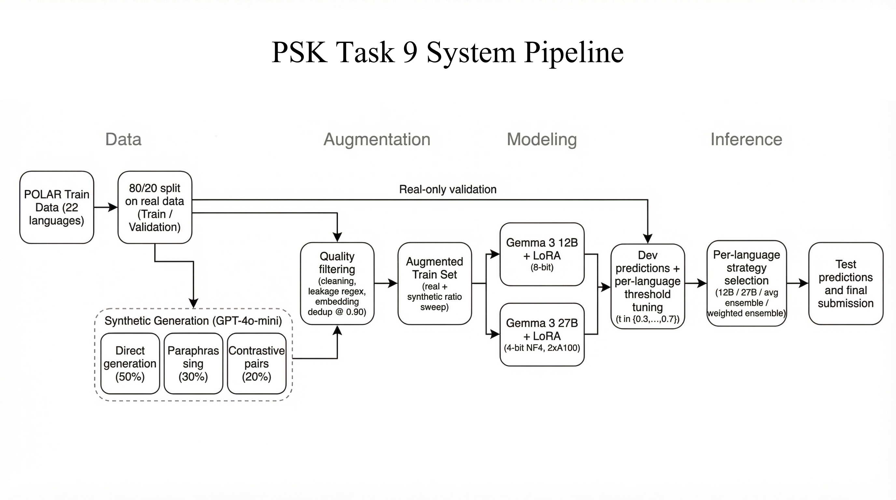
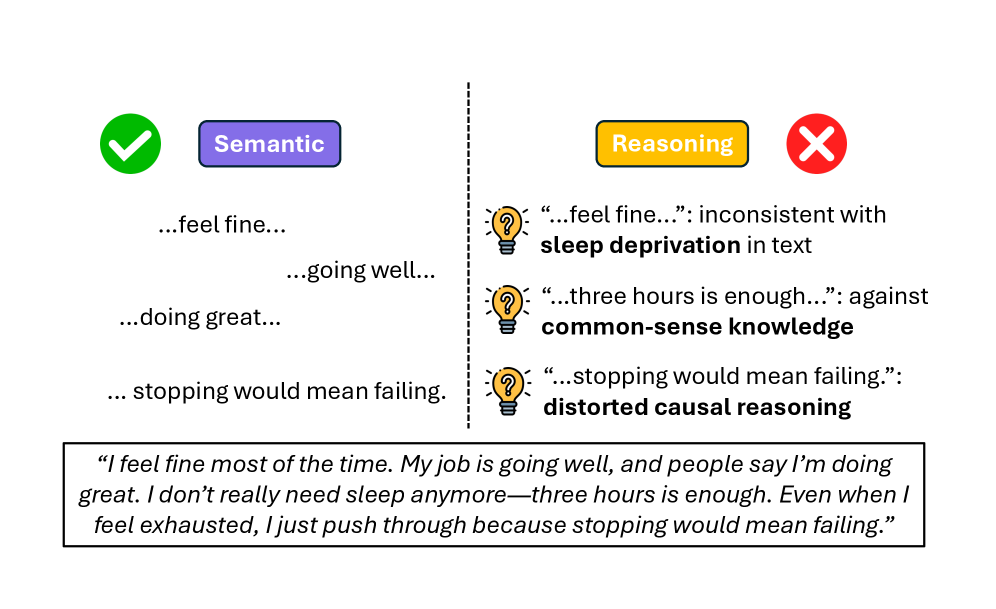
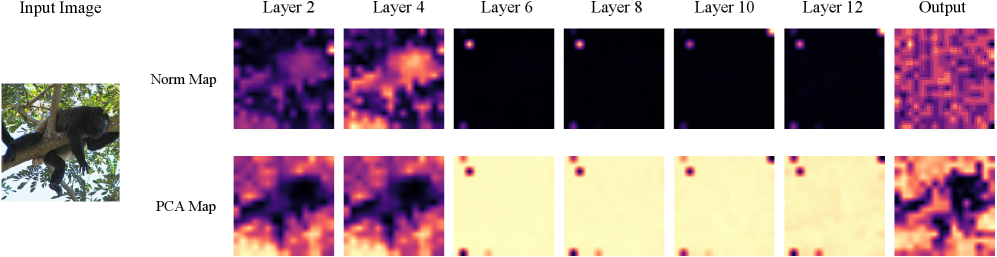

# 🔬 LLM Research Wiki

> AI/ML 领域的维基式知识库。按概念组织，论文为据，持续更新。
> 最后更新：2026-05-07 | 概念：61 | 论文：70

---

## 🌟 今日新论文

> 2026-05-07 自动更新，共 10 篇。这里是网站版每日论文导读；点击标题进入论文页面查看摘要、方法信号、相关主题和关键图示。

  
  

    <h3><a href="entities/papers/2605-05197v1-implicit-representations-of-grammaticality-in-lang.html">Implicit Representations of Grammaticality in Language Models</a></h3>
    
2026-05-06 · cs.CL · 大语言模型 / 基准评估

    
<strong>方法/亮点：</strong>Grammaticality and likelihood are distinct notions in human language.

    
<strong>摘要（中文）：</strong>语法性和可能性是人类语言中不同的概念。预训练语言模型 (LM) 是一种适合最大化语料库可能性的语言概率模型，生成语法良好的文本，并在严格控制的最小对中很好地区分语法句子和不语法句子。然而，它们的字符串概率总体上并不能严格区分语法句子和非语法句子。但是 LM 是否隐含地获得了与字符串概率不同的语法区别？我们通过研究 LM 的内部表示来探索这个问题，方法是在通过对自然文本语料库应用扰动而获得的语法和（合成）非语法句子数据集上训练线性探针。我...

    
<strong>Abstract:</strong> Grammaticality and likelihood are distinct notions in human language. Pretrained language models (LMs), which are probabilistic models of language fitted to maximize corpus likelihood, generate grammatically well-formed ...

  

  
  

    <h3><a href="entities/papers/2605-05175v1-mri-eval-a-tiered-benchmark-for-evaluating-llm-per.html">MRI-Eval: A Tiered Benchmark for Evaluating LLM Performance on MRI Physics and GE Scanner Operations Knowledge</a></h3>
    
2026-05-06 · eess.IV, cs.CL, physics.med-ph · 大语言模型 / 基准评估

    
<strong>方法/亮点：</strong>Purpose: We developed MRI-Eval, a tiered benchmark for relative model comparison on MRI physics and GE scanner operations knowledge using primary multiple-choice questions (MCQ), with stem-only and primed diagnostic conditions as complement

    
<strong>摘要（中文）：</strong>背景：现有的 MRI LLM 基准主要依赖于复习书籍的多项选择题，其中顶级专有模型已经得分很高，限制了歧视。没有系统的基准评估对研究 MRI 实践至关重要的特定供应商扫描仪操作知识。目的：我们开发了 MRI-Eval，这是一种使用初级多项选择题 (MCQ) 进行 MRI 物理和 GE 扫描仪操作知识的相对模型比较的分层基准，并以纯干和启动诊断条件作为补充分析。方法：MRI-Eval 包括来自教科书、GE 扫描仪手册、编程课程材料和专家生...

    
<strong>Abstract:</strong> Background: Existing MRI LLM benchmarks rely mainly on review-book multiple-choice questions, where top proprietary models already score highly, limiting discrimination. No systematic benchmark has evaluated vendor-speci...

  

  
  

    <h3><a href="entities/papers/2605-05166v1-the-first-token-knows-single-decode-confidence-for.html">The First Token Knows: Single-Decode Confidence for Hallucination Detection</a></h3>
    
2026-05-06 · cs.CL, cs.AI · 大语言模型 / 基准评估

    
<strong>方法/亮点：</strong>Self-consistency detects hallucinations by generating multiple sampled answers to a question and measuring agreement, but this requires repeated decoding and can be sensitive to lexical variation.

    
<strong>摘要（中文）：</strong>自我一致性通过生成问题的多个采样答案并测量一致性来检测幻觉，但这需要重复解码，并且可能对词汇变化敏感。语义自一致性通过使用自然语言推理对采样答案进行聚类来改善这一点，但它增加了采样成本和外部推理开销。我们表明，第一个令牌置信度 phi_first 是根据单个贪婪解码的第一个内容承载答案令牌处的前 K 个逻辑的归一化熵计算得出的，匹配或适度超过了闭卷简答事实问答的语义自洽性。在三个 7-8B 指令调整模型和两个基准测试中，phi_firs...

    
<strong>Abstract:</strong> Self-consistency detects hallucinations by generating multiple sampled answers to a question and measuring agreement, but this requires repeated decoding and can be sensitive to lexical variation. Semantic self-consisten...

  

  
  

    <h3><a href="entities/papers/2605-05159v1-psk-at-semeval-2026-task-9-multilingual-polarizati.html">PSK at SemEval-2026 Task 9: Multilingual Polarization Detection Using Ensemble Gemma Models with Synthetic Data Augmentation</a></h3>
    
2026-05-06 · cs.CL, cs.AI, cs.LG · 大语言模型

    
<strong>方法/亮点：</strong>We present our system for SemEval-2026 Task 9: Multilingual Polarization Detection, a binary classification task spanning 22 languages.

    
<strong>摘要（中文）：</strong>我们展示了用于 SemEval-2026 任务 9 的系统：多语言极化检测，这是一项涵盖 22 种语言的二元分类任务。我们的方法使用低秩适应 (LoRA) 微调每种语言的单独 Gemma~3 模型（12B 和 27B 参数），并通过大型语言模型 (LLM) 生成的合成数据进行增强。我们使用 GPT-4o-mini 采用三种合成数据策略（直接生成、释义和对比对创建），并具有多级质量过滤管道，包括基于嵌入的重复数据删除。我们发现，在开发集上...

    
<strong>Abstract:</strong> We present our system for SemEval-2026 Task 9: Multilingual Polarization Detection, a binary classification task spanning 22 languages. Our approach fine-tunes separate Gemma~3 models (12B and 27B parameters) per languag...

  

  
  

    <h3><a href="entities/papers/2605-05121v1-beyond-semantics-an-evidential-reasoning-aware-mul.html">Beyond Semantics: An Evidential Reasoning-Aware Multi-View Learning Framework for Trustworthy Mental Health Prediction</a></h3>
    
2026-05-06 · cs.CL · 大语言模型 / 基准评估 / AI安全与对齐 / 医学AI

    
<strong>方法/亮点：</strong>Automated mental health prediction using textual data has shown promising results with deep learning and large language models.

    
<strong>摘要（中文）：</strong>使用文本数据进行的自动心理健康预测通过深度学习和大型语言模型显示出了有希望的结果。然而，在高风险的现实环境中部署这些模型仍然具有挑战性，因为现有的方法在很大程度上依赖于语义表示，并且经常在模糊、噪声或变化的数据下产生过度自信的预测。此外，大多数方法缺乏可靠的不确定性估计，破坏了对风险敏感的心理健康应用的信任。为了解决这些限制，我们将该任务制定为一个多视图学习问题，它将来自仅编码器模型的语义信息与来自仅解码器模型的高级推理信息集成在一起，...

    
<strong>Abstract:</strong> Automated mental health prediction using textual data has shown promising results with deep learning and large language models. However, deploying these models in high-stakes real-world settings remains challenging, as e...

  

  
  

    <h3><a href="entities/papers/2605-05103v1-text-corpora-as-concept-fields-black-box-hallucina.html">Text Corpora as Concept Fields: Black-Box Hallucination and Novelty Measurement</a></h3>
    
2026-05-06 · cs.CL, cs.AI, cs.CY · 大语言模型 / 强化学习 / AI安全与对齐

    
<strong>方法/亮点：</strong>We introduce the **Concept Field** of a text corpus: a local drift field with pointwise uncertainty, estimated in sentence-embedding space from the deltas between consecutive sentences.

    
<strong>摘要（中文）：</strong>我们引入文本语料库的**概念场**：具有逐点不确定性的局部漂移场，根据连续句子之间的增量在句子嵌入空间中估计。给定一个候选句子转换，我们通过 $z$ 对其与场的一致性进行评分，$z$ 是观察到的增量与场的局部高斯估计之间的平均绝对 z 距离。分数是黑盒的（没有模型内部），可归因于语料库（每个分数都追溯到附近的语料库句子），并且允许直接概率阅读。我们通过引入**向量序列数据库（VSDB）**来支持计算，该数据库将嵌入以及序列位置和下一个增...

    
<strong>Abstract:</strong> We introduce the **Concept Field** of a text corpus: a local drift field with pointwise uncertainty, estimated in sentence-embedding space from the deltas between consecutive sentences. Given a candidate sentence transit...

  

  
  

    <h3><a href="entities/papers/2605-05097v1-continual-knowledge-updating-in-llm-systems-learni.html">Continual Knowledge Updating in LLM Systems: Learning Through Multi-Timescale Memory Dynamics</a></h3>
    
2026-05-06 · cs.LG, cs.AI, cs.CL · 大语言模型 / 图神经网络 / 世界模型

    
<strong>方法/亮点：</strong>LLMs are trained once, then deployed into a world that never stops changing.

    
<strong>摘要（中文）：</strong>法学硕士接受一次培训，然后部署到一个永不停息变化的世界。外部存储器弥补了这一点，但大多数系统显式管理它而不是让它自行适应。生物记忆的工作方式有所不同：耦合的多时间尺度动态使新的联想立即可用，加强重复所确认的内容，并让其余的消失。我们认为外部记忆应该遵循类似的原则。在 Memini 中，这种视图采用联想记忆的形式，将知识组织为有向图。每条边都带有两个耦合的内部变量，一个快，一个慢，遵循突触巩固的 Benna-Fusi 模型。在这种耦合中，...

    
<strong>Abstract:</strong> LLMs are trained once, then deployed into a world that never stops changing. External memory compensates for this, but most systems manage it explicitly rather than letting it adapt on its own. Biological memory works di...

  

  
  

    <h3><a href="entities/papers/2605-05090v1-automatically-finding-and-validating-unexpected-si.html">Automatically Finding and Validating Unexpected Side-Effects of Interventions on Language Models</a></h3>
    
2026-05-06 · cs.CL, cs.AI · 大语言模型 / 基准评估 / 智能体

    
<strong>方法/亮点：</strong>We present an automated, contrastive evaluation pipeline for auditing the behavioral impact of interventions on large language models.

    
<strong>摘要（中文）：</strong>我们提出了一个自动化的对比评估流程，用于审核干预措施对大型语言模型的行为影响。给定基本模型 $M_1$ 和干预模型 $M_2$，我们的方法在对齐的提示上下文中比较它们的自由形式、多标记生成，并生成人类可读的、经统计验证的自然语言假设，描述模型的差异，以及总结经过验证的假设的模式的重复主题。我们通过注入已知的行为变化并表明管道可靠地恢复它们来评估合成环境中的方法。然后，我们将其应用于三种现实世界的干预措施：推理蒸馏、知识编辑和忘却，证明该...

    
<strong>Abstract:</strong> We present an automated, contrastive evaluation pipeline for auditing the behavioral impact of interventions on large language models. Given a base model $M_1$ and an intervention model $M_2$, our method compares their f...

  

  
  

    <h3><a href="entities/papers/2605-05206v1-taming-outlier-tokens-in-diffusion-transformers.html">Taming Outlier Tokens in Diffusion Transformers</a></h3>
    
2026-05-06 · cs.CV, cs.AI, cs.LG · 大语言模型 / 多模态学习

    
<strong>方法/亮点：</strong>To address this issue, we introduce Dual-Stage Registers (DSR), a register-based intervention for both components: trained registers when available, recursive test-time registers otherwise, and diffusion registers for the denoiser.

    
<strong>摘要（中文）：</strong>我们研究用于图像生成的扩散变压器（DiT）中的异常标记。先前的工作表明，视觉变压器（ViT）可以产生少量高规范令牌，这些令牌在携带有限的本地信息的同时吸引了过多的注意力，但它们在生成模型中的作用仍未得到充分探索。我们证明这种现象出现在现代表示自动编码器（RAE）-DiT 管道的编码器和降噪器中：预训练的 ViT 编码器可以产生离群表示，而 DiT 本身可以开发内部离群标记，尤其是在中间层。此外，简单地屏蔽高范数标记并不能提高性能，这表明...

    
<strong>Abstract:</strong> We study outlier tokens in Diffusion Transformers (DiTs) for image generation. Prior work has shown that Vision Transformers (ViTs) can produce a small number of high-norm tokens that attract disproportionate attention w...

  

  
  

    <h3><a href="entities/papers/2605-05193v1-grokability-in-five-inequalities.html">Grokability in five inequalities</a></h3>
    
2026-05-06 · math.PR, cs.AI, math.AP · math.PR, cs.AI, math.AP

    
<strong>方法/亮点：</strong>In this note, we report five mathematical discoveries made in collaboration with Grok, all of which have been subsequently verified by the authors.

    
<strong>摘要（中文）：</strong>在这篇文章中，我们报告了与 Grok 合作的五项数学发现，所有这些发现都随后得到了作者的验证。其中包括 $\mathbb{R}^n$ 中凸集最大高斯周长的改进下界、汉明立方 $\{-1,1\}^n$ 上更尖锐的 $L_2$-$L_1$ 矩比较不等式、强化的自卷积不等式、$\{1,\dots,n\}$ 中最大 $g$-Sidon 集大小的改进渐近边界，以及最佳平衡萨雷克不等式。

    
<strong>Abstract:</strong> In this note, we report five mathematical discoveries made in collaboration with Grok, all of which have been subsequently verified by the authors. These include an improved lower bound on the maximal Gaussian perimeter ...

  

---

## 🧭 知识导航

### 核心概念

| 概念 | 说明 | 论文数 |
|------|------|--------|
| [大语言模型](concepts/large-language-model.html) | GPT、LLaMA 等大规模预训练语言模型 | 8 |
| [强化学习](concepts/reinforcement-learning.html) | RLHF、RLVR、DPO、GRPO 等对齐技术 | 2 |
| [多模态学习](concepts/multimodal-learning.html) | 视觉-语言模型、跨模态推理 | 2 |
| [知识蒸馏](concepts/knowledge-distillation.html) | 教师-学生框架、黑箱蒸馏、策略蒸馏 | 1 |
| [世界模型](concepts/world-models.html) | 环境动态预测与生成 | 1 |
| [基准评估](concepts/benchmarking.html) | 标准化测试与评估方法论 | 2 |
| [智能体](concepts/ai-agents.html) | LLM 驱动的自主代理与多代理协作 | 8 |
| [图神经网络](concepts/graph-neural-networks.html) | 图结构学习与推理 | 1 |
| [自动驾驶](concepts/autonomous-driving.html) | 感知、预测、规划与世界模型 | 1 |
| [AI安全与对齐](concepts/ai-safety-alignment.html) | 对齐问题、对抗训练、安全评估 | 2 |

### 技术方向

- **训练方法** → [强化学习](concepts/reinforcement-learning.html) | [知识蒸馏](concepts/knowledge-distillation.html)
- **模型架构** → [大语言模型](concepts/large-language-model.html) | [图神经网络](concepts/graph-neural-networks.html) | [世界模型](concepts/world-models.html)
- **应用场景** → [自动驾驶](concepts/autonomous-driving.html) | [医学AI](concepts/medical-ai.html) | [智能体](concepts/ai-agents.html)
- **评估与安全** → [基准评估](concepts/benchmarking.html) | [AI安全与对齐](concepts/ai-safety-alignment.html)
