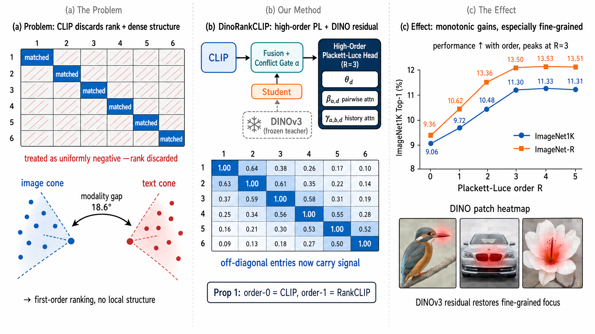

# 🔬 LLM Research Wiki

> AI/ML 领域的维基式知识库。按概念组织，论文为据，持续更新。
> 最后更新：2026-05-09 | 概念：61 | 论文：90

---

## 🌟 今日新论文

> 2026-05-09 自动更新，共 10 篇。这里是网站版每日论文导读；点击标题进入论文页面查看摘要、方法信号、相关主题和关键图示。

  
  

    <h3><a href="entities/papers/2605-06664v1-bami-training-free-bias-mitigation-in-gui-groundin.html">BAMI: Training-Free Bias Mitigation in GUI Grounding</a></h3>
    
2026-05-07 · cs.CV, cs.AI · 多模态学习 / 基准评估 / AI安全与对齐 / 智能体

    
<strong>方法/亮点：</strong>To address these challenges, we introduce \textbf{Bias-Aware Manipulation Inference (BAMI)}, which incorporates two key manipulations, coarse-to-fine focus and candidate selection, to effectively mitigate these biases.

    
<strong>摘要（中文）：</strong>GUI 接地是使 GUI 代理能够执行单击和拖动等任务的关键功能。然而，在 ScreenSpot-Pro 基准测试等复杂场景中，现有模型的性能常常不佳。利用所提出的\textbf{掩模预测分布（MPD）}归因方法，我们发现错误的主要来源有两个：高图像分辨率（导致精度偏差）和复杂的界面元素（导致模糊性偏差）。为了应对这些挑战，我们引入了偏差感知操纵推理（BAMI），它结合了两个关键操作，从粗到细的聚焦和候选选择，以有效地减轻这些偏差。我们...

    
<strong>Abstract:</strong> GUI grounding is a critical capability for enabling GUI agents to execute tasks such as clicking and dragging. However, in complex scenarios like the ScreenSpot-Pro benchmark, existing models often suffer from suboptimal...

  

  
  

    <h3><a href="entities/papers/2605-06658v1-relit-live-relight-video-by-jointly-learning-envir.html">Relit-LiVE: Relight Video by Jointly Learning Environment Video</a></h3>
    
2026-05-07 · cs.CV · 多模态学习 / 基准评估 / AI安全与对齐 / 智能体

    
<strong>方法/亮点：</strong>In this work, we present Relit-LiVE, a novel video relighting framework that produces physically consistent, temporally stable results without requiring prior knowledge of camera pose.

    
<strong>摘要（中文）：</strong>最近的进展表明，大规模视频扩散模型可以重新用作神经渲染器，首先将视频分解为内在场景表示，然后在新颖的照明下执行前向渲染。虽然很有希望，但这种范例从根本上依赖于准确的内在分解，这对于现实世界的视频来说仍然非常不可靠，并且经常导致外观扭曲、材料损坏以及重新照明期间累积​​的时间伪影。在这项工作中，我们提出了 Relit-LiVE，这是一种新颖的视频重新照明框架，可以产生物理一致、时间稳定的结果，而无需事先了解相机姿势。我们的主要见解是将原始...

    
<strong>Abstract:</strong> Recent advances have shown that large-scale video diffusion models can be repurposed as neural renderers by first decomposing videos into intrinsic scene representations and then performing forward rendering under novel ...

  

  
  

    <h3><a href="entities/papers/2605-06643v1-are-we-making-progress-in-multimodal-domain-genera.html">Are We Making Progress in Multimodal Domain Generalization? A Comprehensive Benchmark Study</a></h3>
    
2026-05-07 · cs.CV, cs.AI, cs.LG · 多模态学习 / 基准评估 / AI安全与对齐

    
<strong>方法/亮点：</strong>To address this issue, we introduce MMDG-Bench, the first unified and comprehensive benchmark for MMDG, which standardizes evaluation across six datasets spanning three diverse tasks: action recognition, mechanical fault diagnosis, and sent

    
<strong>摘要（中文）：</strong>尽管用于增强模型鲁棒性的多模态域泛化（MMDG）越来越受欢迎，但仍不清楚报告的性能增益是否反映了真正的算法进展，还是不一致的评估协议的产物。目前的研究是分散的，研究在数据集、模态配置和实验设置方面存在显着差异。此外，现有的基准主要关注动作识别，往往忽略了现实世界的关键挑战，例如输入损坏、模式缺失和模型可信度。标准化的缺乏阻碍了对该领域进展的可靠评估。为了解决这个问题，我们引入了 MMDG-Bench，这是第一个统一且全面的 MMDG 基...

    
<strong>Abstract:</strong> Despite the growing popularity of Multimodal Domain Generalization (MMDG) for enhancing model robustness, it remains unclear whether reported performance gains reflect genuine algorithmic progress or are artifacts of inc...

  

  
  

    <h3><a href="entities/papers/2605-06641v1-glazybench-a-benchmark-for-ceramic-glaze-property.html">GlazyBench: A Benchmark for Ceramic Glaze Property Prediction and Image Generation</a></h3>
    
2026-05-07 · cs.AI, cs.CV · 大语言模型 / 多模态学习 / 基准评估

    
<strong>方法/亮点：</strong>We propose GlazyBench, the first dataset for AI-assisted glaze design.

    
<strong>摘要（中文）：</strong>由于化学成分复杂，开发陶瓷釉料是一个成本高昂、耗时的反复试验过程，给独立艺术家带来了沉重的负担。虽然多模式人工智能的最新进展提供了现代解决方案，但该领域缺乏训练这些模型所需的大规模数据集。我们提出 GlazyBench，这是人工智能辅助釉料设计的第一个数据集。 GlazyBench 包含 23,148 种真实釉料配方，支持两项主要任务：预测原材料烧成后的表面特性，例如颜色和透明度，并根据这些特性生成釉料的准确视觉表示。我们使用传统机器学...

    
<strong>Abstract:</strong> Developing ceramic glazes is a costly, time-consuming process of trial and error due to complex chemistry, placing a significant burden on independent artists. While recent advances in multimodal AI offer a modern soluti...

  

  
  

    <h3><a href="entities/papers/2605-06637v1-dpm-dynamic-masked-metric-learning-for-occluded-pe.html">DPM++: Dynamic Masked Metric Learning for Occluded Person Re-identification</a></h3>
    
2026-05-07 · cs.CV · 基准评估 / AI安全与对齐

    
<strong>方法/亮点：</strong>In this paper, we propose DPM++, a Dynamic Masked Metric Learning framework for occluded person re-identification.

    
<strong>摘要（中文）：</strong>尽管行人重识别取得了令人瞩目的进展，但障碍物造成的遮挡在实际应用中仍然是一个悬而未决的问题。困难在于不完整的遮挡样本与整体身份表示之间的不匹配。严重的遮挡消除了有区别的身体线索，并引入了背景杂乱和遮挡物的干扰，使得全局度量学习变得不可靠。现有方法主要依靠额外的预训练模型来估计可见部分以进行对齐或通过数据增强构建遮挡样本，但仍然缺乏一个统一的框架来学习现实遮挡模式下鲁棒的可见性一致匹配。在本文中，我们提出了 DPM++，一种用于遮挡人员重...

    
<strong>Abstract:</strong> Although person re-identification has made impressive progress, occlusion caused by obstacles remains an unsettled issue in real applications. The difficulty lies in the mismatch between incomplete occluded samples and h...

  

  
  

    <h3><a href="entities/papers/2605-06610v1-softsae-dynamic-top-k-selection-for-adaptive-spars.html">SoftSAE: Dynamic Top-K Selection for Adaptive Sparse Autoencoders</a></h3>
    
2026-05-07 · cs.LG, cs.CV · 大语言模型 / 智能体

    
<strong>方法/亮点：</strong>To address this issue, we propose SoftSAE, a sparse autoencoder with a Dynamic Top-K selection mechanism.

    
<strong>摘要（中文）：</strong>稀疏自动编码器 (SAE) 已成为机械可解释性的重要工具，有助于分析大型语言模型 (LLM) 和视觉变换器 (ViT) 中的内部表示。通过将多语义激活分解为稀疏的单语义特征集，SAE 旨在将神经网络计算转化为人类可理解的概念。然而，诸如 TopK SAE 之类的常见架构依赖于固定的稀疏级别。它们在所有输入中强制执行相同数量的活动特征 (K)，忽略现实世界数据的不同复杂性。自然数据通常位于具有不同局部固有维数的流形上，这意味着相关因素的数...

    
<strong>Abstract:</strong> Sparse Autoencoders (SAEs) have become an important tool in mechanistic interpretability, helping to analyze internal representations in both Large Language Models (LLMs) and Vision Transformers (ViTs). By decomposing po...

  

  
  

    <h3><a href="entities/papers/2605-06592v1-dinorankclip-dinov3-distillation-and-injection-for.html">DINORANKCLIP: DINOv3 Distillation and Injection for Vision-Language Pretraining with High-Order Ranking Consistency</a></h3>
    
2026-05-07 · cs.CV, cs.AI, cs.LG · 多模态学习 / 基准评估 / AI安全与对齐 / 图神经网络

    
<strong>方法/亮点：</strong>We propose DINORANKCLIP, a pretraining framework that addresses both jointly.

    
<strong>摘要（中文）：</strong>对比语言图像预训练（CLIP）存在两个结构性弱点：对称的 InfoNCE 损失丢弃了不匹配的批内对之间的相对顺序，全局池化将视觉表示折叠成对细粒度局部结构不敏感的语义瓶颈。 RANKCLIP 通过列表方式的 Plackett-Luce 排名一致性损失部分解决了第一个问题，但其模型是严格的一阶模型，并且继承了第二个弱点。我们提出了 DINORANKCLIP，这是一个联合解决这两个问题的预训练框架。我们的主要贡献是通过双分支轻量级学生和具有...

    
<strong>Abstract:</strong> Contrastive language-image pretraining (CLIP) suffers from two structural weaknesses: the symmetric InfoNCE loss discards the relative ordering among unmatched in-batch pairs, and global pooling collapses the visual repr...

  

  
  

    <h3><a href="entities/papers/2605-06654v1-optimizer-model-consistency-full-finetuning-with-t.html">Optimizer-Model Consistency: Full Finetuning with the Same Optimizer as Pretraining Forgets Less</a></h3>
    
2026-05-07 · cs.LG, cs.AI, math.OC · 大语言模型

    
<strong>方法/亮点：</strong>In this paper, we present an observation that full finetuning with the same optimizer as in pretraining achieves a better learning-forgetting tradeoff, i.e., forgetting less while achieving the same or better performance on the new task, th

    
<strong>摘要（中文）：</strong>在训练大型语言模型 (LLM) 时，优化器在预训练和微调阶段都发挥着重要作用。在本文中，我们提出了一个观察结果，即在监督微调（SFT）阶段，使用与预训练相同的优化器进行完全微调可以实现更好的学习-遗忘权衡，即在新任务上实现相同或更好性能的同时，与其他优化器以及可能令人惊讶的 LoRA 相比，遗忘更少。我们将这种现象称为优化器模型一致性。为了更好地理解它，通过受控实验和理论分析，我们表明：1）优化器可以通过对激活进行正则化影响来塑造模型，...

    
<strong>Abstract:</strong> Optimizers play an important role in both pretraining and finetuning stages when training large language models (LLMs). In this paper, we present an observation that full finetuning with the same optimizer as in pretrain...

  

  
  

    <h3><a href="entities/papers/2605-06651v1-ai-co-mathematician-accelerating-mathematicians-wi.html">AI Co-Mathematician: Accelerating Mathematicians with Agentic AI</a></h3>
    
2026-05-07 · cs.AI · 基准评估 / 智能体

    
<strong>方法/亮点：</strong>We introduce the AI co-mathematician, a workbench for mathematicians to interactively leverage AI agents to pursue open-ended research.

    
<strong>摘要（中文）：</strong>我们推出了 AI 联合数学家，这是数学家可以交互地利用 AI 代理进行开放式研究的工作台。 AI 联合数学家经过优化，可为数学工作流程的探索性和迭代现实提供整体支持，包括构思、文献检索、计算探索、定理证明和理论构建。通过提供一个异步、有状态的工作空间来管理不确定性、完善用户意图、跟踪失败的假设并输出本地数学工件，该系统反映了人类协作工作流程。在早期测试中，人工智能联合数学家帮助研究人员解决开放问题，确定新的研究方向，并发现被忽视的文献参...

    
<strong>Abstract:</strong> We introduce the AI co-mathematician, a workbench for mathematicians to interactively leverage AI agents to pursue open-ended research. The AI co-mathematician is optimized to provide holistic support for the exploratory...

  

  
  

    <h3><a href="entities/papers/2605-06647v1-superintelligent-retrieval-agent-the-next-frontier.html">Superintelligent Retrieval Agent: The Next Frontier of Information Retrieval</a></h3>
    
2026-05-07 · cs.IR, cs.AI, cs.LG · 大语言模型 / 基准评估 / 智能体

    
<strong>方法/亮点：</strong>We introduce \textit{SuperIntelligent Retrieval Agent} (SIRA), which defines \emph{superintelligence} in retrieval as the ability to compress multi-round exploratory search into a single corpus-discriminative retrieval action.

    
<strong>摘要（中文）：</strong>检索增强代理越来越多地成为大型组织知识库的接口，但大多数仍然将检索视为黑匣子：它们发出探索性查询，检查返回的片段，并迭代地重新制定，直到出现有用的证据。这种方法类似于新手如何搜索不熟悉的数据库，而不是专家如何利用有关术语和可能证据的强大先验来导航它，并导致不必要的检索轮次、延迟增加和召回率低。我们引入\textit{超级智能检索代理}（SIRA），它将检索中的\emph{超级智能}定义为将多轮探索性搜索压缩为单个语料库判别性检索操作的能...

    
<strong>Abstract:</strong> Retrieval-augmented agents are increasingly the interface to large organizational knowledge bases, yet most still treat retrieval as a black box: they issue exploratory queries, inspect returned snippets, and iteratively...

  

---

## 🧭 知识导航

### 核心概念

| 概念 | 说明 | 论文数 |
|------|------|--------|
| [大语言模型](concepts/large-language-model.html) | GPT、LLaMA 等大规模预训练语言模型 | 8 |
| [强化学习](concepts/reinforcement-learning.html) | RLHF、RLVR、DPO、GRPO 等对齐技术 | 2 |
| [多模态学习](concepts/multimodal-learning.html) | 视觉-语言模型、跨模态推理 | 2 |
| [知识蒸馏](concepts/knowledge-distillation.html) | 教师-学生框架、黑箱蒸馏、策略蒸馏 | 1 |
| [世界模型](concepts/world-models.html) | 环境动态预测与生成 | 1 |
| [基准评估](concepts/benchmarking.html) | 标准化测试与评估方法论 | 2 |
| [智能体](concepts/ai-agents.html) | LLM 驱动的自主代理与多代理协作 | 8 |
| [图神经网络](concepts/graph-neural-networks.html) | 图结构学习与推理 | 1 |
| [自动驾驶](concepts/autonomous-driving.html) | 感知、预测、规划与世界模型 | 1 |
| [AI安全与对齐](concepts/ai-safety-alignment.html) | 对齐问题、对抗训练、安全评估 | 2 |

### 技术方向

- **训练方法** → [强化学习](concepts/reinforcement-learning.html) | [知识蒸馏](concepts/knowledge-distillation.html)
- **模型架构** → [大语言模型](concepts/large-language-model.html) | [图神经网络](concepts/graph-neural-networks.html) | [世界模型](concepts/world-models.html)
- **应用场景** → [自动驾驶](concepts/autonomous-driving.html) | [医学AI](concepts/medical-ai.html) | [智能体](concepts/ai-agents.html)
- **评估与安全** → [基准评估](concepts/benchmarking.html) | [AI安全与对齐](concepts/ai-safety-alignment.html)
