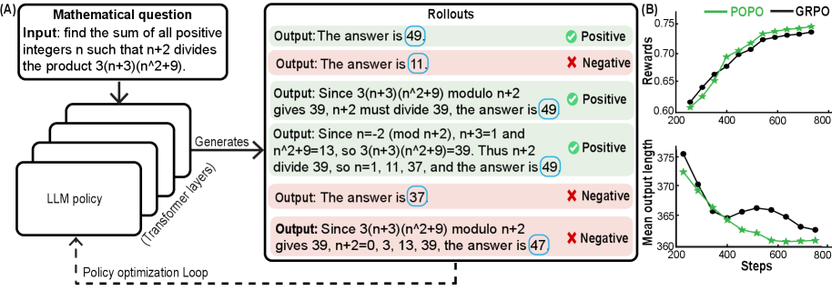
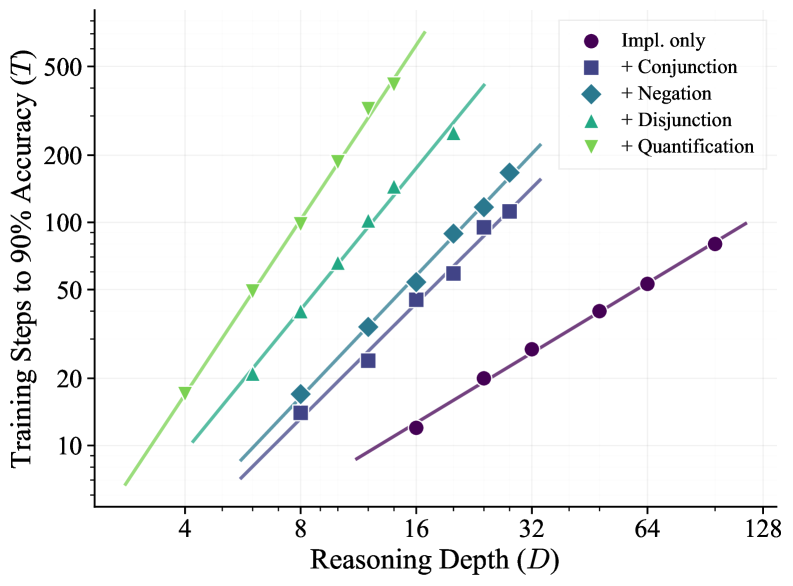
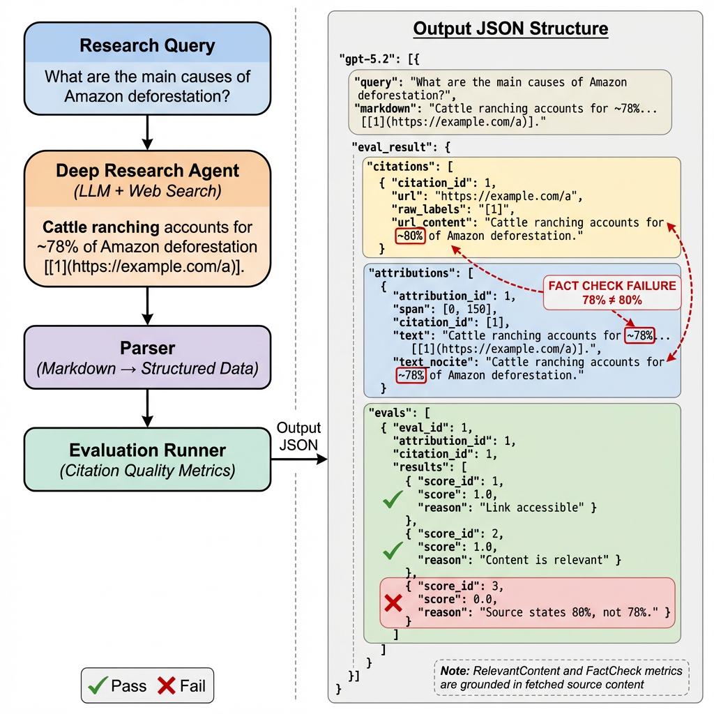
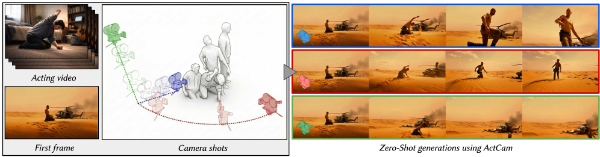

# 🔬 LLM Research Wiki

> AI/ML 领域的维基式知识库。按概念组织，论文为据，持续更新。
> 最后更新：2026-05-08 | 概念：61 | 论文：80

---

## 🌟 今日新论文

> 2026-05-08 自动更新，共 10 篇。这里是网站版每日论文导读；点击标题进入论文页面查看摘要、方法信号、相关主题和关键图示。

  
  

    <h3><a href="entities/papers/2605-06663v1-emo-pretraining-mixture-of-experts-for-emergent-mo.html">EMO: Pretraining Mixture of Experts for Emergent Modularity</a></h3>
    
2026-05-07 · cs.CL · 大语言模型

    
<strong>方法/亮点：</strong>We introduce EMO, an MoE designed for modularity-the independent use and composition of expert subsets-without requiring human-defined priors.

    
<strong>摘要（中文）：</strong>大型语言模型通常部署为整体系统，即使应用程序只需要一小部分功能（例如代码、数学或特定领域的知识），也需要完整的模型。专家混合 (MoE) 似乎提供了一种潜在的替代方案，即每个输入仅激活一部分专家，但实际上，将推理限制为给定领域的一部分专家会导致性能严重下降。这限制了它们在内存受限环境中的实用性，尤其是当模型变得更大、更稀疏时。我们引入了 EMO，这是一种为模块化而设计的 MoE，即专家子集的独立使用和组合，而不需要人类定义的先验。我们的...

    
<strong>Abstract:</strong> Large language models are typically deployed as monolithic systems, requiring the full model even when applications need only a narrow subset of capabilities, e.g., code, math, or domain-specific knowledge. Mixture-of-Ex...

  

  
  

    <h3><a href="entities/papers/2605-06660v1-verifier-backed-hard-problem-generation-for-mathem.html">Verifier-Backed Hard Problem Generation for Mathematical Reasoning</a></h3>
    
2026-05-07 · cs.LG, cs.AI, cs.CL · 大语言模型 / 强化学习 / 基准评估 / 自动驾驶

    
<strong>方法/亮点：</strong>Large Language Models (LLMs) demonstrate strong capabilities for solving scientific and mathematical problems, yet they struggle to produce valid, challenging, and novel problems - an essential component for advancing LLM training and enabl

    
<strong>摘要（中文）：</strong>大型语言模型（LLM）展示了解决科学和数学问题的强大能力，但它们难以产生有效的、具有挑战性的和新颖的问题——这是推进 LLM 培训和实现自主科学研究的重要组成部分。现有的问题生成方法要么依赖于昂贵的人类专家参与，要么采用幼稚的自我博弈范式，这些范式经常因奖励黑客而产生无效问题。这项工作介绍了 VHG，一种基于三方自博构建的验证者增强型难题生成框架。通过将独立验证者集成到传统的设置器-求解器二元性中，我们的设计将设置器的奖励限制为由问题有...

    
<strong>Abstract:</strong> Large Language Models (LLMs) demonstrate strong capabilities for solving scientific and mathematical problems, yet they struggle to produce valid, challenging, and novel problems - an essential component for advancing LL...

  

  
  

    <h3><a href="entities/papers/2605-06652v1-when-no-benchmark-exists-validating-comparative-ll.html">When No Benchmark Exists: Validating Comparative LLM Safety Scoring Without Ground-Truth Labels</a></h3>
    
2026-05-07 · cs.LG, cs.AI, cs.CL · 大语言模型 / 基准评估 / AI安全与对齐

    
<strong>方法/亮点：</strong>Many deployments must compare candidate language models for safety before a labeled benchmark exists for the relevant language, sector, or regulatory regime.

    
<strong>摘要（中文）：</strong>在相关语言、部门或监管制度存在标记基准之前，许多部署必须比较候选语言模型的安全性。我们将这种设置正式化为无基准比较安全评分，并指定基于场景的审计可以解释为部署证据的合同。分数仅在固定场景包、评分标准、审核员、法官、抽样配置和重新运行预算下有效。由于没有可用的标签，我们用工具有效性链取代了基本事实协议：对受控安全与消除对比的响应、目标驱动方差对审计和判断工件的主导地位以及重新运行的稳定性。我们在 SimpleAudit（本地优先的评分工具...

    
<strong>Abstract:</strong> Many deployments must compare candidate language models for safety before a labeled benchmark exists for the relevant language, sector, or regulatory regime. We formalize this setting as benchmarkless comparative safety ...

  

  
  

    <h3><a href="entities/papers/2605-06650v1-beyond-negative-rollouts-positive-only-policy-opti.html">Beyond Negative Rollouts: Positive-Only Policy Optimization with Implicit Negative Gradients</a></h3>
    
2026-05-07 · cs.CL · 大语言模型 / 强化学习 / 基准评估 / AI安全与对齐

    
<strong>方法/亮点：</strong>In this work, we propose Positive-Only Policy Optimization (POPO), a novel RLVR framework in which learning can occur exclusively via online positive rollouts.

    
<strong>摘要（中文）：</strong>由于确定性验证，具有可验证奖励的强化学习（RLVR）成为增强大型语言模型（LLM）推理能力的主导范式。社区见证了从近端策略优化（PPO）到组相对策略优化（GRPO）的快速变化，其中GRPO通过对分组正向和负向推出的简单估计来减少复杂的优势估计。然而，我们注意到，负数推出可能不承认失败严重程度的分级，并且组合的巨大性使得惩罚一些采样负数不太可能在稀疏的二元奖励下覆盖有意义的奖励信号。在这项工作中，我们提出了仅正向策略优化（POPO），这是...

    
<strong>Abstract:</strong> Reinforcement learning with verifiable rewards (RLVR), due to the deterministic verification, becomes a dominant paradigm for enhancing the reasoning ability of large language models (LLMs). The community witnesses the r...

  

  
  

    <h3><a href="entities/papers/2605-06642v1-strata-incentivizing-agentic-reinforcement-learnin.html">StraTA: Incentivizing Agentic Reinforcement Learning with Strategic Trajectory Abstraction</a></h3>
    
2026-05-07 · cs.CL, cs.AI · 大语言模型 / 强化学习 / 自动驾驶 / 智能体

    
<strong>方法/亮点：</strong>In this work, we present Strategic Trajectory Abstraction (StraTA), a simple framework that introduces an explicit trajectory-level strategy into agentic reinforcement learning (RL).

    
<strong>摘要（中文）：</strong>大型语言模型（LLM）越来越多地用作交互式代理，但优化它们以进行长期决策仍然很困难，因为当前的方法很大程度上纯粹是反应性的，这削弱了扩展轨迹上的探索和信用分配。在这项工作中，我们提出了策略轨迹抽象（StraTA），这是一个简单的框架，它将显式轨迹级策略引入代理强化学习（RL）中。 StraTA 从初始任务状态中采样紧凑策略，根据该策略调整后续操作，并与分层 GRPO 式推出设计联合训练策略生成和操作执行，并通过多样化策略推出和关键自我判...

    
<strong>Abstract:</strong> Large language models (LLMs) are increasingly used as interactive agents, but optimizing them for long-horizon decision making remains difficult because current methods are largely purely reactive, which weakens both exp...

  

  
  

    <h3><a href="entities/papers/2605-06639v1-recursive-agent-optimization.html">Recursive Agent Optimization</a></h3>
    
2026-05-07 · cs.LG, cs.AI, cs.CL · 强化学习 / 智能体

    
<strong>方法/亮点：</strong>We introduce Recursive Agent Optimization (RAO), a reinforcement learning approach for training recursive agents: agents that can spawn and delegate sub-tasks to new instantiations of themselves recursively.

    
<strong>摘要（中文）：</strong>我们引入了递归代理优化（RAO），这是一种用于训练递归代理的强化学习方法：可以递归地生成子任务并将其委托给自身的新实例的代理。递归代理实现了推理时间缩放算法，该算法自然地允许代理扩展到更长的上下文，并通过分治法推广到更困难的问题。 RAO 提供了一种训练模型的方法，以最好地利用这种递归推理，指导代理何时以及如何进行委派和通信。我们发现，以这种方式训练的递归代理具有更好的训练效率，可以扩展到超出模型上下文窗口的任务，泛化到比代理训练的任务...

    
<strong>Abstract:</strong> We introduce Recursive Agent Optimization (RAO), a reinforcement learning approach for training recursive agents: agents that can spawn and delegate sub-tasks to new instantiations of themselves recursively. Recursive ag...

  

  
  

    <h3><a href="entities/papers/2605-06638v1-can-rl-teach-long-horizon-reasoning-to-llms-expres.html">Can RL Teach Long-Horizon Reasoning to LLMs? Expressiveness Is Key</a></h3>
    
2026-05-07 · cs.AI, cs.CL · 大语言模型 / 强化学习 / 基准评估 / 世界模型

    
<strong>方法/亮点：</strong>We introduce ScaleLogic, a synthetic logical reasoning framework that offers independent control over two axes of difficulty: the depth of the required proof planning (i.e., the horizon) and the expressiveness of the underlying logic.

    
<strong>摘要（中文）：</strong>强化学习 (RL) 已被应用于改进大型语言模型 (LLM) 推理，但由于缺乏受控、可扩展的环境，对训练如何随任务难度进行扩展的系统研究受到了阻碍。我们引入了 ScaleLogic，一个综合逻辑推理框架，它提供对两个难度轴的独立控制：所需证明计划的深度（即范围）和底层逻辑的表达能力。我们提出的框架支持广泛的逻辑：从简单的仅蕴涵逻辑（“if-then”）到更具表现力的一阶推理，包括合取（“and”）、析取（“or”）、否定（“not”）和通...

    
<strong>Abstract:</strong> Reinforcement learning (RL) has been applied to improve large language model (LLM) reasoning, yet the systematic study of how training scales with task difficulty has been hampered by the lack of controlled, scalable env...

  

  
  

    <h3><a href="entities/papers/2605-06635v1-cited-but-not-verified-parsing-and-evaluating-sour.html">Cited but Not Verified: Parsing and Evaluating Source Attribution in LLM Deep Research Agents</a></h3>
    
2026-05-07 · cs.CL · 大语言模型 / 基准评估 / AI安全与对齐 / 智能体

    
<strong>方法/亮点：</strong>We introduce the first source attribution evaluation framework that uses a reproducible AST parser to extract and evaluate inline citations from LLM-generated Markdown reports at scale.

    
<strong>摘要（中文）：</strong>大型语言模型 (LLM) 为深度研究代理提供支持，将来自数百个网络资源的信息合成为引用的报告，但这些引文无法得到可靠验证。当前的方法要么信任模型准确自引，但存在偏见，要么采用检索增强生成（RAG），但不验证来源的可访问性、相关性或事实一致性。我们引入了第一个来源归因评估框架，该框架使用可重复的 AST 解析器从 LLM 生成的 Markdown 报告中大规模提取和评估内联引用。与单独验证声明的方法不同，我们的框架通过检索实际引用的内容来...

    
<strong>Abstract:</strong> Large language models (LLMs) power deep research agents that synthesize information from hundreds of web sources into cited reports, yet these citations cannot be reliably verified. Current approaches either trust models...

  

  
  

    <h3><a href="entities/papers/2605-06667v1-actcam-zero-shot-joint-camera-and-3d-motion-contro.html">ActCam: Zero-Shot Joint Camera and 3D Motion Control for Video Generation</a></h3>
    
2026-05-07 · cs.CV, cs.AI, cs.LG · 多模态学习 / 基准评估 / 自动驾驶 / 图神经网络

    
<strong>方法/亮点：</strong>We present ActCam, a zero-shot method for video generation that jointly transfers character motion from a driving video into a new scene and enables per-frame control of intrinsic and extrinsic camera parameters.

    
<strong>摘要（中文）：</strong>对于艺术应用，视频生成需要对表演和摄影进行精细控制，即演员的动作和摄像机轨迹。我们提出了 ActCam，一种用于视频生成的零镜头方法，可将角色运动从驾驶视频联合传输到新场景，并实现内部和外部相机参数的每帧控制。 ActCam 建立在任何预先训练的图像到视频扩散模型的基础上，该模型接受场景深度和角色姿势的调节。给定具有移动角色和目标摄像机运动的源视频，ActCam 会生成跨帧保持几何一致的姿势和深度条件。然后，我们使用两阶段调节计划运行单...

    
<strong>Abstract:</strong> For artistic applications, video generation requires fine-grained control over both performance and cinematography, i.e., the actor&#x27;s motion and the camera trajectory. We present ActCam, a zero-shot method for video gene...

  

  
  

    <h3><a href="entities/papers/2605-06665v1-unipool-a-globally-shared-expert-pool-for-mixture.html">UniPool: A Globally Shared Expert Pool for Mixture-of-Experts</a></h3>
    
2026-05-07 · cs.LG, cs.AI · 大语言模型

    
<strong>方法/亮点：</strong>Motivated by this redundancy, we propose UniPool, an MoE architecture that treats expert capacity as a global architectural budget by replacing per-layer expert ownership with a single shared pool accessed by independent per-layer routers.

    
<strong>摘要（中文）：</strong>现代专家混合 (MoE) 架构通过严格的每层规则分配专家容量：每个变压器层拥有一个单独的专家集。该约定将深度缩放与线性专家参数增长结合起来，并假设每一层都需要独立的专家容量。然而，最近的分析和我们的路由探测对这一分配规则提出了挑战：用统一的随机路由替换更深层学习的 top-k 路由器，在多个生产 MoE 模型中，下游精度仅下降 1.0-1.6 个点。受这种冗余的推动，我们提出了 UniPool，这是一种 MoE 架构，通过用独立的每层路...

    
<strong>Abstract:</strong> Modern Mixture-of-Experts (MoE) architectures allocate expert capacity through a rigid per-layer rule: each transformer layer owns a separate expert set. This convention couples depth scaling with linear expert-parameter...

  

---

## 🧭 知识导航

### 核心概念

| 概念 | 说明 | 论文数 |
|------|------|--------|
| [大语言模型](concepts/large-language-model.html) | GPT、LLaMA 等大规模预训练语言模型 | 8 |
| [强化学习](concepts/reinforcement-learning.html) | RLHF、RLVR、DPO、GRPO 等对齐技术 | 2 |
| [多模态学习](concepts/multimodal-learning.html) | 视觉-语言模型、跨模态推理 | 2 |
| [知识蒸馏](concepts/knowledge-distillation.html) | 教师-学生框架、黑箱蒸馏、策略蒸馏 | 1 |
| [世界模型](concepts/world-models.html) | 环境动态预测与生成 | 1 |
| [基准评估](concepts/benchmarking.html) | 标准化测试与评估方法论 | 2 |
| [智能体](concepts/ai-agents.html) | LLM 驱动的自主代理与多代理协作 | 8 |
| [图神经网络](concepts/graph-neural-networks.html) | 图结构学习与推理 | 1 |
| [自动驾驶](concepts/autonomous-driving.html) | 感知、预测、规划与世界模型 | 1 |
| [AI安全与对齐](concepts/ai-safety-alignment.html) | 对齐问题、对抗训练、安全评估 | 2 |

### 技术方向

- **训练方法** → [强化学习](concepts/reinforcement-learning.html) | [知识蒸馏](concepts/knowledge-distillation.html)
- **模型架构** → [大语言模型](concepts/large-language-model.html) | [图神经网络](concepts/graph-neural-networks.html) | [世界模型](concepts/world-models.html)
- **应用场景** → [自动驾驶](concepts/autonomous-driving.html) | [医学AI](concepts/medical-ai.html) | [智能体](concepts/ai-agents.html)
- **评估与安全** → [基准评估](concepts/benchmarking.html) | [AI安全与对齐](concepts/ai-safety-alignment.html)
