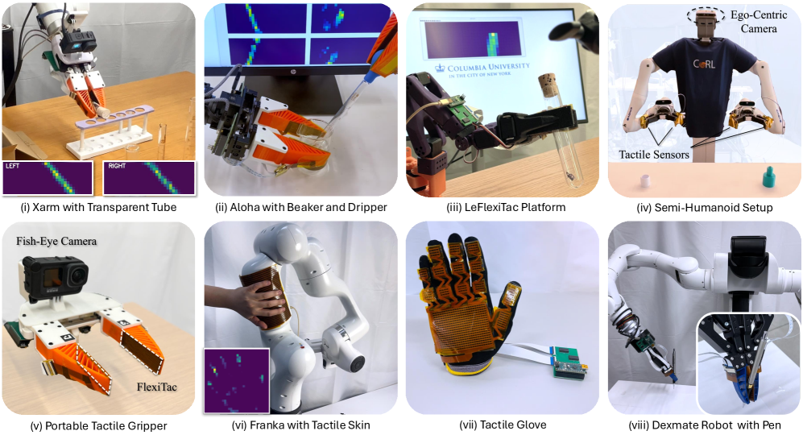
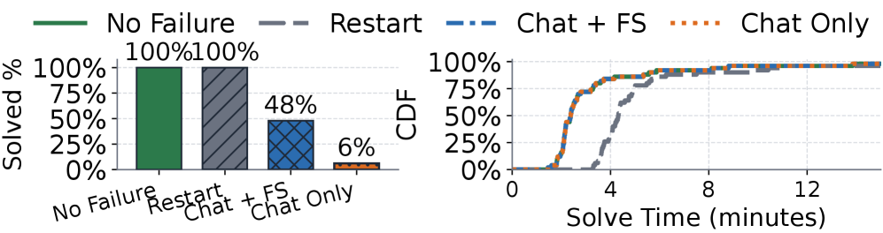

# 🔬 LLM Research Wiki

> AI/ML 领域的维基式知识库。按概念组织，论文为据，持续更新。
> 最后更新：2026-05-02 | 概念：61 | 论文：32

---

## 🌟 今日新论文

> 2026-05-02 自动更新，共 10 篇。这里是网站版每日论文导读；点击标题进入论文页面查看摘要、方法信号、相关主题和关键图示。

  
  

    <h3><a href="entities/papers/2604-28185v1-visual-generation-in-the-new-era-an-evolution-from.html">Visual Generation in the New Era: An Evolution from Atomic Mapping to Agentic World Modeling</a></h3>
    
2026-04-30 · cs.CV · 强化学习 / 基准评估 / 图神经网络 / 世界模型

    
<strong>方法/亮点：</strong>To frame this shift, we introduce a five-level taxonomy: Atomic Generation, Conditional Generation, In-Context Generation, Agentic Generation, and World-Modeling Generation, progressing from passive renderers to interactive, agentic, world-

    
Recent visual generation models have made major progress in photorealism, typography, instruction following, and interactive editing, yet they still struggle with spatial reasoning, persistent state, long-horizon consistency, and causal understanding. We argue...

  

  
  

    <h3><a href="entities/papers/2604-28179v1-stop-holding-your-breath-ct-informed-gaussian-spla.html">Stop Holding Your Breath: CT-Informed Gaussian Splatting for Dynamic Bronchoscopy</a></h3>
    
2026-04-30 · cs.CV · 多模态学习 / 基准评估 / 医学AI / 世界模型

    
<strong>方法/亮点：</strong>We propose to eliminate the need for breath-hold protocols by leveraging patient-specific respiratory modeling.

    
Bronchoscopic navigation relies on registering endoscopic video to a preoperative CT scan, but respiratory motion deforms the airway by 5-20 mm, creating CT-to-body divergence that limits localization accuracy. In practice, this is mitigated through breath-hol...

  

  
  

    <h3><a href="entities/papers/2604-28186v1-computing-equilibrium-beyond-unilateral-deviation.html">Computing Equilibrium beyond Unilateral Deviation</a></h3>
    
2026-04-30 · cs.GT, cs.AI, cs.CC · 基准评估

    
<strong>方法/亮点：</strong>Finally, we use our framework to solve the \emph{Exploitability Welfare Frontier} (EWF), the maximum attainable social welfare subject to a given exploitability (the maximum gain over all unilateral deviations).

    
Most familiar equilibrium concepts, such as Nash and correlated equilibrium, guarantee only that no single player can improve their utility by deviating unilaterally. They offer no guarantees against profitable coordinated deviations by coalitions. Although th...

  

  
  

    <h3><a href="entities/papers/2604-28169v1-phyco-learning-controllable-physical-priors-for-ge.html">PhyCo: Learning Controllable Physical Priors for Generative Motion</a></h3>
    
2026-04-30 · cs.CV, cs.AI, cs.LG · 大语言模型 / 多模态学习 / 强化学习 / 基准评估

    
<strong>方法/亮点：</strong>We present PhyCo, a framework that introduces continuous, interpretable, and physically grounded control into video generation.

    
Modern video diffusion models excel at appearance synthesis but still struggle with physical consistency: objects drift, collisions lack realistic rebound, and material responses seldom match their underlying properties. We present PhyCo, a framework that intr...

  

  
  

    <h3><a href="entities/papers/2604-28158v1-intern-atlas-a-methodological-evolution-graph-as-r.html">Intern-Atlas: A Methodological Evolution Graph as Research Infrastructure for AI Scientists</a></h3>
    
2026-04-30 · cs.AI · 基准评估 / AI安全与对齐 / 图神经网络 / 智能体

    
<strong>方法/亮点：</strong>We introduce Intern-Atlas, a methodological evolution graph that automatically identifies method-level entities, infers lineage relationships among methodologies, and captures the bottlenecks that drive transitions between successive innova

    
Existing research infrastructure is fundamentally document-centric, providing citation links between papers but lacking explicit representations of methodological evolution. In particular, it does not capture the structured relationships that explain how and w...

  

  
  

    <h3><a href="entities/papers/2604-28156v1-flexitac-a-low-cost-open-source-scalable-tactile-s.html">FlexiTac: A Low-Cost, Open-Source, Scalable Tactile Sensing Solution for Robotic Systems</a></h3>
    
2026-04-30 · cs.RO, cs.AI, cs.LG · 世界模型

    
<strong>方法/亮点：</strong>We present FlexiTac, a low-cost, open-source, and scalable piezoresistive tactile sensing solution designed for robotic end-effectors.

    
We present FlexiTac, a low-cost, open-source, and scalable piezoresistive tactile sensing solution designed for robotic end-effectors. FlexiTac is a practical &quot;plug-in&quot; module consisting of (i) thin, flexible tactile sensor pads that provide dense tactile sign...

  

  
  

    <h3><a href="entities/papers/2604-28139v1-claw-eval-live-a-live-agent-benchmark-for-evolving.html">Claw-Eval-Live: A Live Agent Benchmark for Evolving Real-World Workflows</a></h3>
    
2026-04-30 · cs.SE, cs.AI · 大语言模型 / 基准评估 / 智能体

    
<strong>方法/亮点：</strong>We introduce Claw-Eval-Live, a live benchmark for workflow agents that separates a refreshable signal layer, updated across releases from public workflow-demand signals, from a reproducible, time-stamped release snapshot.

    
LLM agents are expected to complete end-to-end units of work across software tools, business services, and local workspaces. Yet many agent benchmarks freeze a curated task set at release time and grade mainly the final response, making it difficult to evaluat...

  

  
  

    <h3><a href="entities/papers/2604-28138v1-crab-a-semantics-aware-checkpointrestore-runtime-f.html">Crab: A Semantics-Aware Checkpoint/Restore Runtime for Agent Sandboxes</a></h3>
    
2026-04-30 · cs.OS, cs.AI · 大语言模型 / 强化学习 / 自动驾驶 / 智能体

    
<strong>方法/亮点：</strong>Autonomous agents act through sandboxed containers and microVMs whose state spans filesystems, processes, and runtime artifacts.

    
Autonomous agents act through sandboxed containers and microVMs whose state spans filesystems, processes, and runtime artifacts. Checkpoint and restore (C/R) of this state is needed for fault tolerance, spot execution, RL rollout branching, and safe rollback-y...

  

  
  

    <h3><a href="entities/papers/2604-28180v1-an-adaptive-wavelet-based-pinn-for-problems-with-l.html">An adaptive wavelet-based PINN for problems with localized high-magnitude source</a></h3>
    
2026-04-30 · cs.LG · 世界模型

    
<strong>方法/亮点：</strong>In recent years, physics-informed neural networks (PINNs) have gained significant attention for solving differential equations, although they suffer from two fundamental limitations, namely, spectral bias inherent in neural networks and los

    
In recent years, physics-informed neural networks (PINNs) have gained significant attention for solving differential equations, although they suffer from two fundamental limitations, namely, spectral bias inherent in neural networks and loss imbalance arising ...

  

  
  

    <h3><a href="entities/papers/2604-28176v1-defending-quantum-classifiers-against-adversarial.html">Defending Quantum Classifiers against Adversarial Perturbations through Quantum Autoencoders</a></h3>
    
2026-04-30 · quant-ph, cs.LG · 多模态学习 / 基准评估 / AI安全与对齐

    
<strong>方法/亮点：</strong>In this paper, we propose an adversarial training-free defense framework that utilizes a quantum autoencoder to purify the adversarial samples through reconstruction.

    
Machine learning models can learn from data samples to carry out various tasks efficiently. When data samples are adversarially manipulated, such as by insertion of carefully crafted noise, it can cause the model to make mistakes. Quantum machine learning mode...

  

---

## 🧭 知识导航

### 核心概念

| 概念 | 说明 | 论文数 |
|------|------|--------|
| [大语言模型](concepts/large-language-model.html) | GPT、LLaMA 等大规模预训练语言模型 | 8 |
| [强化学习](concepts/reinforcement-learning.html) | RLHF、RLVR、DPO、GRPO 等对齐技术 | 2 |
| [多模态学习](concepts/multimodal-learning.html) | 视觉-语言模型、跨模态推理 | 2 |
| [知识蒸馏](concepts/knowledge-distillation.html) | 教师-学生框架、黑箱蒸馏、策略蒸馏 | 1 |
| [世界模型](concepts/world-models.html) | 环境动态预测与生成 | 1 |
| [基准评估](concepts/benchmarking.html) | 标准化测试与评估方法论 | 2 |
| [智能体](concepts/ai-agents.html) | LLM 驱动的自主代理与多代理协作 | 8 |
| [图神经网络](concepts/graph-neural-networks.html) | 图结构学习与推理 | 1 |
| [自动驾驶](concepts/autonomous-driving.html) | 感知、预测、规划与世界模型 | 1 |
| [AI安全与对齐](concepts/ai-safety-alignment.html) | 对齐问题、对抗训练、安全评估 | 2 |

### 技术方向

- **训练方法** → [强化学习](concepts/reinforcement-learning.html) | [知识蒸馏](concepts/knowledge-distillation.html)
- **模型架构** → [大语言模型](concepts/large-language-model.html) | [图神经网络](concepts/graph-neural-networks.html) | [世界模型](concepts/world-models.html)
- **应用场景** → [自动驾驶](concepts/autonomous-driving.html) | [医学AI](concepts/medical-ai.html) | [智能体](concepts/ai-agents.html)
- **评估与安全** → [基准评估](concepts/benchmarking.html) | [AI安全与对齐](concepts/ai-safety-alignment.html)
